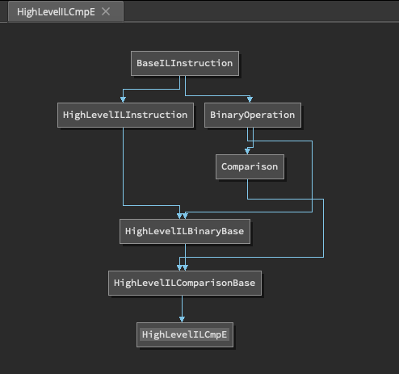

# 3.0 Python API Changes

## `LowLevelILExpr` Removal

Was simply a wrapper class around an `int` to improve code readability. As we've now added type hints throughout the API this was unneeded and actually was more confusing than just simply using a type hint. Additionally this same sort of object was not used in MediumLevelIL or HighLevelIL.

To convert code older code which was using this as follows:

```python
# The following code in Binary Ninja 2.4
if not isinstance(i, lowlevelil.LowLevelILExpr):
    i = lowlevelil.LowLevelILExpr(i)
# Becomes the following in Binary Ninja 3.0
if isinstance(i, int):
    i = lowlevelil.ExpressionIndex(i)
```


## Type object

Prior to 3.0 `Enumeration`, `NamedTypeReference` and `Structure` objects were members rather than subclasses of `Type`. In Binary Ninja 3.0 these types derive from `Type` thus where previously you'd need to do something like this:

```python
>>> bv.types['_GUID'].structure.members
[<DWORD Data1, offset 0x0>, <WORD Data2, offset 0x4>, <WORD Data3, offset 0x6>, <BYTE Data4[0x8], offset 0x8>]
```

Now these can be accessed simply like this:

```python
>>> bv.types['_GUID'].members
[<DWORD Data1, offset 0x0>, <WORD Data2, offset 0x4>, <WORD Data3, offset 0x8>, <BYTE Data4[0x8], offset 0xc>]
```

Similarly with `NamedTypeReference`s and `Enumeration`s.

# 3.0 Python API Improvements 

## `Symbol` -> `CoreSymbol`

Symbol objects have changed slightly. There is now a subtle difference how the end user creates symbols compared with how the core creates symbols. Symbols returned from the core such as those returned from `bv.get_symbol_at` are now `CoreSymbol` objects; however, when you're creating a new symbol object you instantiate a `Symbol` object. Thus end users will **never create an object of type `CoreSymbol`**. Additionally the core will **never return an object of type `Symbol`**. This distinction was made to clean up the `Symbol` object's constructor. Simplifying construction for both end users and API developers. Additionally since `Symbol` inherits from `CoreSymbol` these objects only differ in their method of construction.

Binary Ninja 2.4 Symbol construction
```python
# converting a core symbol object into a python Symbol object
_types.Symbol(None, None, None, symbol_handle)
# creating a symbol as a user
_types.Symbol(sym_type, addr, short_name, full_name, raw_name, None, GlobalBinding, namespace, ordinal)
```

Binary Ninja 3.0 Symbol construction. No magic constructor, no inexplicable `None` parameters.
```python
# converting a core symbol object into a python Symbol object
_types.CoreSymbol(symbol_handle)
# creating a symbol as a user
_types.Symbol(sym_type, addr, short_name, full_name, raw_name, GlobalBinding, namespace, ordinal)
```

## BNIL Instructions

As of Binary Ninja 3.0 IL instructions have been substantially refactored. In Binary Ninja 2.4 an instruction was defined by an `operation` and a dictionary entry. Although this was easy to implement there were some down sides to this implementation. The new implementation creates a class for each instruction operand this helps in many different ways:

1. Speed - because we do it this way we don't have to generate the entire operand tree like we did in the past. Resulting in a substantial performance increase in iteration. 3x faster for HLIL and a more marginal 30% faster for MLIL and LILL as the instructions are less complicated.
2. Type Hinting - It was impossible to know what properties are available for which instructions without consulting the ILInstructions map. We would never be able to get good type checking on any of the IL instructions if it were not changed.
3. Instruction Hierarchies - By implementing instructions in terms of of a class hierarchy IL code is now much more portable across ILs. You can do things like this and it will work for all ILs

```python
for i in il:
 if isinstance(i, Constant):
  print(i.value)
```

The above code in 2.4 would be
```python
for i in il:
 if i.operation in [LLIL_CONST, LLIL_CONST_PTR, LLIL_EXTERN_PTR, MLIL_CONST, MLIL_CONST_PTR, MLIL_EXTERN_PTR, HLIL_CONST, HLIL_CONST_PTR, HLIL_EXTERN_PTR]:
  print(i.value)
```

The only real drawback to this approach is that the instruction hierarchies are rather complicated and there are a lot of abstract base classes. To help this we've implemented a couple of APIs to visualize these relationships.

 * `show_hlil_hierarchy`, `show_mlil_hierarchy`, `show_llil_hierarchy` - These APIs show the entire graph hierarchy for a given IL.
  * `show_hierarchy_graph` - Displays the graph for the current instruction.



## `Variable` Objects

In the Binary Ninja 3.0 Python API the Variable object(s) have been completely overhauled. To understand what prompted these changes and its important to understand how the core differs from the API. In Binary Ninja core Variable objects are a simple 3-tuple of:
 * Storage Location Type - Register, Flag, or Stack
 * Storage Location - An integer which represents a register index, flag index, or stack offset
 * Offset - An offset into the function which initially stores the value and thus creates the variable. Negative values represent passed in parameters, and their storage on the stack.
 * Identifier - This is simply a hash of the other items.

During analysis thousands of these objects are created, so its important that this object be performant. When using the Python API convenience frequently trumps performance as the main goal. Thus in Binary Ninja 3.0 the Variable object has been split into 3 separate objects 2 of which you'll probably never use but are there for some specific purposes.

 * CoreVariable - The same representation as explained above. This is useful for those who speed is their primary concern and do not need to do things like set a variables name or type, and don't need access to access the containing function through the variable. This is the base object from which the other two are derived.
 * VariableNameAndType - Inherits from CoreVariable. This is a special type of object only returned from function parameters when a parameter specifies its storage location.
 * Variable - Inherits from CoreVariable. This is the one you probably care about and is returned from most APIs, and is the focus of this section.

Regardless of which of the above variable object you have its possible to convert one into another. 

### To CoreVariable

No conversion needed as they inherit directly.

### From CoreVariable to VariableNameAndType

```python
var_name_and_type = VariableNameAndType.from_core_variable(core_variable, name, type)
```

### From Variable to VariableNameAndType

```python
var_name_and_type = var.var_name_and_type
```

### From CoreVariable to Variable

```python
var = Variable.from_core_variable(function, core_variable)
```

### From VariableNameAndType to Variable

```python
var = Variable.from_variable_name_and_type(function, var_name_and_type)
```

### Using Variable Objects

In Binary Ninja 2.4 it was rather unintuitive to rename or set the type of a variable.

```python
f = current_function
v = f.vars[0]
f.create_user_var(v, v.type, "new_name")
f.create_user_var(v, Type.char(), "")
```

Additionally it was possible to get the name of a variable but only though some of the APIs which meant it was a particularly confusing object to use in some situations. In 3.0 Variable objects must always contain the function in which they're defined and thus the Variable object always has consistent behavior regardless of which API generated the object. In Binary Ninja 3.0 the code to set a variables name or type is simply:

```python
v = f.vars[0]
v.name = "new_name"
v.type = Type.char()
```

## DataVariable Objects

DataVariable objects have been greatly enhanced in Binary Ninja 3.0. In the core a DataVariable is simply a `Type` and an `int` address. The 2.4 API roughly replicated that abstraction. In Binary Ninja 3.0 the object has a lot more utility. Again similar to what was done with Variable and Symbol, we now have a `CoreDataVariable` object from which `DataVariable`. The `CoreDataVariable` object is a dataclass simple dataclass which maps to the core's representation of the object. The `DataVariable` class inherits from it and provides a lot of additional utility.

Prior to 3.0 a frequent question was: "Through the API how do you set the name of a DataVariable?" The answer was always "You don't, instead create a symbol at that location." This is the same way function names are handled. Although this abstraction serves us well it doesn't make for an intuitive API, thus DataVariable now has a convenient method for setting the variables name and name.

```python
>>> data_var = bv.get_data_var_at(here)
>>> data_var.name

>>> data_var.name = 'foobar'
>>> data_var.name
'foobar'
```
Or if you prefer to give the DataVariable a more complete symbol.

```python
data_var = bv.get_data_var_at(here)
data_var.symbol = Symbol(DataSymbol, here, short_name, full_name, raw_name)
```

Setting the type:

```python
data_var = bv.get_data_var_at(here)
data_var.type = Type.int(4)
```

### Reading and Writing the Contents of a DataVariable

Prior to 3.0 there was really no way to read the contents of a DataVariable it was possible to use the (now deprecated `StructuredDataView`) but there were a bunch of extra steps involved. As of 3.0 Binary Ninja now supports directly reading and writing the value of a `DataVariable` through the `value` property. Suppose we have the following:

```
100207a78  int64_t data_100207a78 = 0x10019142a
100207a80  struct struct_1 data_100207a80 = 
100207a80  {
100207a80      int64_t field_0 = 0x1001f409b
100207a88      int64_t field_8 = 0x10100
100207a90      int64_t field_10 = 0x0
100207a98      int64_t field_18 = 0x100190b9c
100207aa0  }
```

```python
>>> hex(bv.get_data_var_at(0x100207a78).value)
'0x10019142a'
>>> bv.get_data_var_at(0x100207a80)['field_0']
<TypedDataAccessor type:int64_t value:4297015451>
>>> hex(bv.get_data_var_at(0x100207a80)['field_0'].value)
'0x1001f409b'
# Writing values is just as easy as reading them
bv.get_data_var_at(0x100207a80)['field_0'].value = 0
```

## `TypedDataAccessor` Object

The `TypedDataAccessor` object is a replacement for the `StructuredDataView` object. This object allows you typed access to the bytes at a given location. Given the following data:

```
00000000: 41 41 41 41 41 41 41 41 41 41 41 41 41 41 41 41  AAAAAAAAAAAAAAA
```

You can apply a `TypedDataAccessor`
```
tda = TypedDataAccessor(Type.int(8), 0, bv, bv.endianness)
>>> tda
<TypedDataAccessor type:int64_t value:4702111234474983745>
>>> tda.value
4702111234474983745
>>> hex(tda.value)
'0x4141414141414141'
```

## Performance Improvements

The Binary Ninja API has some substantial under the hood changes that allow for increased speed and utility.  Binary Ninja's APIs frequently need to return lists of objects that have been constructed natively, then reconstructed in Python. This Python type creation can take a significant amount of time. In Binary Ninja 3.0 we try to delay or eliminate creation of these types where possible in many common cases.

* 100 Iterations of the following `Code` was run
* 2911 Functions were present in the test binary
* 6363 Symbols were present in the test binary
* 4096 Types were present in the test binary
* `bv` is a `BinaryView` object
* `hlil_func` is a `HighLevelILFunction`

| Code                     | Binary Ninja 2.4 - time(s) | Binary Ninja 3.0 - time(s)  | Factor |
| ------------------------ | -------------------------- | --------------------------- | -------|
| `bv.functions[0]`        | 0.98                       | 0.035                       | 28x    |
| `bv.types['_GUID']`      | 5.90                       | 0.0035                      | 1688x  |
| `bv.symbols['shutdown']` | 4.62                       | 0.00068                     | 6814x  |
| `[i for i in hlil_func]` | 0.0098                     | 0.0026                      | 3.7x   |

These performance improvements were made is by creating new objects that serve as wrappers around Lists and Maps which then incrementally construct the contained objects on demand. Although these is usually the situation you'd use a generator for its obviously not possible for maps, and there is a lot of existing code that does things like `function.basic_blocks[0]` and we wanted to make the transition to 3.0 as painless as possible.

* `bv.symbols` returns a `SymbolMapping` object
* `bv.types` returns a `TypeMapping` object
* `bv.functions` returns a `FunctionList` object
* `current_function.basic_blocks` returns a `BasicBlockList` object


### AdvancedILFunctionList

Additionally we've provided some new speedy ways of getting a the "Advanced Analysis Functions" i.e. `HighLevelILFunction` and `MediumLevelILFunction`. Prior to Binary Ninja 3.0 the defacto way of iterating HLIL functions was something like this:

```python
for f in bv.functions:
    do_stuff(f.hlil)
```

Although the above works it is not as fast as it could be, and in fact it isn't how the core would iterate functions. What the above code basically says is this:

    Foreach function in the BinaryView generate the hlil and wait until the il is fully generated then do_stuff with that il.

Modern machines have lots of cores that can be put to work, and the above code really makes poor use of them. Here's where the `AdvancedILFunctionList` object comes in. This object allows users to request that many IL functions be generated at once and then doles them out as needed. This produces a dramatic latency reduction, allowing your python script to do much less waiting. Using the API is straight forward, as it's a generator that can be directly iterated.

```python
for f in AdvancedILFunctionList(bv):
    do_stuff(f.hlil)
```

Using the `AdvancedILFunctionList` as above should result in minimally a 50% reduction in time spend waiting for IL generation. There are, however; some tweaks you can make to go even faster. The second parameter is the `preload_limit` which defaults to 5 a very low but reasonable number which should be safe on pretty much any computer Binary Ninja is running on. It is possible in situations where you're not severely constrained on RAM to bump this number up significantly and achieve reductions as much as 75%. In our testing we've found values of `400` and greater to produce even better results at the cost of additional RAM. Use the parameter with caution!

```python
>>> timeit.timeit(lambda: [f.hlil for f in bv.functions], number=10)
30.704694400999983
>>> timeit.timeit(lambda: [f.hlil for f in AdvancedILFunctionList(bv)], number=10)
15.333463996999967
>>> timeit.timeit(lambda: [f.hlil for f in AdvancedILFunctionList(bv, preload_limit=400)], number=10)
7.710202791000029
>>> timeit.timeit(lambda: [f.hlil for f in AdvancedILFunctionList(bv, preload_limit=1000)], number=10)
7.229033582
```

Finally the 3rd parameter `functions`. This is convenient for situations when you're interested in going through your own collection of functions for instance if you'd like to iterate all the callee's of the current function you could do the following:

```python
>>> len(current_function.callees)
5
>>> timeit.timeit(lambda: [f.hlil for f in current_function.callees], number=10000)
2.969805995999991
>>> timeit.timeit(lambda: [f.hlil for f in AdvancedILFunctionList(bv, preload_limit=10, functions=current_function.callees)], number=10000)
2.4418122349999294
```

As you can see there is some performance gain but as there aren't that many functions there is much less performance to be had.


