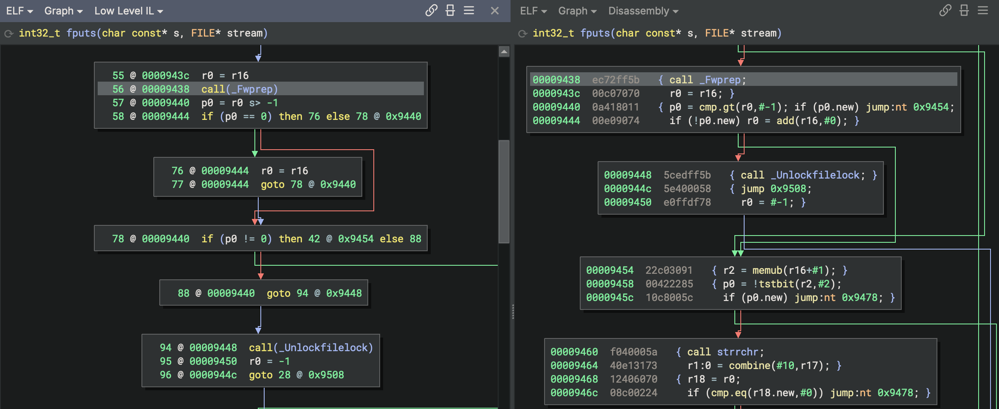
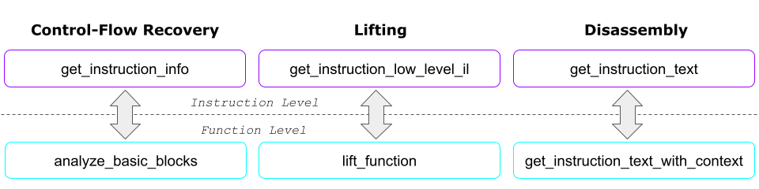
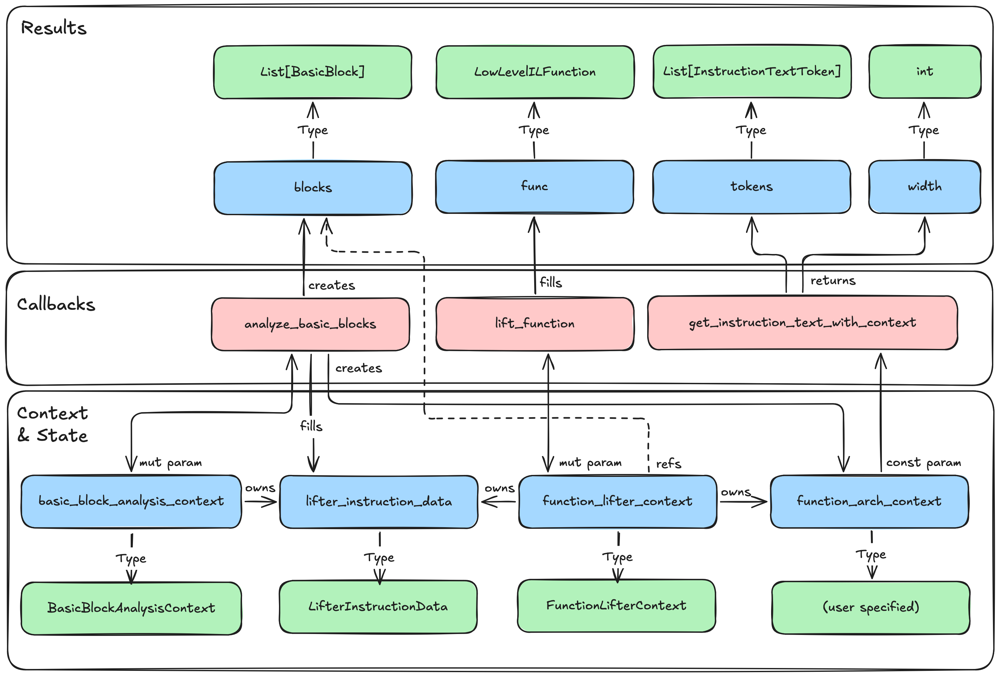

# Context-Aware Control-flow Recovery, Disassembly, and Lifting

Binary Ninja's standard Architecture mode treats each instruction independently. The Architecture
is passed the raw bytes and address, and it disassembles and lifts one instruction at a time. This works well when the
instruction bytes contain everything required to recover control flow, render disassembly, and generate Low Level IL (LLIL), but has limitations when dealing with more complex instruction sets.

Some architectures require more context than a single callback can provide. For example:

- TMS320C6x groups as many as eight instructions into a fetch packet and may divide them into parallel execute packets.
  Fetch-packet headers affect decoding, while branches, loads, and other operations can take effect several cycles
  after they are issued. A branch can also be issued while an earlier branch is still pending.
- Qualcomm Hexagon groups as many as four instructions into a VLIW packet. Instructions in the packet execute in
  parallel, packet parse bits describe packet boundaries and hardware loops, and `.new` operands can consume values
  produced elsewhere in the same packet.

These behaviors cannot be modeled as independent instructions, even when using tricks like increasing `Architecture.max_instr_length` and inspecting the following bytes. The required bytes may precede the current
address, the meaning of an instruction may depend on a path through the function, or an effect may cross a basic-block
boundary. Binary-wide information, such as tables or headers interpreted by a `BinaryView`, may affect decoding.
Instruction operations may also need to be reordered or delayed to model parallel execution and produce correct LLIL.




Binary Ninja provides three complementary architecture callbacks for these cases:

|Stage|Callback|Purpose|
|---|---|---|
|Control-flow recovery|[`analyze_basic_blocks`](https://api.binary.ninja/binaryninja.architecture-module.html#binaryninja.architecture.Architecture.analyze_basic_blocks)|Decode the function with access to its `BinaryView`, create basic blocks and edges, and record contextual state.|
|Function lifting|[`lift_function`](https://api.binary.ninja/binaryninja.architecture-module.html#binaryninja.architecture.Architecture.lift_function)|Generate LLIL for the complete function using its recovered blocks and contextual state.|
|Disassembly rendering|[`get_instruction_text_with_context`](https://api.binary.ninja/binaryninja.architecture-module.html#binaryninja.architecture.Architecture.get_instruction_text_with_context)|Render an instruction using the function context produced during basic-block analysis.|

The default implementations preserve the normal one-instruction-at-a-time behavior. Override these callbacks only when
the architecture requires function- or view-level context.



## Choosing the Scope of Context

Use **no context** when an Architecture's instructions can be disassembled and lifted without
needing any information other than their self-contained group of bytes. This will treat each 
instruction separately, using the standard [`get_instruction_info`](https://api.binary.ninja/binaryninja.architecture-module.html#binaryninja.architecture.Architecture.get_instruction_info),
[`get_instruction_text`](https://api.binary.ninja/binaryninja.architecture-module.html#binaryninja.architecture.Architecture.get_instruction_text), and [`get_instruction_low_level_il`](https://api.binary.ninja/binaryninja.architecture-module.html#binaryninja.architecture.Architecture.get_instruction_low_level_il) callbacks, passing
up to `Architecture.max_instr_length` bytes beginning at each address.

Use **function-level context** when decoding depends on information discovered while traversing a function. Common
examples include packet boundaries, hardware-loop state, delayed effects, and the state entering each basic block.
Override `Architecture.lift_function` and store function-level context in `BasicBlockAnalysisContext.function_arch_context`.
Binary Ninja will then make this context object available through `FunctionLifterContext.function_arch_context`
when calling `get_instruction_text_with_context`.

Use **BinaryView-level context** when decoding depends on information belonging to the entire 
binary rather than to one function. Override `Architecture.analyze_basic_blocks`, which receives
a `Function` and can access `BinaryView`-specific context through `func.view`. Parse or retrieve
the view-level information there, then place the immutable subset needed by the current function
into `BasicBlockAnalysisContext.function_arch_context`. If many functions share expensive
metadata, you can compute and store the shared data into the `BinaryView` using 
`BinaryView.store_metadata` during the first call to `Architecture.analyze_basic_blocks`.
Then, later calls can use `BinaryView.query_metadata` and retrieve the details relevant to each `Function`.

### Notes

Prefer using immutable context objects after basic-block analysis completes. Analysis and lifting may run concurrently for
different functions, so mutable `Architecture`-wide state can introduce races or allow one function's state to affect
another.

Function architecture context is transient analysis data rather than persistent `BinaryView` metadata, so be
prepared to rebuild it during reanalysis or after reopening an analysis database.

Here's a high-level diagram of the structures used by the contextual analysis callbacks:



## Recovering Control Flow with `analyze_basic_blocks`

Overriding `analyze_basic_blocks` replaces Binary Ninja's default basic-block recovery for the `Architecture`. The
callback receives the source `Function` and a
[`BasicBlockAnalysisContext`](https://api.binary.ninja/binaryninja.architecture-module.html#binaryninja.architecture.BasicBlockAnalysisContext) for storing results into.
A custom implementation typically performs the following work:

1. Start a worklist with the function entry point (repeat the following steps until there are no changes left).
2. Read from `func.view` and decode instruction groups while tracking architecture-specific state.
3. Create blocks with `context.create_basic_block` (don't use `add_basic_block` yet)
    * Set each block's exclusive `end` address, and add outgoing edges with `block.add_pending_outgoing_edge`.
4. Add newly discovered branch targets to the worklist.
    * If a target lands inside an existing block, split that block and preserve its outgoing edges and stored instruction data.
5. Record instruction bytes in `context.lifter_instruction_data` so the function lifter does not need to read the view
   during the multithreaded lifting stage.
6. Store the completed function-specific decode state in `context.function_arch_context`.
7. Add each completed block with `context.add_basic_block`
8. Call `context.finalize`

The following outline shows the central operations. `decode_for_analysis` and the values stored in
`instruction_context` are architecture-specific; a production implementation must also apply the analysis policies
described below.

```python
from dataclasses import dataclass, field
from typing import Any

from binaryninja import (
    ArchAndAddr,
    BasicBlockAnalysisContext,
    BranchType,
    Function,
    InstructionInfo,
)


@dataclass
class FunctionDecodeContext:
    instruction_context: dict[int, Any] = field(default_factory=dict)


def analyze_basic_blocks(
    self, func: Function, context: BasicBlockAnalysisContext
) -> None:
    view = func.view
    arch_context = FunctionDecodeContext()
    instruction_data = context.lifter_instruction_data
    pending = [ArchAndAddr(func.arch, func.start)]
    visited: set[tuple[str, int]] = set()

    while pending:
        if view.analysis_is_aborted:
            return

        location = pending.pop()
        key = (location.arch.name, location.addr)
        if key in visited:
            continue
        visited.add(key)

        block = context.create_basic_block(location.arch, location.addr)
        if block is None:
            return

        addr = location.addr
        while addr < view.end:
            # Plugin-defined helper. It may read packet headers, consult BinaryView
            # metadata, and update path-dependent state.
            result = self.decode_for_analysis(view, addr, arch_context)
            if result is None:
                block.has_invalid_instructions = True
                break

            info: InstructionInfo
            info, render_context = result
            if info.length <= 0:
                block.has_invalid_instructions = True
                break

            raw = view.read(addr, info.length)
            if len(raw) != info.length:
                block.has_invalid_instructions = True
                break

            arch_context.instruction_context[addr] = render_context
            if instruction_data is not None:
                instruction_data.append(block, raw)

            ends_block = False
            for branch in info.branches:
                if branch.type in (
                    BranchType.TrueBranch,
                    BranchType.FalseBranch,
                    BranchType.UnconditionalBranch,
                ):
                    target_arch = branch.arch or location.arch
                    block.add_pending_outgoing_edge(
                        branch.type, branch.target, target_arch
                    )
                    pending.append(ArchAndAddr(target_arch, branch.target))
                    ends_block = True
                elif branch.type == BranchType.UnresolvedBranch:
                    block.has_undetermined_outgoing_edges = True
                    ends_block = True
                elif branch.type == BranchType.FunctionReturn:
                    ends_block = True

            addr += info.length
            if ends_block:
                break

        if addr > block.start:
            block.end = addr
            context.add_basic_block(block)

    context.function_arch_context = arch_context
    context.finalize()
```

This outline intentionally omits several responsibilities of the default algorithm. A production implementation must
also:

- Honor `analysis_skip_override`, `max_function_size`, guided analysis, cancellation, executable ranges, and existing
  function boundaries
- Distinguish calls, tail calls, returns, exceptions, indirect branches, and no-return calls
- Record direct code references and halted addresses through the corresponding `BasicBlockAnalysisContext` methods
- Handle branch targets that reach the middle of an existing block
- Set block properties such as `can_exit`, `fallthrough_to_function`, and `has_invalid_instructions` consistently

The open-source
[`DefaultAnalyzeBasicBlocks`](https://github.com/Vector35/binaryninja-api/blob/dev/defaultarch.cpp)
implementation is the authoritative reference for this bookkeeping. Start with its worklist and block-splitting logic,
then replace the instruction-at-a-time decode with your architecture's contextual model.

### Passing Bytes to the Function Lifter

`BasicBlockAnalysisContext.lifter_instruction_data` is a per-function byte store shared with the function-lifting
stage. During basic-block analysis, call `LifterInstructionData.append(block, data)` in address order for each block. During lifting,
`LifterInstructionData.get(block, addr)` returns the stored bytes from `addr` through the end of that block.

Use this store as the primary source of instruction bytes in `lift_function`. Function lifting can occur during a
multithreaded analysis stage, where repeatedly reading from the `BinaryView` is undesirable. A view read may still be
needed as a fallback for a function restored from a database or for a block split after the original analysis.

## Rendering Disassembly with `get_instruction_text_with_context`

`get_instruction_text_with_context` is very similar to `get_instruction_text`: it still returns a list of
`InstructionTextToken` objects and the number of bytes consumed, but it has an additional parameter for the function architecture
context assigned by `analyze_basic_blocks`.

```python
def get_instruction_text_with_context(self, data: bytes, addr: int, context: Any):
    # If this was called directly by a script, there may not be appropriate context.
    # In those cases, fall back to the context-free disassembly
    if not isinstance(context, FunctionDecodeContext):
        return self.get_instruction_text(data, addr)

    # Look up instruction details from the context structure as defined above
    instruction_context = context.instruction_context.get(addr)
    if instruction_context is None:
        return self.get_instruction_text(data, addr)

    return self.render_instruction(data, addr, instruction_context)
```

Keep semantic analysis out of this callback. It should only consume context that has already been computed, not mutate
function state or rediscover the control-flow graph. The returned length must agree with the length used during
basic-block recovery; otherwise, the disassembly and analyzed blocks will drift out of alignment.

## Lifting an Entire Function with `lift_function`

Override `lift_function` when lifting correct LLIL requires coordination across instructions or basic blocks. The callback
receives the destination `LowLevelILFunction` and a
[`FunctionLifterContext`](https://api.binary.ninja/binaryninja.architecture-module.html#binaryninja.architecture.FunctionLifterContext).
The context provides:

- `blocks`, containing the basic blocks recovered by `analyze_basic_blocks`
- `function_arch_context`, containing the architecture-specific state set by `analyze_basic_blocks`
- `lifter_instruction_data`, containing the bytes saved for each block, also set by `analyze_basic_blocks`
- `prepare_block_translation`, function to call to prepares Binary Ninja's label mapping for a source block

A function lifter normally follows this process:

1. Process blocks
    1. Establish a source block
    2. Prepare and mark the block's label
    3. Emit the LLIL for every instruction group
    4. Emit the appropriate terminator or fallthrough
2. Finalize the LLIL function

```python
def lift_function(self, il, context) -> bool:
    view = il.view
    if view is None:
        return False

    arch_context = context.function_arch_context
    instruction_data = context.lifter_instruction_data

    for block in context.blocks:
        if view.analysis_is_aborted:
            return False

        il.set_current_source_block(block)
        context.prepare_block_translation(il, block.arch, block.start)

        label = il.get_label_for_address(block.arch, block.start)
        if label is not None:
            il.mark_label(label)

        addr = block.start
        while addr < block.end:
            il.set_current_address(addr, block.arch)

            data = b""
            if instruction_data is not None:
                data = instruction_data.get(block, addr)
            if not data:
                data = view.read(addr, block.end - addr)

            # Plugin-defined helper. It may lift a complete packet or apply
            # delayed effects carried from predecessor blocks.
            length = self.lift_group_with_context(
                data, addr, il, block, arch_context
            )
            if length is None or length <= 0:
                il.append(il.unimplemented())
                break
            addr += length

        # Plugin-defined helper. Ensure the emitted LLIL represents the source
        # block's outgoing edges when the final group did not emit a terminator.
        self.finish_lifted_block(il, block, arch_context)

    il.finalize()
    return True
```

This is structural scaffolding, not a complete replacement for the default lifter. A custom implementation assumes
responsibility for behavior normally provided by Binary Ninja, including relocation handling, indirect-branch
destinations, inlined-call remapping, no-return calls, contextual returns, block fallthroughs, and invalid instructions.
Refer to
[`DefaultLiftFunction`](https://github.com/Vector35/binaryninja-api/blob/dev/defaultarch.cpp)
and reproduce the portions relevant to the architecture.

### Modeling Parallel and Delayed Execution

For a parallel instruction packet, do not emit each operation as if the previous operation had already committed its
writes. A common strategy is:

1. Decode the complete packet.
2. Evaluate source operands from the architectural state at packet entry.
3. Place intermediate results in LLIL temporary registers.
4. Apply architecture-defined forwarding behavior, such as Hexagon `.new` operands.
5. Commit architectural register and memory writes in the correct order.
6. Emit packet-level control flow after accounting for all predicates and branches.

For delayed effects, maintain an architecture-specific queue that records both the effect and when it becomes visible.
Basic-block analysis must carry the relevant queue state to successor blocks so it can recover the actual branch
targets and block boundaries. Function lifting must apply the same state transitions when generating LLIL. Keeping the
state-transition logic shared between the analyzer and lifter helps prevent disagreements between the CFG and LLIL.

## Design Guidance

- Keep one decoder as the source of truth. Expose plugin-specific helpers that accept explicit packet, function, or
  view context, then call them from control-flow recovery, text rendering, and lifting.
- Treat the context created by `analyze_basic_blocks` as a cache of derived facts, not as a second decoder with separate
  rules.
- Use stable addresses or architecture-and-address pairs as context keys. Do not rely on the order in which blocks are
  lifted.
- Expect blocks to be revisited with different incoming states. If those states produce different control flow, merge
  them conservatively or represent the alternatives explicitly.
- Ensure basic-block recovery and function lifting agree on instruction-group lengths, branch destinations, delay
  behavior, and packet boundaries.
- Fall back to the standard per-instruction callbacks when context is unavailable and independent decoding remains
  possible.

---
