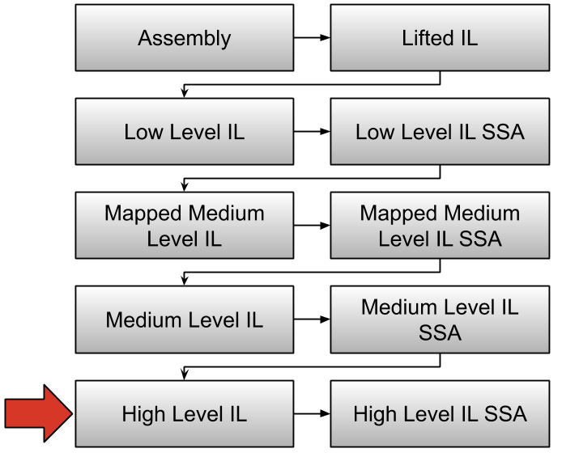

# Binary Ninja Intermediate Language Series, Part 3: High Level IL
# Binary Ninja Intermediate Language: High Level IL

The High Level Intermediate Language (HLIL) is Binary Ninja's decompiler output. Much like [LLIL](./bnil-llil.md) and [MLIL](./bnil-mlil.md), this representation is tree based and has many of the same instructions. This representation is distinct in a few key ways.



1. High level language concepts are recovered.
1. Expressions are folded

## Purposes of HLIL

* Simplified representation
* Small discrete operations
* Enables source-level forms of queries and analysis

In the rest of this article we will explore the instruction set.

## The Instruction Set

The instruction set is made up of [`HighLevelILInstruction`](https://api.binary.ninja/binaryninja.highlevelil-module.html#binaryninja.highlevelil.HighLevelILInstruction) objects. Let's start exploring by using the python console to poke around at some instructions. Open up a binary in Binary Ninja and retrieve an HLIL instruction:+

```
>>> current_il_instruction
<HighLevelILVarInit: uint64_t rax_2 = zx.q(rax_1 - 0x6c)>
>>> type(current_il_instruction)
<class 'binaryninja.highlevelil.HighLevelILVarInit'>
```

`current_il_instruction` is mapped to whatever il instruction is currently selected viewed and is not generally available to those writing plugins or scripts. You can see a full list of our [magic variables here](../guide/index.md#magic-console-variables).

There are a number of properties that can be queried on the [`HighLevelILInstruction`](https://api.binary.ninja/binaryninja.highlevelil-module.html#binaryninja.highlevelil.HighLevelILInstruction) object, and the validity of these properties changes depending on what the current operation is. The properties in HLIL are extremely similar to those in MLIL, with one notable exception being that `HLIL_CALL` instruction objects do not have a `.output` property, but instead `HLIL_CALL`s that have return values will be the `inst.right` of a `HighLevelILVarInit`, `HighLevelILVarAssign`, or similar.


### Control Flow

* `HLIL_JUMP` - Branch to the `dest` expression's address
* `HLIL_CALL` - Branch to the `dest` expression function, saving the return address, with the list of parameters `params`
* `HLIL_RET` - Return to the calling function.
* `HLIL_NORET` - This instruction will never be executed, the instruction before it is a call that doesn't return
* `HLIL_IF` - Branch to the `true`/`false` HLIL instruction identifier depending on the result of the `condition` expression
* `HLIL_GOTO` - Branch to the `dest` expression id
* `HLIL_TAILCALL` - This instruction calls the expression `dest` using `params` as input and `output` for return values
not exist
* `HLIL_SYSCALL` - Make a system/service call with parameters `params` and output `output`
* `HLIL_WHILE` - 
* `HLIL_DO_WHILE` - 
* `HLIL_FOR` - 
* `HLIL_SWITCH` - 
* `HLIL_CASE` - 
* `HLIL_BREAK` - 
* `HLIL_CONTINUE` - 

### Variable Reads and Writes

* `HLIL_VAR_DECLARE` - A declaration of `var`
* `HLIL_VAR_INIT` - Initializes `dest` to the result of an expression `src`
* `HLIL_ASSIGN` - Sets a variable `dest` to the result of an expression `src`
* `HLIL_ASSIGN_UNPACK` - 
* `HLIL_VAR` - A variable expression `src`
* `HLIL_VAR_PHI` - A `PHI` represents the combination of several prior versions of a variable when differnet basic blocks coalesce into a single destination and it's unknown which path was taken.
* `HLIL_MEM_PHI` - A memory `PHI` represents memory modifications that could have occured down different source basic blocks similar to a `VAR_PHI`.
* `HLIL_ADDRESS_OF` - The address of variable `src`
* `HLIL_CONST` - A constant integral value `constant`
* `HLIL_CONST_DATA` - A constant data reference `constant data reference`
* `HLIL_CONST_PTR` - A constant integral value which is used as a pointer `constant`
* `HLIL_EXTERN_PTR` - A symbolic pointer `constant` + `offset` to a symbol that exists outside the binary
* `HLIL_FLOAT_CONST` - A floating point constant `constant`
* `HLIL_IMPORT` - A `constant` integral value representing an imported address
* `HLIL_LOW_PART` - `size` bytes from the low end of `src` expression
* `HLIL_STRUCT_FIELD` - 
* `HLIL_ARRAY_INDEX` - 
* `HLIL_SPLIT` - A split pair of variables `high`:`low` which can be used a single expression
* `HLIL_DEREF` - Dereferences `src`
* `HLIL_DEREF_FIELD` - 

### Arithmetic Operations

* `HLIL_ADD` - Adds `left` expression to `right` expression
* `HLIL_ADC` - Adds with carry the `left` expression to the `right` expression with carry from the `carry` expression
* `HLIL_SUB` - Subtracts the `right` expression from the `left` expression
* `HLIL_SBB` - Subtraction with borrow the `right` expression from the `left` expression with carry from the `carry` expression
* `HLIL_AND` - Bitwise AND `left` expression with the `right` expression
* `HLIL_OR` - Bitwise OR `left` expression with the `right` expression
* `HLIL_XOR` - Bitwise XOR `left` expression with the `right` expression
* `HLIL_LSL` - Logical shift left the `left` expression by the number of bits stored in the `right` expression
* `HLIL_LSR` - Logical shift right the `left` expression by the number of bits stored in the `right` expression
* `HLIL_ASR` - Arithmetic shift right the `left` expression by the number of bits stored in the `right` expression
* `HLIL_ROL` - Rotate left the `left` expression by the number of bits stored in the `right` expression
* `HLIL_RLC` - Rotate left with carry the `left` expression and the `carry` expression by the number of bits stored in the `right` expression
* `HLIL_ROR` - Rotate right the `left` expression by the number of bits stored in the `right` expression
* `HLIL_RRC` - Rotate right with carry the `left` expression and the `carry` expression by the number of bits stored in the `right` expression
* `HLIL_MUL` - Single-precision multiply the `left` expression with the `right` expression
* `HLIL_MULU_DP` - Double-precision unsigned multiply the `left` expression with the `right` expression, result expression is twice the size of the input expressions
* `HLIL_MULS_DP` - Double-precision signed multiply the `left` expression with the `right` expression, result expression is twice the size of the input expressions
* `HLIL_DIVU` - Unsigned single-precision divide `left` expression by the `right` expression
* `HLIL_DIVU_DP` - Unsigned double-precision divide `left` expression by the `right` expression
* `HLIL_DIVS` - Signed single-precision divide `left` expression by the `right` expression
* `HLIL_DIVS_DP` - Signed double-precision divide `left` expression by the `right` expression
* `HLIL_MODU` - Unsigned single-precision modulus of `left` expression by the `right` expression
* `HLIL_MODU_DP` - Unsigned double-precision modulus of `left` expression by the `right` expression
* `HLIL_MODS` - Signed single-precision modulus of `left` expression by the `right` expression
* `HLIL_MODS_DP` - Signed double-precision modulus of `left` expression by the `right` expression
* `HLIL_NEG` - Sign inversion of `src` expression
* `HLIL_NOT` - Bitwise inversion of `src` expression
* `HLIL_FADD` - IEEE754 floating point addition of `left` expression with `right` expression
* `HLIL_FSUB` - IEEE754 floating point subtraction of `left` expression with `right` expression
* `HLIL_FMUL` - IEEE754 floating point multiplication of `left` expression with `right` expression
* `HLIL_FDIV` - IEEE754 floating point division of `left` expression with `right` expression
* `HLIL_FSQRT` - IEEE754 floating point square root of `left` expression with `right` expression
* `HLIL_FNEG` - IEEE754 floating point sign negation of `src` expression
* `HLIL_FABS` - IEEE754 floating point absolute value of `src` expression
* `HLIL_FLOAT_TO_INT` - IEEE754 floating point to integer conversion of `src` expression
* `HLIL_INT_TO_FLOAT` - Integer to IEEE754 floating point conversion of `src` expression
* `HLIL_FLOAT_CONV` - Convert bytes in `src` expression to IEEE754 floating point
* `HLIL_ROUND_TO_INT` - Rounds the IEEE754 floating point number `src` expression
* `HLIL_FLOOR` - Computes the floating point floor of the IEEE754 number in `src`
* `HLIL_CEIL` - Computes the floating point floor of the IEEE754 number in `src`
* `HLIL_FTRUNC` - Computes the floating point truncation of the IEEE754 number in `src`
* `HLIL_SX` - Sign extends the `src` expression
* `HLIL_ZX` - Zero extends the `src` expression
* `HLIL_ADD_OVERFLOW` - Calculates overflow of the addition of `left` expression with `right` expression
* `HLIL_BOOL_TO_INT` - Converts a bool `src` to an integer

### Comparison Instructions

* `HLIL_CMP_E` - Compare expression evaluates to true if `left` expression is equal to `right`
* `HLIL_CMP_NE` - Compare expression evaluates to true if `left` expression is not equal to `right`
* `HLIL_CMP_SLT` - Compare expression evaluates to true if `left` expression is signed less than `right`
* `HLIL_CMP_ULT` - Compare expression evaluates to true if `left` expression is unsigned less than `right`
* `HLIL_CMP_SLE` - Compare expression evaluates to true if `left` expression is signed less than or equal to `right`
* `HLIL_CMP_ULE` - Compare expression evaluates to true if `left` expression is unsigned less than or equal to `right`
* `HLIL_CMP_SGE` - Compare expression evaluates to true if `left` expression is signed greater than or equal to `right`
* `HLIL_CMP_UGE` - Compare expression evaluates to true if `left` expression is unsigned greater than or equal to `right`
* `HLIL_CMP_SGT` - Compare expression evaluates to true if `left` expression is signed greater than `right`
* `HLIL_CMP_UGT` - Compare expression evaluates to true if `left` expression is unsigned greater than `right`
* `HLIL_TEST_BIT` - Test if bit `right` in expression `left` is set
* `HLIL_FCMP_E` - Floating point compare expressions - evaluates to true if `left` expression is equal to `right`
* `HLIL_FCMP_NE` - Floating point compare expressions - evaluates to true if `left` expression is not equal to `right`
* `HLIL_FCMP_LT` - Floating point compare expressions - evaluates to true if `left` expression is less than `right`
* `HLIL_FCMP_LE` - Floating point compare expressions - evaluates to true if `left` expression is less than or equal to `right`
* `HLIL_FCMP_GE` - Floating point compare expressions - evaluates to true if `left` expression is greater than or equal to `right`
* `HLIL_FCMP_GT` - Floating point compare expressions - evaluates to true if `left` expression is greater than `right`
* `HLIL_FCMP_O` - Floating point compare expressions - evaluates to true if both `left` and `right` expressions are ordered (not NaN)
* `HLIL_FCMP_UO` - Floating point compare expressions - evaluates to true if either `left` or `right` expression is unordered (NaN)

### Miscellaneous Instructions

* `HLIL_NOP` - No operation
* `HLIL_BP` - Breakpoint instruction
* `HLIL_TRAP` - Interrupt/trap instruction with `vector` expression
* `HLIL_INTRINSIC` - Intrinsic instruction defined by the architecture
* `HLIL_UNDEF` - The expression performs undefined behavior
* `HLIL_UNIMPL` - The expression is not implemented
* `HLIL_UNIMPL_MEM` - The expression is not implemented but does access `src` memory
* `HLIL_BLOCK` - 
* `HLIL_LABEL` - 
* `HLIL_UNREACHABLE` - 