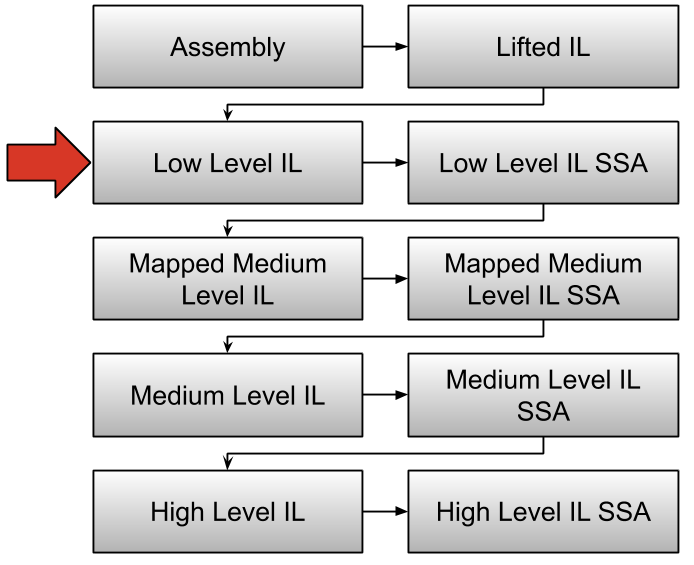

# Binary Ninja Intermediate Language Series, Part 1: Low Level IL

Make sure to checkout the [BNIL overview](bnil-overview.md) first if you haven't already. Or feel free to skip to [part 2](bnil-mlil.md) which covers MLIL. This developer guide is intended to cover some of the mechanics of the LLIL to distinguish it from the other ILs in the BNIL family. 

If you've already read the introduction, let's get right into the details of LLIL!



The Lifted IL is very similar to the LLIL and is primarily of interest for Architecture plugin authors. If you're writing an analysis plugin, you'll always want to be working at LLIL or higher. During each stage of the lifting process a number of transformations take place, and each layer of IL can have different instructions. Because of this, you can not rely on an instruction from one layer existing in another.

## Introduction by example

Since doing is the easiest way to learn let's start with a simple example binary and step through analyzing it using the python console. 


 - Download [chal1](../files/chal1) and open it with Binary Ninja
 - Next, bring up the `Low Level IL` view by clicking in the options pane at the bottom of the screen
 (or alternatively, use the `i` key)
 - Navigate to main (`g`, then "main", or double-click it in the function list)
 - Finally, bring up the python console using: `~`

Next, enter the following in the console:

```
>>> for block in current_function.low_level_il:
... 	for instr in block:
... 		print instr.address, instr.instr_index, instr
... 
4196422 0 push(rbp)
4196423 1 rbp = rsp {var_8}
4196426 2 rsp = rsp - 0x110
4196433 3 rax = rbp - 0xc0 {var_c8}
...
```

This will print out all the LLIL instructions in the current function. How does this code work? 

First we use the global magic variable `current_function` which gives us the python object [`function.Function`](http://api.binary.ninja/function.Function.html) for whatever function is currently selected in the UI. The variable is only usable from the python console, and shouldn't be used for headless plugins. In a script you can either use the function that was passed in if you [registered your plugin](https://api.binary.ninja/binaryninja.plugin-module.html#binaryninja.plugin.PluginCommand.register_for_function) to handle functions, or you can compute the function based on [a specific address](https://api.binary.ninja/binaryninja.binaryview-module.html?highlight=get_functions_at#binaryninja.binaryview.BinaryView.get_functions_at), or maybe even just iterate over all the functions in a BinaryView (`for func in bv.functions:`).

Next we get the [`lowlevelil.LowLevelILFunction`](http://api.binary.ninja/binaryninja.lowlevelil.LowLevelILFunction.html) from the `Function` class: `current_function.low_level_il`. Iterating over the `LowLevelILFunction` class provides access to the [`lowlevelil.LowLevelILBasicBlock`](http://api.binary.ninja/binaryninja.lowlevelil.LowLevelILBasicBlock.html) classes for this function. Inside the loop we can now iterate over the `LowLevelILBasicBlock` class which provides access to the individual [`lowlevelil.LowLevelILInstruction`](http://api.binary.ninja/binaryninja.lowlevelil.LowLevelILInstruction.html) classes.

Finally, we can print out the attributes of the instruction. We first print out `address` which is the address of the corresponding assembly language instruction.  Next, we print the `instr_index`, this you can think of as the address of the IL instruction. Since translating assembly language is a many-to-many relationship, we may see multiple IL instructions needed to represent a single assembly language instruction, and thus each IL instruction needs to have its own index separate from its address. Finally, we print out the instruction text.

In python, iterating over a class is a distinct operation from subscripting.  This separation is used in the `LowLevelILFunction` class. If you iterate over a `LowLevelILFunction` you get a list of `LowLevelILBasicBlocks`, however if you subscript a `LowLevelILFunction` you actually get the `LowLevelILInstruction` whose `instr_index` corresponds to the subscript:

```
>>> list(current_function.low_level_il)
[<block: x86_64@0x0-0x3f>, <block: x86_64@0x3f-0x45>, <block: x86_64@0x45-0x47>,
 <block: x86_64@0x47-0x53>, <block: x86_64@0x53-0x57>, <block: x86_64@0x57-0x5a>]
>>> type(current_function.low_level_il[0])
<class 'binaryninja.lowlevelil.LowLevelILInstruction'>
>>> current_function.low_level_il[0]
<il: push(rbp)>
```

## Low Level IL Instructions
Now that we've established how to access LLIL Functions, Blocks, and Instructions, let's focus in on the instructions themselves. LLIL instructions are infinite length and structured as an expression tree. An expression tree means that instruction operands can be composed of operation. Thus we can have an IL instruction like this:

```
eax = eax + ecx * 4
``` 

The tree for such an instruction would look like:

```
   =
  / \
eax  +
    / \
  eax  *
      / \
    ecx  4
```
There are quite a few reasons that we chose to use expression trees that we won't go into in detail here, but suffice it to say lifting to this form and reading this form are both much easier than other forms.

Now let's get back to the examples. First let's pick an instruction to work with:

```
>>> instr = current_function.low_level_il[2]
>>> instr
<il: rsp = rsp - 0x110>
``` 

For the above instruction, we have a few operations we can perform:

* **address** - returns the virtual address

```
>>> hex(instr.address)
'0x40084aL'
```
* **dest** - returns the destination operand

```
>>> instr.dest
'rsp'
```
* **function** - returns the containing function

```
>>> instr.function
<binaryninja.lowlevelil.LowLevelILFunction object at 0x111c79810>
```
* **instr_index** - returns the LLIL index

```
>>> instr.instr_index
2
```
* **operands** - returns a list of all operands.

```
>>> instr.operands
['rsp', <il: rsp - 0x110>]
```
* **operation** - returns the enumeration value of the current operation

```
>>> instr.operation
<LowLevelILOperation.LLIL_SET_REG: 1>
```
* **src** - returns the source operand

```
>>> instr.src
<il: rsp - 0x110>
```
* **dest** - returns the destination operand

```
>>> instr.dest
'rsp'
```

* **size** - returns the size of the operation in bytes (in this case we have an 8 byte assignment)

```
>>> instr.size
8L
```

Now with some knowledge of the `LowLevelIL` class let's try to do something with it. Let's say our goal is to find all the times the register `rdx` is written to in the current function. This code is straight forward:

```
>>> for block in current_function.low_level_il:
...  for instr in block:
...   if instr.operation == LowLevelILOperation.LLIL_SET_REG and instr.dest.name == 'rdx':
...    print instr.address, instr.instr_index, instr
... 
4196490 14 rdx = [rax].q
4196500 16 rdx = [rax + 8].q
4196511 18 rdx = [rax + 0x10].q
4196522 20 rdx = [rax + 0x18].q
4196533 22 rdx = [rax + 0x20].q
4196544 24 rdx = [rax + 0x28].q
4196798 77 rdx = [0x602090].q
```

## The Instructions

Going into gross detail on all the instructions is out of scope of this article, but we'll go over the different instructions types and speak generally about how they are used.

	
### Registers, Constants & Flags

When parsing an instruction tree the terminals are registers, constants and flags. This provide the basis from which all instructions are built.

* **`LLIL_REG`** - A register, terminal
* **`LLIL_CONST`** - A constant integer value, terminal
* **`LLIL_SET_REG`** - Sets a register to the results of the IL operation in `src` attribute.
* **`LLIL_SET_REG_SPLIT`** - Uses a pair of registers as one double sized register, setting both registers at once.
* **`LLIL_SET_FLAG`** - Sets the specified flag to the IL operation in `src` attribute.

### Memory Load & Store

Reading and writing memory is accomplished through the following instructions.

* **`LLIL_LOAD`** - Load a value from memory.
* **`LLIL_STORE`** - Store a value to memory.
* **`LLIL_PUSH`** - Store value to stack; adjusting stack pointer by sizeof(value) after the store.
* **`LLIL_POP`** - Load value from stack; adjusting stack pointer by sizeof(value) after the store.


### Control Flow & Conditionals

Control flow transferring- and comparison instructions are straightforward enough, but one instruction that deserves more attention is the `if` instruction. To understand the `if` instruction we need to first understand the concept of labels.

Labels function much like they do in C code. They can be put anywhere in the emitted IL and serve as a destination for the `if` and `goto` instructions.  Labels are required because one assembly language instruction can translate to multiple IL instructions, and you need to be able to branch to any of the emitted IL instructions. Let's consider the following x86 instruction `cmove` (Conditional move if equal flag is set):

```
test    eax, eax
cmove  eax, ebx
```

To translate this instruction to IL we have to first create true and false labels. Then we emit the `if` instruction, passing it the proper conditional and labels. Next we emit the true label, then we emit the set register instruction and a goto false label instruction. This results in the following output:

```
0 @ 00000002 if (eax == 0) then 1 else 3
1 @ 00000002 eax = ebx
2 @ 00000002 goto 3
``` 

As you can see from the above code, labels are really just used internally and aren't explicitly marked. In addition to `if` and `goto`, the `jump_to` IL instruction is the only other instruction that operates on labels.  The rest of the IL control flow instructions operate on addresses rather than labels, much like actual assembly language instructions. Note that an architecture plugin author should not be emitting `jump_to` IL instructions as those are generated by the analysis automatically. 

* **`LLIL_JUMP`** - Branch execution to the result of the IL operation.
* **`LLIL_JUMP_TO`** - Jump table construct, contains an expression and list of possible targets.
* **`LLIL_CALL`** - Branch execution to the result of the IL operation.
* **`LLIL_RET`** - Return execution to the caller.
* **`LLIL_NORET`** - Instruction emitted automatically after syscall or call instruction which cause the program to terminate.
* **`LLIL_IF`** - `If` provides conditional execution. If condition is true execution branches to the true label and false label otherwise.
* **`LLIL_GOTO`** - `Goto` is used to branch to an IL label, this is different than jump since jump can only jump to addresses.
* **`LLIL_FLAG_COND`** - Returns the flag condition expression for the specified flag condition.
* **`LLIL_CMP_E`** - equality
* **`LLIL_CMP_NE`** - not equal
* **`LLIL_CMP_SLT`** - signed less than
* **`LLIL_CMP_ULT`** - unsigned less than
* **`LLIL_CMP_SLE`** - signed less than or equal
* **`LLIL_CMP_ULE`** - unsigned less than or equal
* **`LLIL_CMP_SGE`** - signed greater than or equal
* **`LLIL_CMP_UGE`** - unsigned greater than or equal
* **`LLIL_CMP_SGT`** - signed greater than
* **`LLIL_CMP_UGT`** - unsigned greater than


### The Arithmetic & Logical Instructions

LLIL implements the most common arithmetic as well as a host of more complicated instruction which make translating from assembly much easier. Most arithmetic and logical instruction contain `left` and `right` attributes which can themselves be other IL instructions.

The double precision instruction multiply, divide, modulus instructions are particularly helpful for instruction sets like x86 whose output/input can be double the size of the input/output.

* **`LLIL_ADD`** - Add
* **`LLIL_ADC`** - Add with carry
* **`LLIL_SUB`** - Subtract
* **`LLIL_SBB`** - Subtract with borrow
* **`LLIL_AND`** - Bitwise and
* **`LLIL_OR`** - Bitwise or
* **`LLIL_XOR`** - Exclusive or
* **`LLIL_LSL`** - Logical shift left
* **`LLIL_LSR`** - Logical shift right
* **`LLIL_ASR`** - Arithmetic shift right
* **`LLIL_ROL`** - Rotate left
* **`LLIL_RLC`** - Rotate left with carry
* **`LLIL_ROR`** - Rotate right
* **`LLIL_RRC`** - Rotate right with carry
* **`LLIL_MUL`** - Multiply single precision
* **`LLIL_MULU_DP`** - Unsigned multiply double precision 
* **`LLIL_MULS_DP`** - Signed multiply double precision
* **`LLIL_DIVU`** - Unsigned divide single precision
* **`LLIL_DIVU_DP`** - Unsigned divide double precision
* **`LLIL_DIVS`** - Signed divide single precision
* **`LLIL_DIVS_DP`** - Signed divide double precision
* **`LLIL_MODU`** - Unsigned modulus single precision
* **`LLIL_MODU_DP`** - Unsigned modulus double precision
* **`LLIL_MODS`** - Signed modulus single precision
* **`LLIL_MODS_DP`** - Signed modulus double precision
* **`LLIL_NEG`** - Sign negation
* **`LLIL_NOT`** - Bitwise complement

### Special instructions

The rest of the instructions are pretty much self-explanatory to anyone with familiarity with assembly languages.

* **`LLIL_NOP`** - No operation
* **`LLIL_SX`** - Sign extend
* **`LLIL_ZX`** - Zero extend
* **`LLIL_SYSCALL`** - System call instruction
* **`LLIL_BP`** - Breakpoint instruction
* **`LLIL_TRAP`** - Trap instruction
* **`LLIL_UNDEF`** - Undefined instruction
* **`LLIL_UNIMPL`** - Unimplemented instruction
* **`LLIL_UNIMPL_MEM`** - Unimplemented memory access instruction

