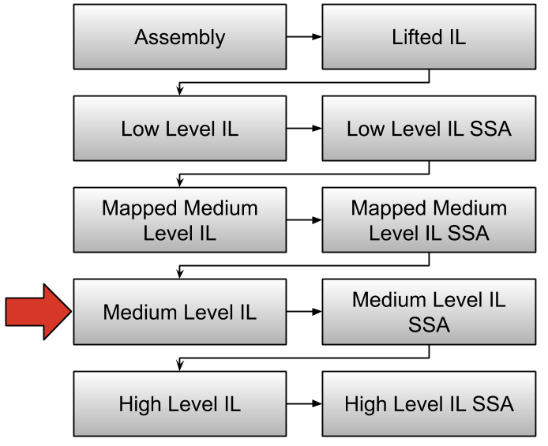

# Binary Ninja Intermediate Language Series, Part 2: Medium Level IL

The Medium Level Intermediate Language (MLIL) is the second major representation in the Binary Ninja Intermediate Language (BNIL) family of intermediate languages. Much like [LLIL](./bnil-llil.md) this representation is tree based and has many of the same instructions. This representation is distinct in a few key ways. 



1. Registers have been translated to variables.
1. The stack as a concept is not present.
1. Variables have types associated with them.
1. Call sites have their parameters inferred and associated with them.
1. Data flow has been calculated and constants are propagated.
1. Some dead code is eliminated (MLIL only, Mapped MLIL doesn't do this)

## Purposes of MLIL

* Simplified representation
* Small discrete operations
* Can be more accurate to binary representation than decompilation
* Powerful Data flow (PossibleValueSet) APIs
* Accurate (though verbose) variable identification

In the rest of this article we will explore the variable object, the type object, the confidence system, and finally the instruction set.

## The Variable Object

First, it's important to understand what we mean when we talk about a MLIL variable. Continuing from our example above we can get a [`Variable`](https://api.binary.ninja/binaryninja.function.Variable.html) object. 

```
>>> inst.output
[<var int64_t rax>]
>>> var = inst.output[0]
>>> type(var)
<class 'binaryninja.function.Variable'>
```

Variables in MLIL have a very specific meaning, that is not completely obvious at first. They represent a single storage location within the scope of a single function. To those not well versed in program analysis, a storage location is where a value is located at a given point in time. In the process of compilation a compiler conducts a step called _Register Allocation_; this is the process of figuring out how to map the potentially infinite number of variables specified in the original source code to a finite set of registers. When there are more variables and intermediate values than registers available, the compiler _spills_ them on to the stack. Thus a single high-level-language variable can be mapped across a number of storage locations. A variable can simultaneously be in multiple registers and on the stack at the same time. However, unlike high-level-language variables, MLIL variables represent one and only one storage location. Binary Ninja's High Level IL (HLIL) will be responsible for storing this mapping.

So let's look at the properties available on a [`Variable`](https://api.binary.ninja/binaryninja.function.Variable.html) object.

### ``source_type``

The ``source_type`` represents the storage location type and can be one of the following :

```
enum VariableSourceType
{
	StackVariableSourceType,
	RegisterVariableSourceType,
	FlagVariableSourceType
};
```


```
>>> var.source_type
<VariableSourceType.RegisterVariableSourceType: 1>
```

### ``storage``

The ``storage`` property changes meaning depending on the [`VariableSourceType`](https://api.binary.ninja/binaryninja.enums.VariableSourceType.html). When a variable is of type ``RegisterVariableSourceType``, its ``storage`` property represents the index into the register list for the given architecture. If the ``source_type`` is ``StackVariableSourceType``, its ``storage`` property represents the stack offset of the variable.

```
>>> var
<var int64_t rax>
>>> var.source_type
<VariableSourceType.RegisterVariableSourceType: 1>
>>> bv.arch._regs_by_index[var.storage]
'rax'
>>> var2
<var int64_t var_260>
>>> var2.source_type
<VariableSourceType.StackVariableSourceType: 0>
>>> hex(var2.storage)
'-0x260'
```

Given the above information it might now be intuitive how variable names are constructed. First we determine the ``source_type`` of the variable. If it's a ``RegisterVariableSourceType`` we just use the register's name directly. If it’s  a ``StackVariableSourceType`` then we use ``var_`` + ``hex(-storage)``. Finally, we append a count each time that that storage location is reused.

### ``index``
The ``index`` is an identifier chosen to be unique across different analysis passes. 

### ``type``

The ``type`` property returns the ``Type`` object associated with the variable:

```
>>> var.type
<type: int64_t, 0% confidence>
```

Type objects are described in detail in the next section.


## The Type Object

Type objects are very similar to standard C types. A Type object's type can be determined through the object’s ``type_class`` property. Valid types are in the [`TypeClass`](https://api.binary.ninja/binaryninja.enums.TypeClass.html) enumeration:

```
enum TypeClass
{
	VoidTypeClass = 0,
	BoolTypeClass = 1,
	IntegerTypeClass = 2,
	FloatTypeClass = 3,
	StructureTypeClass = 4,
	EnumerationTypeClass = 5,
	PointerTypeClass = 6,
	ArrayTypeClass = 7,
	FunctionTypeClass = 8,
	VarArgsTypeClass = 9,
	ValueTypeClass = 10,
	NamedTypeReferenceClass = 11,
	WideCharTypeClass = 12
};
```

Type objects all contain a ``confidence`` property; this is currently only used for type inference, but can also be used by users implementing their own analyses. Below is a reference for each of the type objects and their unique properties.

### VoidTypeClass

A void object is one that nothing is known about. For instance if a reference is taken of a static memory address a variable will be created there with a void type as we know the address is used, but are unsure about what size is being accessed. The instruction that takes the address of the static memory address will be a void pointer.

### BoolTypeClass

A boolean type is an integer which has a value of False (0) or True (!0).

### IntegerTypeClass

An integer type has a sign, a width (in bytes), and a display type. The display type determines how the integer should be displayed; the options are self explanatory:

```
enum IntegerDisplayType
{
	DefaultIntegerDisplayType,
	BinaryDisplayType,
	SignedOctalDisplayType,
	UnsignedOctalDisplayType,
	SignedDecimalDisplayType,
	UnsignedDecimalDisplayType,
	SignedHexadecimalDisplayType,
	UnsignedHexadecimalDisplayType,
	CharacterConstantDisplayType,
	PointerDisplayType
};
``` 

### FloatTypeClass

The float type is a IEEE 754 variable precision type, and can represent floating point numbers up to 10 bytes in width. All floating point numbers are assumed to be signed.


### WideCharTypeClass

The wide character holds a unicode character constant whose interpretation can change depending on the ``analysis.unicode`` group of settings.

### VarArgsTypeClass

A varargs type is used to indicate that a function is variadic and thus represents the set of additional parameters being passed to a given function.

### ValueTypeClass

A value type is simply a constant value. It is used mainly in demangling for types which only have a have a name or value.


### FunctionTypeClass

The function type describes the return type, parameter list, and calling convention of a [function](https://api.binary.ninja/binaryninja.function.Function.html), among many other properties.

* ``can_return`` - boolean value indicating if the function can return
* ``calling_convention`` - the calling convention this function uses
* ``const`` - boolean value indicating if this a const function
* ``has_variable_arguments`` - boolean value indicating if this function is variadic
* ``parameters`` - contains a list of ``Type`` objects
* ``platform`` - the ``Platform`` object associated with this function
* ``return_value`` - the return type of this function
* ``stack_adjustment`` - the size in bytes of the stack adjustment that this function makes

### PointerTypeClass

A pointer type simply describes a pointer and what it points to in the ``target``/``element_type`` property.

### ArrayTypeClass

Array types function similarly to pointer types however the array type knows how large the object that it points to is:

* ``target``/``element_type`` - the type of element this array is constructed of
* ``count`` - the count of array elements
* ``width`` - the size of the array (count * target.width)

### EnumerationTypeClass

``Enumeration`` types function much the same way they do in C, providing a mapping between a name and corresponding constant. The object itself contains a ``members`` property and a list of [`EnumerationMember`](https://api.binary.ninja/binaryninja.types.EnumerationMember.html) objects each containing a name and value.

### StructureTypeClass

Structure types are simple in principle but are complicated by the need for them to be referenced by a ``NamedTypeReference`` for them to be useful. Structures come in 3 different flavors: ``struct``, ``class``, and ``union``. While the first two simply differ in name, in unions all members overlap. ``Structure`` objects contain a list of StructureMembers. StructureMember objects contain a ``name``, ``offset``, and ``type``. Structures can be packed or aligned, accessible by the ``packed`` property.

### NamedTypeReferenceClass

NamedTypeReference types are symbolic references to other types. They function much like a C ``typedef`` (i.e. Name X corresponds to type Y). The NamedTypeReference has a ``type_class`` property describing what sort of type it is pointing at.

```
enum NamedTypeReferenceClass
{
	UnknownNamedTypeClass = 0,
	TypedefNamedTypeClass = 1,
	ClassNamedTypeClass = 2,
	StructNamedTypeClass = 3,
	UnionNamedTypeClass = 4,
	EnumNamedTypeClass = 5
};
```

Most of the above should be self-explanatory except for the ``UnknownNamedTypeClass`` which is used in the name demangler, as the mangler doesn't disambiguate between named Enumerations and named Structures. NamedTypeReference objects also have a UUID ``type_id``.

## The Instruction Set

The instruction set is made up of [`MediumLevelILInstruction`](https://api.binary.ninja/binaryninja.mediumlevelil.MediumLevelILInstruction.html) objects. Let's start exploring by using the python console to poke around at some instructions. Open up a binary in Binary Ninja and retrieve an MLIL instruction:

```
>>> inst = current_mlil[8]
<il: rax = 0x402cb0("PORT")>
>>> type(inst)
<class 'binaryninja.mediumlevelil.MediumLevelILInstruction'>
```

``current_mlil`` is mapped to whatever function is currently being viewed and is not generally available to those writing plugins, as your plugin could be headless. The bracket operators tell the API to get the MLIL instruction at index 8 for the current function.

There are a number of properties that can be queried on the [`MediumLevelILInstruction`](https://api.binary.ninja/binaryninja.mediumlevelil.MediumLevelILInstruction.html) object, and the validity of these properties changes depending on what the current operation is. If we look at the ``operation`` of ``inst`` we can see it is a ``MLIL_CALL`` instruction.

```
>>> inst.operation
<MediumLevelILOperation.MLIL_CALL: 51>
```

From the code in [`mediumlevelil.py`](https://github.com/Vector35/binaryninja-api/blob/dev/python/mediumlevelil.py#L175) we can see that the ``MLIL_CALL`` operation has three properties in addition to the operations available to all ``MediumLevelILInstruction`` objects

```
MediumLevelILOperation.MLIL_CALL: [("output", "var_list"), ("dest", "expr"), ("params", "expr_list")],
```

Thus we can query the call's ``output`` which is a list of variables:

```
>>> inst.output
[<var int64_t rax>]
```

The call's ``dest`` (destination expression) which in this case is a ``MLIL_CONST_PTR``:

```
>>> inst.dest
<il: 0x402cb0>
>>> inst.dest.operation
<MediumLevelILOperation.MLIL_CONST_PTR: 14>
>>> inst.dest.value
<const ptr 0x402cb0>
>>> hex(inst.dest.value.value)
'0x402cb0'
```

The parameter list can be accessed through the ``params`` property:

```
>>> inst.params
[<il: "PORT">]
>>> inst.params[0]
<il: "PORT">
>>> type(inst.params[0])
<class 'binaryninja.mediumlevelil.MediumLevelILInstruction'>
```

### Control Flow

* ``MLIL_JUMP`` - Branch to the ``dest`` expression's address
* ``MLIL_JUMP_TO`` - A jump table dispatch instruction. Uses the ``dest`` expression to calculate the MLIL instruction target ``targets`` to branch to
* ``MLIL_CALL`` - Branch to the ``dest`` expression function, saving the return address, with the list of parameters ``params`` and returning the list of return values ``output``
* ``MLIL_CALL_UNTYPED`` - This is a call instruction where stack resolution could not be determined, and thus a list of parameters and return values do not exist
* ``MLIL_CALL_OUTPUT`` - This expression holds a set of return values ``dest`` from a call
* ``MLIL_CALL_PARAM`` - This expression holds the set of parameters ``src`` for a call instruction
* ``MLIL_RET`` - Return to the calling function.
* ``MLIL_RET_HINT`` - Indirect jump to ``dest`` expression (only used in internal analysis passes.)
* ``MLIL_NORET`` - This instruction will never be executed, the instruction before it is a call that doesn't return
* ``MLIL_IF`` - Branch to the ``true``/``false`` MLIL instruction identifier depending on the result of the ``condition`` expression
* ``MLIL_GOTO`` - Branch to the ``dest`` expression id
* ``MLIL_TAILCALL`` - This instruction calls the expression ``dest`` using ``params`` as input and ``output`` for return values
* ``MLIL_SYSCALL`` - Make a system/service call with parameters ``params`` and output ``output``
* ``MLIL_SYSCALL_UNTYPED`` - Makes a system/service call, but an exact set of parameters couldn't be determined.

### Variable Reads and Writes

* ``MLIL_SET_VAR`` - Sets a variable ``dest`` to the result of an expression ``src``
* ``MLIL_SET_VAR_FIELD`` - Sets variable ``dest`` at ``offset`` to the ``src`` expression
* ``MLIL_SET_VAR_SPLIT`` - Sets a pair of variables ``high``:``low`` to the result of the ``src`` expression
* ``MLIL_LOAD`` - Read ``size`` bytes from the memory address ``src``
* ``MLIL_LOAD_STRUCT`` - Read from the struct offset at ``src`` + ``offset``
* ``MLIL_STORE`` - Stores ``size`` bytes into ``dest`` from ``src``
* ``MLIL_STORE_STRUCT`` - Stores ``size`` bytes into struct offset ``dest`` + ``offset`` from ``src``
* ``MLIL_VAR`` - A variable expression ``src``
* ``MLIL_VAR_FIELD`` - A variable and offset expression ``src``, ``offset``
* ``MLIL_VAR_SPLIT`` - A split pair of variables ``high``:``low`` which can be used a single expression
* ``MLIL_ADDRESS_OF`` - The address of variable ``src``
* ``MLIL_ADDRESS_OF_FIELD`` - The address and ``offset`` of the variable ``src``
* ``MLIL_CONST`` - A constant integral value ``constant``
* ``MLIL_CONST_PTR`` - A constant integral value which is used as a pointer ``constant``
* ``MLIL_EXTERN_PTR`` - A symbolic pointer ``constant`` + ``offset`` to a symbol that exists outside the binary
* ``MLIL_FLOAT_CONST`` - A floating point constant ``constant``
* ``MLIL_IMPORT`` - A ``constant`` integral value representing an imported address
* ``MLIL_LOW_PART`` - ``size`` bytes from the low end of ``src`` expression


### Arithmetic Operations

* ``MLIL_ADD`` - Adds ``left`` expression to ``right`` expression
* ``MLIL_ADC`` - Adds with carry the ``left`` expression to the ``right`` expression with carry from the ``carry`` expression
* ``MLIL_SUB`` - Subtracts the ``right`` expression from the ``left`` expression
* ``MLIL_SBB`` - Subtraction with borrow the ``right`` expression from the ``left`` expression with carry from the ``carry`` expression
* ``MLIL_AND`` - Bitwise AND ``left`` expression with the ``right`` expression
* ``MLIL_OR`` - Bitwise OR ``left`` expression with the ``right`` expression
* ``MLIL_XOR`` - Bitwise XOR ``left`` expression with the ``right`` expression
* ``MLIL_LSL`` - Logical shift left the ``left`` expression by the number of bits stored in the ``right`` expression
* ``MLIL_LSR`` - Logical shift right the ``left`` expression by the number of bits stored in the ``right`` expression
* ``MLIL_ASR`` - Arithmetic shift left the ``left`` expression by the number of bits stored in the ``right`` expression
* ``MLIL_ROL`` - Rotate left the ``left`` expression by the number of bits stored in the ``right`` expression
* ``MLIL_RLC`` - Rotate left with carry the ``left`` expression and the ``carry`` expression by the number of bits stored in the ``right`` expression
* ``MLIL_ROR`` - Rotate right the ``left`` expression by the number of bits stored in the ``right`` expression
* ``MLIL_RRC`` - Rotate right with carry the ``left`` expression and the ``carry`` expression by the number of bits stored in the ``right`` expression
* ``MLIL_MUL`` - Single-precision multiply the ``left`` expression with the ``right`` expression
* ``MLIL_MULU_DP`` - Double-precision unsigned multiply the ``left`` expression with the ``right`` expression, result expression is twice the size of the input expressions
* ``MLIL_MULS_DP`` - Double-precision signed multiply the ``left`` expression with the ``right`` expression, result expression is twice the size of the input expressions
* ``MLIL_DIVU`` - Unsigned single-precision divide ``left`` expression by the ``right`` expression
* ``MLIL_DIVU_DP`` - Unsigned double-precision divide ``left`` expression by the ``right`` expression
* ``MLIL_DIVS`` - Signed single-precision divide ``left`` expression by the ``right`` expression
* ``MLIL_DIVS_DP`` - Signed double-precision divide ``left`` expression by the ``right`` expression
* ``MLIL_MODU`` - Unsigned single-precision modulus of ``left`` expression by the ``right`` expression
* ``MLIL_MODU_DP`` - Unsigned double-precision modulus of ``left`` expression by the ``right`` expression
* ``MLIL_MODS`` - Signed single-precision modulus of ``left`` expression by the ``right`` expression
* ``MLIL_MODS_DP`` - Signed double-precision modulus of ``left`` expression by the ``right`` expression
* ``MLIL_NEG`` - Sign inversion of ``src`` expression
* ``MLIL_NOT`` - Bitwise inversion of ``src`` expression
* ``MLIL_FADD`` - IEEE754 floating point addition of ``left`` expression with ``right`` expression
* ``MLIL_FSUB`` - IEEE754 floating point subtraction of ``left`` expression with ``right`` expression
* ``MLIL_FMUL`` - IEEE754 floating point multiplication of ``left`` expression with ``right`` expression
* ``MLIL_FDIV`` - IEEE754 floating point division of ``left`` expression with ``right`` expression
* ``MLIL_FSQRT`` - IEEE754 floating point square root of ``left`` expression with ``right`` expression
* ``MLIL_FNEG`` - IEEE754 floating point sign negation of ``src`` expression
* ``MLIL_FABS`` - IEEE754 floating point absolute value of ``src`` expression
* ``MLIL_FLOAT_TO_INT`` - IEEE754 floating point to integer conversion of ``src`` expression
* ``MLIL_INT_TO_FLOAT`` - Integer to IEEE754 floating point conversion of ``src`` expression
* ``MLIL_FLOAT_CONV`` - Convert bytes in ``src`` expression to IEEE754 floating point
* ``MLIL_ROUND_TO_INT`` - Rounds the IEEE754 floating point number ``src`` expression
* ``MLIL_FLOOR`` - Computes the floating point floor of the IEEE754 number in ``src``
* ``MLIL_CEIL`` - Computes the floating point floor of the IEEE754 number in ``src``
* ``MLIL_FTRUNC`` - Computes the floating point truncation of the IEEE754 number in ``src``
* ``MLIL_SX`` - Sign extends the ``src`` expression
* ``MLIL_ZX`` - Zero extends the ``src`` expression
* ``MLIL_ADD_OVERFLOW`` - Calculates overflow of the addition of ``left`` expression with ``right`` expression

### Comparison Instructions

* `MLIL_CMP_E` - Compare expression evaluates to true if ``left`` expression is equal to ``right``
* `MLIL_CMP_NE` - Compare expression evaluates to true if ``left`` expression is not equal to ``right``
* `MLIL_CMP_SLT` - Compare expression evaluates to true if ``left`` expression is signed less than ``right``
* `MLIL_CMP_ULT` - Compare expression evaluates to true if ``left`` expression is unsigned less than ``right``
* `MLIL_CMP_SLE` - Compare expression evaluates to true if ``left`` expression is signed less than or equal to ``right``
* `MLIL_CMP_ULE` - Compare expression evaluates to true if ``left`` expression is unsigned less than or equal to ``right``
* `MLIL_CMP_SGE` - Compare expression evaluates to true if ``left`` expression is signed greater than or equal to ``right``
* `MLIL_CMP_UGE` - Compare expression evaluates to true if ``left`` expression is unsigned greater than or equal to ``right``
* `MLIL_CMP_SGT` - Compare expression evaluates to true if ``left`` expression is signed greater than ``right``
* `MLIL_CMP_UGT` - Compare expression evaluates to true if ``left`` expression is unsigned greater than ``right``
* `MLIL_TEST_BIT` - Test if bit ``right`` in expression ``left`` is set
* `MLIL_FCMP_E` - Floating point compare expressions - evaluates to true if ``left`` expression is equal to ``right``
* `MLIL_FCMP_NE` - Floating point compare expressions - evaluates to true if ``left`` expression is not equal to ``right``
* `MLIL_FCMP_LT` - Floating point compare expressions - evaluates to true if ``left`` expression is less than ``right``
* `MLIL_FCMP_LE` - Floating point compare expressions - evaluates to true if ``left`` expression is less than or equal to ``right``
* `MLIL_FCMP_GE` - Floating point compare expressions - evaluates to true if ``left`` expression is greater than or equal to ``right``
* `MLIL_FCMP_GT` - Floating point compare expressions - evaluates to true if ``left`` expression is greater than ``right``
* `MLIL_FCMP_O` - Floating point compare expressions - evaluates to true if both ``left`` and ``right`` expressions are ordered (not NaN)
* `MLIL_FCMP_UO` - Floating point compare expressions - evaluates to true if either ``left`` or ``right`` expression is unordered (NaN)

### Miscellaneous Instructions

* ``MLIL_BP`` - Breakpoint instruction
* ``MLIL_TRAP`` - Interrupt/trap instruction with ``vector`` expression
* ``MLIL_INTRINSIC`` - Intrinsic instruction defined by the architecture
* ``MLIL_FREE_VAR_SLOT`` - Free the ``dest`` expression from the register stack
* ``MLIL_UNDEF`` - The expression performs undefined behavior
* ``MLIL_UNIMPL`` - The expression is not implemented
* ``MLIL_UNIMPL_MEM`` - The expression is not implemented but does access ``src`` memory


