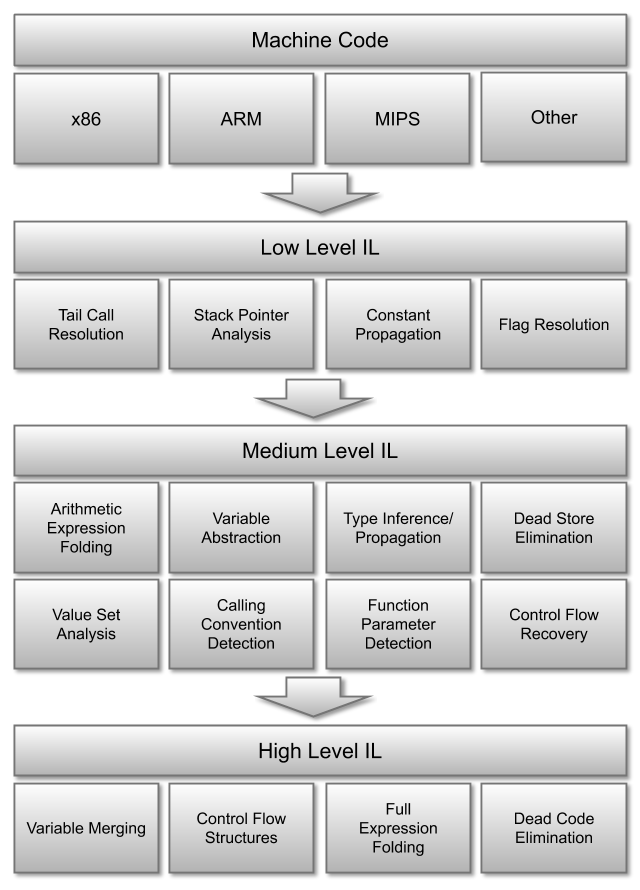
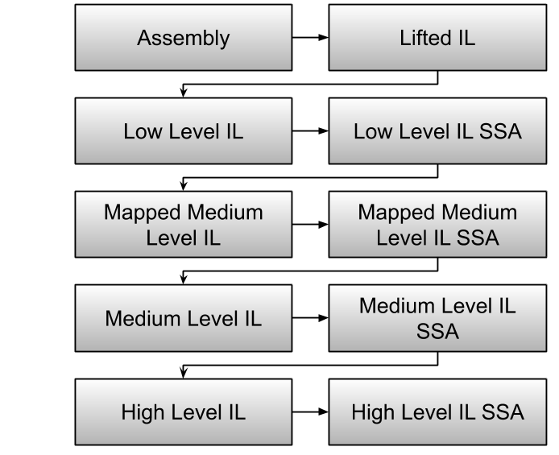

# Binary Ninja Intermediate Language Series, Part 0: Overview

The Binary Ninja Intermediate Language (BNIL) is a semantic representation of the assembly language instructions for a native architecture in Binary Ninja.  BNIL is actually a family of intermediate languages that work together to provide functionality at different abstraction layers. 

BNIL is a [tree-based](https://raw.githubusercontent.com/withzombies/bnil-graph/master/images/graph.png), architecture-independent intermediate representation of machine code used throughout Binary Ninja.



During each step a number of optimizations and analysis passes occur, resulting in a higher and higher level of abstraction the further through the analysis binaries are processed.

Except that overview isn't telling the whole story! The real stack of BNIL _actually_ looks like this:



This short introduction is a very brief guide to BNIL with much more details in [Part 1: LLIL](bnil-llil.md) and [Part 2: MLIL](bnil-mlil.md).

## Reading IL

All of the various ILs (with the exception of the SSA forms) are intended to be easily human-readable and look much like pseudo-code. There is some shorthand notation that is used throughout the ILs, though, explained below:

### Comparisons

First, all comparisons are either signed `s<=` or unsigned `u>=`.


### Bitwise operations

Besides the typical `&&` bitwise operators, BNIL makes use of `sx` and `zx` to indicate `sign-extended` and `zero-extended` operations.

### Size Specifiers

Expressions in BNIL can have one of the following suffixes to indicate a size:

```
.q -- Qword (64 bits)
.d -- Dword (32 bits)
.w -- Word (16 bits)
.b -- Byte (8 bits)
```

### Variable Offsets

Offsets into variables are specified with a `:$offset` syntax indicating how many bits from the bottom of the variable the expression is referencing.

### Example

So putting all that together, if you were to see the following in an IL expression:

```sx.q(rax_2:0.d)```

It represents the lower 32-bits of variable `rax_2`, sign-extended into a 64-bit variable.
