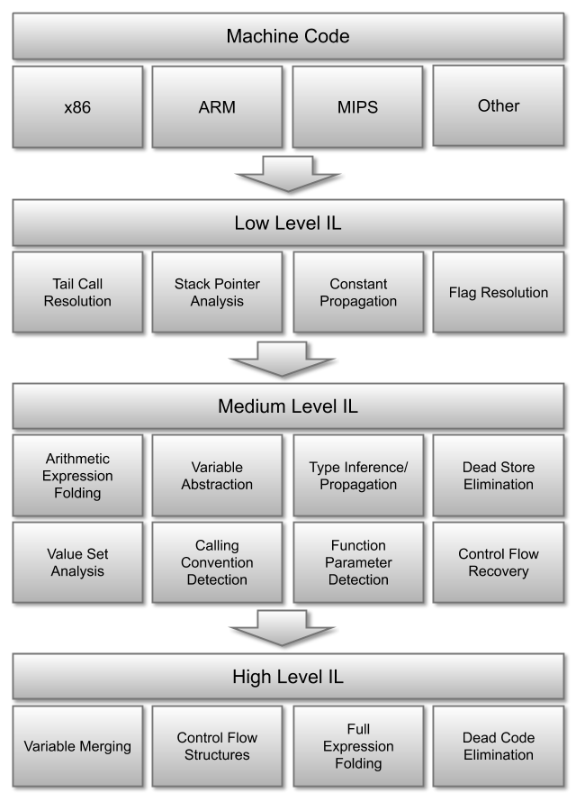

# Binary Ninja Intermediate Language Series, Part 0: Overview

The Binary Ninja Intermediate Language (BNIL) is a semantic representation of the assembly language instructions for a native architecture in Binary Ninja.  BNIL is actually a family of intermediate languages that work together to provide functionality at different abstraction layers. 

BNIL is a [tree-based](https://raw.githubusercontent.com/withzombies/bnil-graph/master/images/graph.png), architecture-independent intermediate representation of machine code used throughout Binary Ninja.



During each step a number of optimizations and analysis passes occur, resulting in a higher and higher level of abstraction the further through the analysis binaries are processed.

Except that overview isn't telling the whole story! The real stack of BNIL _actually_ looks like this:


This short introduction is a very brief guide to BNIL with much more details in [Part 1: LLIL](bnil-llil.md) and [Part 2: MLIL](bnil-mlil.md).

## Summary

While the image above shows a bit of the logical relationships between each IL in terms of analysis, it's only an approximation. The actual analysis includes more edges than just those shown. That said, here's a short overview of some of the differences between each IL and when you might wish to use a given one:

- Lifted IL is intended to be a straight-forward translation from native instruction semantics to LLIL instructions. Note that Lifted IL and LLIL share the same instructions and are substantively similar with a few small differences.
- Low Level IL (LLIL) is converted from Lifted IL, LLIL removes NOP instructions and folds flags into conditional instructions but otherwise contains the same operations as Lifted IL.
- Low Level IL SSA Form is an [SSA](https://en.wikipedia.org/wiki/Static_single_assignment_form) form of LLIL.
- Mapped Medium Level IL is a translation layer between LLIL that is rarely needed for analysis but is useful for the translation process.
- Medium Level IL (MLIL) translates registers and memory accesses into variables, types are associated with variables, platform information is used to generate call sites with types (both inferred and explicit) and parameters, data flow is calculated and constants are propagated.
- Medium Level IL SSA Form is an [SSA](https://en.wikipedia.org/wiki/Static_single_assignment_form) form of MLIL.
- High Level IL (HLIL) [builds on](https://api.binary.ninja/binaryninja.function-module.html#binaryninja.function.Function.request_debug_report) (use the `high_level_il` report type) MLIL by adding higher level control flow instructions, a number of dead-code and variable passes as well as other simplification/folding. It also includes an [AST](https://api.binary.ninja/binaryninja.highlevelil-module.html#binaryninja.highlevelil.HighLevelILInstruction.ast).


## Reading IL

All of the various ILs (with the exception of the SSA forms) are intended to be easily human-readable and look much like pseudo-code. There is some shorthand notation that is used throughout the ILs, though, explained below:

### Comparisons

First, all comparisons are either signed `s<=` or unsigned `u>=`.


### Bitwise operations

Besides the typical `&&` bitwise operators, BNIL makes use of `sx` and `zx` to indicate `sign-extended` and `zero-extended` operations.

### Size Specifiers

Expressions in BNIL can have one of the following suffixes to indicate a size:

```
.q -- Qword (8 bytes)
.d -- Dword (4 bytes)
.w -- Word (2 bytes)
.b -- Byte (1 byte)
```

Note that floating point IL instructions have their own possible size suffixes:

```
.h -- Half (2 bytes)
.s -- Single (4 bytes)
.d -- Double (8 bytes)
.t -- Ten (10 bytes)
.o -- Oword (16 bytes)
```

Additionally, floating point IL operations are indicated with a prefixed `f`, like:

```
f* -- Floating-point multiplication
f/ -- Floating-point division
f+ -- Floating-point addition
f- -- Floating-point subtraction
```

### Variable Offsets

Offsets into variables are specified with a `:$offset` syntax indicating how many bits from the bottom of the variable the expression is referencing.

### Example

So putting all that together, if you were to see the following in an IL expression:

```sx.q(rax_2:0.d)```

It represents the lower 32-bits of variable `rax_2`, sign-extended into a 64-bit variable.
