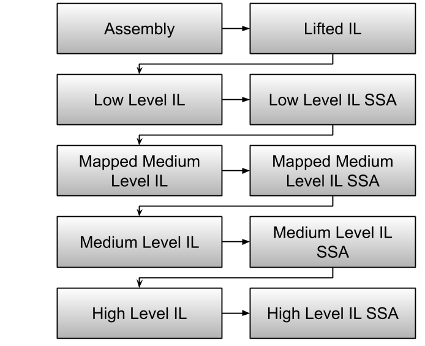

# Binary Ninja Intermediate Language: Overview

The Binary Ninja Intermediate Language (BNIL) is a semantic representation of the assembly language instructions for a native architecture in Binary Ninja.  BNIL is actually a family of intermediate languages that work together to provide functionality at different abstraction layers. 

BNIL is a [tree-based](https://raw.githubusercontent.com/withzombies/bnil-graph/master/images/graph.png), architecture-independent intermediate representation of machine code used throughout Binary Ninja.


During each step a number of optimizations and analysis passes occur, resulting in a higher and higher level of abstraction the further through the analysis binaries are processed.

Except that overview isn't telling the whole story! The real stack of BNIL _actually_ looks like this:



This short introduction is a very brief guide to BNIL with much more details in [Part 1: LLIL](bnil-llil.md) and [Part 2: MLIL](bnil-mlil.md).

## Summary

While the image above shows a bit of the logical relationships between each IL in terms of analysis, it's only an approximation. The actual analysis includes more edges than just those shown. That said, here's a short overview of some of the differences between each IL and when you might wish to use a given one:

- Lifted IL is intended to be a straight-forward translation from native instruction semantics to LLIL instructions. Note that Lifted IL and LLIL share the same instructions and are substantively similar with a few small differences.
- Low Level IL (LLIL) is converted from Lifted IL, LLIL removes NOP instructions and folds flags into conditional instructions but otherwise contains the same operations as Lifted IL.
- Low Level IL SSA Form is an [SSA](https://en.wikipedia.org/wiki/Static_single_assignment_form) form of LLIL.
- Mapped Medium Level IL is a translation layer between LLIL that is rarely needed for analysis but is useful for the translation process.
- Medium Level IL (MLIL) translates registers and memory accesses into variables, types are associated with variables, platform information is used to generate call sites with types (both inferred and explicit) and parameters, data flow is calculated and constants are propagated.
- Medium Level IL SSA Form is an [SSA](https://en.wikipedia.org/wiki/Static_single_assignment_form) form of MLIL.
- High Level IL (HLIL) [builds on](https://api.binary.ninja/binaryninja.function-module.html#binaryninja.function.Function.request_debug_report) (use the `high_level_il` report type) MLIL by adding higher level control flow instructions, a number of dead-code and variable passes as well as other simplification/folding. It also includes an [AST](https://api.binary.ninja/binaryninja.highlevelil-module.html#binaryninja.highlevelil.HighLevelILInstruction.ast).


## Reading IL

All of the various ILs (with the exception of the SSA forms) are intended to be easily human-readable and look much like pseudo-code. There is some shorthand notation that is used throughout the ILs, though, explained below:

### Comparisons

First, all comparisons are either signed `s<=` or unsigned `u>=`.


### Bitwise operations

Besides the typical `&&` bitwise operators, BNIL makes use of `sx` and `zx` to indicate `sign-extended` and `zero-extended` operations.

### Size Specifiers

Expressions in BNIL can have one of the following suffixes to indicate a size:

```
.q -- Qword (8 bytes)
.d -- Dword (4 bytes)
.w -- Word (2 bytes)
.b -- Byte (1 byte)
```

Note that floating point IL instructions have their own possible size suffixes:

```
.h -- Half (2 bytes)
.s -- Single (4 bytes)
.d -- Double (8 bytes)
.t -- Ten (10 bytes)
.o -- Oword (16 bytes)
```

Additionally, floating point IL operations are indicated with a prefixed `f`, like:

```
f* -- Floating-point multiplication
f/ -- Floating-point division
f+ -- Floating-point addition
f- -- Floating-point subtraction
```

### Variable Offsets

Offsets into variables are specified with a `:$offset` syntax indicating how many bits from the bottom of the variable the expression is referencing.

### Macros

A number of macros are used to simplify output when rendering IL where no standard operator exists. The current list includes:

* `COMBINE(a, b)` is a value twice the width of `a` and `b`, where the upper half of the value is the value in `a`, and the lower half of the value is the value in `b`. E.g., for 32-bit values a and b, `COMBINE(a, b)` is equivalent to the 64-bit value, `(a << 32) | b`
* `LOWx(a)` is the lower `x` bits of larger value `a` (`a` with size `2 * x`), stored into a value with size `x`. E.g., for 64-bit value `a`, `LOWD(a)` is the lower 32 bits of `a`, or `a & 0xFFFFFFFF`
* `HIGHx(a)` is the upper `x` bits of larger value `a` (`a` with size `2 * x`), stored into a value with size `x`. E.g., for 64-bit value `a`, `HIGHD(a)` is the upper 32 bits of `a`, or `a >> 32`
* `ROR(a, b)`, `ROL(a, b)`, `RRC(a, b)`, `RLC(a, b)` are Rotate Right/Left and Rotate Right/Left with Carry value `a` by number of bits `b`
* `TEST_BIT(a, b)` is Test if Bit `b` is set in value `a`, equivalent to `(a & b) == b`
* `FCMP_O(a, b)` and `FCMP_UO(a, b)` are Floating Point Comparison Ordered/Unordered. They are tests comparing if two floating point values are ordered/unordered (ordered meaning less than or greater than).

### Example

So putting all that together, if you were to see the following in an IL expression:

```
sx.q(rax_2:0.d)
```

It represents the lower 32-bits of variable `rax_2`, sign-extended into a 64-bit variable.

## Using the API with ILs

When you want to use the API to access BNIL instructions, here are a few tips that will help you with the task. First, if you want to learn what properties different instructions have, instead of manually using `dir()` or looking in the documentation ([1](https://docs.binary.ninja/dev/bnil-llil.html#the-instructions), [2](https://docs.binary.ninja/dev/bnil-mlil.html#the-instruction-set)) lists is to use the [BNIL Graph](https://github.com/Vector35/community-plugins#:~:text=BNIL%20Instruction%20Graph) plugin. Another very useful plugin is the [IL Hierarch](https://github.com/Vector35/community-plugins#:~:text=into%20Binary%20Ninja.-,ilhierarchy,-Fabian%20Freyer) plugin. This plugin is extremely useful for showing the _structure_ of IL instructions relative to one another. You can use several APIS ([1](https://api.binary.ninja/binaryninja.lowlevelil-module.html#binaryninja.lowlevelil.LowLevelILInstruction.show_llil_hierarchy), [2](https://api.binary.ninja/binaryninja.mediumlevelil-module.html#binaryninja.mediumlevelil.MediumLevelILInstruction.show_mlil_hierarchy), [3](https://api.binary.ninja/binaryninja.highlevelil-module.html#binaryninja.highlevelil.HighLevelILInstruction.show_hlil_hierarchy)) to see this overall structure, but the IL Hierarchy plugin lets you select a single IL instructions and see visually which categories of IL instructions it are in. 


So for example, if you want to try to determine whether a given instruction is a Call (which includes syscalls) you can use:

```
for h in current_hlil.instructions:
    if isinstance(h, Call):
        print(f"{str(h)} is a Call of some sort")
    if isinstance(h, LocalCall):
        print(f"{str(h)} is a LocalCall which means no syscalls! It has {len(h.params)} parameters.")
```

Here's what that instruction might look like when selected with the IL Hierarchy plugin:


Be warned though! HLIL in particular is very tree-based. LLIL and MLIL are much safer to use the above paradigm of simply iterating through top-level instructions. 

Make sure to also check out the specifics of each IL level for more details: [LLIL](https://docs.binary.ninja/dev/bnil-llil.html), [MLIL](https://docs.binary.ninja/dev/bnil-mlil.html) (HLIL not yet complete)

## Visitors

A number of visit APIs are available on both the IL function object and the il instructions themselves. There are 3 variants:

* `visit` - visits just the instructions themselves not the operands of the instruction.
* `visit_all` - visits the instructions and their operands
* `visit_operands` - visits just the operands

The visitor receives 4 operands.
* operand_name - name of the current thing being visited (i.e. src, dest, value)
* inst - the current instruction or operand being visited
* instr_type_name - the name of instr's type
* parent - the parent instruction to inst

```python
>>> def visitor(operand_name, inst, instr_type_name, parent):
...  match inst:
...    case Arithmetic(right=Constant()):
...      print(f"{inst.address:#x} {inst}")
... 
>>> current_hlil.root.visit(visitor)
0x4012a0 arg1 + 0x1404
0x4012b0 edx_1 u>> 3
0x4012b5 esi_2 + arg1 + 1
0x4012ad edx_1.b & 7
0x4012c4 (*(arg1 + 0x1404)).b & 7
0x4012be arg1 + 0x1404
0x4012d1 arg1 + 0x1404
0x4012d1 *(arg1 + 0x1404) + 8
0x4012d1 arg1 + 0x1404
0x4012d8 arg1 + 0x1404
0x4012de arg1 + 0x1400
```
