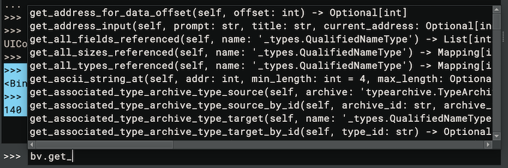
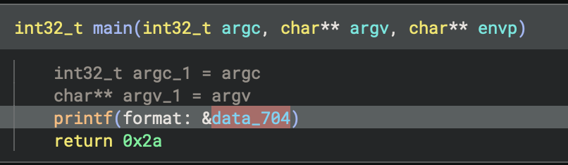
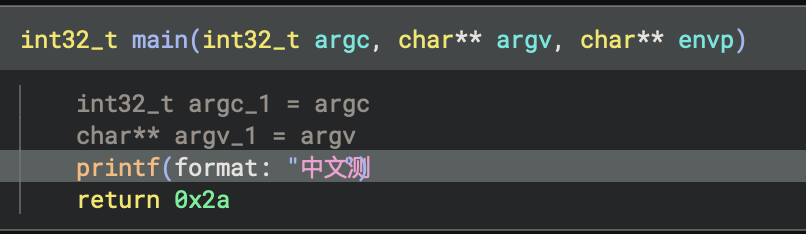
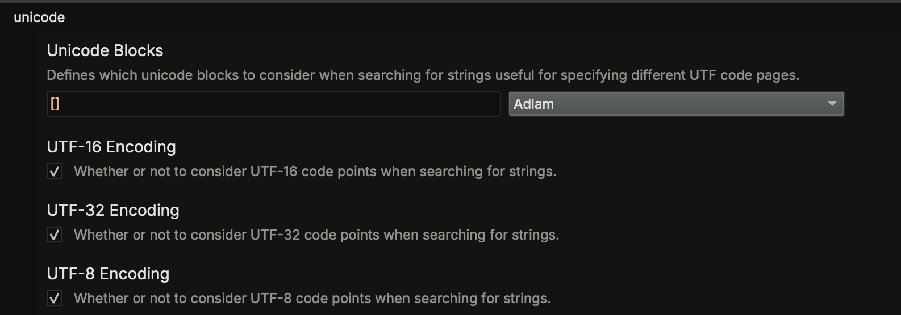

# Important Concepts

## Binary Views

The highest level analysis object in Binary Ninja is a [BinaryView](https://api.binary.ninja/binaryninja.binaryview-module.html#binaryninja.binaryview.BinaryView) (or `bv` for short). You can think of a `bv` as the Binary Ninja equivalent of what an operating system does when loading an executable binary. These `bv`'s are the top-level analysis object representing how a file is loaded into memory as well as debug information, tables of function pointers, and many other structures.

When you are interacting in the UI with an executable file, you can access `bv` in the python scripting console to see the representation of the current file's BinaryView:

```python
>>> bv
<BinaryView: '/bin/ls', start 0x100000000, len 0x182f8>
>>> len(bv.functions)
140
```

???+ Info "Tip"
    Note the use of `bv` here as a shortcut to the currently open BinaryView. For other "magic" variables, see the [user guide](../guide/index.md#magic-console-variables)

If you want to start writing a plugin, most top-level methods will exist off of the BinaryView. Conceptually, you can think about the organization as a hierarchy starting with a BinaryView, then functions, then basic blocks, then instructions. There are of course lots of other ways to access parts of the binary but this is the most common organization. Check out the tab completion in the scripting console for `bv.get<TAB>` for example (a common prefix for many APIs):



Some BinaryViews have parent views. The view used for decompilation includes memory mappings through segments and sections for example, but the "parent_view" property is a view of the original file on-disk.

## REPL versus Scripts

When you're interacting with the Binary Ninja [scripting console](../guide/index.md#script-python-console), it's important to realize that every time you run a command, the UI is automatically going to update analysis. You can see this by even running a simply command like:

```
print("test")
```

and then checking the `Log` pane where you will see an `Analysis update took #.###` message. This is a convenience the UI does for you just like if you were to change a type or create a function, you almost always want the analysis to be updated. However, in scripts you run yourself as plugins or via the "Run Script" command, you may not get the same results mid-execution until after the entire script is finished running.

To achieve the same results when writing a stand-alone plugin, you'd need to use [`current_function.reanalyze()`](https://api.binary.ninja/binaryninja.function-module.html#binaryninja.function.Function.reanalyze), [`bv.update_analysis_and_wait()`](https://api.binary.ninja/binaryninja.binaryview-module.html#binaryninja.binaryview.BinaryView.update_analysis_and_wait), or similar methods.

Another difference in the REPL / scripting console is that the scripting console is not executing on the main thread. This means that if you wish to interact with the UI via QT or BN UI APIs from the console (for example, to [trigger an action via string](https://gist.github.com/psifertex/6fbc7532f536775194edd26290892ef7#file-trigger_actions-py)), you'd need to use [`mainthread.execute_on_main_thread_and_wait()`](https://api.binary.ninja/binaryninja.mainthread-module.html#binaryninja.mainthread.execute_on_main_thread_and_wait) or similar.


## Auto vs User

In the Binary Ninja API, there are often two parallel sets of functions with `_auto_` and `_user_` in their names. For example: [add_user_segment](https://api.binary.ninja/binaryninja.binaryview-module.html#binaryninja.binaryview.BinaryView.add_user_segment) and [add_auto_segment](https://api.binary.ninja/binaryninja.binaryview-module.html#binaryninja.binaryview.BinaryView.add_auto_segment). So what's the difference? Auto functions are those that are expected to be run _automatically_, every time the file is loaded. So for example, if you're writing a [custom file loader](https://github.com/Vector35/binaryninja-api/blob/dev/python/examples/nsf.py) that will parse a particular binary format, you would use `_auto_` functions because each time the file is opened your loader will be used. The results of auto functions are **not** saved in a `.bndb` database because it's expected that whatever produced them originally will again when the file is re-opened or analyzed. This means that even if you're writing a plugin to make changes on a file during analysis, you likely want to use the `_user_` set of APIs so that the changes your plugin causes will separately be saved to the database as if they were done by a user. 

## Concepts for ILs

### Walking ILs

Because our ILs are tree-based, some naive plugins that walk IL looking for specific operations will miss instructions that are part of nested expressions. While there is generally less folding in [MLIL](https://docs.binary.ninja/dev/bnil-mlil.html), making it better target for simple loops like:

```python
for i in bv.mlil_instructions:
  if isinstance(i, Localcall):
    print(i.params)
```

it's still possible to miss instructions with this approach. Additionally, in HLIL it's even easier to miss instructions as there is significantly more nesting. Accordingly we created [`traverse`](https://api.binary.ninja/binaryninja.highlevelil-module.html#binaryninja.highlevelil.HighLevelILFunction.traverse) APIs to walk these tree-based ILs and match whatever property you're interested in. Here are several examples:

```python
def find_strcpy(i, t) -> str:
    match i:
        case HighLevelILCall(dest=HighLevelILConstPtr(constant=c)) if c in t:
            return str(i.params[1].constant_data.data)

t = [
    bv.get_symbol_by_raw_name('__builtin_strcpy').address,
    bv.get_symbol_by_raw_name('__builtin_strncpy').address
]

list(current_hlil.traverse(find_strcpy, t))


def get_memcpy_data(i, t) -> bytes:
    match i:
        case HighLevelILCall(dest=HighLevelILConstPtr(constant=c)) if c == t:
            return bytes(i.params[1].constant_data.data)

# Iterate through all instructions in the HLIL
t = bv.get_symbol_by_raw_name('__builtin_memcpy').address
list(current_hlil.traverse(get_memcpy_data, t))


# find all the calls to __builtin_strcpy and get their values
def find_strcpy(i, t) -> str:
    match i:
        case HighLevelILCall(dest=HighLevelILConstPtr(constant=c)) if c in t:
            return str(i.params[1].constant_data.data)

t = [
    bv.get_symbol_by_raw_name('__builtin_strcpy').address,
    bv.get_symbol_by_raw_name('__builtin_strncpy').address
]
list(current_hlil.traverse(find_strcpy, t))

# collect the number of parameters for each function call
def param_counter(i) -> int:
    match i:
        case HighLevelILCall():
            return len(i.params)
list(current_hlil.traverse(param_counter))


# collect the target of each call instruction if its constant
def collect_call_target(i) -> None:
    match i:
        case HighLevelILCall(dest=HighLevelILConstPtr(constant=c)):
            return c
set([hex(a) for a in current_hlil.traverse(collect_call_target)])


# collect all the Variables named 'this'
def collect_this_vars(i) -> Variable:
    match i:
        case HighLevelILVar(var=v) if v.name == 'this':
            return v
list(v for v in current_hlil.traverse(collect_this_vars))

```

### Mapping between ILs

ILs in general are critical to how Binary Ninja analyzes binaries and we have much more [in-depth](bnil-overview.md) documentation for BNIL (or Binary Ninja Intermediate Language -- the name given to the family of ILs that Binary Ninja uses). However, one important concept to summarize here is that the translation between each layer of IL is many-to-many. Going from disassembly to LLIL to MLIL can result in more or less instructions at each step. Additionally, at higher levels, data can be copied, moved around, etc. You can see this in action in the UI when you select a line of HLIL and many LLIL or disassembly instructions are highlighted.

APIs that query these mappings are plural. So for example, while `current_hlil.llil` will give a single mapping, `current_hlil.llils` will return a list that may contain multiple mappings.


### Operating on IL versus Native

Generally speaking, scripts should operate on ILs. The available information far surpasses the native addresses and querying properties and using APIs almost always beats directly manipulating bytes. However, when it comes time to change the binary, there are some operations that can only be done at a simple virtual address. So for example, the [comment](https://api.binary.ninja/binaryninja.binaryview-module.html#binaryninja.binaryview.BinaryView.set_comment_at) or [tag](https://api.binary.ninja/binaryninja.binaryview-module.html#binaryninja.binaryview.BinaryView.add_tag) APIs (among others) work off of native addressing irrespective of IL level.

### Instruction Index vs Expression Index

It is easy to confuse ExpressionIndex and InstructionIndex properties in the API. While they [are both integers](https://github.com/Vector35/binaryninja-api/blob/dev/python/highlevelil.py#L49-L50) they mean different things and it's important to keep them straight. The Instruction Index is a unique index for that given IL level for that given function. However, because BNIL is [tree-based](bnil-overview.md), when there are nested expresses the expression index may be needed. These indexes are also unique per-function and per-IL level, but they are _distinct_ from instruction indexes even though they may occasionally be similar since they each start at 0 for a given function!

### Static Single Assignment Basics

Our [BNIL Overview](bnil-overview.md) mentions Static Single Assignment (SSA) without explaining what it is. You can of course always check out [Wikipedia](https://en.wikipedia.org/wiki/Static_single-assignment_form), but here's a quick summary of what it is, why we expose multiple SSA forms of our ILs and how you can use it to improve your plugin writing with BNIL.

At it's simplest, SSA forms of an Intermediate Language or Intermediate Representation are those in which variables are read only. They can be set when created, but not modified. Instead of modifying them, when you make a change, a new "version" of the variable is created denoting that the value has changed in some way. While this certainly makes the form less readable to humans, this means it's actually really easy to walk back and see how a variable has been modified by simply looking at the definition site for a given variable or all possible versions before it. Any time the variable is modified, a new version of that variable will be created (you'll see `#` followed by a number indicating that this is a new version). 

But what if the code takes multiple paths and could have different values depending on the path that was taken? SSA forms use a `Φ` (pronounced either as "fee" or "fi" like "fly" depending on which mathematician or Greek speaker you ask!) function to solve this ambiguity. All a `Φ` function does is aggregate different versions of a variable when entering a basic block with multiple paths. So a basic block with two incoming edges where `eax` is modified might have something like: `eax#3 = Φ(eax#1, eax#2)` denoting that the new version of the variable could have come from either of those sources.

Binary Ninja uses this capability internally for its own value set analysis and constant dataflow propagation but plugins can also leverage this information to great effect. For example, want to find an uninitialized value? Simply look for an SSA variable being read from with a version of zero that isn't in the list of arguments to the function. Want to implement your own inter-procedural data-flow system? Binary Ninja does not for performance reasons, but in instances where you can prevent the state space explosion problem, you can build on top of the existing SSA forms to implement exactly this. A simple example might look for vulnerable function calls like printf() where the first argument is user-data. While most trivial cases of this type of flaw tend to be found quickly, it's often the case that subtler versions with functions that wrap functions that wrap functions that call a printf with user data are more tedious to identify. However, using an SSA-based script, it's super easy to see that, for example, the first parameter to a `printf` call originated in a calling function as the second parameter, and THAT function was called with input that came directly from some sort of user input. While one or two layers might be easy to check by hand with few cross-references, with a large embedded firmware, there might be hundreds or thousands of potential locations to check out, and a script using SSA can dramatically reduce the number of cases to investigate. 

## UI Elements

There are several ways to create UI elements in Binary Ninja. The first is to use the simplified [interaction](https://api.binary.ninja/binaryninja.interaction-module.html) API which lets you make simple UI elements for use in GUI plugins in Binary Ninja. As an added bonus, they all have fallbacks that will work in headless console-based applications as well. Plugins that use these API include the [angr](https://github.com/Vector35/binaryninja-api/blob/dev/python/examples/angr_plugin.py) and [nampa](https://github.com/kenoph/nampa) plugins.

The second and more powerful (but more complicated) mechanism is to leverage the _binaryninjaui_ module. Additional documentation is forthcoming, but there are several examples ([1](https://github.com/Vector35/kaitai), [2](https://github.com/Vector35/snippets), [3](https://github.com/Vector35/binaryninja-api/tree/dev/python/examples/triage)), and most of the APIs are backed by the [documented C++ headers](https://api.binary.ninja/cpp). Additionally, the generated _binaryninjaui_ module is shipped with each build of binaryninja and the usual python `dir()` instructions are helpful for exploring its capabilities.

When calling native UI methods, please make sure to use the [execute_on_main_thread](https://api.binary.ninja/binaryninja.mainthread-module.html#binaryninja.mainthread.execute_on_main_thread) method (or the [`_and_wait`](https://api.binary.ninja/binaryninja.mainthread-module.html#binaryninja.mainthread.execute_on_main_thread_and_wait) variant). By default, python actions are not run on the main thread to prevent blocking the UI, however, due to [thread-safety issues](https://doc.qt.io/qt-6/threads-reentrancy.html) around accessing QT from multple threads, UI actions should always make use of these APIs.

## Function Starts, Sizes, and Ending

### How big is a Function?

One of the common questions asked of a binary analysis platform is "how big is a function?". This is a deceptively simple question without a simple answer. There are rather several equally valid definitions you could give for what is the size of a function:

 - the total sum of all basic blocks?
 - the highest virtual address in the function minus the lowest virtual address?
 - the address of return instruction subtracted from the entry point

Except that last one is a trick of course. Because not only can functions have multiple return instructions, but they may have multiple entry points (as is often the case with error handling). 

Basic blocks have, by definition, a start, and an end. Basic Blocks can therefore have consistent sizes that all binary analysis tools would agree upon (though more formal analysis might stop basic blocks on call instructions while for convenience sake, most reverse engineering tools do not). 

Summing up the basic blocks of a function is one way to produce a consistent size for a function, but how do you handle bytes that overlap standard function definitions, for example, via a tail call? Or via a mis-aligned jump where a byte is in two basic blocks? Different tools may resolve those ambiguous situations in different ways, so again, it is difficult to compare the "size" of any one binary analysis tool to another.

 In Binary Ninja, there is no explicit `.size` property of functions. Rather, you can choose to calculate it one of two ways:

```
function_size = current_function.total_bytes
# or  
function_size = current_function.highest_address - current_function.lowest_address
```

Total bytes is similar to the first proposed definition above. It merely sums up the lengths of each basic block in the function. Because Binary Ninja allows bytes to exist in multiple blocks, this can cause bytes to be "double" counted, but this definition is consistent within BN itself, if not always with other tools in some edge cases.

### When does a Function stop?

One reason that having an "end" might be useful in a function (as opposed to the `.highest_address` in Binary Ninja), would be to make it a property that controls the analysis for a function. Unlike some other systems where it's possible to define the start and end of a function, in Binary Ninja, you merely define the start and allow analysis to occur naturally. The end results when all basic blocks terminate either in: 

 - an invalid instruction
 - a return instruction
 - a call to a function marked as `__noreturn__`
 - a branch to a block already in the function
 - any other instruction such as an interrupt that by its definition stops analysis
 
So how do you tell Binary Ninja how big a function is? The answer is you don't directly, but you can instead direct its analysis. For example, if a function is improperly not marked as a noreturn function, edit the function properties via the right-click menu and set the property and all calls to it will end analysis at that point in any callees.

Likewise, you can do things like change memory permissions, patch in invalid instructions, [change an indirect branch's targets](https://github.com/Vector35/binaryninja-api/blob/dev/python/examples/jump_table.py), or use [UIDF](https://binary.ninja/2020/09/10/user-informed-dataflow.html) to influence analysis such that it ends where desired.

## Working with Strings

### Unicode Support

If you're opening a file with non-ascii string encodings, make sure to use one of the "open with options" [methods](../guide/index.md#loading-files) and choose the appropriate code pages. These settings are under the `analysis` / `unicode` section of the settings dialog. If you're not sure which code page you should be enabling, consider using a library like [chardet](https://chardet.readthedocs.io/en/latest/usage.html). For example, here's a file both with and without the "CJK Unified Ideographs" block being enabled:





???+ Info "Tip"
    Note that there is a small bug and some string length calculations will be off with certain characters as shown above.
	
### Wide Strings in the UI

Many Windows applications use wide (UTF-16 or UTF-32) strings. By default these should be identified during initial string analysis as long as the default settings are still enabled.



However, you can always change a variable to a `wchar_t` with `[SHIFT] a` and to a `wchar32_t` with `[CTRL-SHIFT] a` in the UI.

Wide strings will be rendered in the UI as:

 - `u"String"`: 16-bit wide string
 - `U"String"`: 32-bit wide string

### "Strings" versus Strings

The strings view in Binary Ninja are based on all identified strings found in a manner similar to the command-line "strings" tool (with `-a` if you're using a GPL Binutils version). However, this is not the same as a string having a string type in Binary Ninja!

Several settings under analysis limits are relevant to identifying these strings:

 - Maximum String Length: The maximum string length that will be copied (defaults to 16384)
 - Minimum String Length: The minimum string length for strings created during auto-analysis (defaults to 4)
 - Maximum String Search: Maximum number of strings before string identification halts (defaults to 1048576)

### Custom String Formats

There is currently no support for custom types with different encoding mechanisms. Follow [#1334](https://github.com/Vector35/binaryninja-api/issues/1334) for more updates on when that feature is added. That said, it is possible to use a custom [DataRenderer](https://api.binary.ninja/binaryninja.datarender-module.html#binaryninja.datarender.DataRenderer) to improve the rendering using a custom type, but those strings will still not show up in the strings list or when included as variables in decompilation, only in linear view.
