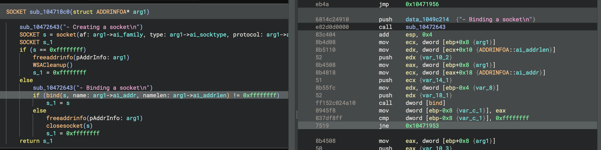

# Important Concepts

## Mapping between ILs

ILs in general are critical to how Binary Ninja analyzes binaries and we have much more [in-depth](bnil-overview.md) documentation for BNIL (or Binary Ninja Intermediate Language -- the name given to the family of ILs that Binary Ninja uses). However, one important concept to summarize here is that the translation between each layer of IL is many-to-many. Going from disassembly to LLIL to MLIL can result in more or less instructions at each step. Additionally, at higher levels, data can be copied, moved around, etc. You can see this in action in the UI when you select a line of HLIL and many LLIL or disassembly instructions are highlighted.

APIs that query these mappings are plural. So for example, while `current_hlil.llil` will give a single mapping, `current_hlil.llils` will return a list that may contain multiple mappings.

## Operating on IL versus Native

Generally speaking, scripts should operate on ILs. The available information far surpasses the native addresses and querying properties and using APIs almost always beats directly manipulating bytes. However, when it comes time to change the binary, there are some operations that can only be done at a simple virtual address. So for example, the [comment](https://api.binary.ninja/binaryninja.binaryview-module.html#binaryninja.binaryview.BinaryView.set_comment_at) or [tag](https://api.binary.ninja/binaryninja.binaryview-module.html#binaryninja.binaryview.BinaryView.add_user_data_tag) APIs (among others) work off of native addressing irrespective of IL level.

## Instruction Index vs Expression Index

It is easy to confuse ExpressionIndex and InstructionIndex properties in the API. While they [are both integers](https://github.com/Vector35/binaryninja-api/blob/dev/python/highlevelil.py#L49-L50) they mean different things and it's important to keep them straight. The Instruction Index is a unique index for that given IL level for that given function. However, because BNIL is [tree-based](bnil-overview.md), when there are nested expresses the expression index may be needed. These indexes are also unique per-function and per-IL level, but they are _distinct_ from instruction indexes even though they may occasionally be similar since they each start at 0 for a given function!

## UI Elements

There are several ways to create UI elements in Binary Ninja. The first is to use the simplified [interaction](https://api.binary.ninja/binaryninja.interaction-module.html) API which lets you make simple UI elements for use in GUI plugins in Binary Ninja. As an added bonus, they all have fallbacks that will work in headless console-based applications as well. Plugins that use these API include the [angr](https://github.com/Vector35/binaryninja-api/blob/dev/python/examples/angr_plugin.py) and [nampa](https://github.com/kenoph/nampa) plugins.

The second and more powerful (but more complicated) mechanism is to leverage the _binaryninjaui_ module. Additional documentation is forthcoming, but there are several examples ([1](https://github.com/Vector35/kaitai), [2](https://github.com/Vector35/snippets), [3](https://github.com/Vector35/binaryninja-api/tree/dev/python/examples/triage)), and most of the APIs are backed by the [documented C++ headers](https://api.binary.ninja/cpp). Additionally, the generated _binaryninjaui_ module is shipped with each build of binaryninja and the usual python `dir()` instructions are helpful for exploring its capabilities.