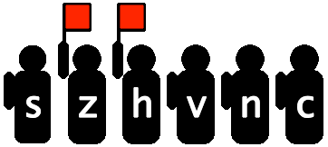

# Binary Ninja Flags

This guide is broken up into three sections.

- Part 1 covers the basics of how architecture modules and flags interact
- Part 2 discusses how to use those flags when lifting
- Part 3 covers advanced topics like custom roles


## Binja Architecture Flags Part 1: The Basics

Think of flags as global boolean variables, set and cleared by observers who monitor the result of instructions from a distance:



Instructions like JXX glance at the flagmen for permission to jump.

Analysis would be _really_ complicated by tracking a "remote thread" like this, in addition to the normal instruction stream. So another approach is to insert the flag logic _into_ the instruction stream:

```
...
SUB a, b, c
flag_s = ...
flag_z = ...
flag_v = ...
...
```

Now the problem is that tons of instructions affect tons of flags, so a lot of noise is generated.

Binja tries to reduce the noise by displaying only the flags between producer and consumer that are relevant. For example, ADD affects many flags, but if none are read until ADC (add with carry) then only the carry flag is shown.

Writing effective flag code in architectures requires this understanding, and there's a bit of an art in "helping" Binja connect flag producers and consumers.

But this is about basics! So what are the basic ways in which an architecture author informs Binja of flags? The following is python architecture code for Z80.

### 1) declare the flags

```
flags = ['s', 'z', 'h', 'pv', 'n', 'c']
```

That's simple, it's just a list of strings.

### 2) assign flag Roles

    flag_roles = {
        's': FlagRole.NegativeSignFlagRole,
        'z': FlagRole.ZeroFlagRole,
        'h': FlagRole.HalfCarryFlagRole,
        'pv': FlagRole.SpecialFlagRole,
        'n': FlagRole.NegativeSignFlagRole,
        'c': FlagRole.CarryFlagRole
    }

Map each flag to a role from [api/python/enum.py](https://api.binary.ninja/_modules/binaryninja/enums.html) if possible. This informs Binja to generate IL for the basic, textbook behavior of a flag. For example, the `ZeroFlagRole` will generate IL that sets the flag when an arithmetic result is zero.

If a flag's behavior does not fit the textbook behavior, use `SpecialFlagRole` and in a future article we'll implement a callback for its custom IL. For example, `PV` here in Z80 acts as both a parity flag and an overflow flag. It's meaning at any given time depends on the last instruction that set it.

In the NES example [nes.py](https://github.com/Vector35/binaryninja-api/blob/dev/python/examples/nes.py) , the 6502 flag `c` deviates from textbook behavior, disqualifying it from `CarryFlagRole`, and earning it `SpecialFlagRole`.

### 3) flag write types

```python
flag_write_types = ['none', '*', 'only_carry']
```

```python
flags_written_by_flag_write_type = {
    'none': [],
    '*': ['s', 'z', 'h', 'pv', 'n', 'c'],
    'only_carry': ['c'],
}
```

Think of `flag_write_types` as custom named groups for your convenience. When you later lift instructions that affect all flags, you don't want to list them individually over and over, you want to say just `..., flag="*")`.

In fact, the `flag` keyword parameter for the IL constructing functions does not accept individual flag names, it accepts only these group names!

## Binja Architecture Flags Part 2: Flag Producer/Consumer

In the last installment, we informed Binja of our architecture's flags by defining a list of flag names, a mapping from flag names to `flag roles`, and groups of flags commonly set together called `flag write types`.

Let's remind ourselves briefly that these are terms within an imagined protocol between architecture author and Binja. The protocol's purpose is to communicate to Binja what flags are present and how they behave. As we accumulate architectures that stretch the protocol's limits (eg: PowerPC with its flag banks), it's possible the protocol gets adjusted to more generally accommodate architectures.

In Part 1, we said Binja tries to reduce the noise in displayed IL by showing only the flags between producer and consumer that are relevant. Consider this simplified flags definition for Z80:

```python
flags = ['c']
flag_roles = { 'c': FlagRole.CarryFlagRole }
flag_write_types = ['none', 'only_carry']
flags_written_by_flag_write_type = { 'none': [], 'only_carry': ['c'], }
```

We have one flag named 'c', we tell Binja that it's the textbook carry flag, and we define a flag group called "only_carry" which sets just this flag.

At lifting time, we mark certain IL instructions as a **producer** using the `flags` keyword. Remember to pass the _group_ or _flag write type_ that contains `c`, **not** `c` itself:

```python
il.add(size, lhs, rhs, flags='only_carry')
```

We mark certain IL instructions as a **consumer** by passing an LLIL flag expression as one of its operands:

```python
il.add_carry(size, lhs, rhs, il.flag("c"))
```

Instructions can be both producers and consumers. This applies to add-with-carry, which both consumes and produces a new `c`. We omitted `, flags='only_carry'` to maximize contrast.

#### Example A

Let's lift a simple C function:

```C
unsigned char add(unsigned char a, unsigned char b)
{
	return a + b;
}
```

Recap: the C function is named `add()` which will produce a Z80 instruction `ADD` (among others) which we lift to LLIL `ADD` that is a **producer** of the `c` flag.

Binja gives this LLIL, after compilation with [SDCC](http://sdcc.sourceforge.net):

```
_add:
   0 @ 0000020e  HL = 3
   1 @ 00000211  HL = HL + SP {arg2}
   2 @ 00000212  IY = 2
   3 @ 00000216  IY = IY + SP {arg1}
   4 @ 00000218  A = [IY {arg1}].b
   5 @ 0000021b  A = A + [HL {arg2}].b   <-- PRODUCER
   6 @ 0000021c  L = A
   7 @ 0000021d  <return> jump(pop)
```

WHERE'S THE CARRY!?

This is the lesson that was non-intuitive to me. Binja knows from the architecture-supplied _lifted IL_ that `ADD` sets `c`, but it doesn't produce any `c` setting _low level_ IL because it failed to detect anyone using `c`.

#### Example B

Let's change the function to use 2-byte integers:

```C
unsigned int add(unsigned int a, unsigned int b)
{
	return a + b;
}
```

Since the Z80 ALU only adds 8-bit ints, multi-byte adds are synthesized with an initial `ADD`, followed by runs of `ADC`. Here's the new IL:

```
_add:
   0 @ 0000020e  HL = 4
   1 @ 00000211  HL = HL + SP {arg3}
   2 @ 00000212  IY = 2
   3 @ 00000216  IY = IY + SP {arg1}
   4 @ 00000218  A = [IY {arg1}].b
   5 @ 0000021b  temp0.b = A
   6 @ 0000021b  temp1.b = [HL {arg3}].b
   7 @ 0000021b  A = A + [HL {arg3}].b                   <-- PRODUCER
   8 @ 0000021b  flag:c = temp0.b + temp1.b u< temp0.b   <--
   9 @ 0000021c  C = A
  10 @ 0000021d  A = [IY + 1 {arg2}].b
  11 @ 00000220  HL = HL + 1 {arg4}
  12 @ 00000221  A = adc.b(A, [HL {arg4}].b, flag:c)     <-- CONSUMER
  13 @ 00000222  B = A
  14 @ 00000223  L = C
  15 @ 00000224  H = B
  16 @ 00000225  <return> jump(pop)
```

With `ADC` present, Binja detects the relationship, and produces the IL `flag:c = temp0.b + temp1.b u< temp0.b`.

This also means that you can mark instructions as producers of a group of many flags, and LLIL will contain the flag calculating code for those flags consumed further along.

### Review

You, the architecture author:

* inform Binja of your architecture's flags by defining:
    * flag names
    * flag "roles" which are just their textbook behavior, if they qualify
    * flag "write types" which groups of flags often set together
* assign instructions as flag **producers** by passing `flag=` keyword parameter during lifting
* assign instructions as flag **consumers** by passing IL flag expressions as operands during lifting

With the defined variables and lifted IL, Binja decides when to generate flag-affecting low level IL.

## Binja Architecture Flags Part 3: Flag Roles

The previous sections said that flag roles were the textbook behavior of flags. If you can assign a flag to a role, there's a chance Binja will have that default behavior and you won't have to implement it yourself. For example, the carry flag is so common among architectures and its behavior is (to my knowledge) non-varying during addition, that we have it hardcoded into Binja:

```
   5 @ 0000021b  temp0.b = A
   6 @ 0000021b  temp1.b = [HL {arg3}].b
   7 @ 0000021b  A = A + [HL {arg3}].b
   8 @ 0000021b  flag:c = temp0.b + temp1.b u< temp0.b   <-- HERE
```

The `c` flag was declared to have CarryFlagRole so the `flag:c = ...` was produced by Binja and the architecture author is not responsible.

The hardcoded flag code is in the `get_flag_write_low_level_il()` method of the Architecture class and (at the time of this writing) supports:

|                      | ADD  | ADC  | SUB  | NEG  | FSUB | OTHERS |
| -------------------- | ---- | ---- | ---- | ---- | ---- | ------ |
| CarryFlagRole        | yes  | yes  | yes  | yes  | yes  |        |
| NegativeSignFlagRole | yes  | yes  | yes  | yes  | yes  | yes    |
| OrderedFlagRole      |      |      |      |      | yes  |        |
| OverflowFlagRole     | yes  |      | yes  |      |      |        |
| PositiveSignFlagRole | yes  | yes  | yes  | yes  | yes  | yes    |
| UnorderedFlagRole    |      |      |      |      | yes  |        |
| ZeroFlagRole         | yes  | yes  | yes  | yes  | yes  | yes    |

If a cell has "yes" it means that for the instruction at the column header, there's an built-in **attempt** at producing the flag in the row. It is not a guarantee that the flag semantics match your architecture's.

So for any instructions that are not ADD, ADC, SUB, NEG, or FSUB, you can try and see if Binja's built-in for calculating negative, positive, or zero flags are accurate for your architecture. If you want carry, ordered, overflow, or unordered, you will need to implement it yourself.

What happens when you mark an instruction the producer of a certain flag, but no implementation exists?

```
  12 @ 0000029e  A = sbb.b(temp1.b, D, flag:c)
  13 @ 0000029e  flag:s = sbb.b(temp1.b, D, flag:c) s< 0
  14 @ 0000029e  flag:pv = unimplemented
```

Here, `sbb` is an `s` producer and a `pv` producer.

Flag `s` is mapped to FlagRole.NegativeSignRole which is "yes" in the table, so Binja emits the default LLIL to set it.

Flag `pv` is mapped to FlagRole.OverflowFlagRole which is not "yes", so Binja doesn't have an implementation and emits LLIL_UNIMPLEMENTED.

If you need to define your own flag setting code, set the flag role to SpecialFlagRole and override `get_flag_write_low_level_il()`. There are two contraints you must work around:

* you do not have access to the operation result, which is tempting to use in negative and overflow calculation
* the operands given are not expressions, they're the registers or constants themselves

In C++ land, converting the operands to expressions has a helper function in LowLevelILFunction called `GetExprForRegisterOrConstantOperation()`. In Python land, you can use `expressionify()` from https://github.com/Vector35/Z80/blob/master/Z80IL.py

## Example: 6502

In 6502, the subtraction carry flag (borrow) is inverted from the textbook behavior, otherwise it's as expected:

```python
flag_roles = {
	"c": FlagRole.SpecialFlagRole,  # Not a normal carry flag, subtract result is inverted
	...
```

Then, later in `get_flag_write_low_level_il()` there is:

```python
def get_flag_write_low_level_il(self, op, size, write_type, flag, operands, il):
	if flag == 'c':
		if (op == LowLevelILOperation.LLIL_SUB) or (op == LowLevelILOperation.LLIL_SBB):
			# Subtraction carry flag is inverted from the commom implementation
			return il.not_expr(0, self.get_default_flag_write_low_level_il(op, size, FlagRole.CarryFlagRole, operands, il))
			# Other operations use a normal carry flag
			return self.get_default_flag_write_low_level_il(op, size, FlagRole.CarryFlagRole, operands, il)
	...			
```

This is nice and convenient: the normal behavior is simply wrapped in a `not`. See [the source](https://github.com/Vector35/binaryninja-api/blob/dev/python/examples/nes.py) for the full code.
