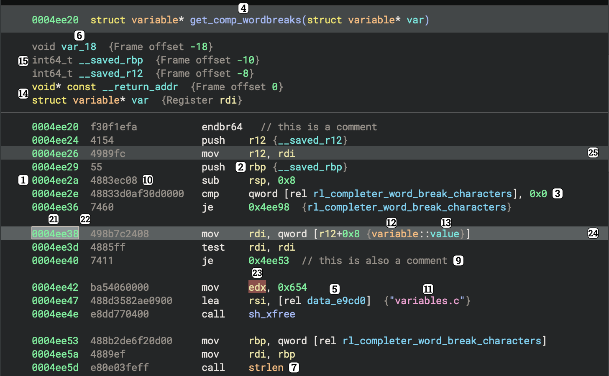
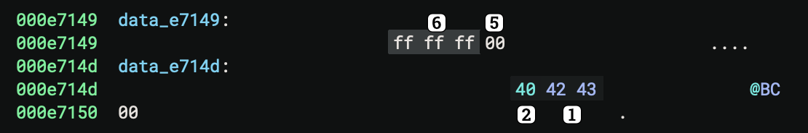
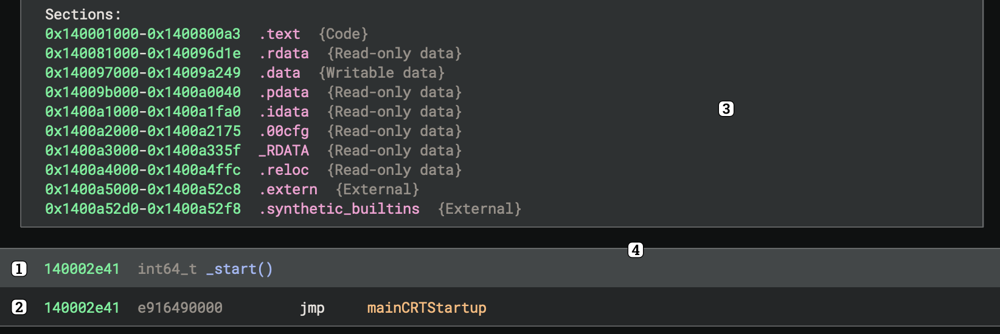
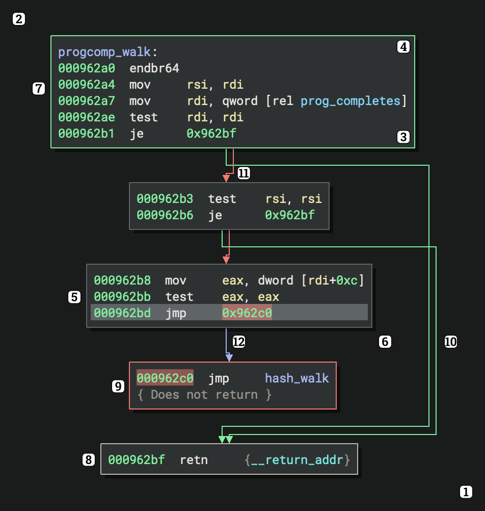
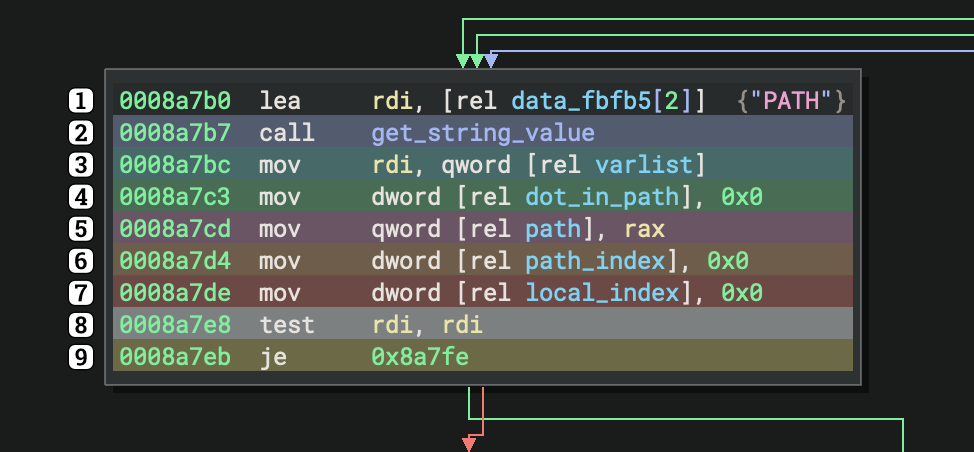
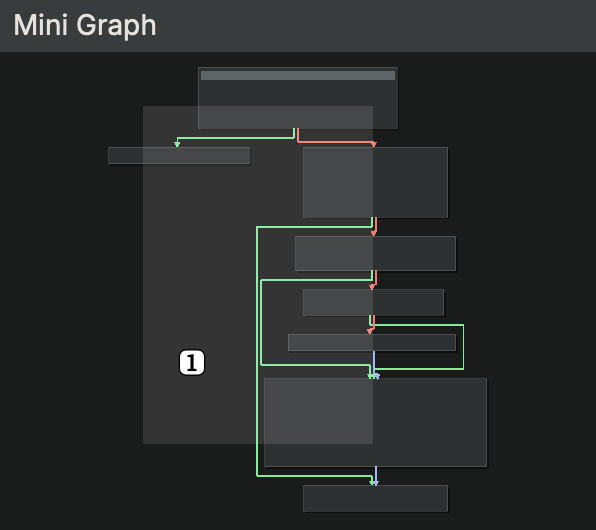
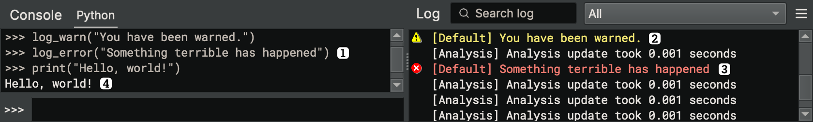
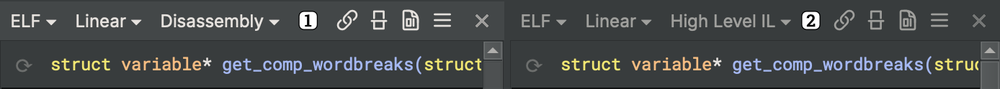
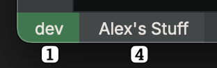

User themes are loaded from JSON files (with the `.bntheme` extension) found in the `themes` or `community-themes` (consider cloning the [community themes repo](https://github.com/Vector35/community-themes)) subdirectories of your [user folder](../guide/index.md#user-folder). The default, full path to these folders is the following on each supported platform:

- macOS: `~/Library/Application Support/Binary Ninja/{themes,community-themes}`
- Windows: `%APPDATA%\Binary Ninja\{themes,community-themes}`
- Linux: `~/.binaryninja/{themes,community-themes}`

To get started, create a new `.bntheme` file in the themes folder for your platform. You may want to copy one of the [example themes](https://github.com/Vector35/binaryninja-api/tree/dev/themes) to start with to avoid lots of "missing required color" errors.

## Theme File Structure

Theme files have the following top-level structure:

```json
{
  "name": "Example Theme",
  "style": "Fusion",
  "styleSheet": "...",
  "colors": { ... },
  "palette": { ... },
  "disabledPalette": { ... },
  "theme-colors": { ... }
}
```

### Name
The `name` key controls the theme's display name in the UI. This key *must* be unique. There cannot be multiple themes with the same name.

### Style
The `style` key specifies which [Qt style](https://doc.qt.io/qt-6/qstyle.html#details) to use for the UI controls. This key should almost always be set to `"Fusion"`.

### Stylesheet
The `styleSheet` key can be used to customize the Qt style above with a [stylesheet in Qt CSS syntax](https://doc.qt.io/qt-6/stylesheet-reference.html), like so:

```json
{
  "styleSheet": "QWidget { border-radius: 0; }"
}
```

If you need to determine what a specific control's class is in order to style it, you can use the `ui.uiDeveloperTools` setting to enable the Widget Inspector.

### Colors
The `colors` key allows you (the theme author) to define color aliases to be used throughout the rest of the theme file. For example, the following sets up two color aliases, `red` and `blue`:

```json
{
  "colors": {
    "red": "#ff0000",
    "blue": [0, 0, 255]
  }
}
```

Colors can be specified as hex strings or as an `[R, G, B]` array.

#### Blending Functions
In addition to color aliases, the theming engine provides the ability to blend colors by passing an array of blending functions and arguments in [prefix notation](https://en.wikipedia.org/wiki/Polish_notation) in place of a color. We provide two blending functions: **average** (`"+"`) and **mix** (`"~"`), as seen in the example below:

```json
{
  "colors": {
    "red": "#ff0000",
    "blue": [0, 0, 255],
    "purple": ["+", "red", "blue"],
    "yellow": "#ffff00",
    "white": [255, 255, 255],
    "slightPink": ["~", "white", "red", 20],
    "quitePink":  ["~", "white", "red", 200],
    "slightlyPinkYellow": ["+", "~", "white", "red", 20, "yellow"]
  }
}
```

In this example, `red` and `blue` are *averaged* (`+`) to create `purple`. Colors can also be *mixed* (`~`), in a weighted manner, like the `slightPink` and `quitePink` colors (which mix `red` into `white` using two different weights, specified by the integers at the end of the array). These blending functions can also be chained together, like in the `slightlyPinkYellow` color, which mixes some `red` into `white` and then averages the result with `yellow`.

### Palette
The `palette` key is the primary interface for theming Qt UI elements and enables customization of the main [`QPalette` color roles](https://doc.qt.io/qt-6/qpalette.html). The following sub-keys are required for all themes:

```json
{
  "palette": {
    "Window": "...",
    "WindowText": "...",
    "Base": "...",
    "AlternateBase": "...",
    "ToolTipBase": "...",
    "ToolTipText": "...",
    "Text": "...",
    "Button": "...",
    "ButtonText": "...",
    "BrightText": "...",
    "Link": "...",
    "LinkVisited": "...",
    "Highlight": "...",
    "HighlightedText": "...",
    "Light": "..."
  }
}
```

The `PlaceholderText` sub-key is currently not themeable and will be automatically set to the "disabled" `Text` value specified below.

### Disabled Palette
The `disabledPalette` key matches the `palette` key above, but specifies colors to use for disabled controls instead. While not required, providing entries for the `Button`, `ButtonText`, `Text`, `WindowText`, and `ToolTipText` roles is highly recommended.

### Theme Colors
The `theme-colors` key contains the rest of a theme's settings. These colors are typically used for custom controls or contexts specific to Binary Ninja itself (which is why they are separate from the Qt colors controlled via the `palette` and `disabledPalette` keys above).

Colors marked "*required*" must be specified. Unmarked colors will hold default values based upon other colors you have chosen, but will be overridden if specified.

#### Tokens



1. `addressColor` (*required*) - Used to color memory address tokens (e.g. `0x100003c5b`)
2. `registerColor` (*required*) - Used to color register names (e.g. `rax`)
3. `numberColor` (*required*) - Used to color number literals (e.g. `0xf0`)
4. `codeSymbolColor` (*required*) - Used to color local function names (e.g. `sub_100003c50`)
5. `dataSymbolColor` (*required*) - Used to color data symbols (e.g. `data_100003e2c`)
6. `stackVariableColor` (*required*) - Used to color stack variables (e.g `var_8`)
7. `importColor` (*required*) - Used to color imported function names (e.g. `printf`)
8. `annotationColor` (*required*) - Used to color annotations (e.g. hints), not shown in picture above
9. `commentColor` - Used to color code comments
10. `opcodeColor` (*required*) - Used to color instruction opcodes (e.g. `ebfe`)
11. `stringColor` (*required*) - Used to color string literals (e.g. `"Hello, world!"`)
12. `typeNameColor` (*required*) - Used to color user-defined type names (e.g. `my_struct`)
13. `fieldNameColor` (*required*) - Used to color structure member names
14. `keywordColor` (*required*) - Used to color keywords (e.g. `for` in HLIL)
15. `uncertainColor` (*required*) - Used to color uncertain data (e.g. variable types with low confidence)
16. `exportColor` - Used to color exported symbols, not shown in picture above
17. `nameSpaceColor` - Used to color a namespace, not shown in picture above
18. `nameSpaceSeparatorColor` - Used to color the separator between a namespace and the rest of the symbol, not shown in picture above
19. `operationColor` - *Currently unused*
20. `gotoLabelColor` - Used to color a `goto`'s label, not shown in picture above
21. `tokenSelectionColor` - Used to draw the background of tokens selected with click-and-drag
22. `outlineColor` (*required*) - Used to draw a box around tokens selected with click-and-drag
23. `tokenHighlightColor` (*required*) - Used to color the background of a token that has been selected with a single click or an arrow key
24. `instructionHighlightColor` (*required*) - Used to color the background of an instruction that has been selected with a single click or an arrow key
25. `relatedInstructionHighlightColor` - Used to color the background of instructions related to an instruction that has been selected with a single click or an arrow key

The following colors are used for the Rainbow Braces setting (`ui.rainbowBraces`):

1. `braceOption1Color` - Defaults to `blueStandardHighlightColor`
2. `braceOption2Color` - Defaults to `orangeStandardHighlightColor`
3. `braceOption3Color` - Defaults to `greenStandardHighlightColor`
4. `braceOption4Color` - Defaults to `redStandardHighlightColor`
5. `braceOption5Color` - Defaults to `yellowStandardHighlightColor`
6. `braceOption6Color` - Defaults to `magentaStandardHighlightColor`

#### Hex View



Each byte in hex view is given a background color based on its value. Values between `0x00` and `0xFF` will use a color interpolated between the `Dark` and `Light` colors specified below.

1. `alphanumericHighlightColor` (*required*) - Used to color bytes that are alphanumeric characters if Color Highlight/ASCII and Printable is enabled in view options (default)
2. `printableHighlightColor` (*required*) - Used to color bytes that are non-alphanumeric printable characters if Color Highlight/ASCII and Printable is enabled in view options (default)
3. `modifiedColor` (*required*) - Used to color bytes that have been modified if Color Highlight/Modification is enabled in view options
4. `insertedColor` (*required*) - Used to color bytes that have been inserted if Color Highlight/Modification is enabled in view options
5. `notPresentColor` (*required*) - Used to color bytes that do not have a value
5. `backgroundHighlightDarkColor` (*required*) - Used as the background color for bytes of value `0x00` if Contrast/Normal is enabled in view options (default)
6. `backgroundHighlightLightColor` (*required*) - Used as the background color for bytes of value `0xFF` if Contrast/Normal is enabled in view options (default)
7. `boldBackgroundHighlightDarkColor` (*required*) - Used as the background color for bytes of value `0x00` if Contrast/High is enabled in view options
8. `boldBackgroundHighlightLightColor` (*required*) - Used as the background color for bytes of value `0xFF` if Contrast/High is enabled in view options
9. `selectionColor` (*required*) - Used as the background color on any bytes that have been selected via click-and-drag

#### Linear View



1. `linearDisassemblyFunctionHeaderColor` (*required*) - Used as the background for function
  headers in linear view
2. `linearDisassemblyBlockColor` (*required*) - Used as the background for function bodies in
  linear view
3. `linearDisassemblyNoteColor` (*required*) - Used as the background color for note blocks in
  linear view, such as the info block found at the start of linear view
4. `linearDisassemblySeparatorColor` (*required*) - Used as the separator/border color between
  major elements in linear view

#### Graph View



Both the graph background and individual graph nodes are actually painted as a gradient. To get a flat background instead, set the `Dark` and `Light` colors to the same color value.

1. `graphBackgroundDarkColor` (*required*) - Used as the bottom-right gradient stop in the graph view background
2. `graphBackgroundLightColor` (*required*) - Used as the upper-left gradient stop in the graph view background
3. `graphNodeDarkColor` (*required*) - Used as the bottom gradient stop in graph node backgrounds
4. `graphNodeLightColor` (*required*) - Used as the upper gradient stop in graph node backgrounds
5. `graphNodeOutlineColor` (*required*) - Used to color the border of graph nodes with no indicator
6. `graphNodeShadowColor`
7. `graphEntryNodeIndicatorColor`
8. `graphExitNodeIndicatorColor`
9. `graphExitNoreturnNodeIndicatorColor`
10. `trueBranchColor` (*required*) - Used to color branches taken when a comparison is true
11. `falseBranchColor` (*required*) - Used to color branches taken when a comparison is false
12. `unconditionalBranchColor` (*required*) - Used to color branches that are always taken
13. `altTrueBranchColor` (*required*) - Used instead of `trueBranchColor` when color-blind mode is enabled
14. `altFalseBranchColor` (*required*) - Used instead of `falseBranchColor` when color-blind mode is enabled
15. `altUnconditionalBranchColor` (*required*) - Used instead of `unconditionalBranchColor` when color-blind mode is enabled

#### Highlighting



1. `blackStandardHighlightColor` (*required*)
2. `blueStandardHighlightColor` (*required*)
3. `cyanStandardHighlightColor` (*required*)
4. `greenStandardHighlightColor` (*required*)
5. `magentaStandardHighlightColor` (*required*)
6. `orangeStandardHighlightColor` (*required*)
7. `redStandardHighlightColor` (*required*)
8. `whiteStandardHighlightColor` (*required*)
9. `yellowStandardHighlightColor` (*required*)

#### Tab Bar

1. `tabBarTabActiveColor` - Used to color the background of the currently active tab
2. `tabBarTabHoverColor` - Used to color the background of any tab the mouse is currently hovering over
3. `tabBarTabInactiveColor` - Used to color the background of any inactive tab
4. `tabBarTabBorderColor` - Used to draw the border around the currently active tab
5. `tabBarTabGlowColor` - Used to draw a glow or shadow around the border of the currently active tab

#### Feature Map

1. `featureMapBaseColor` - Used to color the background
2. `featureMapNavLineColor` - Used to color the line(s) that represent where you are in the binary
3. `featureMapNavHighlightColor` - Used as a highlight outside of the navigation line(s)
4. `featureMapDataVariableColor` - Used to highlight any area containing data variables
5. `featureMapAsciiStringColor` - Used to highlight any area containing ASCII strings
6. `featureMapUnicodeStringColor` - Used to highlight any area containing Unicode strings
7. `featureMapFunctionColor` - Used to highlight any area containing functions
8. `featureMapImportColor` - Used to highlight any area containing imported functions that are not from a library (see below)
9. `featureMapExternColor` - Used to highlight any area containing symbols that are externs
10. `featureMapLibraryColor` - Used to highlight any area containing symbolic functions or functions that are imported from a library

#### Side Bar

1. `sidebarBackgroundColor`
2. `sidebarInactiveIconColor`
3. `sidebarActiveIconColor`
4. `sidebarHeaderBackgroundColor`
5. `sidebarHeaderTextColor`
6. `sidebarWidgetBackgroundColor`

#### Mini-Graph



1. `miniGraphOverlayColor` - Used to color the area of the mini graph that is currently being displayed in graph view

#### Script Console



1. `scriptConsoleOutputColor` - Used to color normal output in the console
2. `scriptConsoleWarningColor` - Used to color warnings in the console
3. `scriptConsoleErrorColor` - Used to color errors in the console
4. `scriptConsoleEchoColor` - Used to color user input in the console

#### Panes



The image above shows an active pane on the left and an inactive pane on the right.

1. `activePaneBackgroundColor` - Used to color the background of a pane that is active
2. `inactivePaneBackgroundColor` - Used to color the background of a pane that is inactive

#### Status Bar



The image above shows the Enterprise button in the "connected" state (connected to a server named "dev") with an open project (named "Alex's Stuff").

1. `statusBarServerConnectedColor` - Used for the Enterprise button while connected to a server
2. `statusBarServerDisconnectedColor` - Used for the Enterprise button while disconnected from a server
3. `statusBarServerWarningColor` - Used for the Enterprise button when there is an issue with the server connection
4. `statusBarProjectColor` - Used for the Project button
