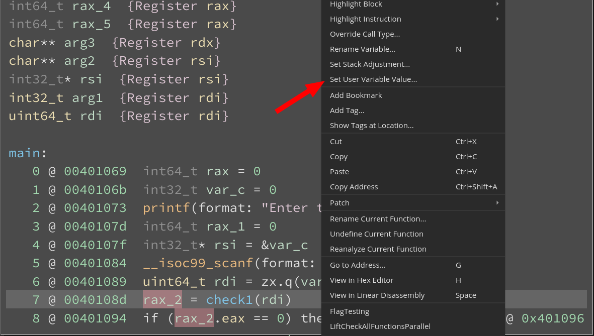
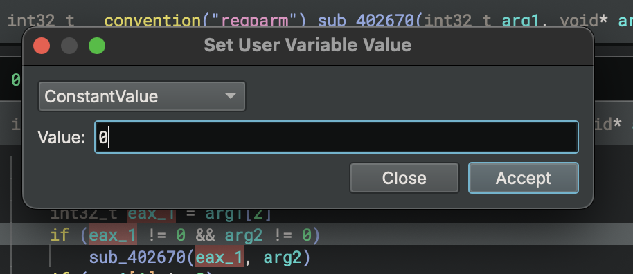
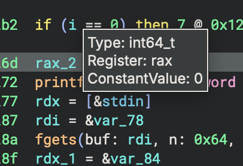
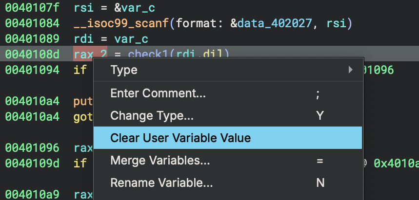
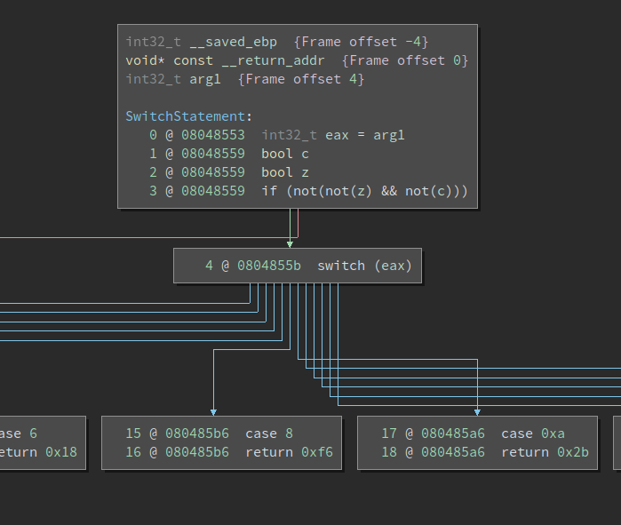

## User Informed Data Flow

Binary Ninja now implements User-Informed DataFlow (UIDF) to improve the static reverse engineering experience of our users. This feature allows users to set the value of a variable at the Medium-level IL layer and have the internal dataflow engine propagate it through the control-flow graph of the function. Besides constant values, Binary Ninja supports various `PossibleValueSet` states as containers to help inform complex variable values.

## Usage

For the purpose of demonstration, we are going to use a simple [crackme](https://github.com/Vector35/uidf-example).

It is a fairly simple challenge but we can use it to demonstrate how UIDF can be used to progressively simplify the problem through branch elimination. First, we'll show how to use this new feature and then we'll discuss some of the design decisions that went into the implementation.

Let's start by looking at the `main` function. Note that the `rax_*` variables contain values returned from the computation of `check_*` functions. These values are used for determining whether control would flow to the satisfying or failure conditions of the crackme.

Let's first look at `rax_2`. We see that the conditional at Medium Level IL (MLIL) instruction 8 uses a field access into `rax` and checks its value against 0. If it evaluates to true, control-flow jumps to `0x004010a4` and outputs "Incorrect". However if it evaluates to false, we continue down the chain of conditionals which determine if the output is "Correct". To confirm our understanding and simplify the process further, we can inform the dataflow analysis engine with the value for `rax_2` and see how it impacts the control flow of the binary.

First, note the definition site of `rax_2` is instruction 7 and then right click there to see "Set User Variable Value...". Users can also bind the action to a hotkey or access it via the command palette.



The dialog box to set the variable value contains two fields:

* `PossibleValueSet` type: `PossibleValueSet` is used to represent the values that a variable can take during analysis. This can also be representative of the values that the variable would take during concrete execution of the program. For instance if the variable value is `<const 0x0>`, it implies that the mapped register would always contain the value `0x0` during the lifetime of the variable. `UndeterminedValue` on the other hand suggests that the analysis could not figure out an appropriate value and representation in the available `PossibleValueSet`s. For the program analysis folks, this is analogous to the top of the dataflow lattice. An `EntryValue` represents the bottom. `PossibleValueSet`s provide complex container types such as `InSetOfValues`, `SignedRangeValue`, `UnsignedRangeValue`, etc.
* Value: Represents the concrete value which is to be informed to the analysis. Please refer to the parse_possiblevalueset [documentation](https://api.binary.ninja/binaryninja.binaryview-module.html#binaryninja.binaryview.BinaryView.parse_possiblevalueset) for a detailed description of the parser rules for the various `PossibleValueSet`s.



The parser checks if the string can be parsed into a [`PossibleValueSet`](https://api.binary.ninja/binaryninja.function.PossibleValueSet.html). The behavior of this parser is similar to the `Goto Address` dialog box or the [`parse_expression` API](https://api.binary.ninja/binaryninja.binaryview-module.html#binaryninja.binaryview.BinaryView.parse_expression). This enables the use of keywords such as `$here`, `$start/$end`, etc.

And of course, like everything else in Binary Ninja you can accomplish this using the API. `PossibleValueSet`s can be created through instantiation of the [`PossibleValueSet`](https://api.binary.ninja/binaryninja.function.PossibleValueSet.html) class or through parsing a value string:

```python
>>> # Creating a PossibleValueSet object through instance creation
>>> # The general syntax is : PossibleValueSet.<value_type>
>>> PossibleValueSet.in_set_of_values([1,2,3])
<in set([0x1, 0x2, 0x3])>
>>> v_r = ValueRange(10, 20, 2)
>>> v_r
<range: 0xa to 0x14, step 0x2>
>>> PossibleValueSet.unsigned_range_value([v_r])
<unsigned ranges: [<range: 0xa to 0x14, step 0x2>]>
>>>
>>> # Creating PossibleValueSet through parsing of value string
>>> state = RegisterValueType.UnsignedRangeValue
>>> # bv.parse_possiblevalueset(value, state, here=0)
>>> bv.parse_possiblevalueset("10:20:2", state)
<unsigned ranges: [<range: 0x10 to 0x20, step 0x2>]>
>>>
```

Let's set the value of the variable `rax_2` to `ConstantValue <0x0>`. Here's how we can do it using the API:

```python
>>> v = current_mlil[7].operands[0][0]
>>> v
<var uint64_t rax_2>
>>> value = PossibleValueSet.constant(0)
>>> value
<const 0x0>
>>> # current_function.set_user_var_value(var, definition_site, value)
>>> current_function.set_user_var_value(v, 0x40108d, value)
>>>
```

Looking at the binary this input should lead to "Incorrect" output. Setting the variable value automatically triggers a re-analysis of the function. This leads to a dataflow analysis pass over the function seeded with the user-informed value for that specific variable. On hovering over the variable token, we see the value that it takes is the one we informed.



The API makes it easy to query for the value of the conditional to check if it has been statically evaluated. We can also get a list of all the currently informed variable values through the API:

```python
>>> current_mlil[8].condition.value
<const 0x1>
>>> current_function.get_all_user_var_values()
{<var uint64_t rax_2>: {archandaddr <x86_64 @ 0x40108d>: <const 0x0>}}
>>>
```

Let us see the High Level IL (HLIL) representation of `main` before UIDF:


Below is the HLIL of `main` after UIDF. If constant propagation leads to conditionals which can be evaluated at analysis time, its value is set to `if (true) or if (false)` at the MLIL layer. More so, the branch of the conditional where the control flow is guaranteed to not reach is eliminated from HLIL. The sub-graph of the CFG which results in the "Correct" output is eliminated. Here, HLIL benefits from dataflow calculations made at MLIL and the updated CFG is indicative of that.


We believe that UIDF is great for experimenting around with during the initial phase of the RE life cycle. If the value for a variable at a location is already informed, right-clicking on the variable at any usage site where the variable has the same SSA version will show an option to "Clear User Variable Value". This clears the informed value and triggers reanalysis. And as always, you can just use undo if setting the user variable value was the last action (using CMD/CTRL+Z).

```python
>>> # current_function.clear_user_var_value(var, definition_site)
>>> current_function.clear_user_var_value(v, 0x40108d)
>>> # Clear all informed user variable values
>>> current_function.clear_all_user_var_values()
>>>
```



### Jump-Table Example

Another example of using UIDF would be to construct jump-tables with known bounds. There are several other ways to achieve this same goal that it may be helpful to review. First, as our old [example plugin](https://github.com/Vector35/binaryninja-api/blob/dev/python/examples/jump_table.py#L81) demonstrates, you can use the [`set_user_indirect_branches`](https://api.binary.ninja/binaryninja.function-module.html#binaryninja.function.Function.set_user_indirect_branches) API, though this is probably the least easy method to use. Next, you can create an appropriately sized array of pointers at the base of a jump table reference, and the jump table recovery will automatically create all of the appropriate targets.

Now, with the introduction of UIDF, there's another easy way to help inform the jump-table analysis. Consider the MLIL representation for an indirect jump as shown below:


Let us inform value for the variable `eax` to be in the range `1` to `0x13`.

```python
>>> v = current_mlil[0].operands[0]
>>> value = PossibleValueSet.unsigned_range_value([ValueRange(0, 0x13, 1)])
>>> def_site = 0x08048553
>>> current_function.set_user_var_value(v, def_site, value)
```

A jump table will be created with a base of `0x804891c` with 14 possible targets for the jump at 0x804855b. Below is a cropped screenshot of the resulting HLIL which consists of a switch construct which depends on the variable value. This [binary](http://pages.cs.wisc.edu/~xmeng/Testsuite.tar.gz) is available on [BN Cloud](https://cloud.binary.ninja/bn/fb2131dd-e726-4009-8428-80f9f0b5e8ae) and is originally written by [Xiaozhu Meng](http://pages.cs.wisc.edu/~xmeng).



## Design notes

Static-only reverse engineering limits the ability to test hypothesis formulated during the initial analysis phase. To that end, analysts usually turn to emulation/debugging to experiment with a binary. This can often be time-consuming if the focus is on checking dependencies between program variables or for verifying the dataflow, or worse, may be impossible for some platforms that are difficult to dynamically analyze. With UIDF, we aim to provide our users with the ability to interact with the dataflow engine more richly and partly achieve the same results without leaving the flow graph or linear analysis window. UIDF could also aid in better understanding targets of indirect jumps or fixing jump tables. Research [[1](#ref1),[2](#ref2)] shows that it is imperative that binary analysis tools adopt a more user-guided approach to solve RE/VR tasks and UIDF tries to be a step up that slope. We aim to continue work in this direction!

UIDF primarily operates on the MLIL layer. Binary Ninja performs constant propagation, resolves call parameters and lifts stack load/stores into a variables. This combined with the SSA form enables an effective dataflow analysis pipeline. MLIL also provides control over dead-code elimination and allows us to prevent removal of redundant instructions (eg. variable definitions for informed variables) and basic blocks (removed due to the resulting dataflow). Binary Ninja's tiered IL representation allows the higher layers to benefit from simplifying transformations at the lower layers. Through fixing jump tables or branch elimination, UIDF influences HLIL output as a user would expect without having drastic changes to the MLIL representation.

Looking towards the future, improvements to the dataflow solver engine would inherently increase the efficacy of UIDF. This could include support for more operations on the complex [`PossibleValueSet`](https://api.binary.ninja/binaryninja.function.PossibleValueSet.html) containers or the ability to play well with program structure such as loops.
