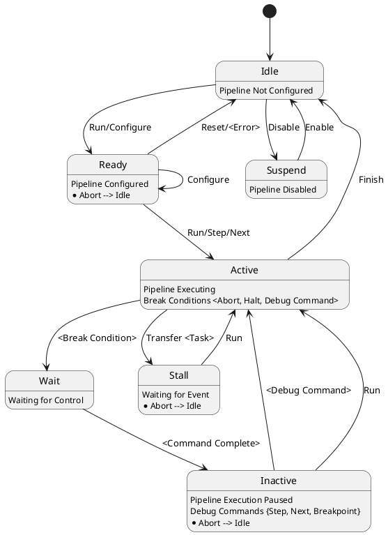

Binary Ninja Workflows Documentation
===

---
# Early Feature Preview

This capability is experimental with no guarantees of API stability or future compatibility. Binary Ninja Workflows is actively under development as a functional prototype. Feedback and questions are welcome!


---
# Contents
---

- [What is Workflows](#what-is-workflows)
- [Getting Started](#getting-started)
	- [Availability](#availability)
	- [Enable](#enable)
	- [Explore](#explore)
	- [Examples](#examples)
- [Basic Concepts](#basic-concepts)
	- [Activity](#activity)
	- [Workflow](#workflow)
	- [Analysis Context](#analysis-context)

<!--
- [Execution Model](#execution-model)
	- [Activity Description](#activity-description)
	- [Workflow Description](#workflow-description)
- [Consistency Requirements](#consistency-requirements)
- [Strategies](#strategies)
- [Core Analysis Descriptions](#core-analysis-descriptions)
- [Extended Analysis Descriptions](#extended-analysis-descriptions)
-->

---
# What Is Workflows
---

Binary Ninja Workflows is an analysis orchestration framework which simplifies the definition and execution of a computational binary analysis pipeline. The extensible pipeline accelerates program analysis and reverse engineering of binary blobs at various levels of abstraction. Workflows supports hybridized execution models, where the ordering of activities in the pipeline can be well-known and procedural, or dynamic and reactive. Currently, the core Binary Ninja analysis is made available as a procedural model and is the aggregate of both module and function-level analyses.

---
# Getting Started
---

## Enable

By default, Binary Ninja Workflows is disabled. Enable the feature via *Settings* in the UI, or with the following:

```
Settings().set_bool('workflows.enable', True)
```

## Explore

The procedural core analysis model resembles a behavior tree and the activities execute as a depth-first pre-order traversal of the tree. In order to represent complex data flows, there is fine-grained control for conditional execution and subtree parallelism. It's possible to visualize the pipeline topology in the UI with `show_topology`, as shown below. There are two visual representations for the pipeline topology, a *Composite View* and a *Sequential View*.

```
Workflow().show_topology()
```

It's possible to create multiple workflows to satisfy the need for tailored analysis across a diverse set of binaries and goals. List available workflows as shown below.

```
>>> list(Workflow)
[<Workflow: CustomTailCallWorkflow>, <Workflow: InlinerWorkflow>, <Workflow: core.function.defaultAnalysis>, <Workflow: core.module.defaultAnalysis>]
```

## Examples

---
### Python

```
pwf = Workflow().clone("PythonLogWarnWorkflow")
pwf.show_topology()
pwf.register_activity(Activity("PythonLogWarn", action=lambda analysis_context: binaryninja.log.log_warn("PythonLogWarn Called!")))
pwf.insert("core.function.basicBlockAnalysis", ["PythonLogWarn"])
pwf.register()
```

Then open a file with options and select *PythonLogWarnWorkflow* for the *Function Workflow* setting.

---
### C++

Several C++ examples are available in [binaryninja-api/examples/workflows](https://github.com/Vector35/binaryninja-api/tree/dev/examples). These examples are distributed with Binary Ninja and available via the *Function Workflow* setting. Steps for building the examples can be found [here](https://github.com/Vector35/binaryninja-api#building).

- Custom Tail Call Analysis
- Call-Site Function Inliner
- Objective C Workflow

---
# Basic Concepts
---

## Activity

An Activity is the basic building block of the Workflows framework and it is also the extensibility mechanism which allows attachment of an arbitrary callback routine. The degree of coupling between activities is discretionary. This means that an activity can be part of a tightly coupled dataflow transform, or an activity can be completely disassociated with other activities in the pipeline. Binary Ninja provides numerous core activities which together provide the program analysis results and IL transformation system. Activities are dynamically parameterized with an analysis context which enables it to produce or consume information in a coordinated fashion.

## Workflow

A Workflow is a repository of activities along with a unique strategy to execute them. Workflows are also composable, meaning workflows can include other workflows. It's possible to control various aspects of the execution strategy such as course-grained debugging as well as conditional, and parallel execution. Binary Ninja provides a default workflow which contains all of the core module and function analyses.

### Workflow Lifecycle

A Workflow starts in the unregistered state from either creating a new empty Workflow, or cloning an existing Workflow. While unregistered it's possible to add and remove activities, as well as change the execution strategy. In order to use the Workflow on a binary it must be registered. Once registered the Workflow is immutable and available for use.

## Analysis Context

The Analysis Context provides access to the current analysis hierarchy along with APIs to query and inform new analysis information.

<! ---

---
# Execution Model
---

## State Graph

## Pipeline

## Task Queue

## Concurrency

## Activity Description

### Metadata

### Properties

### Constructs

- Simple
- Selector
- Iterator
- Concurrent

## Workflow Description

### Metadata

### Properties

---
# Consistency Requirements
---

---
# Strategies
---

## Working with Basic Blocks

## Working with IL Forms

### Low-Level IL

### Medium-Level IL

### High-Level IL

### Single-Static Assignment (SSA)

## Rewriting IL

---
# Core Analysis Descriptions
---

---
# Extended Analysis Descriptions
---

--- >
