# Getting Started

Welcome to Binary Ninja. This introduction document is meant to quickly guide you over some of the most common uses of Binary Ninja.

## Directories

Binary Ninja uses two main locations. The first is the install path of the binary itself and the second is the user folders for user-installed content.

### Binary Path

Binaries are installed in the following locations by default:

- macOS: `/Applications/Binary Ninja.app`
- Windows (global install): `C:\Program Files\Vector35\BinaryNinja`
- Windows (user install): `%LOCALAPPDATA%\Vector35\BinaryNinja`
- Linux: Wherever you extract it! (No standard location)

!!! Warning "Warning"
    Do not put any user content in the install-path of Binary Ninja. The auto-update process of Binary Ninja may replace any files included in these folders.

### User Folder

The base locations of user folders are:

- macOS: `~/Library/Application Support/Binary Ninja`
- Linux: `~/.binaryninja`
- Windows: `%APPDATA%\Binary Ninja`

Contents of the user folder includes:

- `lastrun`: A text file containing the directory of the last BinaryNinja binary path -- very useful for plugins to resolve the install locations in non-default settings or on Linux.
- `license.dat`: License file
- `plugins/`: Folder containing all manually installed user plugins
- `repositories/`: Folder containing files and plugins managed by the [Plugin Manager API](https://api.binary.ninja/binaryninja.pluginmanager-module.html)
- `settings.json`: User settings file (see [settings](#settings))
- `startup.py`: Default python commands run once the UI is loaded in the context of the scripting console
- `keybindings.json`: Custom key bindings (see [key bindings](#custom-hotkeys))

### QSettings Locations

Some settings such as window locations, saved checkboxes, recent file lists, disassembly settings, dialog histories.

If you ever have the need to flush these, you can find the install locations as described in the [QT documentation](https://doc.qt.io/qt-5/qsettings.html#platform-specific-notes).

## License

When you first run Binary Ninja, it will prompt you for your license key. You should have received your license key via email after your purchase. If not, please contact [support](https://binary.ninja/support).

Once the license key is installed, you can change it, back it up, or otherwise inspect it simply by looking inside the base of the user folder for `license.dat`.

## Linux Setup

Because Linux install locations can vary widely, we do not assume that Binary Ninja has been installed in any particular folder on Linux. Rather, you can simply run `binaryninja/scripts/linux-setup.sh` after extracting the zip and various file associations, icons, and other settings will be set up. Run it with `-h` to see the customization options.

## Loading Files

You can load files in many ways:

1. Drag-and-drop a file onto the Binary Ninja window (hold `[CMD/CTRL-SHIFT]` while dropping to use the `Open with Options` workflow)
2. Use the `File/Open` menu or `Open` button on the start screen (`[CMD/CTRL] o`)
3. Use the `File/Open with Options` menu which allows you to customize the analysis options (`[CMD/CTRL-SHIFT] o`)
4. Open a file from the Triage picker (`File/Open for Triage`) which enables several minimal analysis options and shows a summary view first
5. Click an item in the recent files list (hold `[CMD/CTRL-SHIFT]` while clicking to use the `Open with Options` workflow)
6. Press the number key associated with an item from the recent files list (0-9, where 0 represents file 10 on the recent list, optionally holding `[CMD/CTRL-SHIFT]` to use the `Open with Options` workflow)
7. Run Binary Ninja with an optional command-line parameter
8. Open a file from a URL via the `[CMD/CTRL] l` hotkey
9. Open a file using the `binaryninja:` URL handler. For security reasons, the URL handler requires you to confirm a warning before opening a file via the URL handler. URLs additionally support deep linking using the `expr` query parameter where expression value is a valid parsable expression such as those possible in the [navigation dialog](#navigating), and fully documented in the [`parse_expression`](https://api.binary.ninja/binaryninja.binaryview-module.html?highlight=parse_expression#binaryninja.binaryview.BinaryView.parse_expression) API. Below a few examples are provided:
    * URLs For referencing files on the local file system.
        * `binaryninja:///bin/ls?expr=sub_2830` - open the given file and navigate to the function: `sub_2830`
        * `binaryninja:///bin/ls?expr=.text` - open the given file and navigate to the start address of the `.text` section
        * `binaryninja:///bin/ls?expr=.text+6b` - open the given file and navigate to the hexadecimal offset `6b` from the `.text` section.
    * URLs For referencing remote file files either the URL should be prefixed with `binaryninja:` and optionally suffixed with the `expr` query parameter
        * `binaryninja:file://<remote_path>?expr=[.data + 400]` - Download the remote file and navigate to the address at `.data` plus `0x400`

## Saving Files

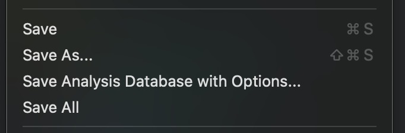

There are five menu items that can be used to save some combination of a raw file or a file's analysis information. Analysis information is saved into files that end in `.bndb` and have the same prefix as the original file. The default behavior for each of the "save" menu choices is described below:

1. "Save" - This menu is the only one bound to a hotkey by default and it is intended to be the "do what I probably want" option.
  - If you have edited the contents of a file and have not yet confirmed the file name to save over, this will ask you to save the file contents and prompt for a file name (check the save dialog title text to confirm this).
  - If you have edited the file contents and _have_ previously specified the file name, this option will save those changes to that file without a prompt.
  - If you have not edited the contents of the file but have added any analysis information (created functinos, comments, changed names types, etc), you will be asked for the name of the `.bndb` analysis database if one does not already exist.
  - If an existing analysis database does exist and is in use, the existing database will be saved without a prompt.
  - Finally, if you have changed both file contents and analysis information, you'll be prompted as to which you wish to save.

2. "Save As" - Will prompt to save the analysis database or just the file contents.
  - If you choose to save the analysis database, it behaves similarly to "Save" above, except for the cases that save without prompt. In those cases, you will _always_ be prompted for a filename.
  - If you choose to save the file contents only, you will be prompted for a filename to which to save the current contents of the binary view, including any modifications.

3. "Save All"  - Used to save multiple tabs worth of analysis data only. Does not save file contents.

4. "Save Analysis Database" - Will prompt to select a database to save analysis information if none is currently selected and in use, and will save without a prompt if one has already been selected.

5. "Save Analysis Database With Options" - Allows for saving a `.bndb` without additional undo information, or by cleaning up some internal snapshot information to decrease the file size.

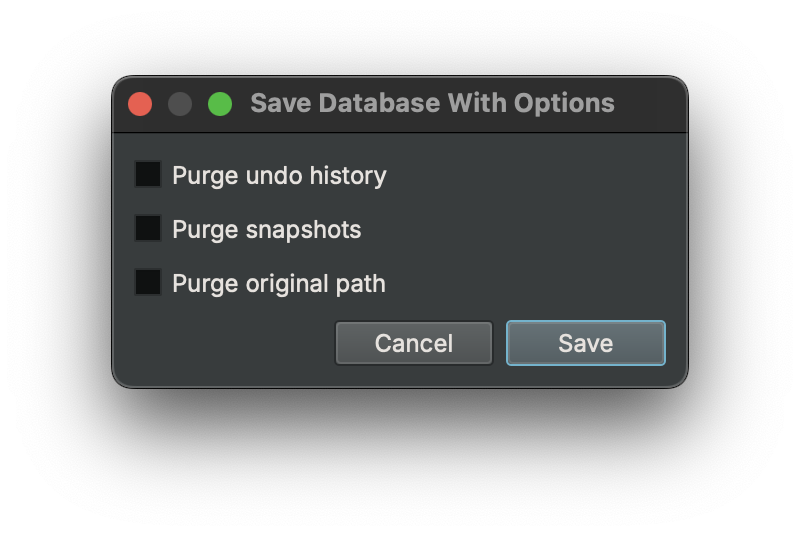 <!-- this image is getting floated down into the next section -->

## Status Bar

 <!-- this image needs updating to reflect new status bar -->

The status bar provides current information about the open file as well as some interactive controls. Summary features are listed below:

* Update Notification - perform updates, download status, and restart notification
* Analysis progress - ongoing analysis progress of current active file
* Cursor offset or selection
* File Contents Lock - interactive control to prevent accidental changes to the underlying file

## Analysis

As soon as you open a file, Binary Ninja begins its auto-analysis which is fairly similar to decompiling the entire binary.

Even while Binary Ninja is analyzing a binary, the UI should be responsive. Not only that, but because the analysis prioritizes user-requested analysis, you can start navigating a binary immediately and wherever you are viewing will be prioritized for analysis. The current progress through a binary is shown in the status bar (more details are available via `bv.analysis_info` in the Python console), but note that the total number of items left to analyze will go up as well as the binary is processed and more items are discovered that require analysis.

Analysis proceeds through several phases summarized below:

* Phase 1 - Initial Recursive Descent
* Phase 2 - Call Target Analysis (Part of Linear Sweep)
* Phase 3.x - Control Flow Graph Analysis (Part of Linear Sweep)

Errors or warnings during the load of the binary are also shown in the status bar, each with an appropriate icon. The most common warnings are from incomplete lifting and can be safely ignored. If the warnings include a message like `Data flow for function at 0x41414141 did not terminate`, then please report the binary to the [bug database](https://github.com/Vector35/binaryninja-api/issues).

### Analysis Speed

If you wish to speed up analysis, you have several options. The first is to use the `File/Open for Triage` menu which activates the Triage file picker. By default, [Triage mode](https://binary.ninja/2019/04/01/hackathon-2019-summary.html#triage-mode-rusty) will enable a faster set of default analysis options that doesn't provide as much in-depth analysis but is significantly faster.

Additionally, using the [open with options](#loading-files) feature allows for customization of a number of analysis options on a per-binary basis. See [all settings](#all-settings) under the `analysis` category for more details.

## Interacting

### Navigating

Navigating code in Binary Ninja is usually a case of just double-clicking where you want to go. Addresses, references, functions, jump edges etc, can all be double-clicked to navigate. Additionally, the `g` hotkey can navigate to a specific address in the current view. Syntax for this field is very flexible. Full expressions can be entered including basic arithmetic, dereferencing, and name resolution (function names, data variable names, segment names, etc). Numerics default to hexadecimal but that can be controlled as well. Full documentation on the syntax of this field can be found [here](https://api.binary.ninja/binaryninja.binaryview-module.html?highlight=parse_expression#binaryninja.binaryview.BinaryView.parse_expression).

### The Sidebar

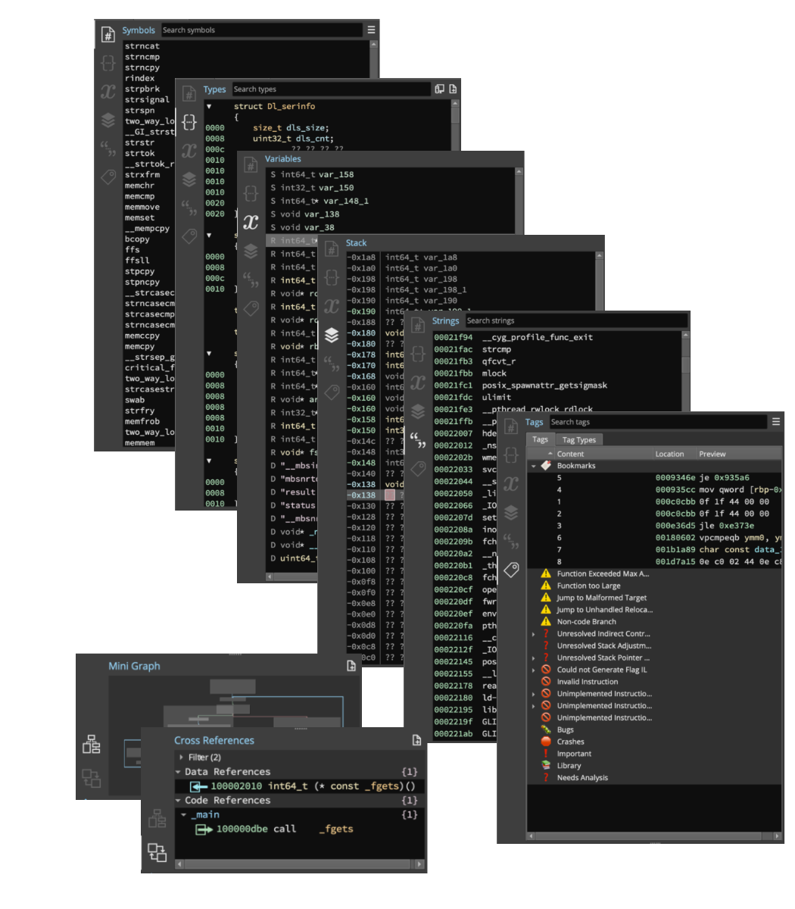

Once you have a file open, the sidebar lets you quickly access the most common features and keeps them available while you work, including:
- symbols
- types
- function-specific local variables
- context-sensitive stack state
- strings
- tags/bookmarks
- a mini-graph of the current function
- cross-references to the current selection

### Tiling Panes

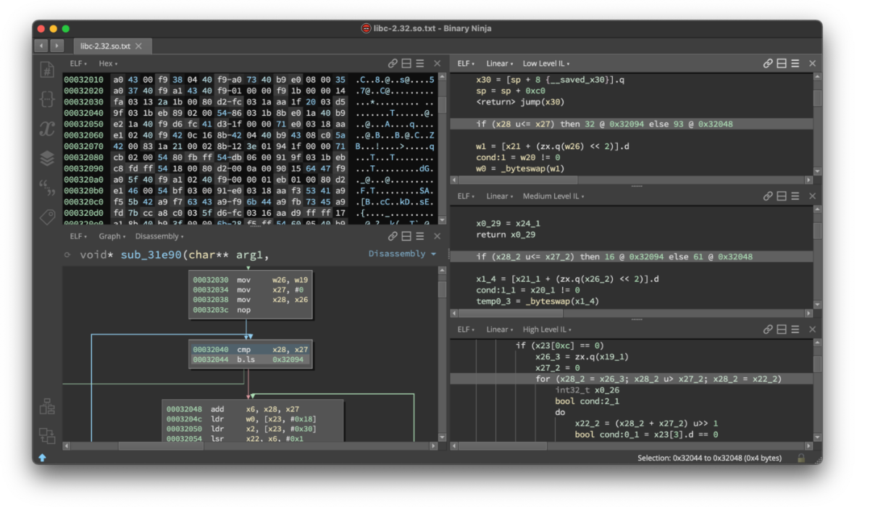

Binary Ninja displays binaries in panes, whether shown as disassembly, hex, IL, or decompiler output. Tiling these panes allows for a wide variety of information to be displayed at the same time.

Each pane has display options at the top and can be split and synchronized with other panes (or groups of panes). The ☰ ("hamburger") menu in the top right of each pane allows for additional customization, including locking the pane to a single function.

The Feature Map is also displayed on the right, and gives a visual summary of the entire binary with different colors representing data variables, code, strings, functions/code, imports, externs, and libraries. It can be moved or hidden via the right-click menu.

### Switching Views
 <!-- this image needs updating to the pane header -->

Switching views happens multiple ways. In some instances, it is automatic (clicking a data reference from graph view will navigate to linear view as data is not shown in the graph view), and there are multiple ways to manually change views as well. While navigating, you can use the view hotkeys (see below) to switch to a specific view at the same location as the current selection. Alternatively, the view menu in the header at the top of each pane can be used to change views without navigating to any given location.

### Command Palette

One great feature for quickly navigating through a variety of options and actions is the `command palette`. Inspired by similar features in [Sublime](http://docs.sublimetext.info/en/latest/reference/command_palette.html) and [VS Code](https://code.visualstudio.com/docs/getstarted/userinterface#_command-palette), the command-palette is a front end into an application-wide, context-sensitive action system that all actions, plugins, and hotkeys in the system are routed through.

To trigger it, simply use the `[CMD/CTRL] p` hotkey. Note that the command-palette is context-sensitive and therefore some actions (for example, `Display as - Binary`) may only be available depending on your current view or selection. This is also available to plugins. For example, a plugin may use [PluginCommand.register](https://api.binary.ninja/binaryninja.plugin-module.html#binaryninja.plugin.PluginCommand.register) with the optional `is_valid` callback to determine when the action should be available.

### Custom Hotkeys

Any action in the [action system](#command-palette) can have a custom hotkey mapped to it. To access the keybindings menu, use the `[CMD/CTRL-SHIFT] b` hotkey, via the `Edit / Keybindings...` (`Binary Ninja / Preferences / Keybindings...` on macOS) menu, or the `Keybindings` [command palette](#command-palette) entry. Any overlapping keybindings will be highlighted. Click the `Keybinding` column header to sort by keybindings in order to see what bindings are overlapping.

!!! Tip "Tip"
    To search in the keybindings list, just click to make sure it's focused and start typing!

!!! Tip "Tip"
    It is also possible to edit the `keybindings.json` file in your user folder directly in a text editor.

!!! Tip "Note"
    On macOS, within the `keybindings.json`, `Ctrl` refers to the Command key, while `Meta` refers to the Option key. This is a remapping performed by Qt to make cross-platform keybindings easier to define.

### Default Hotkeys

 - `h` : Switch to hex view
 - `p` : Create a function
 - `[ESC]` : Navigate backward
 - `[CMD] [` (macOS) : Navigate backward
 - `[CMD] ]` (macOS) : Navigate forward
 - `[CTRL] [` (Windows/Linux) : Navigate backward
 - `[CTRL] ]` (Windows/Linux) : Navigate forward
 - `[SPACE]` : Toggle between linear view and graph view
 - `[F5]`, `[TAB]` : Toggle between decompilation (HLIL) and disassembly view
 - `g` : Go To Address dialog
 - `n` : Name a symbol
 - `u` : Undefine an existing symbol (only for removing new user-defined names)
 - `e` : Edits an instruction (by modifying the original binary -- currently only enabled for x86, and x64)
 - `x` : Focuses the cross-reference pane
 - `;` : Adds a comment
 - `i` : Cycles between disassembly, LLIL, MLIL and HLIL in graph view
 - `t` : Switch to type view
 - `y` : Change type of currently selected element
 - `a` : Change the data type to an ASCII string
 - `1`, `2`, `4`, `8` : Change type directly to a data variable of the indicated widths
 - `d` : Switches between data variables of various widths
 - `r` : Change the data type to single ASCII character
 - `o` : Create a pointer data type
 - `[CMD-SHIFT] +` (macOS) : Graph view zoom in
 - `[CMD-SHIFT] -` (macOS) : Graph view zoom out
 - `[CTRL-SHIFT] +` (Windows/Linux) : Graph view zoom in
 - `[CTRL-SHIFT] -` (Windows/Linux) : Graph view zoom out
 - Other hotkeys specifically for working with types are in the [type guide](guide/type.md#direct-ui-manipulation)

### Graph View

Binary Ninja offers a graph view that groups the basic blocks of disassembly into visually distinct blocks with edges showing control flow between them.

Features of the graph view include:

- Ability to double click edges to quickly jump between locations
- Zoom (CTRL-mouse wheel)
- Vertical Scrolling (Side scroll bar as well as mouse wheel)
- Horizontal Scrolling (Bottom scroll bar as well as SHIFT-mouse wheel)
- Individual highlighting of arguments, addresses, immediate values, types, etc.
- Full type signature of current function shown in an interactive header:
  - Selecting elements in the header highlights them in the graph view
  - Change type (`y`) and Rename (`n`) shortcuts work on elements in the header
  - Reanalyze function button on left edge of the header
- Edge colors indicate whether the path is the true (green) or false (red) case of a conditional jump (a color-blind option in the preferences is useful for those with red-green color blindness) and blue for unconditional branches
- Context menu that can trigger some function-wide actions as well as some specific to the highlighted instruction (such as inverting branch logic or replacing a specific function with a NOP)

### View Options

Each of the views (Hex, Graph, Linear) have a variety of options configurable from the ☰ menu on the top right of the view pane.

Current options include:

- Hex
    - Background highlight
        - None
        - Column
        - Byte value
    - Color highlight
        - None
        - ASCII and printable
        - Modification
    - Contrast
        - Normal
        - Medium
        - Highlight
- Graph & Linear Views
    - Expand long opcode
    - Show address
    - Show call parameter names (MLIL only)
    - Show function address
    - Show opcode bytes
    - Show register set highlighting
    - Show variable types
        - At assignment (MLIL only)
        - At top of function
    - Assembly
    - Low Level IL
        - Show Stack Pointer Value
    - Medium Level IL
    - High Level IL
    - Pseudo C
    - Advanced IL Forms
        - Lifted IL
            - Show IL Flag Usage
        - Low Level IL (SSA Form)
        - Medium Level IL (Mapped)
        - Medium Level IL (Mapped, SSA Form)
        - Medium Level IL (SSA Form)
        - High Level IL (SSA Form)

### Hex View

The hexadecimal view is useful for viewing raw binary files that may or may not even be executable binaries and allows direct editing of the binary contents in place, regardless of the type of the binary. Any changes made in hex view will be reflected in all other [open views](#tiling-panes) of the same binary. The lock button on the right edge of the bottom status bar must be toggled off (🔓) to perform any direct editing in hex view -- this is to prevent unintended modification of the binary by accidental pasting or typing.

The hex view is particularly good for transforming data in various ways via the `Copy as`, `Transform`, and `Paste from` menus. Note that like any other edits, `Transform` menu options will transform the data in-place, but unlike other means of editing the binary, the transformation dialog will work even when the lock button is toggled on (🔒).

!!! Tip "Tip"
    Any changes made in the Hex view will take effect immediately in any other views open into the same file (new views can be created via the `Split to new tab`, or `Split to new window` options under `View`, or via [splitting panes](#tiling-panes)). This can, however, cause large amounts of re-analysis so be warned before making large edits or transformations in a large binary file.

### Cross References Pane

The Cross References view in the lower-left section of the sidebar shows all cross-references to the currently selected address, address range, variable or type. This pane will change depending on whether an entire line is selected (all cross-references to that address/type/variable are shown), or whether a specific token within the line is selected. For instance if you click on the symbol `memmove` in `call memmove` it will display all known cross-references to `memmove`, whereas if you click on the line the `call` instruction is on, you will only get cross-references to the address of the call instruction. Cross-references can be either incoming or outgoing, and they can be either data, code, type, or variable.

#### Code References

Code references are references to or from code, but not necessarily _to_ code. Code References can reference, code, data, or structure types. Code References are inter-procedural, and unfortunately due to speed considerations we currently only show disassembly (rather than an IL) when displaying these types of references. In a future version we hope to address this limitation.

#### Data References

Data References are references created _by_ data (i.e. pointers), not necessarily _to_ data. Outgoing Data References are what is pointed to by the currently selected data. Incoming Data References are the set of data pointers which point to this address.

#### Variable References

Variable References are all the set of uses of a given variable. As these references are intra-procedural we're able to show the currently viewed IL in the preview.

#### Type References

Type References are references to types and type members made by other types, perhaps more accurately called Type-to-Type-References.

#### Tree-based Layout
The cross-references pane comes in two different layouts: tree-based (default and shown above) and table-based (this can be toggled through the context menu or the command palette). The tree-based layout provides the most condensed view, allowing users to quickly see (for instance) how many references are present to the current selection overall and by function. It also allows collapsing to quickly hide uninteresting results.

#### Table-based Layout

The table-based layout provides field-based sorting and multi-select. Clicking the `Filter` text expands the filter pane, showing options for filtering the current results.

#### Template Simplifier

The [`analysis.types.TemplateSimplifier`](#analysis.types.TemplateSimplifier) setting can be helpful when working with C++ symbols.

    <ol id="inline-slides-text">
        <li id="currentline">Before Simplification</li>
        <li>After Simplification</li>
    </ol>
    

        <ul id="image-slider">
            <li>
              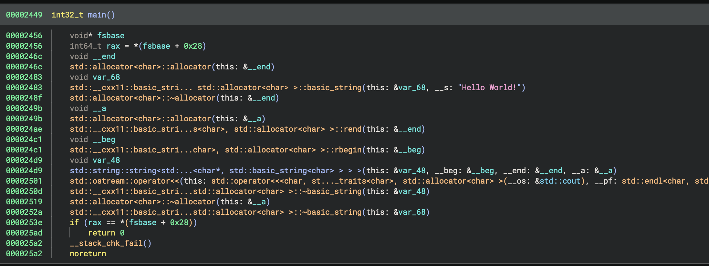
            </li>
            <li>
              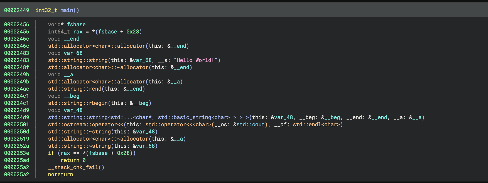
            </li>
        </ul>
    

_hover over the image to temporarily pause_

#### Cross-Reference Filtering

The first of the two drop down boxes allows the selection of incoming, outgoing, or both incoming and outgoing (default). The second allows selection of code, data, type, or variable or any combination thereof. The text box allows regular expression matching of results. When a filter is selected the `Filter` display changes from `Filter (<total-count>)` to `Filter (<total-filtered>/<total-count>)`

#### Cross-Reference Pinning

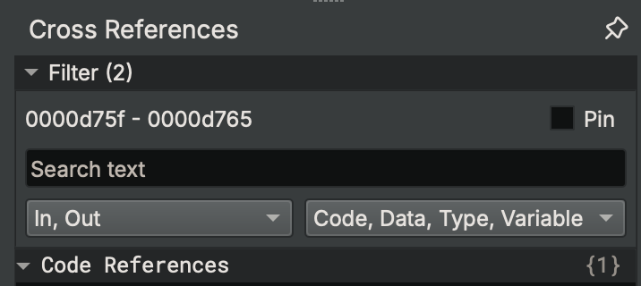

By default Binary Ninja's cross-reference pane is dynamic, allowing quick navigation to relevant references. Sometimes you might rather have the current references stick around so they can be used as a sort of work-list. This workflow is supported in four different ways. First is the `Pin` checkbox (which is only visible if the `Filter` drop-down is open). This prevents the list of cross-references from being updated even after the current selection is changed.

Alternatively clicking the `Pin Cross References to New Pane` button at the top right of the cross references pane in the sidebar, selecting `Pin Cross References` in the context menu or command palette, or using the `SHIFT+X` shortcut pops up a `Pinned Cross References` pane. This pane has a static address range which can only be updated through the `Pin Cross References` action. The third way would be to select (or multi-select in table view) a set of cross-references then right-click `Tag Selected Rows`. The tag pane can then be used to navigate those references. Tags allow for persistent lists to be saved to an analysis database whereas the other options only last for the current session.

#### Cross-Reference Hotkeys

* `x` - Focus the cross-references pane
* `[SHIFT] x` Create a new pinned cross-references pane
* `[OPTION/ALT] x` - Navigate to the next cross-reference
* `[OPTION/ALT-SHIFT] x` - Navigate to the previous cross-reference

The following are only available when the cross-references pane is in focus:

* `[CMD/CTRL] f` - Open the filter dialog
* `[ESC]` - Clear the search dialog
* `[CMD/CTRL] a` - Select all cross-references
* `[ARROW UP/DOWN]` - Select (but don't navigate) next/previous cross-reference
* `[ENTER]` - Navigate to the selected reference

### Linear View

Linear view is a hybrid view between a graph-based disassembly window and the raw hex view. It lists the entire binary's memory in a linear fashion and is especially useful when trying to find sections of a binary that were not properly identified as code or even just examining data.

Linear view is most commonly used for identifying and adding type information for unknown data. To this end, as you scroll, you'll see data and code interspersed. Much like the graph view, you can turn on and off addresses via the command palette `Show Address` or the ☰ menu on the top right of the linear view pane. Many other [options](#view-options) are also available.

### Symbols List

The symbols list in Binary Ninja shows the list of symbols for functions and/or data variables currently identified. As large binaries are analyzed, the list may grow during analysis. The symbols list starts with known functions and data variables such as the entry point, exports, or using other features of the binary file format and explores from there to identify other functions and data variables.

The symbols list highlights symbols according to whether they are functions or data variables, local or exported, or imported. All of these kinds of symbols can be toggled from the ☰ menu at the top right of the Symbols pane.

!!! Tip "Tip"
    To search in the symbols list, just click to make sure it's focused and start typing!

### Edit Function Properties Dialog

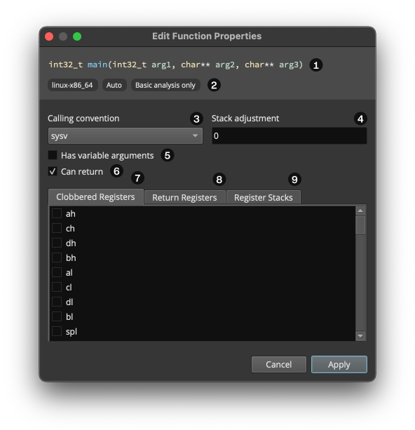

The “Edit Function Properties” dialog provides the ability to easily configure some of a function’s more advanced properties. It can be opened via the context menu when a function is focused in the graph or linear views, or via the command palette. An overview of the UI is as follows:

1. **Function prototype.** The function’s prototype. If the prototype is too long to fit inside the window, a scroll bar will appear.
1. **Function info.** A list of conditionally-shown tags offering information about the function. Possible tags are as follows:
    - **Function architecture/platform**: The function's architecture/platform (e.g. `windows-x86_64`)
    - **Analysis skipped (too large)**: Analysis was skipped for this function because it was too large ([`analysis.limits.maxFunctionSize`](#analysis.limits.maxFunctionSize))
    - **Analysis timed out**: Analysis for this function was skipped because it exceeded the maximum allowed time ([`analysis.limits.maxFunctionAnalysisTime`](#analysis.limits.maxFunctionAnalysisTime))
    - **Analysis was skipped (too many updates)**: Analysis was skipped for this function because it caused too many updates ([`analysis.limits.maxFunctionUpdateCount`](#analysis.limits.maxFunctionUpdateCount))
    - **Analysis suppressed**: Analysis was suppressed for this function because analysis of auto-discovered functions was disabled ([`analysis.suppressNewAutoFunctionAnalysis`](#analysis.suppressNewAutoFunctionAnalysis))
    - **Basic analysis only**: This function only received basis analysis ([`analysis.mode`](#analysis.mode) was 'basic')
    - **Intermediate analysis only**: This function only received intermediate analysis ([`analysis.mode`](#analysis.mode) was 'intermediate')
    - **Unresolved stack usage**: The function has unresolved stack usage
    - **GP = 0xABCD1234**: The global pointer value is 0xABCD1234
1. **Calling convention.** The calling convention this function uses. All calling conventions for the function’s architecture are available as choices.
1. **Stack adjustment.** How many _extra_ bytes does this function remove from the stack upon return?
1. **Has variable arguments.** Does this function accept a variable number of arguments?
1. **Can return.** Does this function return? If not, #8 will be unavailable.
1. **Clobbered registers.** The list of registers that this function clobbers; individual registers can be checked or unchecked.
1. **Return registers.** The list of registers that this function returns data in; individual registers can be checked or unchecked.
1. **Register stack adjustments.** A table containing a row for each register stack (e.g. x87) in the architecture, with the ability to adjust how many registers are removed from each stack when the function returns.

<!-- These same points need to be made about Panes, but also a lot more
### Reflection View

- View BNILs and assembly for the same file side-by-side

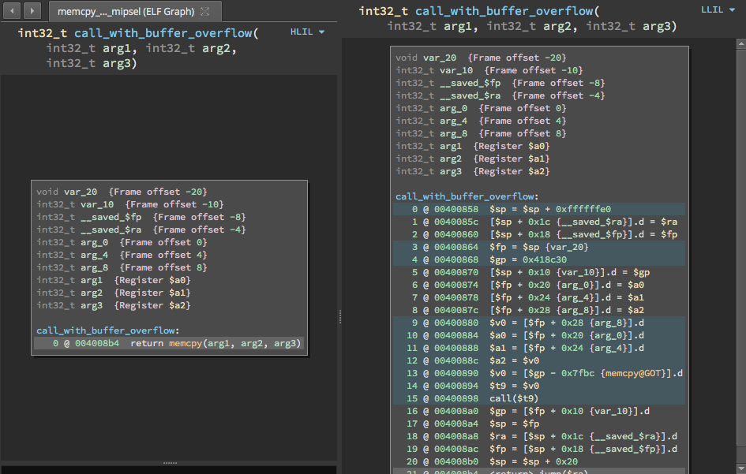

- Settings to control the synchronization behavior

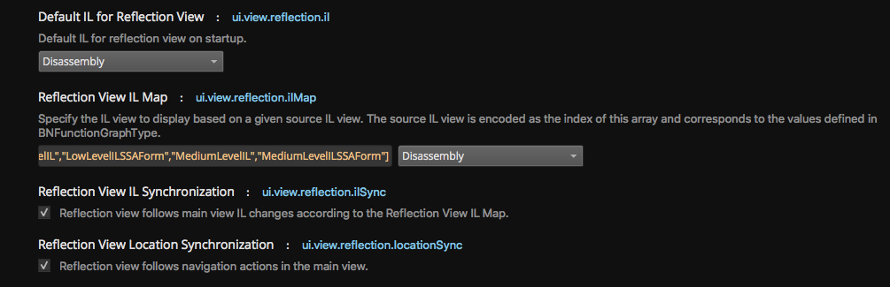

- Right Click the Function Header for quick access to synchronization mode changes

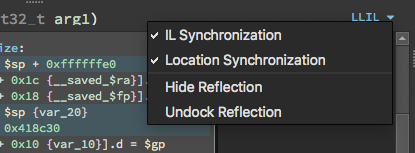

- Reflection currently presents in graph view only

- When main view is linear, Mini Graph renders the Reflection View
-->

### High Level IL

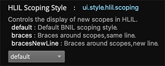

Binary Ninja features a decompiler that produces High Level IL (HLIL) as output. HLIL is not intended to be a representation of the code in C, but some users prefer to have a more C-like scoping style.

You can control the way HLIL appears in the settings.

The different options are shown below:

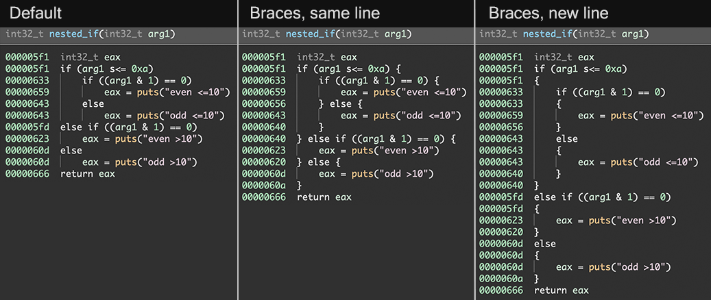

### Pseudo C

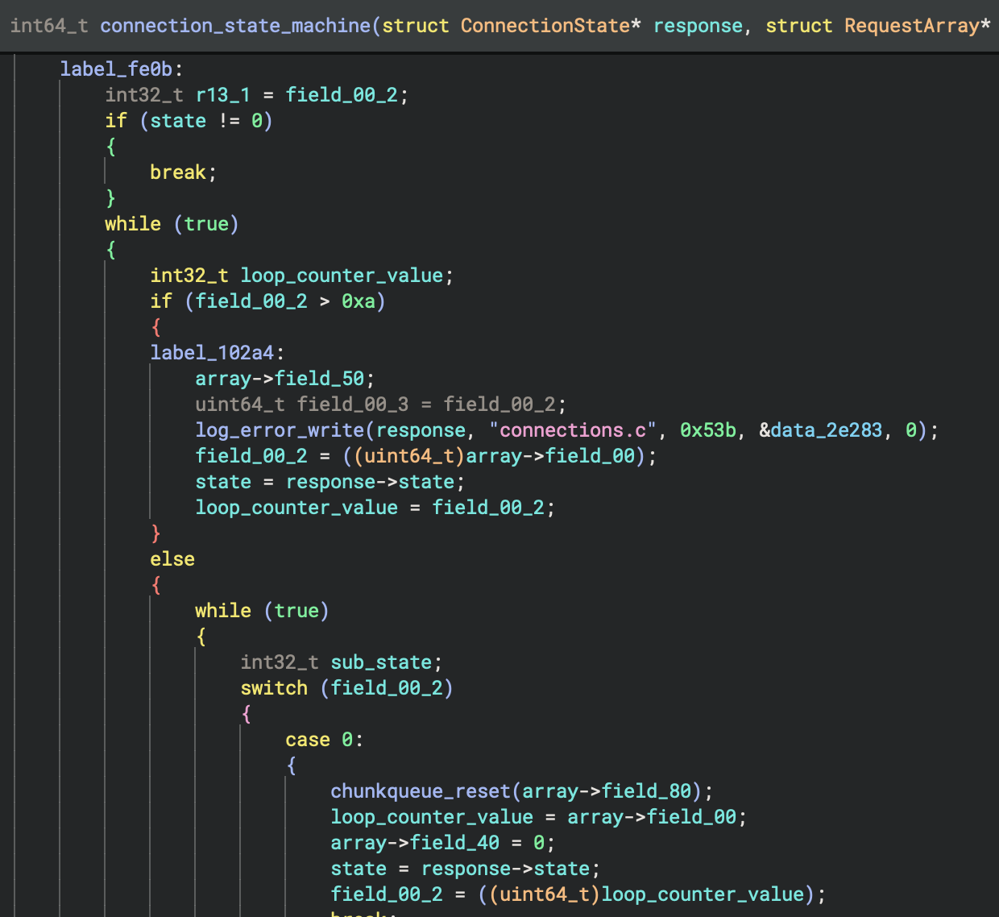

Binary Ninja offers an option to render the HLIL as a decompilation to "pseudo C". This decompilation is intended to be more familiar to the user than the HLIL. It is not necessarily intended to be "compliant" C or even recompilable. In some cases, it may be possible to edit it into a form that a C compiler will accept, but the amount of effort required will vary widely, and no guarantee is made that it will be possible in all cases.

### Dead Store Elimination

Binary Ninja tries to be conservative with eliminating unused variables on the stack. When the analysis finds a variable that cannot be eliminated but does not appear to be used, the assignment will appear grayed out in the decompiler output. The first two lines of the function below show this:

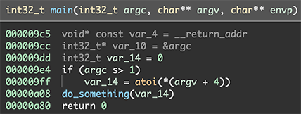

In this case, these variables are actually unused and can be eliminated. You can tell Binary Ninja to do this by right clicking on the variable and choosing "Allow" from the "Dead Store Elimination" submenu.

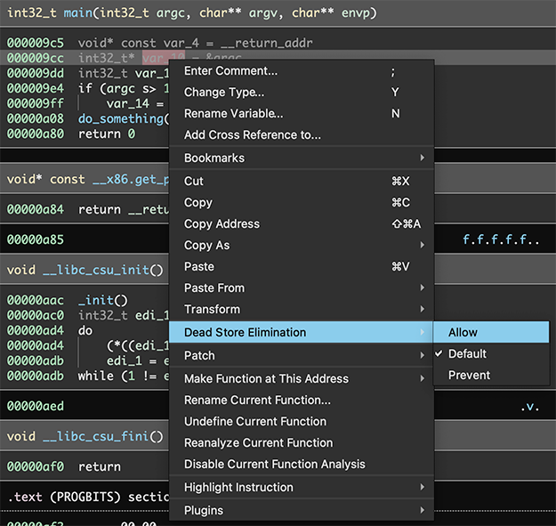

Performing this action on both variables in the example results in the following output:

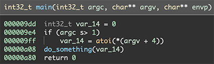

### Script (Python) Console

The integrated script console is useful for small scripts that aren't worth writing as full plugins.

To trigger the console, either use `<BACKTICK>`, or use the `View`/`Python Console` menu.

!!!Tip "Note"
    Note that `<BACKTICK>` will work in most contexts to open the console and focus its command line, unless the UI focus is in an editor widget.

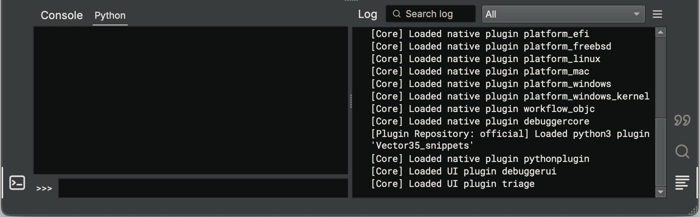

When both the Script Console and the Log view are open, the title of both acts as a tab that can be dragged to either a tabbed view showing only one at a time (the default) or a split view showing both. Currently, the console and log views are part of a "Global Area", meaning they are always visible in the same position when switching between open binary tabs in the same window. This means they can only dock with each other, and not with the sidebar or the main pane view area. It is possible to open additional scripting consoles via the `Create Python Console` action in the [command palette](#command-palette), and these new consoles will appear as additional tabs in the topmost, leftmost tab in the global area. Note that `<BACKTICK>` will always focus the original main scripting console, and while any of the other created consoles can be closed (using the button that will appear when hovering over the right edge of its tab), the original one cannot be closed.

Multi-line input is possible just by doing what you'd normally do in python. If you leave a trailing `:` at the end of a line, the box will automatically turn into a multi-line edit box, complete with a command-history. To submit that multi-line input, use `<CTRL>-<ENTER>`. You can also force multi-line input with `<SHIFT>-<ENTER>`.

The scripting console is not a full IDE, but it has several convenience features that make it more pleasant to use:

- `<TAB>` offers completion of variables, methods, anything in-scope
- `<CTRL>-R` allows for reverse-searching your console history
- `<UP>` and `<DOWN>` can be used to view the command-history

The interactive python prompt also has several built-in functions and variables:

- `here` / `current_address`: address of the current selection (it's settable too and will navigate the UI if changed)
- `bv` / `current_view` / : the current [BinaryView](https://api.binary.ninja/binaryninja.BinaryView.html)
- `current_function`: the current [Function](https://api.binary.ninja/binaryninja.Function.html)
- `current_basic_block`: the current [BasicBlock](https://api.binary.ninja/binaryninja.BasicBlock.html)
- `current_llil`: the current [LowLevelILFunction](https://api.binary.ninja/binaryninja.lowlevelil.LowLevelILFunction.html)
- `current_mlil`: the current [MediumLevelILFunction](https://api.binary.ninja/binaryninja.mediumlevelil.MediumLevelILFunction.html)
- `current_hlil`: the current [HighLevelILFunction](https://api.binary.ninja/binaryninja.highlevelil.HighLevelILFunction.html)
- `current_selection`: a tuple of the start and end addresses of the current selection
- `current_selection`: a tuple of the start and end addresses of the current selection
- `write_at_cursor(data)`: function that writes data to the start of the current selection
- `get_selected_data()`: function that returns the data in the current selection

#### `startup.py`

The python interpreter can be customized to run scripts on startup using `startup.py` in your user folder. Simply enter commands into that file, and they will be executed every time Binary Ninja starts. By default, it comes with an import helper:

    # Commands in this file will be run in the interactive python console on startup
    from binaryninja import *

From here, you can add any custom functions or objects you want to be available in the console. If you want to restore the original copy of `startup.py` at any time, simply delete the file and restart Binary Ninja. A fresh copy of the above will be generated.

#### Python Debugging
See the [plugin development guide](dev/plugins.md#debugging-python).

Note
!!! Tip "Note"
    The current script console only supports Python at the moment, but it's fully extensible for other programming languages for advanced users who wish to implement their own bindings.

## Using Plugins

Plugins can be installed by one of two methods. First, they can be manually installed by adding the plugin (either a `.py` file or a folder implementing a python module with a `__init__.py` file) to the appropriate path:

- macOS: `~/Library/Application Support/Binary Ninja/plugins/`
- Linux: `~/.binaryninja/plugins/`
- Windows: `%APPDATA%\Binary Ninja\plugins`

Alternatively, plugins can be installed with the new [pluginmanager](https://api.binary.ninja/binaryninja.pluginmanager-module.html) API.

For more detailed information on plugins, see the [plugin guide](guide/plugins.md).

## PDB Plugin

Binary Ninja supports loading PDB files through a built in PDB loader. When selected from the plugin menu it attempts to find the corresponding PDB file using the following search order:

1. Look in the same directory as the opened file/bndb (e.g. If you have `c:\foo.exe` or `c:\foo.bndb` open the PDB plugin looks for `c:\foo.pdb`)
2. Look in the local symbol store. This is the directory specified by the settings: `local-store-relative` or `local-store-absolute`. The format of this directory is `foo.pdb\<guid>\foo.pdb`.
3. Attempt to connect and download the PDB from the list of symbol servers specified in setting `symbol-server-list`.
4. Prompt the user for the PDB.

## Debugger Plugin (Beta)

Binary Ninja now comes with the debugger plugin that can debug executables on Windows, Linux, and macOS.

The debugger is currently in Beta, so it needs to be manually turned on. The relevant setting is in "Settings" -> "corePlugins" -> "Debugger Plugin (Beta)".

For more detailed information on plugins, see the [debugger guide](guide/debugger.md).

## Settings

Binary Ninja provides various settings which are available via the `[CMD/CTRL] ,` hotkey. These settings allow a wide variety of customization of the user interface and functional aspects of the analysis environment.

Several search keywords are available in the settings UI. Those include:

- `@default` - Shows settings that are in the default scope
- `@user` - Shows only settings that the user has changed
- `@project` - Shows settings scoped to the current project
- `@resource` - Shows settings scoped to the current resource (for example if you used open-with-options and changed settings)
- `@modified` - Shows settings that are changed from their default values

There are several scopes available for settings:

* **User Settings** - Settings that apply globally and override the defaults. These settings are stored in `settings.json` within the [User Folder](#user-folder).
* **Project Settings** - Settings which only apply if a project is opened. These settings are stored in `.binaryninja/settings.json` within a Project Folder. Project Folders can exist anywhere except within the User Folder. These settings apply to all files contained in the Project Folder and override the default and user settings. In order to activate this feature, select the Project Settings tab and a clickable "Open Project" link will appear at the top right of the view. Clicking this will create `.binaryninja/settings.json` in the folder of the currently selected binary view. If it already exists, this link will be replaced with the path of the project folder.
* **Resource Settings** - Settings which only apply to a specific BinaryView object within a file. These settings persist in a Binary Ninja Database (.bndb) database or ephemerally in a BinaryView object if a database does not yet exist for a file.

!!!Tip "Tip"
    Both the _Project_ and _Resource_ tabs have a drop down indicator (▾) that can be clicked to select the project or resource whose settings you want to adjust.

All settings are uniquely identified with an identifier string. Identifiers are available in the settings UI via the context menu and are useful for find settings using the search box and for [programmatically](https://api.binary.ninja/binaryninja.settings-module.html) interacting with settings.

**Note**: In order to facilitate reproducible analysis results, when opening a file for the first time, all of the analysis settings are automatically serialized into the _Resource Setting_ scope. This prevents subsequent _User_ and _Project_ setting modifications from unintentionally changing existing analysis results.

### All Settings

Here's a list of all built-in settings currently available from the UI:

|Category|Setting|Description|Type|Default|Scope|Key|
|---|---|---|---|---|---|---|
|analysis|Disallow Branch to String|Enable the ability to halt analysis of branch targets that fall within a string reference. This setting may be useful for malformed binaries.|`boolean`|`False`|[`SettingsProjectScope`, `SettingsResourceScope`, `SettingsUserScope`]|<a id='analysis.conservative.disallowBranchToString'>analysis.conservative.disallowBranchToString</a>|
|analysis|Never Save Undo Data|Never save previous user actions to the database.|`boolean`|`False`|[`SettingsProjectScope`, `SettingsResourceScope`, `SettingsUserScope`]|<a id='analysis.database.neverSaveUndoData'>analysis.database.neverSaveUndoData</a>|
|analysis|Suppress Reanalysis|Disable function reanalysis on database load when the product version or analysis settings change.|`boolean`|`False`|[`SettingsProjectScope`, `SettingsResourceScope`, `SettingsUserScope`]|<a id='analysis.database.suppressReanalysis'>analysis.database.suppressReanalysis</a>|
|analysis|Alternate Type Propagation|Enable an alternate approach for function type propagation. This setting is experimental and may be useful for some binaries.|`boolean`|`True`|[`SettingsProjectScope`, `SettingsResourceScope`, `SettingsUserScope`]|<a id='analysis.experimental.alternateTypePropagation'>analysis.experimental.alternateTypePropagation</a>|
|analysis|Correlated Memory Value Propagation|Attempt to propagate the value of an expression from a memory definition to a usage. Currently this feature is simplistic and the scope is a single basic block. This setting is experimental and may be useful for some binaries.|`boolean`|`True`|[`SettingsProjectScope`, `SettingsResourceScope`, `SettingsUserScope`]|<a id='analysis.experimental.correlatedMemoryValuePropagation'>analysis.experimental.correlatedMemoryValuePropagation</a>|
|analysis|Heuristic Value Range Clamping|Use DataVariable state inferencing to help determine the possible size of a lookup table.|`boolean`|`True`|[`SettingsProjectScope`, `SettingsResourceScope`, `SettingsUserScope`]|<a id='analysis.experimental.heuristicRangeClamp'>analysis.experimental.heuristicRangeClamp</a>|
|analysis|Parse and Apply Debug Info|Attempt to parse debug info with supplied debug info plugins for utilization during analysis.|`boolean`|`False`|[`SettingsProjectScope`, `SettingsResourceScope`, `SettingsUserScope`]|<a id='analysis.experimental.parseDebugInfo'>analysis.experimental.parseDebugInfo</a>|
|analysis|Always Analyze Indirect Branches|When using faster analysis modes, perform full analysis of functions containing indirect branches.|`boolean`|`True`|[`SettingsProjectScope`, `SettingsResourceScope`, `SettingsUserScope`]|<a id='analysis.forceIndirectBranches'>analysis.forceIndirectBranches</a>|
|analysis|Initial Analysis Hold|Enabling the analysis hold discards all future analysis updates until clearing the hold. This setting only applies to analysis in the InitialState.|`boolean`|`False`|[`SettingsProjectScope`, `SettingsResourceScope`, `SettingsUserScope`]|<a id='analysis.initialAnalysisHold'>analysis.initialAnalysisHold</a>|
|analysis|Advanced Analysis Cache Size|Controls the number of functions for which the most recent generated advanced analysis is cached. Large values may result in very high memory utilization.|`number`|`64`|[`SettingsProjectScope`, `SettingsResourceScope`, `SettingsUserScope`]|<a id='analysis.limits.cacheSize'>analysis.limits.cacheSize</a>|
|analysis|Max Function Analysis Time|Any functions that exceed this analysis time are deferred. A value of 0 disables this feature. The default value is 20 seconds. Time is specified in milliseconds.|`number`|`20000`|[`SettingsProjectScope`, `SettingsResourceScope`, `SettingsUserScope`]|<a id='analysis.limits.maxFunctionAnalysisTime'>analysis.limits.maxFunctionAnalysisTime</a>|
|analysis|Max Function Size|Any functions over this size will not be automatically analyzed. A value of 0 disables analysis of functions and suppresses the related log warning. To override see FunctionAnalysisSkipOverride. Size is specified in bytes.|`number`|`65536`|[`SettingsProjectScope`, `SettingsResourceScope`, `SettingsUserScope`]|<a id='analysis.limits.maxFunctionSize'>analysis.limits.maxFunctionSize</a>|
|analysis|Max Function Update Count|Any functions that exceed this incremental update count are deferred. A value of 0 disables this feature.|`number`|`100`|[`SettingsProjectScope`, `SettingsResourceScope`, `SettingsUserScope`]|<a id='analysis.limits.maxFunctionUpdateCount'>analysis.limits.maxFunctionUpdateCount</a>|
|analysis|Max Lookup Table Size|Limits the maximum number of entries for a lookup table.|`number`|`4095`|[`SettingsProjectScope`, `SettingsResourceScope`, `SettingsUserScope`]|<a id='analysis.limits.maxLookupTableSize'>analysis.limits.maxLookupTableSize</a>|
|analysis|Minimum String Length|The minimum length for strings created during auto-analysis|`number`|`4`|[`SettingsProjectScope`, `SettingsResourceScope`, `SettingsUserScope`]|<a id='analysis.limits.minStringLength'>analysis.limits.minStringLength</a>|
|analysis|Maximum String Search|Maximum number of strings to find before giving up.|`number`|`1048576`|[`SettingsProjectScope`, `SettingsResourceScope`, `SettingsUserScope`]|<a id='analysis.limits.stringSearch'>analysis.limits.stringSearch</a>|
|analysis|Worker Thread Count|The number of worker threads available for concurrent analysis activities.|`number`|`9`|[`SettingsProjectScope`, `SettingsResourceScope`, `SettingsUserScope`]|<a id='analysis.limits.workerThreadCount'>analysis.limits.workerThreadCount</a>|
|analysis|Autorun Linear Sweep|Automatically run linear sweep when opening a binary for analysis.|`boolean`|`True`|[`SettingsProjectScope`, `SettingsResourceScope`, `SettingsUserScope`]|<a id='analysis.linearSweep.autorun'>analysis.linearSweep.autorun</a>|
|analysis|Control Flow Graph Analysis|Enable the control flow graph analysis (Analysis Phase 3) portion of linear sweep.|`boolean`|`True`|[`SettingsProjectScope`, `SettingsResourceScope`, `SettingsUserScope`]|<a id='analysis.linearSweep.controlFlowGraph'>analysis.linearSweep.controlFlowGraph</a>|
|analysis|Detailed Linear Sweep Log Information|Linear sweep generates additional log information at the InfoLog level.|`boolean`|`False`|[`SettingsProjectScope`, `SettingsResourceScope`, `SettingsUserScope`]|<a id='analysis.linearSweep.detailedLogInfo'>analysis.linearSweep.detailedLogInfo</a>|
|analysis|Entropy Heuristics for Linear Sweep|Enable the application of entropy based heuristics to the function search space for linear sweep.|`boolean`|`True`|[`SettingsProjectScope`, `SettingsResourceScope`, `SettingsUserScope`]|<a id='analysis.linearSweep.entropyHeuristics'>analysis.linearSweep.entropyHeuristics</a>|
|analysis|Max Linear Sweep Work Queues|The number of binary regions under concurrent analysis.|`number`|`64`|[`SettingsProjectScope`, `SettingsResourceScope`, `SettingsUserScope`]|<a id='analysis.linearSweep.maxWorkQueues'>analysis.linearSweep.maxWorkQueues</a>|
|analysis|Permissive Linear Sweep|Permissive linear sweep searches all executable segments regardless of read/write permissions. By default, linear sweep searches sections that are ReadOnlyCodeSectionSemantics, or if no sections are defined, segments that are read/execute.|`boolean`|`False`|[`SettingsProjectScope`, `SettingsResourceScope`, `SettingsUserScope`]|<a id='analysis.linearSweep.permissive'>analysis.linearSweep.permissive</a>|
|analysis|Analysis Mode|Controls the amount of analysis performed on functions.|`string`|`full`|[`SettingsProjectScope`, `SettingsResourceScope`, `SettingsUserScope`]|<a id='analysis.mode'>analysis.mode</a>|
| | |  enum: Only perform control flow analysis on the binary. Cross references are valid only for direct function calls. [Disassembly Only]|`enum`|`controlFlow`| | |
| | |  enum: Perform fast initial analysis of the binary. This mode does not analyze types or data flow through stack variables. [LLIL and Equivalents]|`enum`|`basic`| | |
| | |  enum: Perform analysis which includes type propagation and data flow. [MLIL and Equivalents]|`enum`|`intermediate`| | |
| | |  enum: Perform full analysis of the binary.|`enum`|`full`| | |
|analysis|Autorun Function Signature Matcher|Automatically run the function signature matcher when opening a binary for analysis.|`boolean`|`True`|[`SettingsProjectScope`, `SettingsResourceScope`, `SettingsUserScope`]|<a id='analysis.signatureMatcher.autorun'>analysis.signatureMatcher.autorun</a>|
|analysis|Auto Function Analysis Suppression|Enable suppressing analysis of automatically discovered functions.|`boolean`|`False`|[`SettingsProjectScope`, `SettingsResourceScope`, `SettingsUserScope`]|<a id='analysis.suppressNewAutoFunctionAnalysis'>analysis.suppressNewAutoFunctionAnalysis</a>|
|analysis|Tail Call Heuristics|Attempts to recover function starts that may be obscured by tail call optimization (TCO). Specifically, branch targets within a function are analyzed as potential function starts.|`boolean`|`True`|[`SettingsProjectScope`, `SettingsResourceScope`, `SettingsUserScope`]|<a id='analysis.tailCallHeuristics'>analysis.tailCallHeuristics</a>|
|analysis|Tail Call Translation|Performs tail call translation for jump instructions where the target is an existing function start.|`boolean`|`True`|[`SettingsProjectScope`, `SettingsResourceScope`, `SettingsUserScope`]|<a id='analysis.tailCallTranslation'>analysis.tailCallTranslation</a>|
|analysis|Simplify Templates|Simplify common C++ templates that are expanded with default arguments at compile time (eg. `std::__cxx11::basic_string<wchar, std::char_traits<wchar>, std::allocator<wchar> >` to `std::wstring`).|`boolean`|`False`|[`SettingsProjectScope`, `SettingsResourceScope`, `SettingsUserScope`]|<a id='analysis.types.TemplateSimplifier'>analysis.types.TemplateSimplifier</a>|
|analysis|Unicode Blocks|Defines which unicode blocks to consider when searching for strings.|`array`|[]|[`SettingsProjectScope`, `SettingsResourceScope`, `SettingsUserScope`]|<a id='analysis.unicode.blocks'>analysis.unicode.blocks</a>|
|analysis|UTF-16 Encoding|Whether or not to consider UTF-16 code points when searching for strings.|`boolean`|`True`|[`SettingsProjectScope`, `SettingsResourceScope`, `SettingsUserScope`]|<a id='analysis.unicode.utf16'>analysis.unicode.utf16</a>|
|analysis|UTF-32 Encoding|Whether or not to consider UTF-32 code points when searching for strings.|`boolean`|`True`|[`SettingsProjectScope`, `SettingsResourceScope`, `SettingsUserScope`]|<a id='analysis.unicode.utf32'>analysis.unicode.utf32</a>|
|analysis|UTF-8 Encoding|Whether or not to consider UTF-8 code points when searching for strings.|`boolean`|`True`|[`SettingsProjectScope`, `SettingsResourceScope`, `SettingsUserScope`]|<a id='analysis.unicode.utf8'>analysis.unicode.utf8</a>|
|arch|x86 Disassembly Case|Specify the case for opcodes, operands, and registers.|`boolean`|`True`|[`SettingsUserScope`]|<a id='arch.x86.disassembly.lowercase'>arch.x86.disassembly.lowercase</a>|
|arch|x86 Disassembly Separator|Specify the token separator between operands.|`string`|`, `|[`SettingsUserScope`]|<a id='arch.x86.disassembly.separator'>arch.x86.disassembly.separator</a>|
|arch|x86 Disassembly Syntax|Specify disassembly syntax for the x86/x86_64 architectures.|`string`|`BN_INTEL`|[`SettingsUserScope`]|<a id='arch.x86.disassembly.syntax'>arch.x86.disassembly.syntax</a>|
| | |  enum: Sets the disassembly syntax to a simplified Intel format. (TBD) |`enum`|`BN_INTEL`| | |
| | |  enum: Sets the disassembly syntax to Intel format. (Destination on the left) |`enum`|`INTEL`| | |
| | |  enum: Sets the disassembly syntax to AT&T format. (Destination on the right) |`enum`|`AT&T`| | |
|corePlugins|Aarch64 Architecture|Enable the built-in Aarch64 architecture module.|`boolean`|`True`|[`SettingsUserScope`]|<a id='corePlugins.architectures.aarch64'>corePlugins.architectures.aarch64</a>|
|corePlugins|ARMv7 Architecture|Enable the built-in ARMv7 architecture module.|`boolean`|`True`|[`SettingsUserScope`]|<a id='corePlugins.architectures.armv7'>corePlugins.architectures.armv7</a>|
|corePlugins|MIPS Architecture|Enable the built-in MIPS architecture module.|`boolean`|`True`|[`SettingsUserScope`]|<a id='corePlugins.architectures.mips'>corePlugins.architectures.mips</a>|
|corePlugins|PowerPC Architecture|Enable the built-in PowerPC architecture module.|`boolean`|`True`|[`SettingsUserScope`]|<a id='corePlugins.architectures.powerpc'>corePlugins.architectures.powerpc</a>|
|corePlugins|x86/x86_64 Architecture|Enable the built-in x86/x86_64 architecture module.|`boolean`|`True`|[`SettingsUserScope`]|<a id='corePlugins.architectures.x86'>corePlugins.architectures.x86</a>|
|corePlugins|Crypto Plugin|Enable the built-in crypto plugin.|`boolean`|`True`|[`SettingsUserScope`]|<a id='corePlugins.crypto'>corePlugins.crypto</a>|
|corePlugins|Debugger Plugin (Beta)|Enable the built-in debugger plugin.|`boolean`|`False`|[`SettingsUserScope`]|<a id='corePlugins.debugger'>corePlugins.debugger</a>|
|corePlugins|PDB Loader|Enable the built-in PDB loader plugin.|`boolean`|`True`|[`SettingsUserScope`]|<a id='corePlugins.pdb'>corePlugins.pdb</a>|
|corePlugins|DECREE Platform|Enable the built-in DECREE platform module.|`boolean`|`True`|[`SettingsUserScope`]|<a id='corePlugins.platforms.decree'>corePlugins.platforms.decree</a>|
|corePlugins|FreeBSD Platform|Enable the built-in FreeBSD platform module.|`boolean`|`True`|[`SettingsUserScope`]|<a id='corePlugins.platforms.freebsd'>corePlugins.platforms.freebsd</a>|
|corePlugins|Linux Platform|Enable the built-in Linux platform module.|`boolean`|`True`|[`SettingsUserScope`]|<a id='corePlugins.platforms.linux'>corePlugins.platforms.linux</a>|
|corePlugins|macOS Platform|Enable the built-in macOS platform module.|`boolean`|`True`|[`SettingsUserScope`]|<a id='corePlugins.platforms.mac'>corePlugins.platforms.mac</a>|
|corePlugins|Windows Platform|Enable the built-in Windows platform module.|`boolean`|`True`|[`SettingsUserScope`]|<a id='corePlugins.platforms.windows'>corePlugins.platforms.windows</a>|
|corePlugins|Triage Plugin|Enable the built-in triage plugin.|`boolean`|`True`|[`SettingsUserScope`]|<a id='corePlugins.triage'>corePlugins.triage</a>|
|files|Auto Rebase Load File|When opening a file with options, automatically rebase an image which has a default load address of zero to 4MB for 64-bit binaries, or 64KB for 32-bit binaries.|`boolean`|`False`|[`SettingsProjectScope`, `SettingsUserScope`]|<a id='files.pic.autoRebase'>files.pic.autoRebase</a>|
|files|Universal Mach-O Architecture Preference|Specify an architecture preference for automatic loading of a Mach-O file from a Universal archive. By default, the first object file in the listing is loaded.|`array`|[]|[`SettingsUserScope`]|<a id='files.universal.architecturePreference'>files.universal.architecturePreference</a>|
| | | |`enum`|`alpha`| | |
| | | |`enum`|`arm`| | |
| | | |`enum`|`arm (XScale)`| | |
| | | |`enum`|`arm64`| | |
| | | |`enum`|`arm64_32`| | |
| | | |`enum`|`arm64_32v8`| | |
| | | |`enum`|`arm64e`| | |
| | | |`enum`|`arm64v8`| | |
| | | |`enum`|`armv4t`| | |
| | | |`enum`|`armv5tej`| | |
| | | |`enum`|`armv6`| | |
| | | |`enum`|`armv6m`| | |
| | | |`enum`|`armv7`| | |
| | | |`enum`|`armv7em`| | |
| | | |`enum`|`armv7f`| | |
| | | |`enum`|`armv7k`| | |
| | | |`enum`|`armv7m`| | |
| | | |`enum`|`armv7s`| | |
| | | |`enum`|`armv8`| | |
| | | |`enum`|`hppa`| | |
| | | |`enum`|`i860`| | |
| | | |`enum`|`mc680x0`| | |
| | | |`enum`|`mc88000`| | |
| | | |`enum`|`mc98000`| | |
| | | |`enum`|`mips`| | |
| | | |`enum`|`ppc`| | |
| | | |`enum`|`ppc601`| | |
| | | |`enum`|`ppc602`| | |
| | | |`enum`|`ppc603`| | |
| | | |`enum`|`ppc603e`| | |
| | | |`enum`|`ppc603ev`| | |
| | | |`enum`|`ppc604`| | |
| | | |`enum`|`ppc604e`| | |
| | | |`enum`|`ppc620`| | |
| | | |`enum`|`ppc64`| | |
| | | |`enum`|`ppc7400`| | |
| | | |`enum`|`ppc7450`| | |
| | | |`enum`|`ppc750`| | |
| | | |`enum`|`ppc970`| | |
| | | |`enum`|`sparc`| | |
| | | |`enum`|`vax`| | |
| | | |`enum`|`x86`| | |
| | | |`enum`|`x86 (Arch1)`| | |
| | | |`enum`|`x86_64`| | |
| | | |`enum`|`x86_64 (Haswell)`| | |
|network|Download Provider|Specify the registered DownloadProvider which enables resource fetching over HTTPS.|`string`|`CoreDownloadProvider`|[`SettingsUserScope`]|<a id='network.downloadProviderName'>network.downloadProviderName</a>|
| | | |`enum`|`CoreDownloadProvider`| | |
| | | |`enum`|`PythonDownloadProvider`| | |
|network|Enable External Resources|Allow Binary Ninja to download external images and resources when displaying markdown content (e.g. plugin descriptions).|`boolean`|`True`|[`SettingsUserScope`]|<a id='network.enableExternalResources'>network.enableExternalResources</a>|
|network|Enable External URLs|Allow Binary Ninja to download and open external URLs.|`boolean`|`True`|[`SettingsUserScope`]|<a id='network.enableExternalUrls'>network.enableExternalUrls</a>|
|network|Enable Plugin Manager|Allow Binary Ninja to connect to the update server to check for new plugins and plugin updates.|`boolean`|`True`|[`SettingsUserScope`]|<a id='network.enablePluginManager'>network.enablePluginManager</a>|
|network|Enable Release Notes|Allow Binary Ninja to connect to the update server to display release notes on new tabs.|`boolean`|`True`|[`SettingsUserScope`]|<a id='network.enableReleaseNotes'>network.enableReleaseNotes</a>|
|network|Enable Update Channel List|Allow Binary Ninja to connect to the update server to determine which update channels are available.|`boolean`|`True`|[`SettingsUserScope`]|<a id='network.enableUpdateChannelList'>network.enableUpdateChannelList</a>|
|network|Enable Updates|Allow Binary Ninja to connect to the update server to check for updates.|`boolean`|`True`|[`SettingsUserScope`]|<a id='network.enableUpdates'>network.enableUpdates</a>|
|network|HTTPS Proxy|Override default HTTPS proxy settings. By default, HTTPS Proxy settings are detected and used automatically via environment variables (e.g., https_proxy). Alternatively, proxy settings are obtained from the Internet Settings section of the Windows registry, or the Mac macOS System Configuration Framework.|`string`| |[`SettingsUserScope`]|<a id='network.httpsProxy'>network.httpsProxy</a>|
|network|Websocket Provider|Specify the registered WebsocketProvider which enables communication over HTTPS.|`string`|`CoreWebsocketProvider`|[`SettingsUserScope`]|<a id='network.websocketProviderName'>network.websocketProviderName</a>|
| | | |`enum`|`CoreWebsocketProvider`| | |
|pdb|Auto Download PDBs|Automatically download pdb files from specified symbol servers.|`boolean`|`True`|[`SettingsProjectScope`, `SettingsUserScope`]|<a id='pdb.autoDownload'>pdb.autoDownload</a>|
|pdb|Absolute PDB Symbol Store Path|Absolute path specifying where the PDB symbol store exists on this machine, overrides relative path.|`string`| |[`SettingsProjectScope`, `SettingsUserScope`]|<a id='pdb.localStoreAbsolute'>pdb.localStoreAbsolute</a>|
|pdb|Relative PDB Symbol Store Path|Path *relative* to the binaryninja _user_ directory, specifying the pdb symbol store.|`string`|`symbols`|[`SettingsProjectScope`, `SettingsUserScope`]|<a id='pdb.localStoreRelative'>pdb.localStoreRelative</a>|
|pdb|Symbol Server List|List of servers to query for pdb symbols.|`array`|[`https://msdl.microsoft.com/download/symbols`]|[`SettingsProjectScope`, `SettingsUserScope`]|<a id='pdb.symbolServerList'>pdb.symbolServerList</a>|
|pluginManager|Community Plugin Manager Update Channel|Specify which community update channel the Plugin Manager should update plugins from.|`string`|`master`|[`SettingsUserScope`]|<a id='pluginManager.communityUpdateChannel'>pluginManager.communityUpdateChannel</a>|
| | |  enum: The default channel. This setting should be used unless you are testing the Plugin Manager.|`enum`|`master`| | |
| | |  enum: Plugin Manager test channel.|`enum`|`test`| | |
|pluginManager|Debug Plugin Manager|Enable debug functionality for the Plugin Manager.|`boolean`|`False`|[`SettingsUserScope`]|<a id='pluginManager.debug'>pluginManager.debug</a>|
|pluginManager|Official Plugin Manager Update Channel|Specify which official update channel the Plugin Manager should update plugins from.|`string`|`master`|[`SettingsUserScope`]|<a id='pluginManager.officialUpdateChannel'>pluginManager.officialUpdateChannel</a>|
| | |  enum: The default channel. This setting should be used unless you are testing the Plugin Manager.|`enum`|`master`| | |
| | |  enum: Plugin Manager test channel.|`enum`|`test`| | |
|pluginManager|Unofficial 3rd Party Plugin Repository Display Name|Specify display name of 3rd party plugin repository.|`string`| |[`SettingsUserScope`]|<a id='pluginManager.unofficialName'>pluginManager.unofficialName</a>|
|pluginManager|Unofficial 3rd Party Plugin Repository URL|Specify URL of 3rd party plugin|`string`| |[`SettingsUserScope`]|<a id='pluginManager.unofficialUrl'>pluginManager.unofficialUrl</a>|
|python|Python Path Override|Python interpreter binary which may be necessary to install plugin dependencies. Should be the same version as the one specified in the 'Python Interpreter' setting|`string`| |[`SettingsUserScope`]|<a id='python.binaryOverride'>python.binaryOverride</a>|
|python|Python Interpreter|Python interpreter library(dylib/dll/so.1) to load if one is not already present when plugins are loaded.|`string`| |[`SettingsUserScope`]|<a id='python.interpreter'>python.interpreter</a>|
|python|Minimum Python Log Level|Set the minimum Python log level which applies in headless operation only. The log is connected to stderr. Additionally, stderr must be associated with a terminal device.|`string`|`WarningLog`|[`SettingsUserScope`]|<a id='python.log.minLevel'>python.log.minLevel</a>|
| | |  enum: Print Debug, Info, Warning, Error, and Alert messages to stderr on the terminal device.|`enum`|`DebugLog`| | |
| | |  enum: Print Info, Warning, Error, and Alert messages to stderr on the terminal device.|`enum`|`InfoLog`| | |
| | |  enum: Print Warning, Error, and Alert messages to stderr on the terminal device.|`enum`|`WarningLog`| | |
| | |  enum: Print Error and Alert messages to stderr on the terminal device.|`enum`|`ErrorLog`| | |
| | |  enum: Print Alert messages to stderr on the terminal device.|`enum`|`AlertLog`| | |
| | |  enum: Disable all logging in headless operation.|`enum`|`Disabled`| | |
|python|Python Virtual Environment Site-Packages|The 'site-packages' directory for your python virtual environment.|`string`| |[`SettingsUserScope`]|<a id='python.virtualenv'>python.virtualenv</a>|
|rendering|Show variable and integer annotations|Show variable and integer  annotations in disassembly i.e. {var_8}|`boolean`|`True`|[`SettingsUserScope`]|<a id='rendering.annotations'>rendering.annotations</a>|
|rendering|HLIL Scoping Style|Controls the display of new scopes in HLIL.|`string`|`default`|[`SettingsUserScope`]|<a id='rendering.hlil.scopingStyle'>rendering.hlil.scopingStyle</a>|
| | |  enum: Default BNIL scoping style.|`enum`|`default`| | |
| | |  enum: Braces around scopes, same line.|`enum`|`braces`| | |
| | |  enum: Braces around scopes, new line.|`enum`|`bracesNewLine`| | |
|rendering|Maximum String Annotation Length|The maximum substring length that will be shown in string annotations.|`number`|`32`|[`SettingsUserScope`]|<a id='rendering.strings.maxAnnotationLength'>rendering.strings.maxAnnotationLength</a>|
|triage|Triage Analysis Mode|Controls the amount of analysis performed on functions when opening for triage.|`string`|`basic`|[`SettingsProjectScope`, `SettingsResourceScope`, `SettingsUserScope`]|<a id='triage.analysisMode'>triage.analysisMode</a>|
| | |  enum: Only perform control flow analysis on the binary. Cross references are valid only for direct function calls.|`enum`|`controlFlow`| | |
| | |  enum: Perform fast initial analysis of the binary. This mode does not analyze types or data flow through stack variables.|`enum`|`basic`| | |
| | |  enum: Perform full analysis of the binary.|`enum`|`full`| | |
|triage|Triage Shows Hidden Files|Whether the Triage file picker shows hidden files.|`boolean`|`False`|[`SettingsProjectScope`, `SettingsResourceScope`, `SettingsUserScope`]|<a id='triage.hiddenFiles'>triage.hiddenFiles</a>|
|triage|Triage Linear Sweep Mode|Controls the level of linear sweep performed when opening for triage.|`string`|`partial`|[`SettingsProjectScope`, `SettingsResourceScope`, `SettingsUserScope`]|<a id='triage.linearSweep'>triage.linearSweep</a>|
| | |  enum: Do not perform linear sweep of the binary.|`enum`|`none`| | |
| | |  enum: Perform linear sweep on the binary, but skip the control flow graph analysis phase.|`enum`|`partial`| | |
| | |  enum: Perform full linear sweep on the binary.|`enum`|`full`| | |
|triage|Always Prefer Triage Summary View|Always prefer opening binaries in Triage Summary view, even when performing full analysis.|`boolean`|`False`|[`SettingsProjectScope`, `SettingsResourceScope`, `SettingsUserScope`]|<a id='triage.preferSummaryView'>triage.preferSummaryView</a>|
|triage|Prefer Triage Summary View for Raw Files|Prefer opening raw files in Triage Summary view.|`boolean`|`False`|[`SettingsProjectScope`, `SettingsResourceScope`, `SettingsUserScope`]|<a id='triage.preferSummaryViewForRaw'>triage.preferSummaryViewForRaw</a>|
|ui|Allow Welcome Popup|By default, the welcome window will only show up when it has changed and this install has not seen it. However, disabling this setting will prevent even that.|`boolean`|`True`|[`SettingsUserScope`]|<a id='ui.allowWelcome'>ui.allowWelcome</a>|
|ui|Color Blind|Choose colors that are visible to those with red/green color blindness.|`boolean`|`False`|[`SettingsUserScope`]|<a id='ui.colorBlind'>ui.colorBlind</a>|
|ui|Developer Mode|Enable developer preferences.|`boolean`|`False`|[`SettingsUserScope`]|<a id='ui.developerMode'>ui.developerMode</a>|
|ui|Dock Window Title Bars|Enable to display title bars for dockable windows attached to a main window.|`boolean`|`True`|[`SettingsUserScope`]|<a id='ui.docks.titleBars'>ui.docks.titleBars</a>|
|ui|Feature Map|Enable the feature map which displays a visual overview of the BinaryView.|`boolean`|`True`|[`SettingsProjectScope`, `SettingsResourceScope`, `SettingsUserScope`]|<a id='ui.featureMap.enable'>ui.featureMap.enable</a>|
|ui|Feature Map File-Backed Only Mode|Exclude mapped regions that are not backed by a load file.|`boolean`|`False`|[`SettingsProjectScope`, `SettingsResourceScope`, `SettingsUserScope`]|<a id='ui.featureMap.fileBackedOnly'>ui.featureMap.fileBackedOnly</a>|
|ui|Feature Map Location|Location of the feature map.|`string`|`right`|[`SettingsUserScope`]|<a id='ui.featureMap.location'>ui.featureMap.location</a>|
| | |  enum: Feature map appears on the right side of the window.|`enum`|`right`| | |
| | |  enum: Feature map appears at the top of the window.|`enum`|`top`| | |
|ui|File Contents Lock|Lock the file contents to prevent accidental edits from the UI. File modification via API and menu based patching is explicitly allowed while the lock is enabled.|`boolean`|`True`|[`SettingsUserScope`]|<a id='ui.fileContentsLock'>ui.fileContentsLock</a>|
|ui|Existing Database Detection|When opening a file in the UI, detect if a database (bndb) exists and offer to open the database.|`string`|`prompt`|[`SettingsUserScope`]|<a id='ui.files.databaseDetection'>ui.files.databaseDetection</a>|
| | |  enum: Enable detection and generate prompt.|`enum`|`prompt`| | |
| | |  enum: Enable detection and automatically open the file or database, if found.|`enum`|`always`| | |
| | |  enum: Disable detection.|`enum`|`disable`| | |
|ui|Auto Open with Options|Specify the file types which automatically open with the options dialog.|`array`|[`Mapped`, `Universal`]|[`SettingsUserScope`]|<a id='ui.files.openWithOptions'>ui.files.openWithOptions</a>|
| | | |`enum`|`Mapped`| | |
| | | |`enum`|`ELF`| | |
| | | |`enum`|`Mach-O`| | |
| | | |`enum`|`COFF`| | |
| | | |`enum`|`PE`| | |
| | | |`enum`|`Universal`| | |
|ui|Font Antialiasing Style|Which antialiasing style should be used when drawing fonts.|`string`|`subpixel`|[`SettingsUserScope`]|<a id='ui.font.antialiasing'>ui.font.antialiasing</a>|
| | |  enum: Perform subpixel antialiasing on fonts.|`enum`|`subpixel`| | |
| | |  enum: Avoid subpixel antialiasing on fonts if possible.|`enum`|`grayscale`| | |
| | |  enum: No subpixel antialiasing at High DPI.|`enum`|`hidpi`| | |
| | |  enum: No font antialiasing.|`enum`|`none`| | |
|ui|Application Font Name|The font to be used in UI elements, e.g. buttons, text fields, etc.|`string`|`Open Sans`|[`SettingsUserScope`]|<a id='ui.font.app.name'>ui.font.app.name</a>|
|ui|Application Font Size|The desired font size (in points) for interface elements.|`number`|`11`|[`SettingsUserScope`]|<a id='ui.font.app.size'>ui.font.app.size</a>|
|ui|Emoji Font Name|The font to be used in for rendering emoji.|`string`|`Apple Color Emoji`|[`SettingsUserScope`]|<a id='ui.font.emoji.name'>ui.font.emoji.name</a>|
|ui|Emoji Font Style|The subfamily of the emoji font that should be used.|`string`| |[`SettingsUserScope`]|<a id='ui.font.emoji.style'>ui.font.emoji.style</a>|
|ui|Allow Bold View Fonts|Should bold view fonts be allowed?|`boolean`|`True`|[`SettingsUserScope`]|<a id='ui.font.view.bold'>ui.font.view.bold</a>|
|ui|View Font Name|The font to be used in disassembly views, the hex editor, and anywhere a monospaced font is appropriate.|`string`|`Source Code Pro`|[`SettingsUserScope`]|<a id='ui.font.view.name'>ui.font.view.name</a>|
|ui|View Font Size|The desired font size (in points) for the view font.|`number`|`12`|[`SettingsUserScope`]|<a id='ui.font.view.size'>ui.font.view.size</a>|
|ui|View Line Spacing|How much additional spacing should be inserted between baselines in views.|`number`|`1`|[`SettingsUserScope`]|<a id='ui.font.view.spacing'>ui.font.view.spacing</a>|
|ui|View Font Style|The subfamily (e.g. Regular, Medium) of the view font that should be used.|`string`| |[`SettingsUserScope`]|<a id='ui.font.view.style'>ui.font.view.style</a>|
|ui|Number of history entries to store.|Controls the number of history entries to store for input dialogs.|`number`|`50`|[`SettingsUserScope`]|<a id='ui.inputHistoryCount'>ui.inputHistoryCount</a>|
|ui|Maximum UI Log Size|Set the maximum number of lines for the UI log.|`number`|`10000`|[`SettingsUserScope`]|<a id='ui.log.maxSize'>ui.log.maxSize</a>|
|ui|Minimum UI Log Level|Set the minimum log level for the UI log.|`string`|`InfoLog`|[`SettingsUserScope`]|<a id='ui.log.minLevel'>ui.log.minLevel</a>|
| | |  enum: Display Debug, Info, Warning, Error, and Alert messages to log console.|`enum`|`DebugLog`| | |
| | |  enum: Display Info, Warning, Error, and Alert messages to log console.|`enum`|`InfoLog`| | |
| | |  enum: Display Warning, Error, and Alert messages to log console.|`enum`|`WarningLog`| | |
| | |  enum: Display Error and Alert messages to log console.|`enum`|`ErrorLog`| | |
| | |  enum: Display Alert messages to log console.|`enum`|`AlertLog`| | |
|ui|Manual Tooltip|Enable to prevent tooltips from showing without &lt;ctrl&gt; being held.|`boolean`|`False`|[`SettingsUserScope`]|<a id='ui.manualTooltip'>ui.manualTooltip</a>|
|ui|Maximum Number of Cross-reference Items|The number of cross-reference items to show in the cross-reference widget. Value 0 means no limit.|`number`|`1000`|[`SettingsUserScope`]|<a id='ui.maxXrefItems'>ui.maxXrefItems</a>|
|ui|Desired Maximum Columns for Split Panes|Number of horizontal splits (columns) before defaulting to a vertical split.|`number`|`2`|[`SettingsUserScope`]|<a id='ui.panes.columnCount'>ui.panes.columnCount</a>|
|ui|Show Pane Headers|Enable to display headers containing the current view and options at the top of every pane. When headers are disabled, use the Command Palette or keyboard shortcuts to manage panes.|`boolean`|`True`|[`SettingsUserScope`]|<a id='ui.panes.headers'>ui.panes.headers</a>|
|ui|Preferred Location for New Panes|Default corner for placement of new panes. Split will occur horizontally up to the maximum column setting, then vertically in the corner specified by this setting.|`string`|`bottomRight`|[`SettingsUserScope`]|<a id='ui.panes.newPaneLocation'>ui.panes.newPaneLocation</a>|
| | |  enum: Left side for horizontal split, top side for vertical split.|`enum`|`topLeft`| | |
| | |  enum: Right side for horizontal split, top side for vertical split.|`enum`|`topRight`| | |
| | |  enum: Left side for horizontal split, bottom side for vertical split.|`enum`|`bottomLeft`| | |
| | |  enum: Right side for horizontal split, bottom side for vertical split.|`enum`|`bottomRight`| | |
|ui|Default Split Direction|Default direction for splitting panes.|`string`|`horizontal`|[`SettingsUserScope`]|<a id='ui.panes.splitDirection'>ui.panes.splitDirection</a>|
| | |  enum: Horizontal split (columns).|`enum`|`horizontal`| | |
| | |  enum: Vertical split (rows).|`enum`|`vertical`| | |
|ui|Always Show Pane Options in Status Bar|Enable to always show options for the active pane in the status bar.|`boolean`|`False`|[`SettingsUserScope`]|<a id='ui.panes.statusBarOptions'>ui.panes.statusBarOptions</a>|
|ui|Sync Panes by Default|Sync current location between panes by default.|`boolean`|`True`|[`SettingsUserScope`]|<a id='ui.panes.sync'>ui.panes.sync</a>|
|ui|Enable Warning about Installing Community Plugins|Enable showing warning message about safety and efficacy of community plugins.|`boolean`|`True`|[`SettingsUserScope`]|<a id='ui.pluginManager.warnCommunityInstall'>ui.pluginManager.warnCommunityInstall</a>|
|ui|Recent Command Limit|Specify a limit for the recent command palette history.|`number`|`5`|[`SettingsUserScope`]|<a id='ui.recentCommandLimit'>ui.recentCommandLimit</a>|
|ui|Recent File Limit|Specify a limit for the recent file history in the new tab window.|`number`|`10`|[`SettingsUserScope`]|<a id='ui.recentFileLimit'>ui.recentFileLimit</a>|
|ui|Show Indentation Guides|Show indentation markers in linear high-level IL|`boolean`|`True`|[`SettingsUserScope`]|<a id='ui.renderIndentGuides'>ui.renderIndentGuides</a>|
|ui|Default Scripting Provider|Specify the registered ScriptingProvider for the default scripting console in the UI.|`string`|`Python`|[`SettingsUserScope`]|<a id='ui.scripting.defaultProvider'>ui.scripting.defaultProvider</a>|
| | | |`enum`|`Python`| | |
|ui|Scripting Provider History Size|Specify the maximum number of lines contained in the scripting history.|`number`|`1000`|[`SettingsUserScope`]|<a id='ui.scripting.historySize'>ui.scripting.historySize</a>|
|ui|Display Settings Identifiers|Display setting identifiers in the UI settings view.|`boolean`|`False`|[`SettingsUserScope`]|<a id='ui.settings.displayIdentifiers'>ui.settings.displayIdentifiers</a>|
|ui|Default Sidebar Content on Open|Specify a sidebar widget to automatically activate in the content area when opening a file.|`string`|`Symbols`|[`SettingsUserScope`]|<a id='ui.sidebar.defaultContentWidget'>ui.sidebar.defaultContentWidget</a>|
| | | |`enum`|`None`| | |
| | | |`enum`|`Symbols`| | |
| | | |`enum`|`Types`| | |
| | | |`enum`|`Variables`| | |
| | | |`enum`|`Stack`| | |
| | | |`enum`|`Strings`| | |
| | | |`enum`|`Tags`| | |
|ui|Default Sidebar Reference on Open|Specify a sidebar widget to automatically activate in the reference area when opening a file.|`string`|`Cross References`|[`SettingsUserScope`]|<a id='ui.sidebar.defaultReferenceWidget'>ui.sidebar.defaultReferenceWidget</a>|
| | | |`enum`|`None`| | |
| | | |`enum`|`Mini Graph`| | |
| | | |`enum`|`Cross References`| | |
|ui|Sidebar Mode|Select how the sidebar should react to tab changes.|`string`|`perTab`|[`SettingsUserScope`]|<a id='ui.sidebar.mode'>ui.sidebar.mode</a>|
| | |  enum: Sidebar layout and size is per tab and is remembered when moving between tabs.|`enum`|`perTab`| | |
| | |  enum: Sidebar widgets are per tab but the size of the sidebar is static and does not change.|`enum`|`staticSize`| | |
| | |  enum: Sidebar layout is fully static and stays in the current layout when moving between tabs.|`enum`|`static`| | |
|ui|Open Sidebar on Startup|Open sidebar to default widgets when Binary Ninja is initially launched.|`boolean`|`False`|[`SettingsUserScope`]|<a id='ui.sidebar.openOnStartup'>ui.sidebar.openOnStartup</a>|
|ui|Show Exported Data Variables|Show exported data variables in the symbol list.|`boolean`|`False`|[`SettingsProjectScope`, `SettingsUserScope`]|<a id='ui.symbolList.showExportedDataVars'>ui.symbolList.showExportedDataVars</a>|
|ui|Show Exported Functions|Show exported functions in the symbol list.|`boolean`|`True`|[`SettingsProjectScope`, `SettingsUserScope`]|<a id='ui.symbolList.showExportedFunctions'>ui.symbolList.showExportedFunctions</a>|
|ui|Show Imports|Show imports in the symbol list.|`boolean`|`True`|[`SettingsProjectScope`, `SettingsUserScope`]|<a id='ui.symbolList.showImports'>ui.symbolList.showImports</a>|
|ui|Show Local Data Variables|Show local data variables in the symbol list.|`boolean`|`False`|[`SettingsProjectScope`, `SettingsUserScope`]|<a id='ui.symbolList.showLocalDataVars'>ui.symbolList.showLocalDataVars</a>|
|ui|Show Local Functions|Show local functions in the symbol list.|`boolean`|`True`|[`SettingsProjectScope`, `SettingsUserScope`]|<a id='ui.symbolList.showLocalFunctions'>ui.symbolList.showLocalFunctions</a>|
|ui|Max Tab Filename Length|Truncate filenames longer than this in tab titles.|`number`|`25`|[`SettingsUserScope`]|<a id='ui.tabs.maxFileLength'>ui.tabs.maxFileLength</a>|
|ui|Theme|Customize the appearance and style of Binary Ninja.|`string`|`Dark`|[`SettingsUserScope`]|<a id='ui.theme'>ui.theme</a>|
|ui|Graph View IL Carousel|Specify the IL view types and order for use with the 'Cycle IL' actions in Graph view.|`array`|[`Disassembly`, `LowLevelIL`, `MediumLevelIL`, `HighLevelIL`]|[`SettingsUserScope`]|<a id='ui.view.graph.carousel'>ui.view.graph.carousel</a>|
| | | |`enum`|`Disassembly`| | |
| | | |`enum`|`LowLevelIL`| | |
| | | |`enum`|`LiftedIL`| | |
| | | |`enum`|`LowLevelILSSAForm`| | |
| | | |`enum`|`MediumLevelIL`| | |
| | | |`enum`|`MediumLevelILSSAForm`| | |
| | | |`enum`|`MappedMediumLevelIL`| | |
| | | |`enum`|`MappedMediumLevelILSSAForm`| | |
| | | |`enum`|`HighLevelIL`| | |
| | | |`enum`|`HighLevelILSSAForm`| | |
|ui|Default IL for Graph View|Default IL for graph view on startup.|`string`|`Disassembly`|[`SettingsUserScope`]|<a id='ui.view.graph.il'>ui.view.graph.il</a>|
| | | |`enum`|`Disassembly`| | |
| | | |`enum`|`LowLevelIL`| | |
| | | |`enum`|`LiftedIL`| | |
| | | |`enum`|`LowLevelILSSAForm`| | |
| | | |`enum`|`MediumLevelIL`| | |
| | | |`enum`|`MediumLevelILSSAForm`| | |
| | | |`enum`|`MappedMediumLevelIL`| | |
| | | |`enum`|`MappedMediumLevelILSSAForm`| | |
| | | |`enum`|`HighLevelIL`| | |
| | | |`enum`|`HighLevelILSSAForm`| | |
| | | |`enum`|`PseudoC`| | |
|ui|Graph View Padding|Add extra space around graphs, proportional to the view's size.|`number`|`0.0`|[`SettingsProjectScope`, `SettingsUserScope`]|<a id='ui.view.graph.padding'>ui.view.graph.padding</a>|
|ui|Prefer Graph|Prefer graph view over linear on startup.|`boolean`|`False`|[`SettingsUserScope`]|<a id='ui.view.graph.preferred'>ui.view.graph.preferred</a>|
|ui|Linear View IL Carousel|Specify the IL view types and order for use with the 'Cycle IL' actions in Linear view.|`array`|[`Disassembly`, `LowLevelIL`, `MediumLevelIL`, `HighLevelIL`]|[`SettingsUserScope`]|<a id='ui.view.linear.carousel'>ui.view.linear.carousel</a>|
| | | |`enum`|`Disassembly`| | |
| | | |`enum`|`LowLevelIL`| | |
| | | |`enum`|`LiftedIL`| | |
| | | |`enum`|`LowLevelILSSAForm`| | |
| | | |`enum`|`MediumLevelIL`| | |
| | | |`enum`|`MediumLevelILSSAForm`| | |
| | | |`enum`|`MappedMediumLevelIL`| | |
| | | |`enum`|`MappedMediumLevelILSSAForm`| | |
| | | |`enum`|`HighLevelIL`| | |
| | | |`enum`|`HighLevelILSSAForm`| | |
|ui|Linear View Gutter Width|Linear view gutter and tags width, in characters.|`number`|`5`|[`SettingsUserScope`]|<a id='ui.view.linear.gutterWidth'>ui.view.linear.gutterWidth</a>|
|ui|Default IL for Linear View|Default linear view type to display on startup.|`string`|`HighLevelIL`|[`SettingsUserScope`]|<a id='ui.view.linear.il'>ui.view.linear.il</a>|
| | | |`enum`|`Disassembly`| | |
| | | |`enum`|`LowLevelIL`| | |
| | | |`enum`|`LiftedIL`| | |
| | | |`enum`|`LowLevelILSSAForm`| | |
| | | |`enum`|`MediumLevelIL`| | |
| | | |`enum`|`MediumLevelILSSAForm`| | |
| | | |`enum`|`MappedMediumLevelIL`| | |
| | | |`enum`|`MappedMediumLevelILSSAForm`| | |
| | | |`enum`|`HighLevelIL`| | |
| | | |`enum`|`HighLevelILSSAForm`| | |
| | | |`enum`|`PseudoC`| | |
|ui|Default filter for types view|Default type filter to use in types view.|`string`|`user`|[`SettingsProjectScope`, `SettingsResourceScope`, `SettingsUserScope`]|<a id='ui.view.types.defaultTypeFilter'>ui.view.types.defaultTypeFilter</a>|
| | | |`enum`|`all`| | |
| | | |`enum`|`user`| | |
|ui|TypeView Line Numbers|Controls the display of line numbers in the types view.|`boolean`|`True`|[`SettingsUserScope`]|<a id='ui.view.types.lineNumbers'>ui.view.types.lineNumbers</a>|
|ui|Possible Value Set Function Complexity Limit|Function complexity limit for showing possible value set information. Complexity is calculated as the total number of outgoing edges in the function's MLIL SSA form.|`number`|`25`|[`SettingsProjectScope`, `SettingsResourceScope`, `SettingsUserScope`]|<a id='ui.view.variables.pvsComplexityLimit'>ui.view.variables.pvsComplexityLimit</a>|
|ui|File Path in Window Title|Controls whether the window title includes the full file path for the current file.|`boolean`|`False`|[`SettingsUserScope`]|<a id='ui.window.title.showPath'>ui.window.title.showPath</a>|
|updates|Update Channel Preferences|Select update channel and version.|`string`|`None`|[]|<a id='updates.channelPreferences'>updates.channelPreferences</a>|
|updates|Show All Versions|Show all versions that are available for the current update channel in the UI.|`boolean`|`False`|[`SettingsUserScope`]|<a id='updates.showAllVersions'>updates.showAllVersions</a>|
|user|Email|The email that will be shown when collaborating with other users.|`string`| |[`SettingsUserScope`]|<a id='user.email'>user.email</a>|
|user|Name|The name that will be shown when collaborating with other users.|`string`| |[`SettingsUserScope`]|<a id='user.name'>user.name</a>|
|workflows|Workflows Analysis Orchestration Framework|Enable the analysis orchestration framework. This feature is currently under active development.|`boolean`|`False`|[`SettingsProjectScope`, `SettingsResourceScope`, `SettingsUserScope`]|<a id='workflows.enable'>workflows.enable</a>|
|workflows|Workflows Example Plugins|Enable the built-in example plugins.|`boolean`|`False`|[`SettingsUserScope`]|<a id='workflows.examples'>workflows.examples</a>|
|workflows|Function Workflow|Workflow selection for function-based analysis.|`string`|`core.function.defaultAnalysis`|[`SettingsProjectScope`, `SettingsResourceScope`, `SettingsUserScope`]|<a id='workflows.functionWorkflow'>workflows.functionWorkflow</a>|
| | | |`enum`|`core.function.defaultAnalysis`| | |
|workflows|Module Workflow|Workflow selection for module-based analysis. Note: Module-based workflows incomplete.|`string`|`core.module.defaultAnalysis`|[`SettingsProjectScope`, `SettingsResourceScope`, `SettingsUserScope`]|<a id='workflows.moduleWorkflow'>workflows.moduleWorkflow</a>|
| | | |`enum`|`core.module.defaultAnalysis`| | |

## Updates

Binary Ninja automatically updates itself by default. This functionality can be disabled in the `Update Channel` dialog (`[CMD/CTRL] p`, `Update Channel`, or under the `Preferences` sub menu available under `Edit` on Linux and Windows, and the Application menu on macOS) preferences by turning off the `Update to latest version automatically` option. Regardless of whether automatic updates are enabled, it is always possible to check for updates by selecting `Check for Updates...` from either the command palette or under `Help` menu on Linux and Windows, and the Application menu on macOS.

Updates are silently downloaded in the background and when complete an option to restart is displayed in the status bar. When an update is available but has not been applied, a blue up arrow will appear in the status bar. Clicking this arrow will apply the update once it ensures it has the lastest update, downloading it if necessary. Once the update is complete, a green arrow will appear in its place with the message "Restart to Apply Update". Even if the arrow is not clicked, once the arrow is green, Binary Ninja will replace itself with the new version as it launches whenever it is restarted.

On windows, this is achieved through a separate launcher that loads first and replaces the installation before launching the new version which you'll notice as a separate window. On macOS and Linux, the original installation is overwritten after the update occurs as these operating systems allow files to be replaced while running. The update on restart is thus immediate.

Note
!!! Tip "Note"
    If you have any trouble with the self-updater, you can always [request](https://binary.ninja/recover/) a fresh set of download links as long as you are under active support.

### Development Branch

Binary Ninja [stable builds](https://binary.ninja/changelog) releases happen on semi-regular intervals throughout the year. However, we also make development builds available to customers with active support. Simply use the update dialog, and select one of the "Development" channels in the `Update Channel` field.

<!-- ## Unicode Support

Currently, Unicode support for Big Endian strings is very limited. Also, UTF-16 only supports Basic Latin code points. -->

## Getting Support

Vector 35 offers a number of ways to receive [support](https://binary.ninja/support/).
