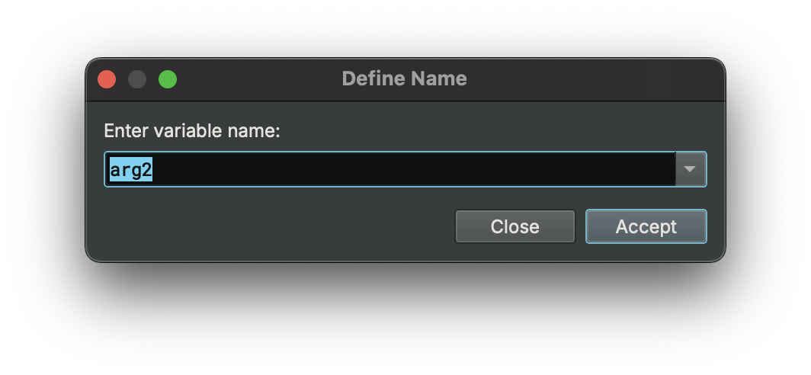
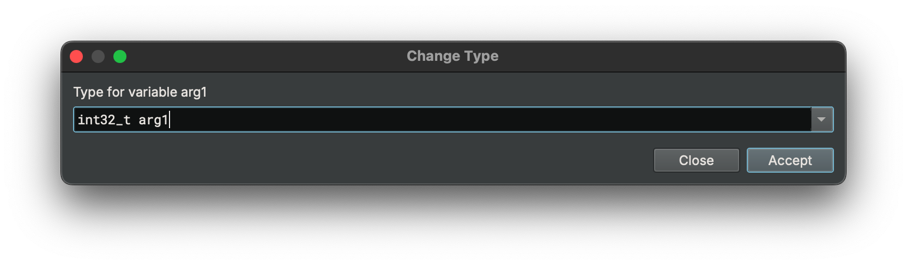
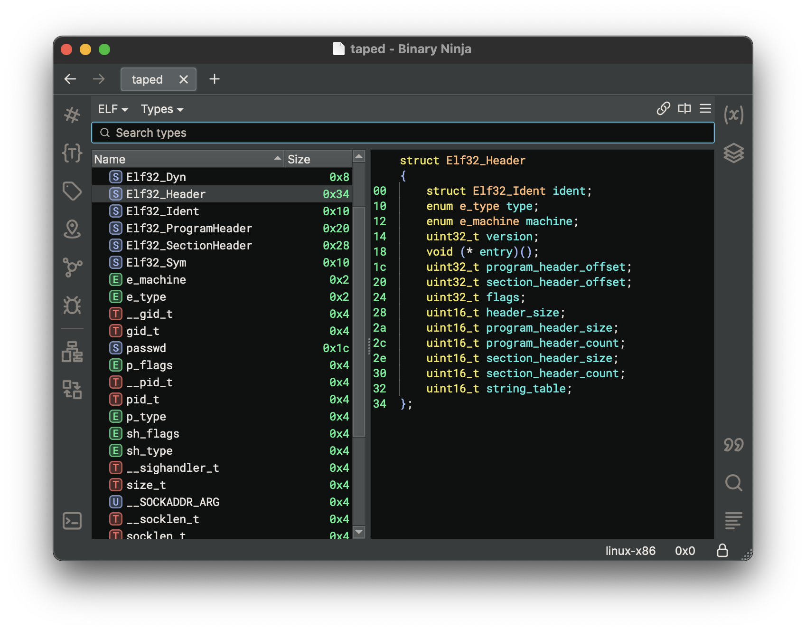
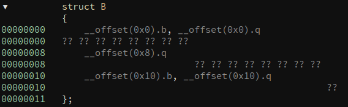
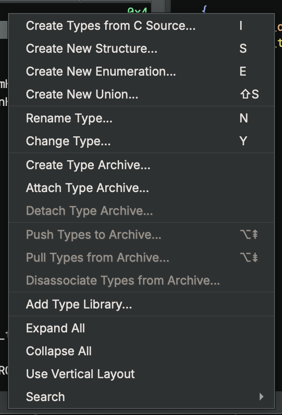
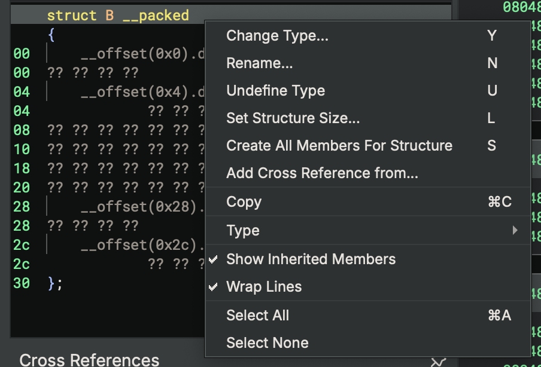

# Basic Types

The biggest culprit of bad decompilation is often missing type information. Therefore, some of the most important actions you can take while reverse engineering is renaming symbols/variables, applying types, and creating new types to apply.

## Renaming Symbols and Variables



Some binaries helpfully have symbol information in them which makes reverse engineering easier. Of course, even if the binary doesn't come with symbol information, you can always add your own. From the UI, just select the function, variable, member, or register you want to change and press `n`. This works on variables as well.

## Applying Structures and Types

Simply select an appropriate token (variable or memory address), and press `y` to bring up the change type dialog. Types can be applied on both disassembly and all levels of IL. Any variables that are shared between the ILs will be updated as types are applied.



## Types View

To see all types in a Binary View, use the types view. It can be accessed from the menu `View > Types`. Alternatively, you can access it with the `t` hotkey from most other views, or using `[CMD/CTRL] p` to access the command-palette and typing "types". This is the most common interface for creating structures, unions and types using C-style syntax.

The types view is also available in the sidebar with the `{…}` icon.

For many built-in file formats you'll notice that common headers are already enumerated in the types view. These headers are applied when viewing the binary in [linear view](./index.md#linear-view) and will show the parsed binary data into that structure or type making them particularly useful for binary parsing even of non-executable file formats.



### Structure Access Annotations

Types view now annotates code references to structure offsets. It uses the same convention as in the graph/linear view. For example, the `__offset(0x8).q` token means the code references the offset 0x8 of this structure, and the size of the access is a qword. This will make it easier to see which offsets of a structure are being used, and aid in the process of creating structure members.



### Shortcuts

From within the Types view, you can use the following hotkeys to create new types, structures, or unions. Alternatively, you can use the right-click menu to access these options and more.





* `s` - Create new structure
* `i` - Create new type
* `[SHIFT] s` - Creating a new union
* `1`, `2`, `4`, `8`: The number hotkeys will create a create an integer of the specified size. This additionally works on selections.
* `d`: If you want to cycle through the different integer sizes, repeatedly pressing `d` has the same effect as pressing the numbers in order.
* `-`: To quickly toggle integers between signed and unsigned integers, you can use the `-` hotkey.


The shortcuts for editing existing elements are:

* `y` - Edit type / field
* `n` - Rename type / field
* `l` - Set structure size
* `u` - undefine field

## Attributes

Structs support the attribute `__packed` to indicate that there is no padding. Additionally, function prototypes support the following keywords to indicate their calling convention or other features:

``` text
__cdecl
__stdcall
__fastcall
__convention
__noreturn
```

To use the `__convention` keyword, pass in the convention name as a parameter argument:

```
__convention("customconvention")
```


## Examples

``` C
enum _flags
{
    F_X = 0x1,
    F_W = 0x2,
    F_R = 0x4
};
```

``` C
struct Header __packed
{
    char *name;
    uint32_t version;
    void (* callback)();
    uint16_t size;
    enum _flags flags;
};
```
