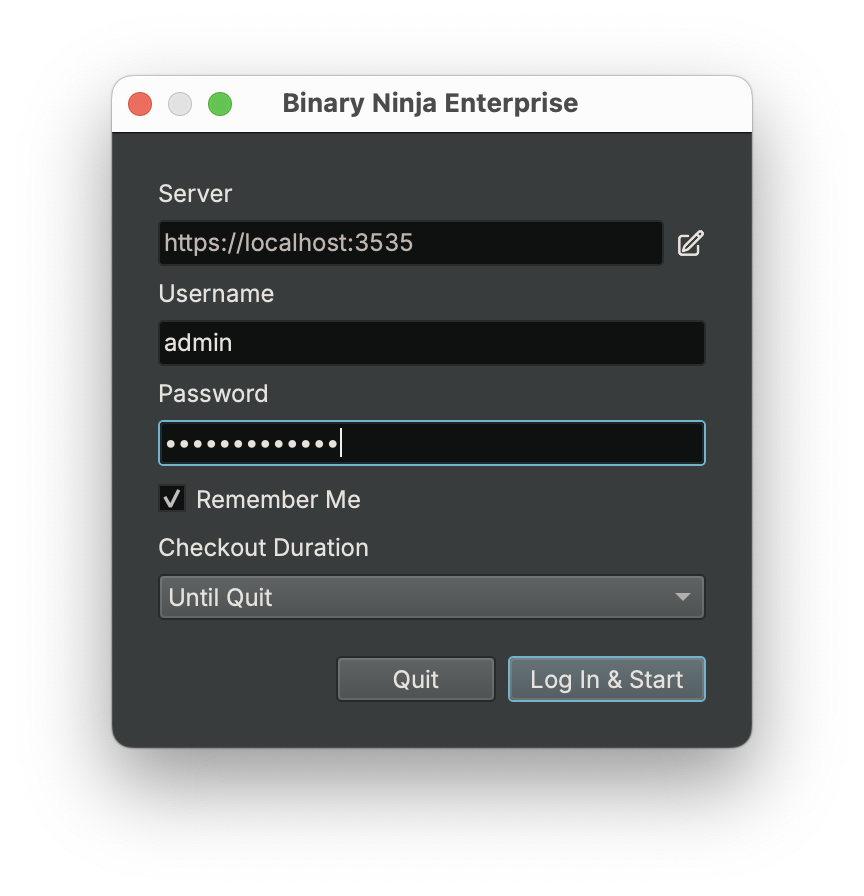
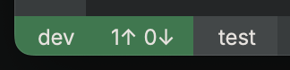
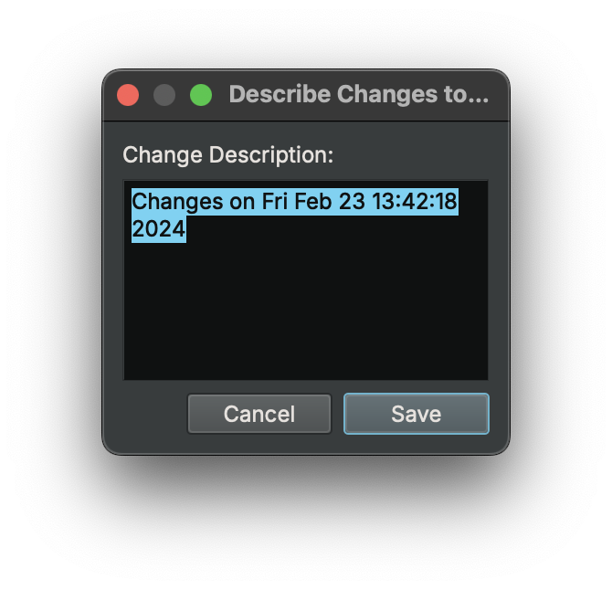
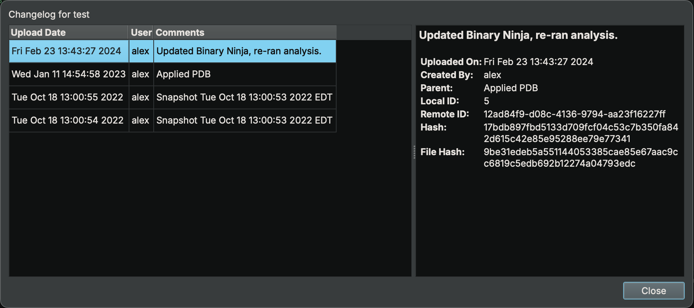
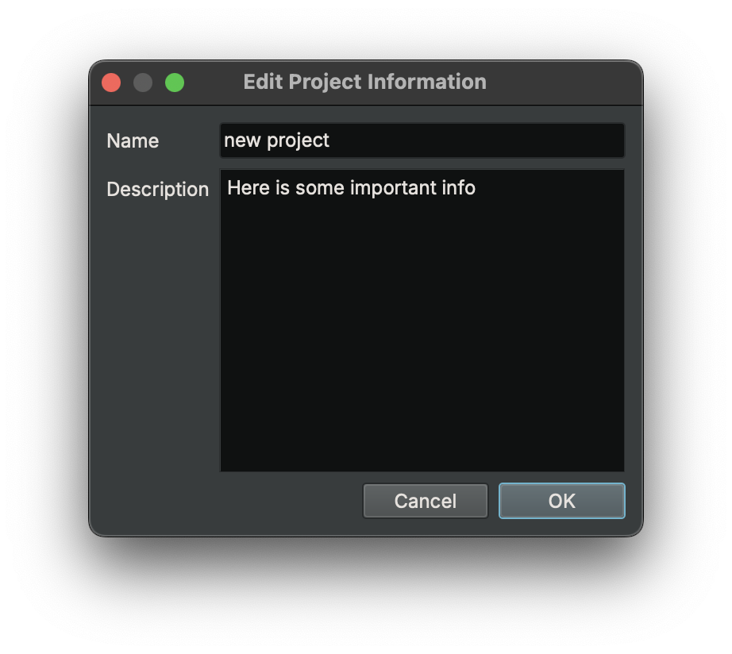
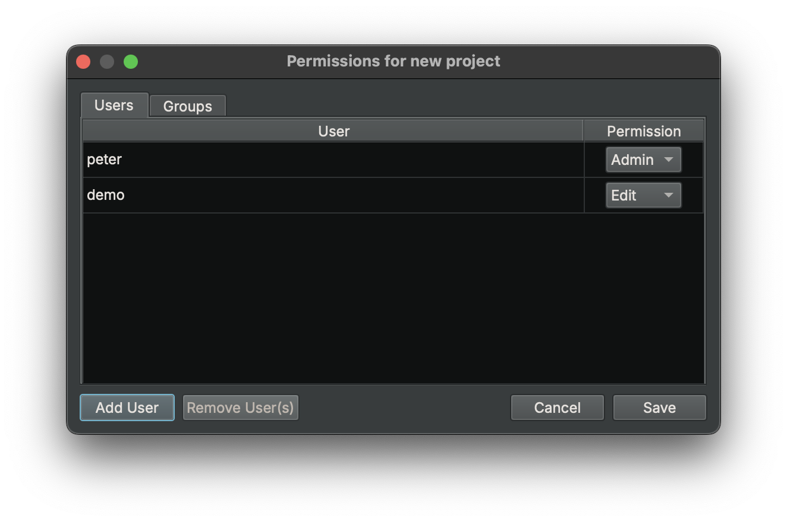
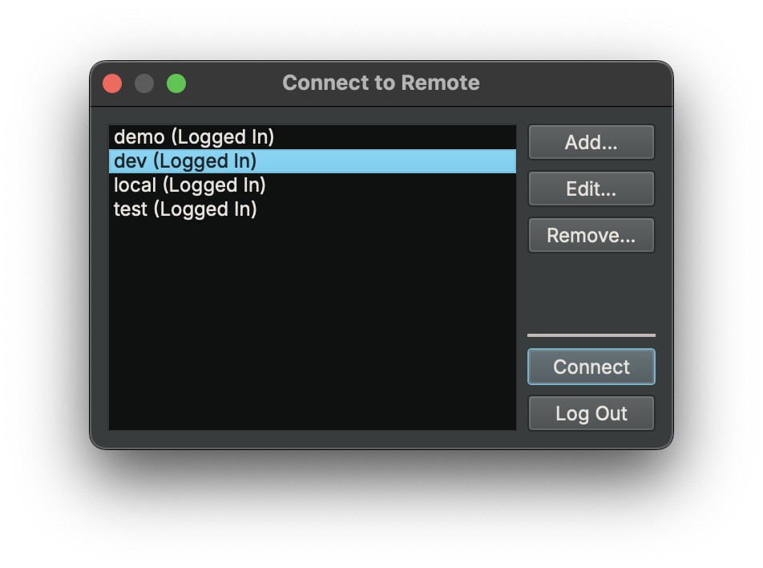
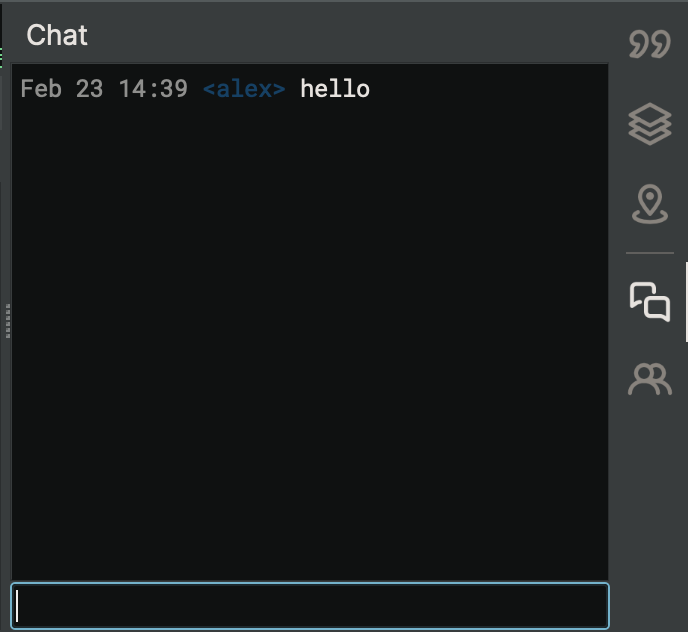
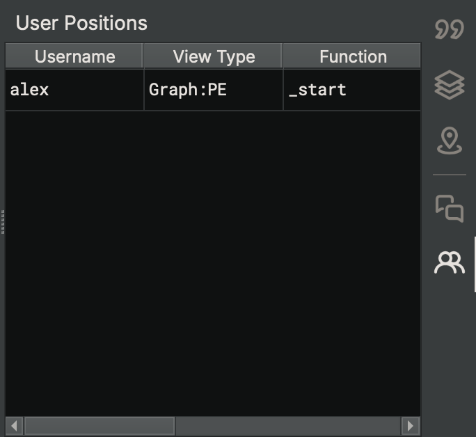

# User Interface

Enterprise collaboration functionality is intended to be seamlessly integrated with Binary Ninja. But, there are still a few differences.

## Login Dialog

When starting the Enterprise client, you will be greeted by a login dialog:

This dialog will have up to 4 fields:

* **Authentication**: If the Enterprise server you are connecting to has a Single Sign-On (SSO) provider configured,this drop-down menu will appear to allow users to authenticate with an SSO provider instead of with an Enterprise server account.
* **Username**: This text box contains your username if you are logging in with an Enterprise server account (hidden if using SSO)
* **Password**: This text box contains your password if you are logging in with an Enterprise server account (hidden if using SSO)
* **Remember Me**: This checkbox will remember the settings you choose and try to log you in the same way (and with the same settings) in the future.
* **Checkout Duration**: This drop-down provides a selection of license durations. The default is "Until I Quit", which will refresh your license every 15 minutes until you quit the Enterprise client.

## Status Bar

The first additional UI feature can be found in the bottom-left corner of the status bar:

This indicator consists of three separate sections: The active server button, the sync button, and the project button.

### Active Server Button
This button shows your connection status with the Enterprise server and acts as a shortcut to the Remote Dialog tab.

### Sync Button
This button shows how many snapshots can be pushed to or pulled from the Enterprise server. It is only shown with a shared database open. Clicking it will push and pull snapshots as needed to synchronize your local state with the Enterprise server's state. This is the best way to quickly share your changes with other collaborators and ensure you have their changes, too.

The sync button has four indicators, some of which may be hidden:

* `!!` - This indicates that there has been a problem with either getting status from the server or syncing with the server. Check the log for more details.
* `# ↑` - This indicates the number of local snapshots that have not yet been pushed to the Enterprise server.
  * If you see a `*` next to the number, that indicates that you have unsaved local changes that are not yet part of a snapshot.
  * If this indicator is missing, it means your user does not have permission to push snapshots to the Enterprise server for this file.
* `# ↓` - This indicates the number of remote snapshots that have not yet been pulled from the Enterprise server.
* `↻` - This indicates that the client is in the process of checking with the Enterprise server to see if there are any new snapshots available.

### Project Button
This button shows the currently active project and will show the Project Browser tab when clicked. See the main Binary Ninja documentation for more information regarding projects.

### Describe Changes Dialog

This dialog will appear during the sync process if you are pushing any changes to the Enterprise server. This will apply a name to the set of changes you are pushing and add an entry in the file's changelog.

## File Changelog

This dialog can be accessed via `File -> Collaboration -> File Changelog...`. It shows a list of changes that have been made to the current file, along with what user made those changes, when, and a description of those changes. Items in this list are *sets* of changes (typically all of the changes before a user clicked the sync button), rather than every snapshot in the database.

## Remote Dialog

This is the main window for the Enterprise client is the Remote Dialog. It can be opened by either:

* Clicking `View -> Collaboration -> Remote Dialog` in the menu bar
* Clicking on the active server button in the status bar (see above)
* Opening the command palette (`[CTRL/CMD-P]`) and choosing `Collaboration - Remote Dialog` in the list

The main components of the Remote Dialog window deal with management and display of remote projects. On top of these is an area for managing the server and your connection to it.

### Project List
The Project List shows what projects are available to you on the Enterprise server. Right-click will give a context menu with the following options:

* **Manage Permissions** - Opens a dialog where you can manage permissions for the project
* **Edit Info** - Opens a dialog where you can edit project metadata
* **Delete** - Deletes the project (this has a confirmation dialog and is *non-recoverable*)
* **Add Project** - Opens a dialog where you can add project metadata for a new project

#### Manage Permissions Dialog

Permissions can be set on *users* or *groups* of users. Available permissions are:

* **View** - Lets the user or group view the files in the project, but not push any changes
* **Edit** - Lets the user or group push analysis changes, upload files, and change product details, in addition to view permissions
* **Admin** - Lets the user or group modify the project permissions, in addition to edit permissions

### Server Area
Across the of the Remote Dialog are five buttons:

* **Refresh** - Refreshes the projects and files shown from the currently active server.
* **Connect**/**Disconnect** - Connects to (or disconnect from) an Enterprise server. If connecting, it will show the "Connect to Remote" window (see below).
* **Manage Users...** - Opens a dialog that allows adding, editing, and removing users from the current server. (Only available to server administrators.)
* **Manage Groups...** - Opens a dialog that allows adding, editing, and removing groups from the current server. (Only available to server administrators.)
* **Actions** - Opens a context menu with the following options:
  * **Create Project...** - Opens a dialog box for creating a new project
  * **Import Local Project...** - Opens a file picker to select a local project to upload in its entirety
  * **Edit Properties...** - Opens a dialog box for editing the current project's name and description
  * **Manage Permissions...** - Opens a dialog for editing the current project's permissions
  * **Delete...** - Deletes the currently selected project (this has a confirmation dialog and is *non-recoverable*)

Above these buttons is your current server connection status.

#### Connect to Remote Window

The "Connect to Remote" window is shown when the Connect button is clicked. Here, you can manage Enterprise servers with the buttons on the right of the window.

When connecting to a new Enterprise server, a Login dialog will appear. In addition to the obvious username and password fields, the `Remember me` field will store a token in your platform's secret store or keychain. `Automatically connect` will attempt to reconnect to this Enterprise server in the future.

## Chat Window

Every file in a project has an associated chat log that can be accessed via `View -> Chat` in the menu bar or via the Chat sidebar icon. Users working on the same file can send messages in the chat window to communicate with other collaborators in real-time.

## User Positions

Every file in a project has an associated list of user positions that can be accessed via `View -> User Positions` or via the User Positions sidebar icon. This is a table that shows, in real-time:

* **Username** - The username of users that have this file open from the server
* **View Type** - The type of view each user is currently looking at
* **Function** - The function each user is looking at, if they are looking at a function
* **Offset** - The offset in the file each user is looking at
* **IL Type** - What type of IL each user is looking at

Double-clicking on any entry in this table will navigate you to that location within the file.

