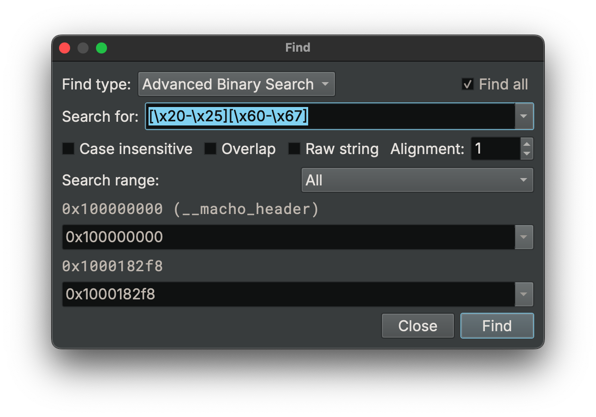
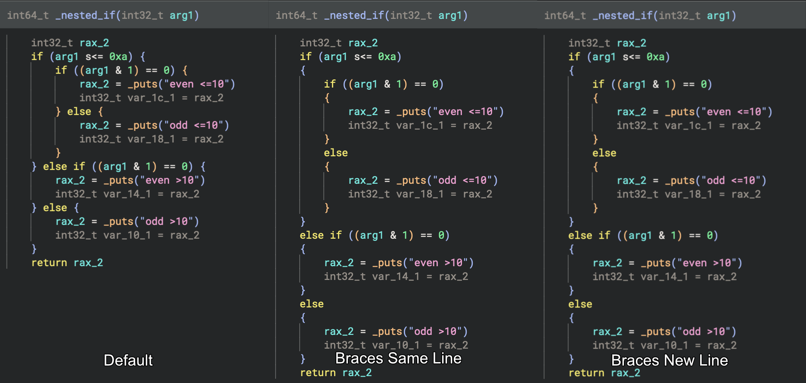
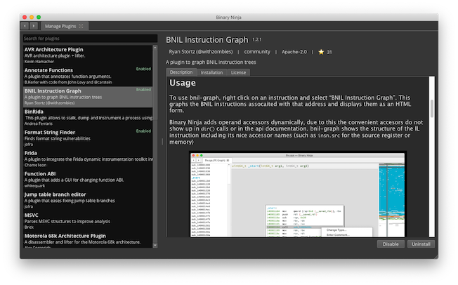

# User Guide

Welcome to the Binary Ninja User Guide. You'll notice two menus here. On the right is the table of contents for this main page of the user manual. On the left are links to larger topics that have their own pages, including:

- [Plugins](plugins.md)
- [Settings](settings.md)
- [Projects](projects.md)
- [Troubleshooting](troubleshooting.md)
- [Objective-C](objectivec.md)
- [Debugger](debugger/index.md)
- [Migration Guide](migration/index.md)
- [Types](types/index.md)
[comment]: <> (When changing this list, make sure to update mkdocs.yml as well)

## Directories

Binary Ninja stores information in two primary locations. The first is the binary path (wherever Binary Ninja is installed) and the second is the user folder for user-installed content.

### Binary Path

Binaries are installed in the following locations by default:

- macOS: `/Applications/Binary Ninja.app`
- Linux: Wherever you extract it! (No standard location)
- Windows (global install): `C:\Program Files\Vector35\BinaryNinja`
- Windows (user install): `%LOCALAPPDATA%\Vector35\BinaryNinja`

???+ Tip "Tip"
    If you want a silent install on Windows, because we use the [NSIS](https://nsis.sourceforge.io/Docs/) installer, simply use: `BinaryNinjaInstaller.exe /S`

???+ Danger "Warning"
    Do not put any user content in the install-path of Binary Ninja. The auto-update process of Binary Ninja WILL remove any files included in these locations.

### User Folder

While the default user folders are listed below, you can override these paths on all platforms using the `BN_USER_DIRECTORY` environment variable.

- macOS: `~/Library/Application Support/Binary Ninja`
- Linux: `~/.binaryninja`
- Windows: `%APPDATA%\Binary Ninja`

The contents of the user folder includes:

- `lastrun`: A text file containing the directory of the last Binary Ninja binary path -- very useful for plugins to resolve the install locations in non-default settings or on Linux
- `license.dat`: License file
- `plugins/`: Folder containing all manually installed user plugins
- `repositories/`: Folder containing files and plugins managed by the [Plugin Manager API](https://api.binary.ninja/binaryninja.pluginmanager-module.html)
- `settings.json`: User settings file (see [settings](settings.md))

The following files and folders may be created in the user folder but are not created by default without some additional action:

- `keybindings.json`: Custom key bindings (see [key bindings](#custom-hotkeys))
- `startup.py`: Default python commands run once the UI is loaded in the context of the scripting console
- `signatures/`: Any user-created signatures can be stored in platform-specific sub-folders in this location
- `pythonVER/`: Any pip dependencies from plugin manager plugins are installed to the appropriate python version subfolder such as `python310`, or `python311`
- `symbols/`: Used to store automatically downloaded PDBs
- `update/`: Used to store update caches for pending updates
- `snippets/`: Used to store snippets created using the official Snippet plugin
- `themes/`: For user themes or user-modified versions of official themes (see [Creating Themes](../dev/themes.md))
- `types/platform`: This folder can contain additional user [platform types](types/platformtypes.md)
- `typelib`: This folder can contain additional user [Type Libraries](../dev/annotation.md#type-libraries)
- `community-themes/`: Can also be used to store themes, particularly so you can clone the [community theme collection](https://github.com/vector35/community-themes) directly into your user folder

### QSettings Locations

Some settings such as window locations, saved checkboxes, recent file lists, disassembly settings, dialog histories are stored in `QSettings`.

If you ever have the need to flush these, you can find the install locations as described in the [QT documentation](https://doc.qt.io/qt-6/qsettings.html#platform-specific-notes).

## License

{ width="400" }

When you first run Binary Ninja, it will prompt you for your license key. You should have received your license key via email after your purchase. If not, please contact [support](https://binary.ninja/support).

Once the license key is installed, you can change it, back it up, or otherwise inspect it simply by looking inside the base of the user folder for `license.dat`.

## Linux Setup

Because Linux install locations can vary widely, we do not assume that Binary Ninja has been installed in any particular folder on Linux. Rather, you can simply run `binaryninja/scripts/linux-setup.sh` after extracting the zip and various file associations, icons, and other settings will be set up. Run it with `-h` to see the customization options.

## Loading Files

{ width="600" }

You can load files in many ways:

1. Drag-and-drop a file onto the Binary Ninja window (hold `[CMD/CTRL-SHIFT]` while dropping to use the `Open with Options` workflow)
2. Use the `File/Open` menu or `Open` button on the start screen (`[CMD/CTRL] o`)
3. Use the `File/Open with Options` menu which allows you to customize the analysis options (`[CMD/CTRL-SHIFT] o`)
4. Open a file from the Triage picker (`File/Open for Triage`) which enables several minimal analysis options and shows a summary view first
5. Click an item in the recent files list (hold `[CMD/CTRL-SHIFT]` while clicking to use the `Open with Options` workflow)
6. Press the number key associated with an item from the recent files list (0-9, where 0 represents file 10 on the recent list, optionally holding `[CMD/CTRL-SHIFT]` to use the `Open with Options` workflow)
7. Run Binary Ninja with an optional command-line parameter
8. Open a file from a URL via the `[CMD/CTRL] l` hotkey
9. Open a file using the `binaryninja:` URL handler. For security reasons, the URL handler requires you to confirm a warning before opening a file via the URL handler. URLs additionally support deep linking using the `expr` query parameter where expression value is a valid parsable expression such as those possible in the [navigation dialog](#navigating), and fully documented in the [`parse_expression`](https://api.binary.ninja/binaryninja.binaryview-module.html?highlight=parse_expression#binaryninja.binaryview.BinaryView.parse_expression) API. Below a few examples are provided:
    * URLs For referencing files on the local file system.
        * `binaryninja:///bin/ls?expr=sub_2830` - open the given file and navigate to the function: `sub_2830`
        * `binaryninja:///bin/ls?expr=.text` - open the given file and navigate to the start address of the `.text` section
        * `binaryninja:///bin/ls?expr=.text+6b` - open the given file and navigate to the hexadecimal offset `6b` from the `.text` section.
    * URLs For referencing remote files either the URL should be prefixed with `binaryninja:` and optionally suffixed with the `expr` query parameter
        * `binaryninja:file://<remote_path>?expr=[.data + 400]` - Download the remote file and navigate to the address at `.data` plus `0x400`

## Saving Files

{ width="400" }

There are five menu items that can be used to save some combination of a raw file or a file's analysis information. Analysis information is saved into files that end in `.bndb` and have the same prefix as the original file. The default behavior for each of the "save" menu choices is described below:

1. "Save" - This menu is the only one bound to a hotkey by default and it is intended to be the "do what I probably want" option.
    - If you have edited the contents of a file and have not yet confirmed the file name to save over, this will ask you to save the file contents and prompt for a file name (check the save dialog title text to confirm this).
    - If you have edited the file contents and _have_ previously specified the file name, this option will save those changes to that file without a prompt.
    - If you have not edited the contents of the file but have added any analysis information (created functions, comments, changed names types, etc), you will be asked for the name of the `.bndb` analysis database if one does not already exist.
    - If an existing analysis database is currently being opened or previously saved, the existing database will be saved without a prompt.
    - Finally, if you have changed both file contents and analysis information, you'll be prompted as to which you wish to save.

2. "Save As" - Will prompt to save the analysis database or just the file contents.
    - If you choose to save the analysis database, it behaves similarly to "Save" above, except for the cases that save without prompt. In those cases, you will _always_ be prompted for a filename.
    - If you choose to save the file contents only, you will be prompted for a filename to which to save the current contents of the binary view, including any modifications.

3. "Save All" - Used to save multiple tabs worth of analysis data only. Does not save file contents.

4. "Save Analysis Database" - Will prompt to select a database to save analysis information if none is currently selected and in use, and will save without a prompt if one has already been selected.

5. "Save Analysis Database With Options" - Allows for saving a `.bndb` without additional undo information, or by cleaning up some internal snapshot information to decrease the file size.

{ width="600" }

## New Files

When you create a new file, you're given the [hex view](index.md#hex-view) of an empty file. From here you can manually type in hexadecimal or ascii values, or paste in data in a variety of ways. To type in hex, make sure the left-side is focused, to type in ascii, just focus the right-side using the mouse or the "tab" key. The only way to enter a tab character into the ascii section is to enter "09" in the hex side.

To paste, right click anywhere in the view, select "Paste From," and choose whichever option matches the data you copied. For example, the string `\x01\x02\x03\x04` can be pasted as an Escape String, while `01020304` is Raw Hex.

From here, you can save the contents of your new binary to disk and reopen it for auto-analysis. Of course, you could also switch out of hex view into linear view and start creating functions directly.

## New Tab

{ width="800" }

The New Tab is the first view shown when starting the application. It contains a set of buttons with common actions for loading and creating files,
and a list of recent files you've opened.

{ width="700" }

A "Compact Mode" exists which presents only file paths. This can be enabled and disabled from the right-click menu. Additionally, within Binary Ninja settings, `CompactBase` mode can be enabled, which only shows the filenames.

### Recent Files

Recent files can be opened on double click. They can also be navigated using the arrow keys, and opened via pressing enter. Opening a recent file using `[SHIFT+ENTER]` will open that file with the Open With Options dialog.

The Recent files list can be cleared via using the Command Palette (`[CTRL] + P`) action `Clear Recently Opened`.

Hotkeys (macOS: `[CMD] + 0` - `[CMD] + 9`, Windows/Linux: `[CTRL] + 0` - `[CTRL + 9]`) can also be used to quickly open a file. The hotkey for a given entry will be shown on the right.

### Commercial/Enterprise Features

{ width="700" }

On Commercial and Enterprise, the New Tab file list also contains a separate tab for Recent Projects. These tabs can be docked, rearranged, split, or unified, and their split is adjustable. Layout changes will be saved.

While Projects themselves are presented in their own tab, files opened in Projects will be located in the usual Recent Files list.

Project names are formatted as `[Project] Project Name Here` while project files are formatted as `[Project Name Here] File Name Here`.

## Status Bar

{ width="800" }

The status bar provides current information about the open file as well as some interactive controls. Summary features are listed below:

* Update Notification - perform updates, download status, and restart notification
* Analysis progress - ongoing analysis progress of current active file
* Cursor offset or selection - interactive control that can be clicked to change its display format, or also to copy the current address or selection in a number of different formats (see the below screenshot)
* File Contents Lock - interactive control to prevent accidental changes to the underlying file

## Analysis

As soon as you open a file, Binary Ninja begins its auto-analysis which is fairly similar to decompiling the entire binary.

Even while Binary Ninja is analyzing a binary, the UI should be responsive. Not only that, but because the analysis prioritizes user-requested analysis, you can start navigating a binary immediately and wherever you are viewing will be prioritized for analysis. The current progress through a binary is shown in the status bar (more details are available via `bv.analysis_info` in the Python console), but note that the total number of items left to analyze will go up as well as the binary is processed and more items are discovered that require analysis.

Analysis proceeds through several phases summarized below:

* Phase 1 - Initial Recursive Descent
* Phase 2 - Call Target Analysis (Part of Linear Sweep)
* Phase 3.x - Control Flow Graph Analysis (Part of Linear Sweep)

Errors or warnings during the load of the binary are also shown in the status bar, each with an appropriate icon. The most common warnings are from incomplete lifting and can be safely ignored. If the warnings include a message like `Data flow for function at 0x41414141 did not terminate`, then please report the binary to the [bug database](https://github.com/Vector35/binaryninja-api/issues).

### Analysis Speed

If you wish to speed up analysis, you have several options. The first is to use the `File/Open for Triage` menu which activates the Triage file picker. By default, [Triage mode](https://binary.ninja/2019/04/01/hackathon-2019-summary.html#triage-mode-rusty) will enable a faster set of default analysis options that doesn't provide as much in-depth analysis but is significantly faster.

Additionally, using the [open with options](#loading-files) feature allows for customization of a number of analysis options on a per-binary basis. See [all settings](settings.md#all-settings) under the `analysis` category for more details.

## Navigating

{ width="600" }
Navigating code in Binary Ninja is usually a case of just double-clicking where you want to go. Addresses, references, functions, jump edges etc., can all be double-clicked to navigate. Additionally, the `g` hotkey can navigate to a specific address in the current view. Syntax for this field is very flexible. Full expressions can be entered including basic arithmetic, dereferencing, and name resolution (function names, data variable names, segment names, etc.). Numerics default to hexadecimal, but that can be controlled as well if you wish to use octal decimal or other base/radix. Full documentation on the syntax of this field can be found [here](https://api.binary.ninja/binaryninja.binaryview-module.html?highlight=parse_expression#binaryninja.binaryview.BinaryView.parse_expression).

Additionally, middle-clicking (scroll-wheel clicking) items that can be double-clicked can be used to navigate to that location in a new Split Pane. Shift + middle-click can also be used to navigate to that location in a new Tab. These bindings can be configured in the Settings ([`ui.middleClickNavigationAction`](settings.md#ui.middleClickNavigationAction), [`ui.middleClickShiftNavigationAction`](settings.md#ui.middleClickShiftNavigationAction)). These "Split and Navigate" actions can also be accessed in the Context (right-click) menu, and can be separately bound to keys in the Keybindings view.

There's also [many](#using-the-keyboard) keyboard-based navigation options.

### Switching Views

Switching views happens multiple ways. In some instances, it is automatic, such as clicking a data reference from graph view. This will navigate to linear view as data is not shown in the graph view. While navigating, you can use the [view hotkeys](#default-hotkeys) to switch to a specific view at the same location as the current selection. Next you can use the [command palette](#command-palette). Additionally, the view menu in the header at the top of each pane can be used to change views without navigating to any given location. Finally, you can also use the `View` application menu.

???+ Tip "Tip"
    Any loaded BinaryView will show up in the upper-left of the main pane. You can switch between (for example), `ELF` and `Raw` to switch between multiple loaded [BinaryViews](../dev/concepts.md#Binary-Views).

## The Sidebar

{ width = "800" }

Once you have a file open, the sidebar lets you quickly access the most common features as sidebar panels and keeps them available while you work. These panels can be moved both upper left (1) and upper right (2) as well as to the bottom left (3), bottom right (4), and along the bottom left (5) and bottom right (5) in the middle.

 - 1-2: This section is where the majority of the primarily vertical panels reside. You can only have on larger item here at a time visible. The default behavior is for a click on another panel icon to hide the previous panel. However, this default can be overridden by using `[SHIFT]` click. If overridden, both the old panel and the new panel will be visible.
 - 3-4: This section is primarily for smaller panels where you may wish to toggle multiple on or off. Clicking a panel here will toggle its visibility without impacting other panels. Note that despite 4 not having any items in it by default, when you drag a panel icon to this region, you'll see the separator that separates 1/2 from 3/4 appear.
 - 5-6: Primarily for horizontal content, the bottom-most panel icon regions behave much like sections 1-2 except they are applied to two regions in the bottom of the window. Clicking a different icon in this region will switch to that panel, or hide that panel entirely if it is already selected.

???+ Info "Tip"
    Note that you can also right-click on sidebar icons and choose from `Docked`, `Floating`, and `Window` options to expose even more possible layout options.

Here's a more detailed look into each of those panels:

### Symbols

The Symbols List is a powerful symbol organization and navigation tool. It allows sorting symbols by a variety of attributes, organizing them into folders (both manually, and automatically via the [API](https://api.binary.ninja/binaryninja.component-module.html#binaryninja.component.Component)), and much more.

???+ Tip "Tip"
    Searching in the symbol list doesn't require focusing the search box. That the filter list here (and in the string panel) is a "fuzzy" search. Each space-separated keyword is used as a substring match and order matters. So: "M C N" for example would match `MyClassName`.

#### Columns

{ width="600" }

The Symbol List shows the following columns by default:

- `Name`: the [short name](https://api.binary.ninja/binaryninja.types-module.html#binaryninja.types.CoreSymbol) of the symbol (can be changed to the [raw name](https://api.binary.ninja/binaryninja.types-module.html#binaryninja.types.CoreSymbol) in the menu icon for the Symbol List)
- `Address`: the virtual address for the symbol
- `Kind`: may be one of "Folder", Function", "Data", and "Bare Symbol"
- `Section`: the section of the binary the symbol appears in

Additionally, the following columns are hidden by default and can be enabled by right-clicking the header:

- `Total Bytes`: tn the case of functions, the sum of size of basic blocks

These columns can be re-arranged, hidden, and used for sorting.

Sort by a given column simply by clicking it. Click it again to toggle between ascending and descending sort order.

Columns can be re-arranged via dragging.

#### New Folder with Selection
"New Folder with Selection" will create a new folder containing the selected items.
When this is done within a folder, the folder will be created within the shared parent.

{ width="600" }

#### Via Dragging

Dragging several items onto another non-folder item will create a folder containing the dragged items and the item they were dropped on.

#### Moving Items into Folders

Dragging several items onto or into a folder will move the items into that folder.

#### "Remove from Folder"

The "Remove from Folder" context menu option will move a given item or items to the root of the tree.

### Types

The Types View can be used as a sidebar panel or as a pane in the main view. The UI is exactly the same except for the default vertical versus horizontal. For more details, see the [Types View](types/basictypes.md#types-view) documentation.

### Tags/Bookmarks

{ width="600" }

The tags panel allows you to both change existing tag categories, add your own categories, and also review any existing tags or bookmarks. Bookmarks are just tags with default hotkeys bound to them for both setting them and navigating them. The default keybinding to set a bookmark is `[CTRL-ALT] 1` through `[CTRL-ALT] 0` representing Bookmarks 1-10. The default hotkeys for navigating them are `[CTRL] 1` through `[CTRL] 0`. See the [keybindings](#custom-hotkeys) section for information on changing the default keybindings.

### Memory Map

{ width="600" }

The "Memory Map" pane and sidebar widget show segments and sections currently present in the binary, allows some modification of automatically added sections, and allows adding, modifying, and deleting user segments and sections.

To access it, use either the icon in the sidebar to open the panel, or use the view drop-down in the main pane, or use the command-palette!

When a segment is selected (highlighted in blue) related sections will be outlined (white border).

Likewise, when a section is selected, related segments will be outlined.

The sorting order of segments and sections can be changed by clicking on any column header.

### External Links

{ width="400" }

External Links allow files in projects to connect to one another, so you could, for example, have an analysis database of an executable as well as multiple libraries it imports and follow references between the two. See the [projects documentation](projects.md#external-links) for more information.

### Mini-Graph

{ width="400" }

The Mini Graph only shows content when the currently selected main pane contains a [Graph view](#graph-view). The preview region is shown as a gray box that can be dragged to navigate the larger graph.

### Cross References

The Cross References view in the lower-left section of the sidebar shows all cross-references to the currently selected address, address range, variable or type. This pane will change depending on whether an entire line is selected (all cross-references to that address/type/variable are shown), or whether a specific token within the line is selected. For instance if you click on the symbol `memmove` in `call memmove` it will display all known cross-references to `memmove`, whereas if you click on the line the `call` instruction is on, you will only get cross-references to the address of the call instruction. Cross-references can be either incoming or outgoing, and they can be either data, code, type, or variable.

{ width="600" }

#### Code References

Code references are references to or from code, but not necessarily _to_ code. Code References can reference, code, data, or structure types. Code References are inter-procedural, and unfortunately due to speed considerations we currently only show disassembly (rather than an IL) when displaying these types of references. In a future version we hope to address this limitation.

#### Data References

Data References are references created _by_ data (i.e. pointers), not necessarily _to_ data. Outgoing Data References are what is pointed to by the currently selected data. Incoming Data References are the set of data pointers which point to this address.

#### Variable References

Variable References are all the set of uses of a given variable. As these references are intraprocedural we're able to show the currently viewed IL in the preview.

#### Type References

Type References are references to types and type members made by other types, perhaps more accurately called Type-to-Type-References.

#### Tree-based Layout
The cross-references pane comes in two different layouts: tree-based (default and shown above) and table-based (this can be toggled through the context menu or the command palette). The tree-based layout provides the most condensed view, allowing users to quickly see (for instance) how many references are present to the current selection overall and by function. It also allows collapsing to quickly hide uninteresting results.

#### Table-based Layout

{ width="600" }

The table-based layout provides field-based sorting and multi-select. Clicking the `Filter` text expands the filter pane, showing options for filtering the current results.

#### Cross-Reference Filtering

{ width="500" }

The first of the two drop down boxes allows the selection of incoming, outgoing, or both incoming and outgoing (default). The second allows selection of code, data, type, or variable or any combination thereof. The text box allows regular expression matching of results. When a filter is selected the `Filter` display changes from `Filter (<total-count>)` to `Filter (<total-filtered>/<total-count>)`

#### Cross-Reference Pinning

{ width="600" }

By default, Binary Ninja's cross-reference pane is dynamic, allowing quick navigation to relevant references. Sometimes you might rather have the current references stick around, so they can be used as a sort of work-list. This workflow is supported in four different ways. First is the `Pin` checkbox (which is only visible if the `Filter` drop-down is open). This prevents the list of cross-references from being updated even after the current selection is changed.

Alternatively clicking the `Pin Cross References to New Pane` button at the top right of the cross references pane in the sidebar, selecting `Pin Cross References` in the context menu or command palette, or using the `SHIFT+X` shortcut pops up a `Pinned Cross References` pane. This pane has a static address range which can only be updated through the `Pin Cross References` action. The third way would be to select (or multi-select in table view) a set of cross-references then right-click `Tag Selected Rows`. The tag pane can then be used to navigate those references. Tags allow for persistent lists to be saved to an analysis database whereas the other options only last for the current session.

#### Cross-Reference Hotkeys

* `x` - Focus the cross-references pane
* `[SHIFT] x` Create a new pinned cross-references pane
* `[OPTION/ALT] x` - Navigate to the next cross-reference
* `[OPTION/ALT-SHIFT] x` - Navigate to the previous cross-reference

The following are only available when the cross-references pane is in focus:

* `[CMD/CTRL] f` - Open the filter dialog
* `[ESC]` - Clear the search dialog
* `[CMD/CTRL] a` - Select all cross-references
* `[ARROW UP/DOWN]` - Select (but don't navigate) next/previous cross-reference
* `[ENTER]` - Navigate to the selected reference

### Console

{ width="800" }

The Console panel by default only contains a single Python scripting console, however it is possible to create additional consoles using the `Create Python Console` command palette item.

For many more details about using the python console, see below in the [Python console documentation](#script-python-console).

### Variables

{ width="400" }

The Variables sidebar panel will show local variables from the currently selected function. Possible variable values include:

 - Register Variables (R)
 - Stack Variables (S)
 - Flag Variables (F)
 - Data Variables (D)

 Note that this sidebar is sensitive to function. Possible value set values will be shown for variables based on the currently selected offset in the function.

### Stack

{ width="400" }

The Stack sidebar panel shows the currently selected function's stack layout. You can create variables using the [usual](types/type.md#direct-ui-manipulation) hotkeys as well as using the right-click menu (which also shows the hotkeys).

### Strings

{ width="700" }

The Strings sidebar panel shows all identified strings in the binary.  See [working with strings](../dev/concepts.md#working-with-strings) for more information on how these strings are identified.

### Find

{ width="700" }

The normal find dialog also exists as a sidebar panel that allows persistent, tabbed results. The `Filter` drop-down allows further filtering of identified results and supports regular expressions (though the main find search types do not).

The search types are available from a drop-down next to the text input field and include:

 - Advanced Binary Search: A new search type using the [bv.search](https://dev-api.binary.ninja/binaryninja.binaryview-module.html#binaryninja.binaryview.BinaryView.search) syntax (supporting regular expressions and wildcard hex strings)
 - Escaped: Escaped strings such as `OneString\x09\Tabsx09Another`
 - Hex: All values much be valid hex characters such as `ebfffc390` and the bytes will only be searched for in this particular order
 - Raw: A simple string search that matches the exact string as specified
 - Text: Searches the decompilation or whatever view is currently selected for disassembly, BNIL, or Pseudo C
 - Constant: Useful for searching for a constant where the byte ordering is handled for you, such as `0x01020304`

### Logs

{ width="700" }

The log window lets you search and filter through logs. You can search by text or filter by loggers to identify messages of interest. By default, only the logs for a specific BinaryView that's open as well as any Global logs will show up but this setting can either be changed through the right-click menu or the drop down menu in the upper-right of the log window.

## Tiling Panes

{ width="1000" }

Binary Ninja displays binaries in panes, whether shown as disassembly, hex, IL, or decompiler output. Tiling these panes allows for a wide variety of information to be displayed at the same time.

Each pane has display options at the top and can be split and synchronized with other panes (or groups of panes). The ☰ ("hamburger") menu in the top right of each pane allows for additional customization, including locking the pane to a single function.

## Feature Map

{ width="100" }

The Feature Map is also displayed on the right of the main pane area. It provides a visual summary of the entire binary with different colors representing data variables, code, strings, functions/code, imports, externs, and libraries. It can be moved or hidden via the right-click menu. Note that these colors are theme-aware and will change if your theme does, but on the default Ninja Edit theme:

- &nbsp;&nbsp; Blue represents code in functions
- &nbsp;&nbsp; Orange represents imports and externs
- &nbsp;&nbsp; Green represents ASCII strings
- &nbsp;&nbsp; Red represents Unicode strings
- &nbsp;&nbsp; Grey represents data variables
- &nbsp;&nbsp; Black is the base color when nothing else exists there

## Using the Keyboard

### Command Palette

{ width="800" }

One great feature for quickly navigating through a variety of options and actions is the `command palette`. Inspired by similar features in [Sublime](https://sublime-text-unofficial-documentation.readthedocs.io/en/sublime-text-2/extensibility/command_palette.html) and [VS Code](https://code.visualstudio.com/docs/getstarted/userinterface#_command-palette), the command-palette is a front end into an application-wide, context-sensitive action system that all actions, plugins, and hotkeys in the system are routed through.

To trigger it, simply use the `[CMD/CTRL] p` hotkey. Note that the command-palette is context-sensitive and therefore some actions (for example, `Display as - Binary`) may only be available depending on your current view or selection. This is also available to plugins. For example, a plugin may use [`PluginCommand.register`](https://api.binary.ninja/binaryninja.plugin-module.html#binaryninja.plugin.PluginCommand.register) with the optional `is_valid` callback to determine when the action should be available.

### Custom Hotkeys

{ width="800" }

Any action in the [action system](#command-palette) can have a custom hotkey mapped to it. To access the keybindings menu, use the `[CMD/CTRL-SHIFT] b` hotkey, via the `Edit / Keybindings...` (`Binary Ninja / Preferences / Keybindings...` on macOS) menu, or the `Keybindings` [command palette](#command-palette) entry. Any overlapping keybindings will be highlighted. Click the `Keybinding` column header to sort by keybindings in order to see what bindings are overlapping.

The settings themselves are saved directly in the `keybindings.json` file in your [user folder](#user-folder).

To search in the keybindings list, just click to make sure it's focused and start typing!

???+ Tip "Tip"
    On macOS, within the `keybindings.json`, `Ctrl` refers to the Command key, while `Meta` refers to the Option key. This is a remapping performed by Qt to make cross-platform keybindings easier to define.

### Default Hotkeys

 - `h` : Switch to hex view
 - `p` : Create a function
 - `[ESC]` : Navigate backward
 - `[CMD] [` (macOS) : Navigate backward
 - `[CMD] ]` (macOS) : Navigate forward
 - `[CTRL] [` (Windows/Linux) : Navigate backward
 - `[CTRL] ]` (Windows/Linux) : Navigate forward
 - `[SPACE]` : Toggle between linear view and graph view
 - `[F5]`, `[TAB]` : Toggle between Pseudo C and disassembly view
 - `g` : Go To Address dialog
 - `n` : Name a symbol
 - `u` : Undefine an existing symbol (only for removing new user-defined names)
 - `e` : Edit an instruction (by modifying the original binary -- currently only enabled for x86, and x64)
 - `x` : Focus the cross-reference pane
 - `;` : Add a comment
 - `i` : Cycle between disassembly, LLIL, MLIL and HLIL
 - `t` : Switch to type view
 - `y` : Change type of currently selected element
 - `a` : Change the data type to an ASCII string
 - `[SHIFT] a` : Change the data type to a `wchar_t` string
 - `[OPT-SHIFT] a` (macOS) : Change the data type to a `wchar32_t` string
 - `[CTRL-SHIFT] a`  (Windows/Linux) : Change the data type to a `wchar32_t` string
 - `1`, `2`, `4`, `8` : Change type directly to a data variable of the indicated widths
 - `f` : Switch data variable between floating point types of varying precision
 - `d` : Switch between data variables of various widths
 - `r` : Change the data type to single ASCII character
 - `o` : Create a pointer data type
 - `+` : Merge variables used in assignment
 - `=` : Merge/split variable dialog
 - `[CMD-SHIFT] +` (macOS) : Graph view zoom in
 - `[CMD-SHIFT] -` (macOS) : Graph view zoom out
 - `[CTRL-SHIFT] +` (Windows/Linux) : Graph view zoom in
 - `[CTRL-SHIFT] -` (Windows/Linux) : Graph view zoom out
 - Other hotkeys specifically for working with types are listed in the [type guide](types/type.md#direct-ui-manipulation)

## Graph View

{ width="800" }

Binary Ninja offers a graph view that groups the basic blocks of disassembly into visually distinct blocks with edges showing control flow between them.

Features of the graph view include:

- Ability to double-click edges to quickly jump between locations
- Zoom (CTRL-mouse wheel)
- Zoom to Fit - Zooms out until the whole graph is visible (`w`)
- Zoom to Cursor - Zooms to 100% at the position of the cursor (`z`)
- Vertical Scrolling (Side scroll bar as well as mouse wheel)
- Horizontal Scrolling (Bottom scroll bar as well as SHIFT-mouse wheel)
- Individual highlighting of arguments, addresses, immediate values, types, etc.
- Full type signature of current function shown in an interactive header:
    - Selecting elements in the header highlights them in the graph view
    - Change type (`y`) and Rename (`n`) shortcuts work on elements in the header
    - Reanalyze function button on left edge of the header
- Edge colors indicate whether the path is the true (green) or false (red) case of a conditional jump (a color-blind option in the preferences is useful for those with red-green color blindness) and blue for unconditional branches
- Context menu that can trigger some function-wide actions as well as some specific to the highlighted instruction (such as inverting branch logic or replacing a specific function with a NOP)

## View Options

{ width="400" }

Each of the views (Hex, Graph, Linear) have a variety of options configurable from the ☰ menu on the top right of the view pane.

Current options include:

- Hex (and Linear View where hex values are shown)
    - Background highlight
        - None
        - Column
        - Byte value
    - Color highlight
        - None
        - ASCII and printable
        - Modification
    - Contrast
        - Normal
        - Medium
        - Highlight
- Graph & Linear Views
    - Expand Long Opcode
    - Indent HLIL Function Body (HLIL only)
    - Show Address
    - Show Call Parameter Names (MLIL/HLIL only)
    - Show Function Address
    - Show Opcode Bytes
    - Show Register Set Highlighting
    - Show Type Casts (`[SHIFT+CMD/CTRL] + C`)
    - Show Variable Types
        - At Assignment (MLIL graph only)
        - At Top of Function
    - Single Function View
    - Advanced
        - Show All Expression Types (MLIL/HLIL only)
        - Show IL Flag Usage (Lifted IL only)
        - Show IL Opcodes
        - Show Stack Pointer Value (LLIL only)

## Hex View

{ width="800" }

The hexadecimal view is useful for viewing raw binary files that may or may not even be executable binaries and allows direct editing of the binary contents in place, regardless of the type of the binary. Any changes made in hex view will be reflected in all other [open views](#tiling-panes) of the same binary. The lock button on the right edge of the bottom status bar must be toggled off (🔓) to perform any direct editing in hex view -- this is to prevent unintended modification of the binary by accidental pasting or typing.

The hex view is particularly good for transforming data in various ways via the `Copy as`, `Transform`, and `Paste from` menus. Note that like any other edits, `Transform` menu options will transform the data in-place, but unlike other means of editing the binary, the transformation dialog will work even when the lock button is toggled on (🔒).

If you're using the hex view for a Binary View like ELF, Mach-O or PE, you probably want to make sure you're also in the `Raw` view if you want to see the file as it exists on disk in hex view.

### Live Preview
    Any changes made in the Hex view will take effect immediately in any other views open into the same file (new views can be created via the `Split to new tab`, or `Split to new window` options under `View`, or via [splitting panes](#tiling-panes)). This can, however, cause large amounts of re-analysis so be warned before making large edits or transformations in a large binary file.

## Linear View

{ width="1000" }

Linear view is a hybrid view between a graph-based disassembly window and the raw hex view. It lists the entire binary's memory in a linear fashion and is especially useful when trying to find sections of a binary that were not properly identified as code or even just examining data.

Linear view is commonly used for identifying and adding type information for unknown data. To this end, as you scroll, you'll see data and code interspersed. Much like the graph view, you can turn on and off addresses via the command palette `Show Address` or the ☰ menu on the top right of the linear view pane. Many other [options](#view-options) are also available.

## Edit Function Properties Dialog

{ width="600" }

The “Edit Function Properties” dialog provides the ability to easily configure some of a function’s more advanced properties. It can be opened via the context menu when a function is focused in the graph or linear views, or via the command palette. An overview of the UI is as follows:

0. **Function prototype.** The function’s prototype. If the prototype is too long to fit inside the window, a scroll bar will appear.
1. **Function info.** A list of conditionally-shown tags offering information about the function. Possible tags are as follows:
    - **Function architecture/platform**: The function's architecture/platform (e.g. `windows-x86_64`)
    - **Analysis skipped (too large)**: Analysis was skipped for this function because it was too large ([`analysis.limits.maxFunctionSize`](settings.md#analysis.limits.maxFunctionSize))
    - **Analysis timed out**: Analysis for this function was skipped because it exceeded the maximum allowed time ([`analysis.limits.maxFunctionAnalysisTime`](settings.md#analysis.limits.maxFunctionAnalysisTime))
    - **Analysis was skipped (too many updates)**: Analysis was skipped for this function because it caused too many updates ([`analysis.limits.maxFunctionUpdateCount`](settings.md#analysis.limits.maxFunctionUpdateCount))
    - **Analysis suppressed**: Analysis was suppressed for this function because analysis of auto-discovered functions was disabled ([`analysis.suppressNewAutoFunctionAnalysis`](settings.md#analysis.suppressNewAutoFunctionAnalysis))
    - **Basic analysis only**: This function only received basis analysis ([`analysis.mode`](settings.md#analysis.mode) was 'basic')
    - **Intermediate analysis only**: This function only received intermediate analysis ([`analysis.mode`](settings.md#analysis.mode) was 'intermediate')
    - **Unresolved stack usage**: The function has unresolved stack usage
    - **GP = 0xABCD1234**: The global pointer value is 0xABCD1234
1. **Calling convention.** The calling convention this function uses. All calling conventions for the function’s architecture are available as choices.
1. **Stack adjustment.** How many _extra_ bytes does this function remove from the stack upon return?
1. **Has variable arguments.** Does this function accept a variable number of arguments?
1. **Can return.** Functions that cannot return will halt disassembly on branches where they are called
1. **Pure.** Functions that are pure are assumed to have no side effects and may be inlined if their return value is trivial
1. **Inline during analysis.** Causes the function to be [inlined](https://api.binary.ninja/binaryninja.function-module.html#binaryninja.function.Function.inline_during_analysis) during analysis.
1. **Clobbered registers.** The list of registers that this function clobbers; individual registers can be checked or unchecked.
1. **Return registers.** The list of registers that this function returns data in; individual registers can be checked or unchecked.
1. **Register stack adjustments.** A table containing a row for each register stack (e.g. x87) in the architecture, with the ability to adjust how many registers are removed from each stack when the function returns.

## High Level IL

{ width="400" }

Binary Ninja features a decompiler that produces High Level IL (HLIL) as output. HLIL is not intended to be a representation of the code in C, but some users prefer to have a more C-like scoping style.

You can control the way HLIL appears in the settings.

The different options are shown below:

{ width="500" }

## Pseudo C

{ width="800" }

Binary Ninja offers an option to render the HLIL as a decompilation to "Pseudo C". This decompilation is intended to be more familiar to the user than the HLIL. It is not necessarily intended to be "compliant" C or even recompilable. In some cases, it may be possible to edit it into a form that a C compiler will accept, but the amount of effort required will vary widely, and no guarantee is made that it will be possible in all cases.

## Dead Store Elimination

Binary Ninja tries to be conservative with eliminating unused variables on the stack. When the analysis finds a variable that cannot be eliminated but does not appear to be used, the assignment will appear grayed out in the decompiler output. The first two lines of the function below show this:

{ width="500" }

In this case, these variables are actually unused and can be eliminated. You can tell Binary Ninja to do this by right-clicking on the variable and choosing "Allow" from the "Dead Store Elimination" submenu.

{ width="500" }

Performing this action on both variables in the example results in the following output:

{ width="500" }

## Merging and Splitting Variables

Binary Ninja automatically splits all variables that the analysis determines to be safely splittable. This allows the user to assign different types to different uses of the same register or memory location. Sometimes, however, the code is more clear if two or more of these variables are merged together into a single variable.

### Merge Variable Here

The `Merge Variable Here` action is bound to the hotkey `+` (i.e. `Shift + =` ) by default. It analyzes the HLIL at the current location and if it is a simple variable to variable assignment, it will automatically merge those two variables without feedback.

### Merge Variables

For more complicated situations you can select the variable in question and use the "Merge Variables" dialog. By default, this dialog is bound to the `=` hotkey. The dialog provides you with a searchable list of variables that can be merged or unmerged.

{ width="400" }

There are 3 categories of variables that you can select from.

* Suggested merges - These are collected by searching the HLIL for variable to variable assignments that are still sound
* Other valid merges - These are variables that can be merged but do not violate any soundness checks
* Potentially unsound merges - These are variables that we've determined to not be sound to merge with

Any of these merges can be undone if you determine them to be done in error by either using "Undo" or by bringing up this dialog again and unchecking the variables in question.

### Removing Merges

To unmerge a variable, either select "Split Merged Variable" from the context menu, or reenter the "Merge Variables..."
dialog and deselect the variables that should no longer be merged.

### Split Variables

{ width="200" }

Variables that have multiple definitions can be manually split into multiple variables by clicking on the
variable at a definition site and selecting "Split Variable at Definition" from the context menu.

!!! Warning "Warning"
    Splitting a variable manually can cause IL and decompilation to be incorrect. There are some
    patterns where variables can be safely split semantically but analysis cannot determine that
    it is safe, and this feature is provided to allow variable splitting to be performed in these
    cases.

Manually split variables will initially provide the selected definition as a separate variable, and all other
definitions will be automatically resolved into one or more other variables. If some of the definitions should
have been included as part of the same variable, use "Merge Variables..." from the context menu after splitting
to select which of the other definitions should be merged.

## Script (Python) Console

{ width="800" }

The integrated script console is useful for small scripts that aren't worth writing as full plugins.

To trigger the console, either use `<BACKTICK>`, or use the `View`/`Python Console` menu.

???+ Tip "Tip"
    Note that `<BACKTICK>` will work in most contexts to open the console and focus its command line, unless the UI focus is in an editor widget.

{ width="800" }

When both the Script Console and the Log view are open, the title of both acts as a tab that can be dragged to either a tabbed view showing only one at a time (the default) or a split view showing both. Currently, the console and log views are part of a "Global Area", meaning they are always visible in the same position when switching between open binary tabs in the same window. This means they can only dock with each other, and not with the sidebar or the main pane view area. It is possible to open additional scripting consoles via the `Create Python Console` action in the [command palette](#command-palette), and these new consoles will appear as additional tabs in the topmost, leftmost tab in the global area. Note that `<BACKTICK>` will always focus the original main scripting console, and while any of the other created consoles can be closed (using the button that will appear when hovering over the right edge of its tab), the original one cannot be closed.

Multi-line input is possible just by doing what you'd normally do in python. If you leave a trailing `:` at the end of a line, the box will automatically turn into a multi-line edit box, complete with a command-history. To submit that multi-line input, use `<CTRL>-<ENTER>`. You can also force multi-line input with `<SHIFT>-<ENTER>`.

The scripting console is not a full IDE, but it has several convenience features that make it more pleasant to use:

- `<TAB>` offers completion of variables, methods, anything in-scope
- `<CTRL>-R` allows for reverse-searching your console history
- `<UP>` and `<DOWN>` can be used to view the command-history

### Magic Console Variables

The interactive python prompt also has several built-in "magic" functions and variables. Some are read-only, and some are writable to provide convenient interactivity between the UI and console:

- `here` / `current_address`: address of the current selection. It's settable too and will navigate the UI if changed
- `current_selection`: a tuple of the start and end addresses of the current selection. It's settable and will change the current selection
- `current_raw_offset`: the file offset that corresponds the current address. It's settable and will navigate to the corresponding file offset
- `bv` / `current_view` / : the current [`BinaryView`](https://api.binary.ninja/binaryninja.binaryview-module.html#binaryninja.binaryview.BinaryView)
- `current_function`: the current [`Function`](https://api.binary.ninja/binaryninja.function-module.html#binaryninja.function.Function)
- `current_basic_block`: the current [`BasicBlock`](https://api.binary.ninja/binaryninja.basicblock-module.html#binaryninja.basicblock.BasicBlock)
- `current_llil`: the current [`LowLevelILFunction`](https://api.binary.ninja/binaryninja.lowlevelil-module.html#binaryninja.lowlevelil.LowLevelILFunction)
- `current_mlil`: the current [`MediumLevelILFunction`](https://api.binary.ninja/binaryninja.mediumlevelil-module.html#binaryninja.mediumlevelil.MediumLevelILFunction)
- `current_hlil`: the current [`HighLevelILFunction`](https://api.binary.ninja/binaryninja.highlevelil-module.html#binaryninja.highlevelil.HighLevelILFunction)
- `write_at_cursor(data)`: function that writes data to the start of the current selection
- `get_selected_data()`: function that returns the data in the current selection
- `current_il_index`: the current index of the IL instruction. It can be LLIL/MLIL/HLIL depending on which one is shown in the UI
- `current_il_instruction`: the current IL instruction. It can be LLIL/MLIL/HLIL depending on which one is shown in the UI
- `current_il_function`: the current IL function. It can be LLIL/MLIL/HLIL depending on which one is shown in the UI
- `current_il_basic_block`: the current IL basic block. It can be LLIL/MLIL/HLIL depending on which one is shown in the UI
- `current_token`: the current selected [`InstructionTextToken`](https://api.binary.ninja/binaryninja.architecture-module.html#binaryninja.architecture.InstructionTextToken). None if no token is selected
- `current_data_var`: the current selected [`DataVariable`](https://api.binary.ninja/binaryninja.binaryview-module.html#binaryninja.binaryview.DataVariable). None if no data variable is selected
- `current_sections`: the list of [`Section`](https://api.binary.ninja/binaryninja.binaryview-module.html#binaryninja.binaryview.Section)s that the current address is in. This the list can be empty
- `current_segment`: the [`Segment`](https://api.binary.ninja/binaryninja.binaryview-module.html#binaryninja.binaryview.Segment) that the current address is in.
- `current_comment`: the comment at the current address. Writing to it sets comment at the current address
- `current_symbol`: the [`Symbol`](https://api.binary.ninja/binaryninja.types-module.html#binaryninja.types.Symbol) at the current address. None if there is no symbol
- `current_symbols`: the list of [`Symbol`](https://api.binary.ninja/binaryninja.types-module.html#binaryninja.types.Symbol)s at the current address
- `current_var`: the current selected [`Variable`](https://api.binary.ninja/binaryninja.variable-module.html?highlight=variable#binaryninja.variable.Variable) in a function. Not to be confused with `current_data_var`
- `current_ui_context`: the current [`UIContext`](https://api.binary.ninja/cpp/class_u_i_context.html)
- `current_ui_view_frame`: the current [`ViewFrame`](https://api.binary.ninja/cpp/class_view_frame.html)
- `current_ui_view`: the current [`View`](https://api.binary.ninja/cpp/class_view.html)
- `current_ui_action_handler`: the current [`UIActionHandler`](https://api.binary.ninja/cpp/class_u_i_action_handler.html)
- `current_ui_view_location`: the current [`ViewLocation`](https://api.binary.ninja/cpp/class_view_location.html)
- `current_ui_action_context`: the current [`UIActionContext`](https://api.binary.ninja/cpp/struct_u_i_action_context.html)

### startup.py

The python interpreter can be customized to run scripts on startup using `startup.py` in your user folder. Simply enter commands into that file, and they will be executed every time Binary Ninja starts. By default, it comes with an import helper:

    # Commands in this file will be run in the interactive python console on startup
    from binaryninja import *

From here, you can add any custom functions or objects you want to be available in the console. If you want to restore the original copy of `startup.py` at any time, simply delete the file and restart Binary Ninja. A fresh copy of the above will be generated.

### "Run Script..."

???+ Danger "Warning"
    When you run commands in the scripting console, the UI will automatically update analysis. This is because quite often when you make a change in the console you expect it to be immediately reflected in the UI. The same is not true when running a script where you must trigger `bv.update_analysis_and_wait()` or `current_function.reanalyze()` to experience the same behavior.

The "Run Script..." option in the File Menu allows loading a python script from your filesystem and executing it
within the console. It can also be run via the Command Palette or bound to a key.

The script will have access to the same variables the Python console does, including the built-in special functions and
variables defined by Binary Ninja, and any variables you have already defined within the console. It may be helpful to
think of it as an equivalent to pasting the contents of the script within the console.

While `__name__` in the console is set to `'__console__'`, within a script it will be set to `'__main__'`. `__file__` is not
defined within the console, but within the script, it will be set to the absolute path of the script.

Any variables or functions defined globally within the script will be available within the console, and to future scripts.

### Python Debugging
See the [plugin development guide](../dev/plugins.md#debugging-using-other-ides).

Note
???+ Tip "Tip"
    The current script console only supports Python at the moment, but it's fully extensible for other programming languages for advanced users who wish to implement their own bindings.

## Using Plugins

Plugins can be installed by one of two methods. First, they can be installed via the Plugin Manager accessed via the `Plugins` / `Manage Plugins` menu or `[CMD/CTRL] m` hotkey.

{ width="1000" }

Second, they can be manually installed by adding the plugin (either a `.py` file or a folder implementing a python module with a `__init__.py` file) to the appropriate path:

- macOS: `~/Library/Application Support/Binary Ninja/plugins/`
- Linux: `~/.binaryninja/plugins/`
- Windows: `%APPDATA%\Binary Ninja\plugins`

For more detailed information on using plugins, see the [plugin guide](plugins.md).

## Loading PDBs

Binary Ninja supports loading PDB files through a built-in PDB loader. It will automatically search for a corresponding PDB file whenever you load a Windows executable or library that was compiled with a PDB. The PDB loader will search a variety of places for PDBs, in the following order, if the files exist and match the GUID in the analyzed file:

1. Look in symbol servers defined in the `_NT_SYMBOL_PATH` environment variable, as defined by [Microsoft's documentation](https://learn.microsoft.com/en-us/windows/win32/debug/using-symsrv).
2. Look for the file at the path specified in the loaded binary. E.g. when `C:\Users\foo\foo.exe` was compiled, it stored `C:\Users\foo\foo.pdb` as metadata inside `foo.exe`, so `C:\Users\foo\foo.pdb` will be loaded if it exists (and matches the guid).
3. Look in the same directory as the opened file/bndb (e.g. If you have opened `C:\foo.exe` or `C:\foo.bndb`, the PDB plugin looks for `C:\foo.pdb`)
4. Look in the local symbol store. This is the directory specified by `pdb.files.localStoreAbsolute` in the settings, if it exists. Otherwise, this is a folder relative to the Binary Ninja user directory, specified by the `pdb.files.localStoreRelative` setting (and possibly the `BN_USER_DIRECTORY` environment variable). This directory has the structure `<symbol store>\foo.pdb\<guid>\foo.pdb`, equivalent to a regular symbol server.
5. Attempt to connect and download the PDB from the list of symbol servers specified in setting `pdb.files.symbolServerList`, in order.

If you know the location of the PDB in advance, or it would not be found by any of the above, you can manually point the loader at the file via Open with Options and specifying the path under External Debug Info File (setting name `analysis.debugInfo.external`). If this is done, the previous steps to look up the PDB will not be taken.

### Configuration

The PDB loader comes with a couple configuration options which enable and disable various features and may improve your analysis results. They can be toggled for all files via settings, or for an individual file via Open with Options.

* **Allow Unnamed Untyped Symbols (default off)**: Some PDBs contain variables with no name and only a `void` type. These are most likely static local variables with no type information. This is off by default because there isn't much actionable information you can do with these, and they often cause confusion and duplicate symbols.
* **Allow Untyped Symbols (default on)**: In stripped PDBs, the Global Module (see: **Load Global Module Symbols**) can contain symbols whose name does not demangle to any type. Usually these are globals used in C code that doesn't mangle types into names. Having this on will allow creating these symbols without type information.
* **Create Missing Named Types (default on)**: In stripped PDBs, while no type information is available, mangled names still contain references to the stripped types in function parameters and global variables. This setting will create empty types for all of those names, so that the type references will resolve properly even if the referenced types are not found.
* **Expand RTTI Structures (default on)**: This creates structures for RTTI symbols found within a PDB, like RTTI Class Type Information, RTTI Complete Object Locator, RTTI Class Hierarchy Descriptor, etc. No analysis information is currently derived from these structures, but they will have their fields annotated in Linear View.
* **Generate Virtual Table Structures (default on)**: This generates structures for virtual tables found on classes in the PDB's types. Due to limitations of Binary Ninja's C++ type handling, these virtual table structures are just structures of function pointers, and may have incorrect behavior for types with multiple or virtual inheritance.
* **Load Global Module Symbols (default on)**: The global module in a PDB contains a list of all the functions with no type information beyond a C++ mangled name. Generally, this information is less accurate than a full symbol type, but stripped PDBs from Microsoft's official PDB server (and ones created via the `/PDBSTRIPPED` link.exe flag) will only have information in this module. In the event that a symbol has both a defined type and a global module mangled name, the defined type will be used.
* **Cache Downloaded PDBs in Local Store (default on)**: When a PDB is downloaded from a PDB server, or loaded from a file, a copy of it will be saved in the local symbol store (as defined by #4 [above](#loading-pdbs)). This is useful when working with large PDBs that you want to save, but will use extra disk space.

## Debugger

Binary Ninja now comes with a debugger plugin that can debug executables on Windows, Linux, and macOS.

For more detailed information on plugins, see the [debugger guide](debugger/index.md).

## Updates

Binary Ninja automatically updates itself by default. This functionality can be disabled in the `Update Channel` dialog (`[CMD/CTRL] p`, `Update Channel`, or under the `Preferences` sub menu available under `Edit` on Linux and Windows, and the Application menu on macOS) preferences by turning off the `Update to latest version automatically` option. Regardless of whether automatic updates are enabled, it is always possible to check for updates by selecting `Check for Updates...` from either the command palette or under `Help` menu on Linux and Windows, and the Application menu on macOS.

Updates are silently downloaded in the background and when complete an option to restart is displayed in the status bar. When an update is available but has not been applied, a blue up arrow will appear in the status bar. Clicking this arrow will apply the update once it ensures it has the latest update, downloading it if necessary. Once the update is complete, a green arrow will appear in its place with the message "Restart to Apply Update". Even if the arrow is not clicked, once the arrow is green, Binary Ninja will replace itself with the new version as it launches whenever it is restarted.

On Windows, this is achieved through a separate launcher that loads first and replaces the installation before launching the new version which you'll notice as a separate window. On macOS and Linux, the original installation is overwritten after the update occurs as these operating systems allow files to be replaced while running. The update on restart is thus immediate.

Note
???+ Tip "Tip"
    If you have any trouble with the self-updater, you can always [request](https://binary.ninja/recover/) a fresh set of download links as long as you are under active support.

### Development Branch

Binary Ninja [stable builds](https://binary.ninja/changelog) releases happen on semiregular intervals throughout the year. However, we also make development builds available to customers with active support. Simply use the update dialog, and select one of the "Development" channels in the `Update Channel` field.

## Support

To contact Vector 35 for support, we recommend the following methods:

 - [Public Slack](https://slack.binary.ninja/)
 - Vector 35 offers a number of ways to receive [support](https://binary.ninja/support/).
