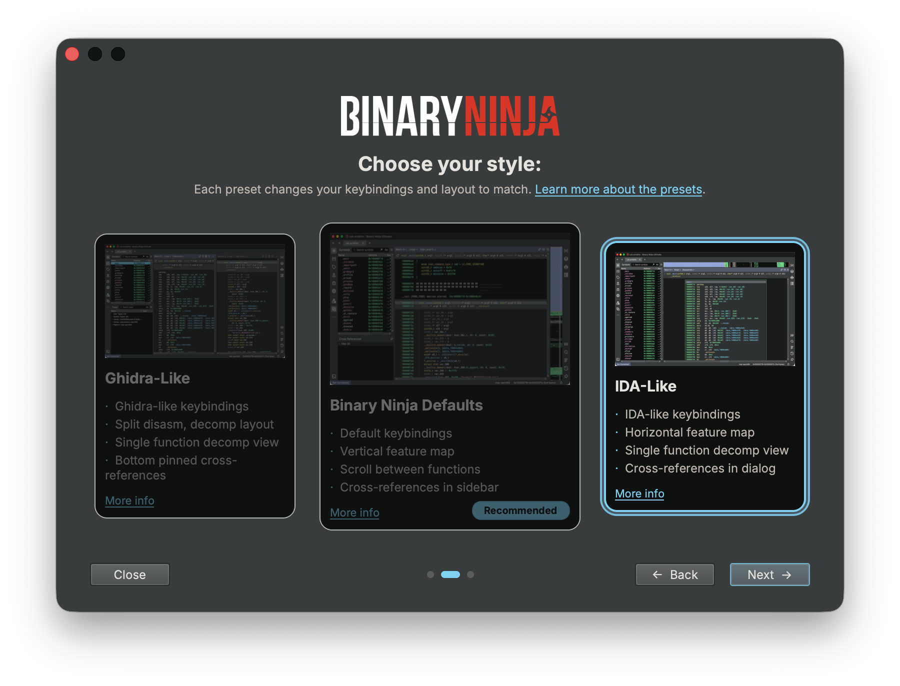

# Migrating from IDA

## Starting Binary Ninja

Binary Ninja starts with the [New Tab Page](../index.md#new-tab) open. From here, you can optionally [start a project](../projects.md#creating-a-project) to work with multiple files, [create new files](../index.md#new-files) to paste in data, or just [open existing files](../index.md#loading-files) (including drag-and-drop!).

## Decompiler Settings

Binary Ninja likes to stay out of your way as much as possible, but sometimes you need to dig into the settings and change how a file is analyzed. If you have a file that can be opened with default settings, you won't get prompted for any additional input. Binary Ninja will automatically analyze the entire file — including running [linear sweep](https://binary.ninja/2017/11/06/architecture-agnostic-function-detection-in-binaries.html) — and provide you with linear decompilation for the whole file (like IDA's linear disassembly, but as decompilation by default).

If you're opening a [Universal Mach-O](https://en.wikipedia.org/wiki/Universal_binary), the Open with Options dialogue will appear so that you can choose which architecture to open (in the top right). If you have a default architecture you want to open whenever you open a universal binary, you can set your preference in a setting called [Universal Mach-O Architecture Preference](../settings.md#settings-reference). You'll also see the Open with Options dialogue when Binary Ninja is unable to recognize the file type or otherwise needs user input to analyze the file (can't find the entry point, needs you to provide some memory mappings, etc.).

It's worth digging into Binary Ninja's [settings](../settings.md) and seeing what's available to tune, but if you ever want to change a setting for a single binary, you can Open (it) with Options. Go to File -> Open with Options, and any settings you change will apply to only that file.

If you're used to waiting for IDA's auto-analysis to finish before working, you'll find that Binary Ninja is designed to remain responsive during analysis. A priority queue ensures that wherever you navigate is analyzed first, even while other analysis threads continue in the background.

## Importing Data

Importing IDA IDB (`.idb`) and TIL (`.til`) files into Binary Ninja allows you to automatically transfer analysis data, saving you from manually moving over information.

There are two ways through the UI to import IDB and TIL files:

1. Prior to opening the binary, selecting _Open with Options_, allows you to set the IDB file you want to import with the _IDB File_ setting (`analysis.idb.autoLoadFile`).
2. After opening a binary, selecting _Load IDB File_ (`Plugins\\Load IDB File`) allows you to apply IDB/TIL files after analysis has already started.

The following data will be imported:

- Function information (name, comments, function type)
- Type information
- Section information
- Data variables
- Symbols

## Keybindings

To quickly set up IDA-like keybindings, open the First Run dialog from the Help menu (Help / First Run Wizard...) and select the IDA preset. The First Run dialog will apply IDA-style keybindings and UI settings for you. It appears automatically the first time you launch Binary Ninja, but it is always available from Help / First Run Wizard... — so if you dismissed it initially, or later want to (re)apply the IDA preset or switch between presets, you can change your keybindings and settings from there at any time.

Alternatively, you can manually replace your [keybindings](../index.md#custom-hotkeys) file in your [user folder](../index.md#user-folder) with [this file](../../files/ida-keybindings.json) to have the most seamless experience when changing to Binary Ninja.

Most of the default keybindings you're used to are the same. Any "actions" (renaming, setting types, opening cross-references, etc) you might want to perform can be found in the [command palette](../index.md#command-palette), which will save you from digging through unfamiliar right-click menus and help you learn any new keybindings. You can even [add your own actions](https://binary.ninja/2024/02/15/command-palette.html#how-do-i-register-actions-with-the-command-palette-myself) with ease. All actions can have their keybinding set, changed, or removed in the [keybindings menu](../index.md#default-hotkeys).

For the complete list of shortcuts the IDA preset applies, see [`ida-keybindings.json`](../../files/ida-keybindings.json).

Some major exceptions are:

- Save is `[CTRL/⌘-S]`.
- The "subviews" keybindings are:
    - `T` for Types
    - `[SHIFT-F4]` to toggle to/from Hex View
    - `[TAB]` to toggle to/from disassembly
- `0` toggles integer display between hexadecimal and decimal, which is `H` in IDA

## UI Settings

When you select the "IDA" preset in the First Run dialog, Binary Ninja will configure several settings to provide a more IDA-familiar experience:

### View Settings
- **Preferred View**: Sets graph view as the default (like IDA), rather than Binary Ninja's default linear view
- **Show Address**: Disabled in linear view for a cleaner interface

### Feature Map
- **Enabled**: The feature map is explicitly enabled
- **Location**: Moves the feature map to the top of the view (similar to IDA's navigation bar)

### Sidebar Configuration
- **Default Sidebars**: Shows only the Symbols sidebar by default (instead of both Symbols and Cross References)

### Cross-References
- **Modal Cross-References**: Sets cross-references to appear in a dialog window instead of the pinned sidebar (matching IDA's xref dialog behavior)

These settings can be changed at any time through Binary Ninja's settings menu (`[CTRL/⌘-,]`).

### Preset Configuration Files

The IDA preset keybindings and settings are stored in JSON configuration files that are easy to review and contribute to:

- **Keybindings**: [`api/docs/files/ida-keybindings.json`](https://github.com/Vector35/binaryninja-api/blob/dev/docs/files/ida-keybindings.json)
- **Settings**: [`api/docs/files/ida-settings.json`](https://github.com/Vector35/binaryninja-api/blob/dev/docs/files/ida-settings.json)

If you notice a missing keybinding or a setting that would make the IDA experience more familiar, we welcome contributions via pull requests to the [binaryninja-api](https://github.com/Vector35/binaryninja-api) repository.

## Cross-References

The hotkey for Cross-References in Binary Ninja will match your IDA muscle-memory. When using the IDA preset from the First Run dialog, cross-references will open in a dialog window (like IDA). If you are not using the IDA preset, you can change this behavior with the [`ui.defaultXrefInterface`](../settings.md#ui.defaultXrefInterface) setting.

## Theme

We like our dark themes, but understand they're not for everyone. We have an expansive list of [community themes](https://github.com/Vector35/community-themes), and [a guide](../../dev/themes.md) and a [blog post](https://binary.ninja/2021/07/08/creating-great-themes.html) on how to make your own. The built-in "Classic" theme should feel nostalgic, but if you're looking for a light theme that's slightly easier on the eyes, try out Summer or Solarized Light.

## Layout

Binary Ninja's layout is very similar to what you're used to in IDA, but there's one setting you might want to change and a handful of improvements to look out for as well.

### Feature Map

<!-- TODO: Add screenshot of the feature map in its IDA-like position at the top of the view -->

When using the First Run dialog settings, the [feature map](../index.md#feature-map) is moved to where you might be more comfortable. To move it back, right-click anywhere in it. That said, take notice that Binary Ninja's feature map is 2d: both directions you move your cursor changes the address in Binary Ninja. The exact number of bytes that fit across the width of the feature map scales to the size of the binary. You can disable this in the right-click menu by selecting "Linear Feature Map."

We also have an entropy map if you need it. It's tucked away in [triage view](../index.md#triage-summary).

### Sidebars

Our sidebars have a whole host of customization options, so make sure to check out [their dedicated docs](../index.md#the-sidebar) to maximize your workflow.

#### Main Area

Binary Ninja shows you linear decompilation by default for the whole binary. However, some people strongly prefer the "single function at a time" workflow, so we made an option for that too. Find the small hamburger menu (the three line pop-out menu) in the top right of your view and select “Single Function View.”

The option applies to a pane, not to a particular IL, so it stays on for both disassembly and decompilation in that pane. To read disassembly linearly while decompilation shows one function at a time, split into two panes and set each separately (though at restart, the last set setting will be applied to both).

Check out the [tiling panes](../index.md#tiling-panes) docs for more information.

## What You'll Love

...about switching to Binary Ninja! We know leaving your old tool behind can be hard, and there will be things you miss, but we think there are a lot of features packed into Binary Ninja that you'll love. Here are a couple we think you'll appreciate:

 - Decompilation for every architecture, including [ones you bring yourself](https://binary.ninja/2020/01/08/guide-to-architecture-plugins-part1.html)
 - [Updates (nearly) every day](../index.md#updates) on the dev branch
 - [Our awesome first-party Python API](../../dev/cookbook.md) (and [C++](https://api.binary.ninja/cpp/), and [Rust](https://dev-rust.binary.ninja/) too!)
 - [**So** much open source](https://github.com/Vector35/binaryninja-api?tab=readme-ov-file#related-repositories) (that includes our architecture modules!)

---

Don't forget to check out our [additional resources](index.md#additional-resources)!
