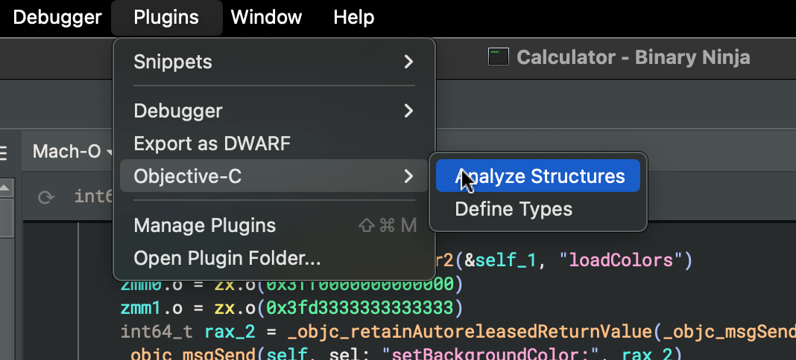
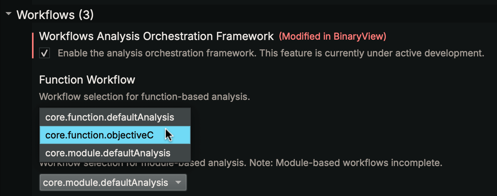

# Objective-C (Beta)

Recent version of Binary Ninja ship with [an additional plugin](https://github.com/Vector35/workflow_objc)
for assisting with Objective-C analysis. It provides both a [workflow](https://docs.binary.ninja/dev/workflows.html)
and a plugin command for enhancing Objective-C binary analysis. A brief summary
of the features offered is as follows:

- **Function Call Cleanup.** When using the Objective-C workflow, calls to
  `objc_msgSend` can be replaced with direct calls to the relevant function's
  implementation.

- **Name and Type Recovery.** Using runtime information embedded in the
  binary, Binary Ninja can automatically apply names and type information to
  Objective-C functions.

- **Structure Markup.** Data variables are automatically created for Objective-C
  structures such as classes and method lists to enable easy navigation.

- **Data Renderers.** Formatting of Objective-C types such as tagged and/or
  (image-)relative pointers is improved via custom data renderers.

- **CFString Handling.** Data variables are automatically created for all
  `CFString` instances present in the binary.

## Usage

If you have an Objective-C binary you are analyzing for the first time, or one
you are returning to, you can run the "Objective-C — Analyze Structures" action
from the command palette or plugins menu to perform Objective-C structure
analysis. _If you have already marked up Objective-C structures or modified
function types yourself, be aware that they may be overwritten when this action
is run._

### Workflow

To utilize function call cleanup, the workflows feature must be enabled, and the
Objective-C workflow must be chosen when loading a binary for analysis.

This will automatically apply structure analysis as the binary is analyzed and
also translate `objc_msgSend` calls to direct method calls, where possible.
