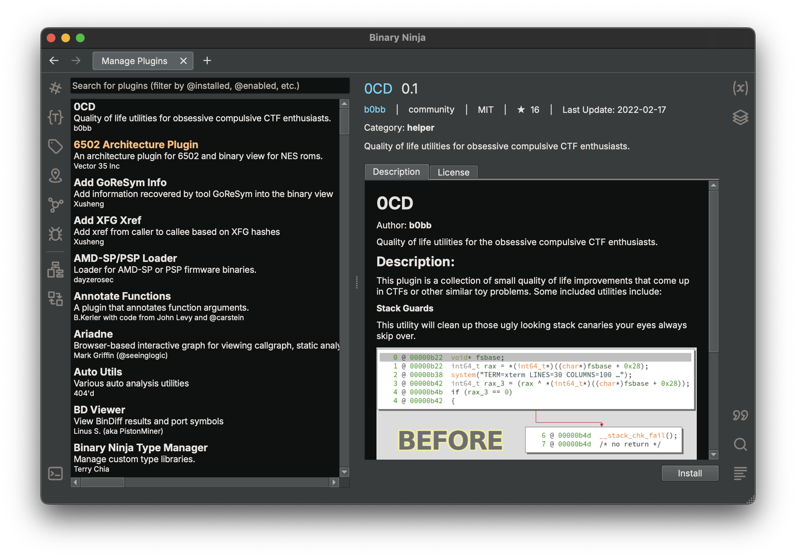

# Plugins

Plugins really show off the power of Binary Ninja. This guide should help give you an overview of both using and writing plugins.

The most common Binary Ninja plugins are Python which we are covering here. That said, there are some C++ plugins which must be built for the appropriate native architecture and will usually include build instructions for each platform. Several [C++ examples] are included in the API repository. 

## Using Plugins

Plugins are loaded from the user's plugin folder: 

- OS X: `~/Library/Application Support/Binary Ninja/plugins/`
- Linux: `~/.binaryninja/plugins/`
- Windows: `%APPDATA%\Binary Ninja\plugins`

Note that plugins installed via the [PluginManager API] are installed in the `repositories` folder in the same path as the previous `plugin` folder listed above.  You should not need to manually touch anything in that folder, but should access them via the API instead. 

### Plugin Manager



Plugins can now be installed directly via the GUI from Binary Ninja. You can launch the plugin manager via any of the following methods:

 - (Linux/Windows) `[CTRL-SHIFT-M]`
 - (MacOS) `[CMD-SHIFT-M]`

 Or:

 - (Linux/Windows) `Edit` / `Preferences` / `Manage Plugins`
 - (MacOS) `Binary Ninja` / `Preferences` / `Manage Plugins`

 Or:

 - (Linux/Windows) `[CTRL-P]` / `Plugin Manager` / `[ENTER]`
 - (MacOS) `[CMD-P]` / `Plugin Manager` / `[ENTER]`

Note that some plugins may show `Force Install` instead of the normal `Install` button. If that's the case, it means the plugin does not specifically advertise support for your platform or version of python. Often times the plugin will still work, but you must override a warning to confirm installation and be aware that the plugin may not be compatible. 

#### Plugin Manager Searching

The plugin manager also supports a number of helpful search keywords to filter through the list of plugins as it continues to grow:

 - `@installed` to only show installed plugins
 - `@enabled` to only show enabled plugins
 - `@disabled` to show plugins that are installed but not enabled)

The following plugin categories are also searchable:

 - `@core`
 - `@ui`
 - `@architecture`
 - `@binaryview`
 - `@helper`

### Manual installation

You can manually install a plugin either by adding a folder which contains it (the plugin folder must contain an `__init__.py` at the top of the folder, or a python file can be included directly in the plugin folder though this is not recommended).

Note, if manually cloning the [api repository](https://github.com/Vector35/binaryninja-api), make sure to:

``` text
git submodule update --init --recursive
```

after cloning or else the submodules will not actually be downloaded. 

### Installing via the API

Binary Ninja now offers a [PluginManager API] which can simplify the process of finding and installing plugins. From the console:

``` text
>>> mgr = RepositoryManager()
>>> dir(mgr)
['__class__', '__delattr__', '__dict__', '__dir__', '__doc__', '__eq__', '__format__', '__ge__', '__getattribute__', '__getitem__', '__gt__', '__hash__', '__init__', '__init_subclass__', '__le__', '__lt__', '__module__', '__ne__', '__new__', '__reduce__', '__reduce_ex__', '__repr__', '__setattr__', '__sizeof__', '__str__', '__subclasshook__', '__weakref__', 'add_repository', 'check_for_updates', 'default_repository', 'handle', 'plugins', 'repositories']
>>> mgr.plugins
{'community': [<joshwatson_binaryninjamsp430 not-installed/disabled>, <Alex3434_BinjaSigMaker not-installed/disabled>, <toolCHAINZ_structor not-installed/disabled>, <Vascojofra_jumptablebrancheditor not-installed/disabled>, <zznop_bnida not-installed/disabled>, <zznop_bngenesis not-installed/disabled>, <zznop_bnkallsyms not-installed/disabled>, <zznop_binjago not-installed/disabled>, <zznop_bnrecursion not-installed/disabled>, <bkerler_annotate installed/enabled>, <verylazyguy_binaryninjavmndh not-installed/disabled>, <0x1F9F1_binjamsvc not-installed/disabled>, <fluxchief_binaryninja_avr not-installed/disabled>, <withzombies_bnilgraph installed/enabled>, <mechanicalnull_sourcery_pane not-installed/disabled>, <chame1eon_binaryninjafrida not-installed/disabled>, <Vascojofra_formatstringfinderbinja installed/enabled>, <shareef12_driveranalyzer not-installed/disabled>, <carstein_Syscaller not-installed/disabled>, <404d_peutils not-installed/disabled>, <ForAllSecure_bncov not-installed/disabled>, <ehntoo_binaryninjasvd not-installed/disabled>, <whitequark_binja_function_abi not-installed/disabled>, <bowline90_BinRida not-installed/disabled>, <wrigjl_binaryninjam68k not-installed/disabled>], 'official': [<Vector35_OpaquePredicatePatcher not-installed/disabled>, <Vector35_sample_plugin not-installed/disabled>]}
>>> mgr.plugins['community'][0].installed
False
>>> mgr.plugins['community'][0].installed = True
>>> mgr.plugins['community'][0].installed
True
>>> mgr.plugins['community'][0].enabled
False
>>> mgr.plugins['community'][0].enabled = True
>>> mgr.plugins['community'][0].enabled
>>> mgr.plugins['community'][0].enabled
True
```

Then just restart, and your plugin will be loaded.

### Installing Prerequisites

Because Windows and MacOS ship with an embedded version of Python, if you want to install plugins inside that Python, we recommend instead installing an official [python.org] (NOTE: ensure you do not accidentally install a 32-bit build) version, or a [homebrew] Python 3.x build.

Then, you can adjust your [python.interpreter setting] to point to the appropriate install location. Note that the file being pointed to should be a `.dll` or `.dylib` though homebrew will often make the files not have any extension. For example:

```
$ file /usr/local/Cellar/python@3.8/3.8.5/Frameworks/Python.framework/Versions/3.8/Python
/usr/local/Cellar/python@3.8/3.8.5/Frameworks/Python.framework/Versions/3.8/Python: Mach-O 64-bit dynamically linked shared library x86_64
```

Note that using `pip.main` is no longer supported by the pip maintainers therefore this previous approach to installing dependencies is not currently supported.

### Troubleshooting

Troubleshooting many Binary Ninja problems is helped by enabling debug logs and logging the output to a file. Just launch Binary Ninja with 

``` text
/Applications/Binary\ Ninja.app/Contents/MacOS/binaryninja -d -l /tmp/bnlog.txt
```

And check `/tmp/bnlog.txt` when you're done. 

Additionally, running a python plugin with an environment variable of `BN_DISABLE_USER_PLUGINS` will prevent the API from initializing user-plugins which is helpful for root cause analysis.

## Writing Plugins

First, take a look at some of the [example] plugins, or some of the [community] plugins to get a feel for different APIs you might be interested in. Of course, the full [API] docs are online and available offline via the `Help`/`Open API Reference...`.

To start, we suggest you download the [sample plugin] as a template since it contains all of the elements you're likely to need.

- Begin by editing the `plugin.json` file 
- Next, update the `LICENSE`
- For small scripts, you can include all the code inside of `__init__.py`, though we recommend for most larger scripts that init just act as an initializer and call into functions organized appropriately in other files.

### Plugin Debugging Mode

Available via [settings], enabling plugin debugging mode will enable additional IL types via the UI.

### UI Elements

There are several ways to create UI elements in Binary Ninja. The first is to use the simplified [interaction] API which lets you make simple UI elements for use in GUI plugins in Binary Ninja. As an added bonus, they all have fallbacks that will work in headless console-based applications as well. Plugins that use these API include the [angr] and [nampa] plugins.

The second and more powerful (but more complicated) mechanism is to leverage the _binaryninjaui_ module. Documentation is forthcoming, but there are several examples ([1], [2], [3]) in the meantime. Additionally, the _binaryninjaui_ module is shipped with each build of binaryninja and includes header files that is helpful for using the APIs even when they're not documented.

### Testing

It's useful to be able to reload your plugin during testing. On the Commercial edition of Binary Ninja, this is easily accomplished with a stand-alone headless install using `import binaryninja` after [installing the API].  (install_api.py is included in every install in the installation folder)

For the Personal edition, we recommend simply commenting out the `register_` function normally used to register the plugin via whatever mechanism it uses and instead simply using the built-in Python console along with the python `reload` function to load new changes and test them by directly calling functions in the module. This work-around unfortunately is not supported for Binary View or Architecture plugins which unfortunately do require a restart to test if not running on Commercial. 

[PluginManager API]: https://api.binary.ninja/binaryninja.pluginmanager-module.html
[example]: https://github.com/Vector35/binaryninja-api/tree/dev/python/examples
[community]: https://github.com/Vector35/community-plugins
[C++ examples]: https://github.com/Vector35/binaryninja-api/tree/dev/examples
[API]: https://api.binary.ninja/
[sample plugin]: https://github.com/Vector35/sample_plugin
[UI enhancements]: https://github.com/NOPDev/BinjaDock
[interaction API]: https://api.binary.ninja/binaryninja.interaction-module.html
[angr]: https://github.com/Vector35/binaryninja-api/blob/dev/python/examples/angr_plugin.py
[nampa]: https://github.com/kenoph/nampa
[installing the API]: https://github.com/Vector35/binaryninja-api/blob/dev/scripts/install_api.py
[settings]: ../getting-started.md#ui.debugMode
[python.interpreter setting]: ../getting-started.md#python.interpreter
[interaction]: https://api.binary.ninja/binaryninja.interaction-module.html
[1]: https://github.com/Vector35/binaryninja-api/tree/dev/python/examples/kaitai
[2]: https://github.com/Vector35/binaryninja-api/tree/dev/python/examples/snippets
[3]: https://github.com/Vector35/binaryninja-api/tree/dev/python/examples/triage
[python.org]: https://www.python.org/downloads/windows/
[homebrew]: https://docs.brew.sh/Homebrew-and-Python