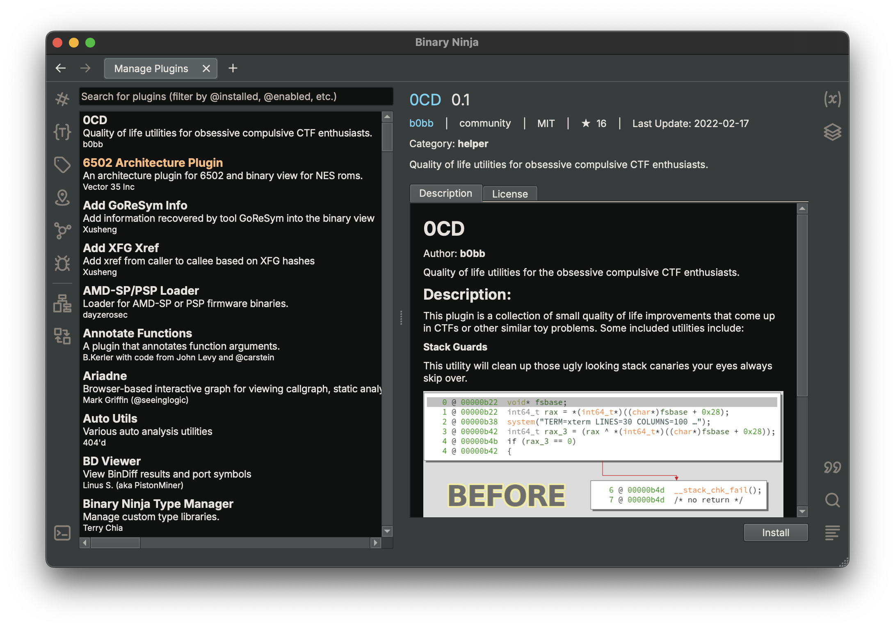

# Using Plugins

The most common Binary Ninja plugins are written in Python which we are covering here. That said, there are some C++ plugins which must be built for the appropriate native architecture and will usually include build instructions for each platform. Several [C++ examples](https://github.com/Vector35/binaryninja-api/tree/dev/examples) are included in the API repository. Binary Ninja also bundles native plugins such as the [Google BinDiff similarity and BinExport integration](./similarity.md#binexport). Finally, there is preliminary support for [Rust plugins](https://github.com/Vector35/binaryninja-api/tree/dev/rust), but the Rust API is still in the early stages of development, and should be considered a moving target, so proceed with caution and develop at your own risk.

Local plugins are installed manually in the user's plugin folder:

- macOS: `~/Library/Application Support/Binary Ninja/plugins/`
- Linux: `~/.binaryninja/plugins/`
- Windows: `%APPDATA%\Binary Ninja\plugins`

Managed plugins installed via the [Extension Manager API](https://api.binary.ninja/binaryninja.extensionmanager-module.html) are stored in the `repositories` folder alongside the `plugins` folder listed above. You should not manually adjust managed plugin files and should access them through the API or Extension Manager instead. Binary Ninja also ships bundled plugins as part of the product installation.

## Extension Manager

{ width="1000" }

Plugins can be installed directly via the GUI from Binary Ninja. You can launch the extension manager via any of the following methods:

 - (Linux/Windows) `[CTRL-SHIFT-M]`
 - (macOS) `[CMD-SHIFT-M]`

 Or:

 - `Plugins` / `Manage Extensions`

 Or:

 - (Linux/Windows) `[CTRL-P]` / `Manage Extensions` / `[ENTER]`
 - (macOS) `[CMD-P]` / `Manage Extensions` / `[ENTER]`

Note that some plugins may show `Force Install` instead of the normal `Install` button. If that's the case, it means the plugin does not specifically advertise support for your platform or version of python. Often times the plugin will still work, but you must override a warning to confirm installation and be aware that the plugin may not be compatible.

### Extension Manager Searching

In addition to finding plugins by name or description content, the search box in the extension manager also supports a number of helpful search keywords to filter through the list of plugins as it continues to grow:

 - `@installed` to only show installed plugins
 - `@enabled` to only show enabled plugins
 - `@disabled` to show plugins that are installed but not enabled
 - `@update_available` to show plugins that have updates to install
 - `@failed_to_load` to show plugins that failed to load
 - `@local` to show plugins installed manually in the user plugin folder
 - `@shadowed` to show plugins replaced by a higher-priority plugin with the same identity

The following plugin categories are also searchable:

 - `@core`
 - `@ui`
 - `@architecture`
 - `@binaryview`
 - `@helper`

## Manual installation

You can install a local Python plugin by adding a folder with an `__init__.py` at its top level, or by placing a Python file directly in the plugin folder (though this is not recommended). Native core plugins can also be placed in the plugin folder. The Extension Manager lists local plugins as unmanaged, shows their path and load status, and reports errors such as a missing or incompatible core ABI. Local plugins cannot be installed, updated, or uninstalled through the Extension Manager. Native UI plugins use a separate loader and are not included in the Extension Manager at this time.

### Plugin precedence and load failures

When plugins have the same runtime identity, the first match from the following will take precedence:

1. Local plugin (in user plugins folder)
2. Managed plugin (from Extension Manager)
3. Bundled plugin (from Binary Ninja install)

The lower-priority plugins are *shadowed* and will not be loaded. This includes when the higher-priority plugin fails to load. You can use `@failed_to_load` and `@shadowed` in the Extension Manager to find the affected entries.

Disabling a plugin lets the next eligible plugin load. Managed plugins can be disabled in the Extension Manager. For a local plugin, set its `enabled` property to `False` through the [Extension Manager API](https://api.binary.ninja/binaryninja.extensionmanager-module.html) to disable it for the current session, or move its file or directory out of the user plugin folder and restart to keep it disabled. Local plugin enable/disable state is not saved across restarts. If a plugin is already running, disabling it cannot unload it. Restart Binary Ninja to activate the lower-priority plugin. Likewise, restart after fixing a failed plugin so it can be loaded again.

Note, if manually cloning the [api repository](https://github.com/Vector35/binaryninja-api), make sure to:

``` text
git submodule update --init --recursive
```

after cloning or else the necessary submodules will not actually be downloaded.

### Installing via the API

Binary Ninja includes an [Extension Manager API](https://api.binary.ninja/binaryninja.extensionmanager-module.html) which can simplify the process of finding and installing plugins. From the console:

```python
>>> mgr = RepositoryManager()
>>> dir(mgr)
['__class__', '__delattr__', '__dict__', '__dir__', '__doc__', '__eq__', '__format__', '__ge__', '__getattribute__', '__getitem__', '__gt__', '__hash__', '__init__', '__init_subclass__', '__le__', '__lt__', '__module__', '__ne__', '__new__', '__reduce__', '__reduce_ex__', '__repr__', '__setattr__', '__sizeof__', '__str__', '__subclasshook__', '__weakref__', 'add_repository', 'check_for_updates', 'default_repository', 'handle', 'plugins', 'repositories']
>>> mgr.plugins
{'community': [<joshwatson_binaryninjamsp430 not-installed/disabled>, <Alex3434_BinjaSigMaker not-installed/disabled>, <toolCHAINZ_structor not-installed/disabled>, <Vascojofra_jumptablebrancheditor not-installed/disabled>, <zznop_bnida not-installed/disabled>, <zznop_bngenesis not-installed/disabled>, <zznop_bnkallsyms not-installed/disabled>, <zznop_binjago not-installed/disabled>, <zznop_bnrecursion not-installed/disabled>, <bkerler_annotate installed/enabled>, <verylazyguy_binaryninjavmndh not-installed/disabled>, <0x1F9F1_binjamsvc not-installed/disabled>, <fluxchief_binaryninja_avr not-installed/disabled>, <withzombies_bnilgraph installed/enabled>, <mechanicalnull_sourcery_pane not-installed/disabled>, <chame1eon_binaryninjafrida not-installed/disabled>, <Vascojofra_formatstringfinderbinja installed/enabled>, <shareef12_driveranalyzer not-installed/disabled>, <carstein_Syscaller not-installed/disabled>, <404d_peutils not-installed/disabled>, <ForAllSecure_bncov not-installed/disabled>, <ehntoo_binaryninjasvd not-installed/disabled>, <whitequark_binja_function_abi not-installed/disabled>, <bowline90_BinRida not-installed/disabled>, <wrigjl_binaryninjam68k not-installed/disabled>], 'official': [<Vector35_OpaquePredicatePatcher not-installed/disabled>, <Vector35_sample_plugin not-installed/disabled>]}
>>> mgr.plugins['community'][0].installed
False
>>> mgr.plugins['community'][0].installed = True
>>> mgr.plugins['community'][0].installed
True
>>> mgr.plugins['community'][0].enabled
False
>>> mgr.plugins['community'][0].enabled = True
>>> mgr.plugins['community'][0].enabled
>>> mgr.plugins['community'][0].enabled
True
```

Then just restart and the newly-enabled plugin will be loaded.

### Installing Prerequisites

Binary Ninja can automatically install pip requirements for python plugins installed using the extension manager. If the plugin author has included a `requirements.txt` file, the extension manager will automatically install those dependencies.

The `Install python3 module` action (available from the [command palette](index.md#command-palette)) can be used to install python3 modules to the local [python folder](index.md#user-folder).

Binary Ninja ships with an embedded version of Python on Windows, macOS, and Linux. All plugin dependencies installed are placed in the [user folder](index.md#user-folder) / pythonVER. For example with Python 3.13: `~/.binaryninja/python313/`.

You may also wish to use your own custom interpreter which you can set with the [python.interpreter setting](settings.md#python.interpreter) to point to the appropriate install location. Note that the file being pointed to should be a `.dll`, `.dylib`, or `.so` though homebrew will often install libraries without any extension. For example:

```bash
$ file /usr/local/Cellar/python@3.8/3.8.5/Frameworks/Python.framework/Versions/3.8/Python
/usr/local/Cellar/python@3.8/3.8.5/Frameworks/Python.framework/Versions/3.8/Python: Mach-O 64-bit dynamically linked shared library x86_64
```

### Troubleshooting

When troubleshooting Binary Ninja problems, it may help to enable debug logging as well as logging the output to a file. Just launch Binary Ninja with:

``` text
/Applications/Binary\ Ninja.app/Contents/macOS/binaryninja -d -l /tmp/bnlog.txt
```

And check `/tmp/bnlog.txt` when you're done.

Additionally, the `BN_DISABLE_USER_PLUGINS` environment variable prevents the API from initializing local plugins from the user plugin folder. This is helpful for identifying when a local plugin is causing problems. Setting `BN_USER_DIRECTORY` overrides the user directory where settings and local plugins are loaded.

## Writing Plugins

See the [developer documentation](../dev/index.md) for documentation on creating plugins.
