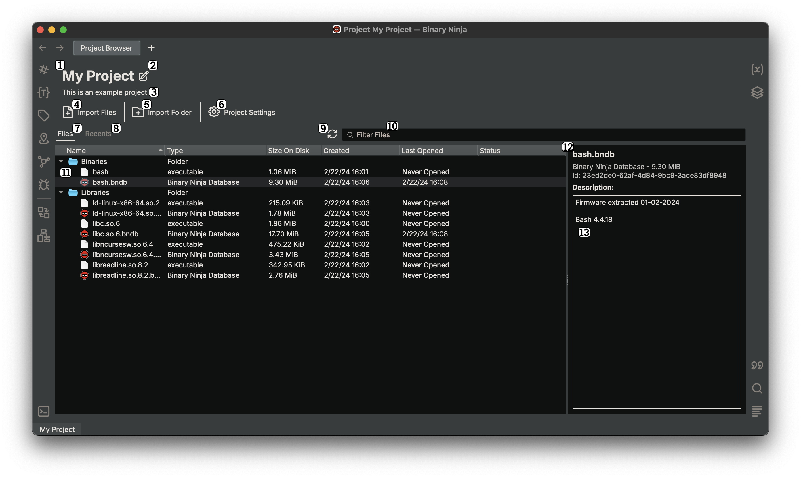
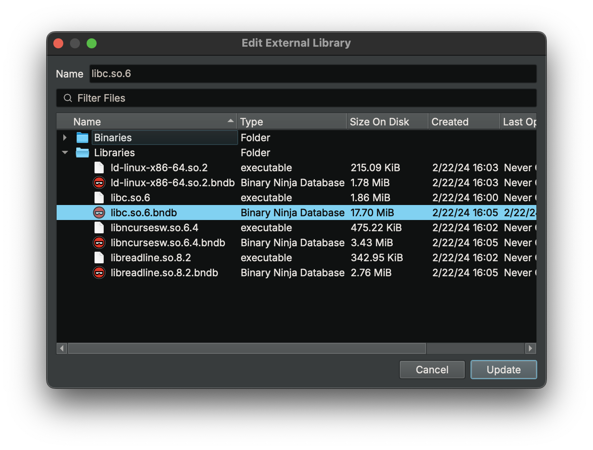
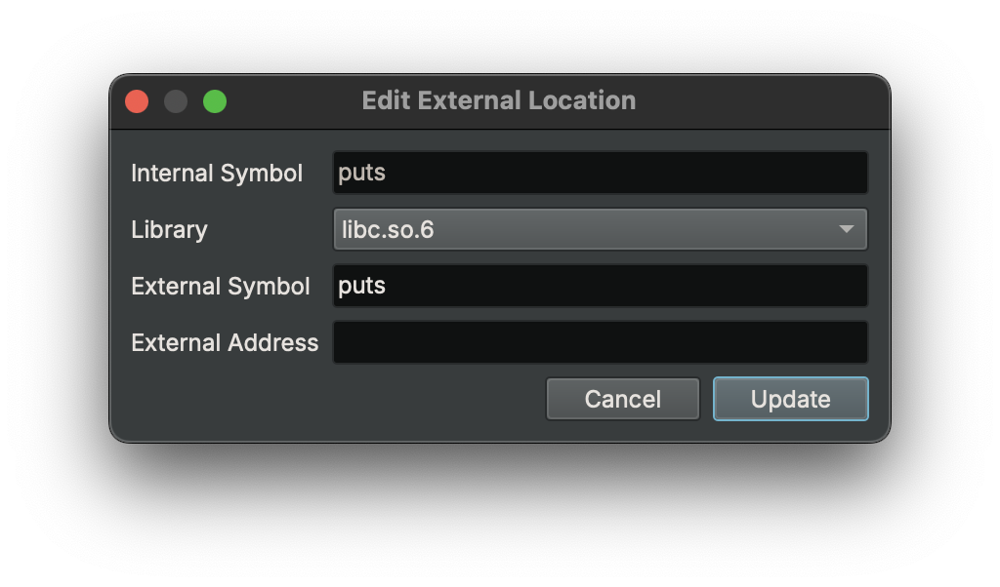

# Projects

Projects provide a way to keep and organize related binaries, databases, and resources in a managed format.

???+ Important "Supported Editions"
    Projects are only available in the Commercial and Enterprise editions of Binary Ninja

## Creating a Project

A new project can be created by either selecting `New Project` from the new tab page or `File > New Project` from the application toolbar. After creation, the new project will be opened automatically.

## Opening a Project

Existing projects can be opened by:

- Opening the `.bnpm` (or `.bnpr` on macOS) like any other file in Binary Ninja
- Double-clicking the project from the "Recent Projects" list in a new tab

When a project is first opened, a new window will be created for it. This window is permanently tied to this project, meaning that it will only contain files associated with this project.

## Structure on Disk

A project has a few components stored on disk:

- A top-level `.bnpr` directory that contains everything
- A `project.bnpm` project metadata file
- Optionally a `settings.json` file if project settings have been modified
- A `data` directory that contains the data for files in the project

## Project Browser

The primary method of interaction with a project is through the "Project Browser" UI.

1. The name of the project
2. Edit project details
3. Description of project
4. Import files to the project
5. Import a folder to the project
6. View and modify project-level settings
7. Tab for project file tree
8. Tab for Recent project file list
9. Refresh project
10. Filter the current view for files and folders
11. Project contents tree
12. Info widget showing details about the currently selected items
13. Description of currently selected item

### Adding Files to a Project

There are a handful of ways to add files to a project:

- Drag and drop files and folders directly into the project browser
- Using the `Import Files` button, select files to add to the currently selected folder
- Using the `Import Folder` button, select a folder to recursively import under the selected folder

### Exporting Files from a Project

To export files/folders from a project, select any number of files and folders in the project browser and choose `Export Selected` from the context menu or `Project Browser - Export Selected` from the command palette.

### Batch Analysis

Files in a project can be batch-analyzed easily from the project browser. Simply select the files to analyze and choose `Analyze Selected` from the context menu or `Project Browser - Analyze Selected` from the command palette. This will create a BNDB for each selected file, unless it is a BNDB itself.

## Project Settings

Project level settings let you set project-wide settings that apply to every file in the project. See the [settings documentation](settings.md) for more information.

## External Links

{ width="400" }

In the `External Links` sidebar widget, there is a top level entry for each defined `External Library`. Additionally, there is a special top-level entry: `<No Library>`, that contains all `External Locations` that are yet to be assigned to an `External Library`.

### External Libraries

An External Library represents a full library, optionally backed by a project file (e.g. `libc.so` which is backed by `libc.bndb`).

#### Creating an External Library

{ width="800" }

Creating an `External Library` can be done via context menu or command palette action `Create External Library...` with the `External Links` sidebar widget focused. This will open a dialog that lets you specify the name and (optionally) the file backing the new library. `External Libraries` are identified by a unique name that is immutable after creation.

#### Editing an External Library

Editing an existing `External Library` can be done via context menu or command palette action `Edit External Library...` with a library entry selected. This uses the same dialog as creation, but the "name" field is not editable.

#### Removing an External Library

Removing an `External Library` can be done via context menu or command palette action `Remove External Library...` with a library entry selected. This will delete the `External Library`, and all associated `External Locations` will have their library unassigned.

### External Locations

An External Location represents a symbol in a `Binary View` that points to an external target address and/or symbol in an `External Library` (e.g. `strcpy` points to `strcpy` in `libc.so`). When attempting to navigate to the symbol that is the source of an `External Location` with an `External Library` assigned, you will instead navigate to the destination address or symbol in the `External Library`, if it is backed by a file.

#### Creating an External Location

{ width="600" }

Creating an `External Location` can be done via context menu or command palette action `Create External Location...` with the `External Links` sidebar widget focused. This will open a dialog that lets you specify the internal symbol that is the source of the link, (optionally) the library that the `External Location` points to, and the external symbol and/or address. `External Locations` must always have at least one of the external symbol or address populated.

#### Editing an External Location

Editing an `External Location` can be done via context menu or command palette action `Edit External Location...` with a location entry selected. This uses the same dialog as creation, but the "internal symbol" field is not editable.

To easily change the assigned library for one or more `External Locations`, you can select and drag them to the desired `External Library` top-level entry.

#### Removing an External Location

Removing an `External Location` can be done via context menu or command palette action `Remove External Location...` with a location entry selected.
