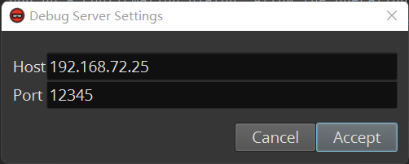
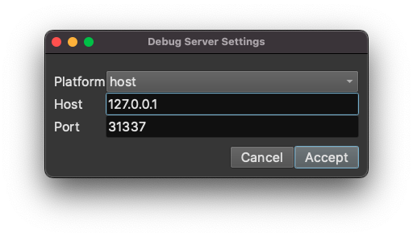
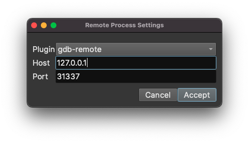

# Remote Debugging

## Support Status

Right now, we support Windows remote debugging from Windows, and Linux/macOS remote debugging from all platforms. Remote debugging of Windows executable from Linux/macOS is a planned feature.

We also support gdbserver/lldb-server remote debugging from all platforms. Currently, the gdbserver support is limited to remote android debugging, and support for other targets, e.g., qiling, VMWare, QEMU, etc., will be added later. 

| Target  🔽 Host ▶️    | macOS   | Linux   | Windows |
|-----------------------|---------|---------|---------|
| macOS                 | /       | Yes     | Yes     |
| Linux                 | Yes     | /       | Yes     |
| Windows               | Planned | Planned | /       |
| GDB Server            | Yes     | Yes     | Yes     | 
| LLDB Server           | Yes     | Yes     | Yes     |

## Debug Server v.s. Remote Process

There are two types of remote debugging, i.e, via a `debug server`, or a `remote process`.

A remote process is straight-forward -- it is a process that runs on the remote host. The debugger connects to it and then debugs it. If you have used `gdbserver` or `debugserver` previously, you probably already know about it.

A debug server is a server that runs on the remote host. The debugger connects to it and can instruct the debug server to launch a proces as needed. Then the debugger can connect to the running process and debug it. 
One advantage of using a debug server is that the user does not need to access the remote host to launch the target repeately -- it can be done within the debugger. 
Moreover, a debug server often offers more functionalities than launching a remote process. For example, the `lldb-server` supports reading and writing the remote file system, as well as executing shell commands on the remote host.

We recommend using debug server whenever possible and only use the remote process as a backup.

For now, `DbgEng` adapter supports debug server, and `LLDB` adapter supports both debug server and remote process.

## Preparing Remote Host

### Windows

To use remote debugging, first install two DbgEng redistributable on the remote machine.

- Find the DbgEng redistributable. There are two MSIs that come with Binary Ninja installation, `X64 Debuggers And Tools-x64_en-us.msi` and `X86 Debuggers And Tools-x86_en-us.msi`. They can be found in `<BN_INSTALL_DIR>\plugins\dbgeng`.
- Alternatively, the redistributable can be found at the debugger release page on GitHub. Download and extract the [debugger-win32.zip](https://github.com/Vector35/debugger/releases/download/0.1/debugger-win32.zip), and navigate to `debugger-win32\plugins\dbgeng`.
- Install the redistributable on the remote machine. Copy them to the remote machine and double-click to install them. By default, the `x64` version will be installed into `C:\Program Files\Windows Kits\10\Debuggers`, and the x86 version will be installed to `C:\Program Files (x86)\Windows Kits\10\Debuggers`.
- If you do not have admin privilege to install the two redistributable, extract the redistributable to any appropriate location by running command `msiexec /a X64 Debuggers And Tools-x64_en-us.msi TARGETDIR=<EXTRACT_DIR>` and `msiexec /a X86 Debuggers And Tools-x86_en-us.msi TARGETDIR=<EXTRACT_DIR>`.
- Once installed properly, there should be a `dbgsrv.exe` in both folders, `C:\Program Files\Windows Kits\10\Debuggers\x64` and `C:\Program Files\Windows Kits\10\Debuggers\x86`.

### macOS

- Download and extract [debugger-darwin.zip](https://github.com/Vector35/debugger/releases/download/0.1/debugger-darwin.zip).
- Find the `lldb` folder at `debugger-darwin/plugins/lldb` and copy it to the remote host.
- Note, the entire lldb folder must be copied. Only copying the `lldb-server` or `debugserver` executable does not work.

### Linux

There are two ways to prepare a Linux remote host, i.e., using lldb-server (recommended) or using gdbserver.

#### lldb-server (recommended)

- Download and extract [debugger-linux.zip](https://github.com/Vector35/debugger/releases/download/0.1/debugger-linux.zip).
- Find the `lldb` folder at `debugger-linux/plugins/lldb` and copy it to the remote host.
- Note, the entire lldb folder must be copied. Only copying the `lldb-server` executable does not work.
- One can also use the `lldb-server` or `gdbserver` that comes with the host system's Linux distribution. However, that might cause compatability issues.

#### gdbserver

Install the `gdb` using the system package manager, e.g., `sudo apt install gdbserver`.

### iOS

Setting up an iOS device or emulator for debugging is challenging. A step-by-step guide is out of scope here. We assume the user is familiar with the setup, or already having a proper setup that works with lldb.

We will provide a detailed guide on this later.

The high level steps are:

- Extract the `debugserver` executable from the developer disk image that comes with the XCode.
- Sign it with a proper entitlements plist to enable it to debug all processes.
- Upload the signed debugserver to the remote system.

### Android

Setting up an Android device or emulator for debugging requires a few steps. A step-by-step guide is out of scope here. We assume the user is familiar with the setup, or already having a proper setup that works with gdb.

We will provide a detailed guide on this later.

The high level steps are:

- Install the Android NDK
- Find the `gdbserver` or `gdbserver64` executable in NDK
- Upload it to the remote host

## Launching the Debug Server or Remote Process

### Windows

To start a remote debugging session, first launch the `dbgsrv.exe` on the remote machine.

- First determine whether the target is x64 or x86. If the target is x64, then use the `dbgsrv.exe` in the x64 DbgEng installation folder. If the target is x86, then use the `dbgsrv.exe` in the x86 DbgEng installation folder. If the version of `dbgsrv.exe` does not match the target, the debugger will behave unexpectedly.
- Launch the dbgsrv by running `dbgsrv.exe -t tcp:port=<PORT>,server=<IP_ADDRESS>`, where `IP_ADDRESS:PORT` is the IP and port the Binary Ninja will connect to. For example, `dbgsrv.exe -t tcp:port=12345,server=192.168.72.25`. Note, the `server=` part cannot be omitted.
- If this is done for the first time, the Window firewall will pop up a confirmation dialog. Allow the operation.
- If the operation succeeds, the `dbgsrv.exe` will keep running in the background. If any error occurs, it will show a message box.

### macOS

#### Debug Server

- cd debugger-darwin/plugins/lldb
- ./lldb-server p --server --listen 0.0.0.0:31337

Specifying `0.0.0.0` instructs lldb-server to listen on all interfaces. You can also specify a particular IP address of an interface.

#### Remote Process

- cd debugger-darwin/plugins/lldb
- To launch a new process, run `./debugserver 0.0.0.0:31337 /path/to/helloworld foo bar`, where `/path/to/helloworld` is the path of the executable, and `foo bar` are two arguments.
- To attach to a running process by PID, run `./debugserver 0.0.0.0:31337 --attach=1234`, where `1234` is the PID of the target process.

### Linux

#### Debug Server (LLDB)

- cd debugger-linux/plugins/lldb
- ./lldb-server p --server --listen 0.0.0.0:31337

Specifying `0.0.0.0` instructs lldb-server to listen on all interfaces. You can also specify a particular IP address of an interface.

#### Remote Process (LLDB)

- cd debugger-linux/plugins/lldb
- To launch a new process, run `./lldb-server g 0.0.0.0:31337 -- /path/to/helloworld foo bar`, where `/path/to/helloworld` is the path of the executable, and `foo bar` are two arguments.
- To attach to a running process by PID, run `./lldb-server g 0.0.0.0:31337 --attach 1234`, where `1234` is the PID of the target process.

#### Debug Server (GDB)

`gdbserver` can work as a debug server as well.

- gdbserver --multi 0.0.0.0:31337

#### Remote Process (GDB)

One can also use `gdbserver` to launch or attach to a remote process. Since the version of gdbserver varies, there might be compatability issues, though.

- To launch a new process, run `gdbserver 0.0.0.0:31337 -- /path/to/helloworld foo bar`, where `/path/to/helloworld` is the path of the executable, and `foo bar` are two arguments.
- To attach to a running process by PID, run `gdbserver 0.0.0.0:31337 --attach 1234`, where `1234` is the PID of the target process.

### iOS

- ssh into the remote host
- To launch a new process, run `./debugserver 0.0.0.0:31337 /path/to/helloworld foo bar`, where `/path/to/helloworld` is the path of the executable, and `foo bar` are two arguments.
- To attach to a running process by PID, run `./debugserver 0.0.0.0:31337 --attach=1234`, where `1234` is the PID of the target process.
- Targets launched/attached by `debugserver` are considered remote process. Follow the `Connecting to a Remote Process` section to connect to it.

### Android

- ssh into the remote host
- To launch a new process, run `gdbserver 0.0.0.0:31337 -- /path/to/helloworld foo bar`, where `/path/to/helloworld` is the path of the executable, and `foo bar` are two arguments.
- To attach to a running process by PID, run `gdbserver 0.0.0.0:31337 --attach 1234`, where `1234` is the PID of the target process.
- Targets launched/attached by `gdbserver` are considered remote process. Follow the `Connecting to a Remote Process` section to connect to it.

## Connecting to a Debug Server (DBGENG Adapter)

Now, connect to a debug server in Binary Ninja using DbgEng adapter.

- Open the binary you wish to debug
- Click "Debugger" -> "Connect to Debug Server" in the main window menu bar
- In the dialog, type in the IP and port to connect to:

- Click `Accept`. A message box will show up if the connection is successful.
- Now one can launch the target in the same way as local debugging. However, since the path of the executable on the remote machine is very likely to be different from the path on the local machine. We need to specify its path.
- Click "Debugger" -> "Launch/Connect Settings" in the main window menu bar

- Specify the executable path on the remote machine
- Launch the target

One can also attach to a process running on the remote machine via its PID. In that case, there is no need to specify the executable path.

When connected to the debug server, the debugger can launch the executable multiple times using the same connection. There is no need to relaunch and reconnect to the debug server after the target exits.

To disconnect from the debug server, click "Debugger" -> "Disconnect from Debug Server". After that, if we launch the target, it will execute on the local machine. Be careful!

## Connecting to a Debug Server (LLDB Adapter)

Connecting to a debug server using LLDB adapter is slightly different from using DbgEng adapter.

- Open the binary you wish to debug
- Click "Debugger" -> "Connect to Debug Server" in the main window menu bar
- In the dialog, type in the IP and port to connect to:

- There is a `Platform` dropdown menu. We need to select an appropriate platform so that LLDB can work properly:

If the remote host is a macOS system, select `remote-macosx`. If the remote host is a Linux system, select `remote-linux`. If the remote host is a gdbserver with `--multi` command line option, select `remote-gdb-server`. Note, despite that there exists an `remote-windows` entry, LLDB's debug server does not work on Windows at the moment. 

- Click `Accept`. A message box will show up if the connection is successful.
- Now one can launch the target in the same way as local debugging. However, since the path of the executable on the remote machine is very likely to be different from the path on the local machine. There are two ways to deal with it.
  - Do nothing. LLDB will copy the executable on the local system to the remote system, likely into a tmp folder, and then execute it. This works when the executable is insensitive to its location.
  - Change the platform working directory. If the executable already exists on the remote system, we can change the platform working directory to the folder which the executable is in. LLDB will detect the existence of the executable and launch it. To do it, run the command `platform settings -w /path/to/desided/directory` in the Debugger Console widget in the global area panel. 
- Launch the target

One can also attach to a process running on the remote machine via its PID. In that case, there is no need to change the current working directory.

When connected to the debug server, the debugger can launch the executable multiple times using the same connection. There is no need to relaunch and reconnect to the debug server after the target exits.

To disconnect from the debug server, click "Debugger" -> "Disconnect from Debug Server". After that, if we launch the target, it will execute on the local machine. Be careful!

## Connecting to a Remote Process

- Open the binary you wish to debug
- Click "Debugger" -> "Connect to Debug Server" in the main window menu bar
- In the dialog, type in the IP and port to connect to:

- For the `Plugin` dropdown menu, select `gdb-remote` or `debugserver/lldb` accordingly.
- Click `Accept`.