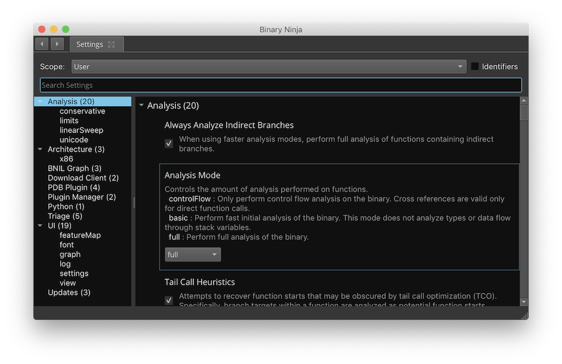

# Settings

## UI

{ width="800" }

Binary Ninja provides various settings which are available via the `[CMD/CTRL] ,` hotkey for *User* settings and the `[CMD/CTRL] .` hotkey for *Resource* settings which apply to the current BinaryView. These settings allow a wide variety of customization of the user interface and functional aspects of the analysis environment.

Several search keywords are available in the settings UI. Those include:

- `@default` - Shows settings that are in the default scope
- `@user` - Shows only settings that the user has changed
- `@project` - Shows settings scoped to the current project
- `@resource` - Shows settings scoped to the current resource (for example if you used open-with-options and changed settings)
- `@modified` - Shows settings that are changed from their default values

There are several scopes available for settings:

* **User Settings** - Settings that apply globally and override the defaults. These settings are stored in `settings.json` within the [User Folder](./index.md#user-folder).
* **Project Settings** - Settings which only apply if a project is opened. These settings are stored in `.binaryninja/settings.json` within a Project Folder. Project Folders can exist anywhere except within the User Folder. These settings apply to all files contained in the Project Folder and override the default and user settings. In order to activate this feature, select the Project Settings tab and a clickable "Open Project" link will appear at the top right of the view. Clicking this will create `.binaryninja/settings.json` in the folder of the currently selected binary view. If it already exists, this link will be replaced with the path of the project folder.
* **Resource Settings** - Settings which only apply to a specific BinaryView object within a file. These settings persist in a Binary Ninja Database (.bndb) database or ephemerally in a BinaryView object if a database does not yet exist for a file.

???+ Info "Tip"
    Both the _Project_ and _Resource_ tabs have a drop down indicator (▾) that can be clicked to select the project or resource whose settings you want to adjust.

All settings are uniquely identified with an identifier string. Identifiers are available in the settings UI via the context menu and are useful for finding settings using the search box and for [programmatically](https://api.binary.ninja/binaryninja.settings-module.html) interacting with settings.

**Note**: In order to facilitate reproducible analysis results, when opening a file for the first time, all of the analysis settings are automatically serialized into the _Resource Setting_ scope. This prevents subsequent _User_ and _Project_ setting modifications from unintentionally changing existing analysis results.

## All Settings

|Category|Setting|Description|Type|Default|Scope|Key|
|---|---|---|---|---|---|---|
|analysis|Alternate Type Propagation|Enable an alternate approach for function type propagation.|`boolean`|`True`|[`SettingsProjectScope`, `SettingsResourceScope`, `SettingsUserScope`]|<a id='analysis.alternateTypePropagation'>analysis.alternateTypePropagation</a>|
|analysis|Automatic Name Variables|Automatically name variables according to their usage.|`boolean`|`True`|[`SettingsProjectScope`, `SettingsResourceScope`, `SettingsUserScope`]|<a id='analysis.autoNameVariables'>analysis.autoNameVariables</a>|
|analysis|Disallow Branch to String|Enable the ability to halt analysis of branch targets that fall within a string reference. This setting may be useful for malformed binaries.|`boolean`|`False`|[`SettingsProjectScope`, `SettingsResourceScope`, `SettingsUserScope`]|<a id='analysis.conservative.disallowBranchToString'>analysis.conservative.disallowBranchToString</a>|
|analysis|Correlated Memory Value Propagation|Attempt to propagate the value of an expression from a memory definition to a usage. Currently this feature is simplistic and the scope is a single basic block.|`boolean`|`True`|[`SettingsProjectScope`, `SettingsResourceScope`, `SettingsUserScope`]|<a id='analysis.correlatedMemoryValuePropagation'>analysis.correlatedMemoryValuePropagation</a>|
|analysis|Purge Original Filename Path|When saving a database, remove all path information from the Original Filename field|`boolean`|`False`|[`SettingsProjectScope`, `SettingsUserScope`]|<a id='analysis.database.purgeOriginalFilenamePath'>analysis.database.purgeOriginalFilenamePath</a>|
|analysis|Purge Snapshots|When saving a database, purge old snapshots keeping only the current snapshot.|`boolean`|`False`|[`SettingsProjectScope`, `SettingsUserScope`]|<a id='analysis.database.purgeSnapshots'>analysis.database.purgeSnapshots</a>|
|analysis|Purge Undo History|When saving a database, purge current and existing undo history.|`boolean`|`False`|[`SettingsProjectScope`, `SettingsUserScope`]|<a id='analysis.database.purgeUndoHistory'>analysis.database.purgeUndoHistory</a>|
|analysis|Suppress Reanalysis|Disable function reanalysis on database load when the product version or analysis settings change.|`boolean`|`False`|[`SettingsProjectScope`, `SettingsResourceScope`, `SettingsUserScope`]|<a id='analysis.database.suppressReanalysis'>analysis.database.suppressReanalysis</a>|
|analysis|Debug File Directories|Paths to folder containing debug info stored by build id.|`array`|[]|[`SettingsProjectScope`, `SettingsResourceScope`, `SettingsUserScope`]|<a id='analysis.debugInfo.debugDirectories'>analysis.debugInfo.debugDirectories</a>|
|analysis|External Debug Info File|Separate file to attempt to parse and import debug information from.|`string`| |[`SettingsProjectScope`, `SettingsResourceScope`, `SettingsUserScope`]|<a id='analysis.debugInfo.external'>analysis.debugInfo.external</a>|
|analysis|Import Debug Information|Attempt to parse and apply debug information from each file opened.|`boolean`|`True`|[`SettingsProjectScope`, `SettingsResourceScope`, `SettingsUserScope`]|<a id='analysis.debugInfo.internal'>analysis.debugInfo.internal</a>|
|analysis|Early Stack Constant Propagation|Propagate constants stored on the stack during Low Level IL analysis. This allows stack offsets to be resolved when stack pointer updates use constants placed on the stack.|`string`|`inlined`|[`SettingsProjectScope`, `SettingsResourceScope`, `SettingsUserScope`]|<a id='analysis.earlyStackConstantPropagation'>analysis.earlyStackConstantPropagation</a>|
| | |  enum: Do not perform early constant propagation for stack variables|`enum`|`off`| | |
| | |  enum: Only perform early constant propagation when one or more functions have been inlined into the function|`enum`|`on`| | |
| | |  enum: Always perform early constant propagation for stack variables|`enum`|`inlined`| | |
|analysis|Extract Types From Mangled Names|Attempt to extract types from mangled names using the demangler. This can lead to recovering inaccurate parameters.|`boolean`|`True`|[`SettingsProjectScope`, `SettingsResourceScope`, `SettingsUserScope`]|<a id='analysis.extractTypesFromMangledNames'>analysis.extractTypesFromMangledNames</a>|
|analysis|Always Analyze Indirect Branches|When using faster analysis modes, perform full analysis of functions containing indirect branches.|`boolean`|`True`|[`SettingsProjectScope`, `SettingsResourceScope`, `SettingsUserScope`]|<a id='analysis.forceIndirectBranches'>analysis.forceIndirectBranches</a>|
|analysis|Gratuitous Function Update|Force the function update cycle to always end with an IncrementalAutoFunctionUpdate type.|`boolean`|`False`|[`SettingsProjectScope`, `SettingsResourceScope`, `SettingsUserScope`]|<a id='analysis.gratuitousFunctionUpdate'>analysis.gratuitousFunctionUpdate</a>|
|analysis|Heuristic Value Range Clamping|Use DataVariable state inferencing to help determine the possible size of a lookup table.|`boolean`|`True`|[`SettingsProjectScope`, `SettingsResourceScope`, `SettingsUserScope`]|<a id='analysis.heuristicRangeClamp'>analysis.heuristicRangeClamp</a>|
|analysis|Aggressive Condition Complexity Removal Threshold|High Level IL tuning parameter (deprecated).|`number`|`64`|[`SettingsProjectScope`, `SettingsResourceScope`, `SettingsUserScope`]|<a id='analysis.hlil.aggressiveConditionComplexityRemovalThreshold'>analysis.hlil.aggressiveConditionComplexityRemovalThreshold</a>|
|analysis|Code Duplication Limit|Maximum number of lines of code to duplicate to reduce control flow complexity.|`number`|`2`|[`SettingsProjectScope`, `SettingsResourceScope`, `SettingsUserScope`]|<a id='analysis.hlil.codeDuplicationLimit'>analysis.hlil.codeDuplicationLimit</a>|
|analysis|Control Flow Resolution Strategy|Method used for resolving control flow in HLIL.|`string`|`graphTransformation`|[`SettingsProjectScope`, `SettingsResourceScope`, `SettingsUserScope`]|<a id='analysis.hlil.controlFlowResolution'>analysis.hlil.controlFlowResolution</a>|
| | |  enum: Use condition graphs to resolve control flow (deprecated).|`enum`|`conditionGraph`| | |
| | |  enum: Use graph transformations to resolve control flow.|`enum`|`graphTransformation`| | |
|analysis|Graph Optimizer Limit|High Level IL tuning parameter.|`number`|`64`|[`SettingsProjectScope`, `SettingsResourceScope`, `SettingsUserScope`]|<a id='analysis.hlil.graphOptimizerLimit'>analysis.hlil.graphOptimizerLimit</a>|
|analysis|Max Condition Complexity|High Level IL tuning parameter (deprecated).|`number`|`1024`|[`SettingsProjectScope`, `SettingsResourceScope`, `SettingsUserScope`]|<a id='analysis.hlil.maxConditionComplexity'>analysis.hlil.maxConditionComplexity</a>|
|analysis|Max Condition Reduce Iterations|High Level IL tuning parameter (deprecated).|`number`|`1024`|[`SettingsProjectScope`, `SettingsResourceScope`, `SettingsUserScope`]|<a id='analysis.hlil.maxConditionReduceIterations'>analysis.hlil.maxConditionReduceIterations</a>|
|analysis|Maximum Expression Count|High Level IL tuning parameter.|`number`|`1048576`|[`SettingsProjectScope`, `SettingsResourceScope`, `SettingsUserScope`]|<a id='analysis.hlil.maxExpressionCount'>analysis.hlil.maxExpressionCount</a>|
|analysis|Max Intermediate Condition Complexity|High Level IL tuning parameter.|`number`|`1048576`|[`SettingsProjectScope`, `SettingsResourceScope`, `SettingsUserScope`]|<a id='analysis.hlil.maxIntermediateConditionComplexity'>analysis.hlil.maxIntermediateConditionComplexity</a>|
|analysis|Eliminate Pure Calls during HLIL Optimization|Whether or not pure calls (calls to functions with no side-effects) are removed during HLIL optimizations.|`boolean`|`True`|[`SettingsProjectScope`, `SettingsResourceScope`, `SettingsUserScope`]|<a id='analysis.hlil.pureCallElimination'>analysis.hlil.pureCallElimination</a>|
|analysis|Strict Memory Ordering|Prevents reordering of memory reads during HLIL optimization.|`boolean`|`False`|[`SettingsProjectScope`, `SettingsResourceScope`, `SettingsUserScope`]|<a id='analysis.hlil.strictMemoryOrdering'>analysis.hlil.strictMemoryOrdering</a>|
|analysis|Switch Case Node Threshold|High Level IL tuning parameter.|`number`|`4`|[`SettingsProjectScope`, `SettingsResourceScope`, `SettingsUserScope`]|<a id='analysis.hlil.switchCaseNodeThreshold'>analysis.hlil.switchCaseNodeThreshold</a>|
|analysis|Switch Case Value Count Threshold|High Level IL tuning parameter.|`number`|`6`|[`SettingsProjectScope`, `SettingsResourceScope`, `SettingsUserScope`]|<a id='analysis.hlil.switchCaseValueCountThreshold'>analysis.hlil.switchCaseValueCountThreshold</a>|
|analysis|Target Max Condition Complexity|High Level IL tuning parameter (deprecated).|`number`|`16`|[`SettingsProjectScope`, `SettingsResourceScope`, `SettingsUserScope`]|<a id='analysis.hlil.targetMaxConditionComplexity'>analysis.hlil.targetMaxConditionComplexity</a>|
|analysis|Initial Analysis Hold|Enabling the analysis hold discards all future analysis updates until clearing the hold. This setting only applies to analysis in the InitialState.|`boolean`|`False`|[`SettingsProjectScope`, `SettingsResourceScope`, `SettingsUserScope`]|<a id='analysis.initialAnalysisHold'>analysis.initialAnalysisHold</a>|
|analysis|Keep Dead Code Branches|Keep unreachable code branches and associated basic blocks in HLIL.|`boolean`|`False`|[`SettingsProjectScope`, `SettingsResourceScope`, `SettingsUserScope`]|<a id='analysis.keepDeadCodeBranches'>analysis.keepDeadCodeBranches</a>|
|analysis|Advanced Analysis Cache Size|Controls the number of functions for which the most recent generated advanced analysis is cached. Large values may result in very high memory utilization.|`number`|`64`|[`SettingsProjectScope`, `SettingsResourceScope`, `SettingsUserScope`]|<a id='analysis.limits.cacheSize'>analysis.limits.cacheSize</a>|
|analysis|Max Function Analysis Time|Any functions that exceed this analysis time are deferred. A value of 0 disables this feature. The default value is 20 seconds. Time is specified in milliseconds.|`number`|`20000`|[`SettingsProjectScope`, `SettingsResourceScope`, `SettingsUserScope`]|<a id='analysis.limits.maxFunctionAnalysisTime'>analysis.limits.maxFunctionAnalysisTime</a>|
|analysis|Max Function Size|Any functions over this size will not be automatically analyzed. A value of 0 disables this feature. Size is specified in bytes.|`number`|`65536`|[`SettingsProjectScope`, `SettingsResourceScope`, `SettingsUserScope`]|<a id='analysis.limits.maxFunctionSize'>analysis.limits.maxFunctionSize</a>|
|analysis|Max Function Update Count|Any functions that exceed this incremental update count are deferred. A value of 0 disables this feature.|`number`|`100`|[`SettingsProjectScope`, `SettingsResourceScope`, `SettingsUserScope`]|<a id='analysis.limits.maxFunctionUpdateCount'>analysis.limits.maxFunctionUpdateCount</a>|
|analysis|Max Lookup Table Size|Limits the maximum number of entries for a lookup table.|`number`|`4095`|[`SettingsProjectScope`, `SettingsResourceScope`, `SettingsUserScope`]|<a id='analysis.limits.maxLookupTableSize'>analysis.limits.maxLookupTableSize</a>|
|analysis|Maximum String Length|The maximum string length that will be copied.|`number`|`16384`|[`SettingsUserScope`]|<a id='analysis.limits.maxStringLength'>analysis.limits.maxStringLength</a>|
|analysis|Minimum String Length|The minimum length for strings created during auto-analysis|`number`|`4`|[`SettingsProjectScope`, `SettingsResourceScope`, `SettingsUserScope`]|<a id='analysis.limits.minStringLength'>analysis.limits.minStringLength</a>|
|analysis|Maximum String Search|Maximum number of strings to find before giving up.|`number`|`1048576`|[`SettingsProjectScope`, `SettingsResourceScope`, `SettingsUserScope`]|<a id='analysis.limits.stringSearch'>analysis.limits.stringSearch</a>|
|analysis|Worker Thread Count|The number of worker threads available for concurrent analysis activities.|`number`|`15`|[`SettingsProjectScope`, `SettingsResourceScope`, `SettingsUserScope`]|<a id='analysis.limits.workerThreadCount'>analysis.limits.workerThreadCount</a>|
|analysis|Autorun Linear Sweep|Automatically run linear sweep when opening a binary for analysis.|`boolean`|`True`|[`SettingsProjectScope`, `SettingsResourceScope`, `SettingsUserScope`]|<a id='analysis.linearSweep.autorun'>analysis.linearSweep.autorun</a>|
|analysis|Control Flow Graph Analysis|Enable the control flow graph analysis (Analysis Phase 3) portion of linear sweep.|`boolean`|`True`|[`SettingsProjectScope`, `SettingsResourceScope`, `SettingsUserScope`]|<a id='analysis.linearSweep.controlFlowGraph'>analysis.linearSweep.controlFlowGraph</a>|
|analysis|Detailed Linear Sweep Log Information|Linear sweep generates additional log information at the InfoLog level.|`boolean`|`False`|[`SettingsProjectScope`, `SettingsResourceScope`, `SettingsUserScope`]|<a id='analysis.linearSweep.detailedLogInfo'>analysis.linearSweep.detailedLogInfo</a>|
|analysis|Entropy Heuristics for Linear Sweep|Enable the application of entropy based heuristics to the function search space for linear sweep.|`boolean`|`True`|[`SettingsProjectScope`, `SettingsResourceScope`, `SettingsUserScope`]|<a id='analysis.linearSweep.entropyHeuristics'>analysis.linearSweep.entropyHeuristics</a>|
|analysis|High Entropy Threshold for Linear Sweep|Regions in the binary at or above this threshold are not included in the search space for linear sweep.|`number`|`0.82`|[`SettingsProjectScope`, `SettingsResourceScope`, `SettingsUserScope`]|<a id='analysis.linearSweep.entropyThresholdHigh'>analysis.linearSweep.entropyThresholdHigh</a>|
|analysis|Low Entropy Threshold for Linear Sweep|Regions in the binary at or below this threshold are not included in the search space for linear sweep.|`number`|`0.025`|[`SettingsProjectScope`, `SettingsResourceScope`, `SettingsUserScope`]|<a id='analysis.linearSweep.entropyThresholdLow'>analysis.linearSweep.entropyThresholdLow</a>|
|analysis|Max Linear Sweep Work Queues|The number of binary regions under concurrent analysis.|`number`|`64`|[`SettingsProjectScope`, `SettingsResourceScope`, `SettingsUserScope`]|<a id='analysis.linearSweep.maxWorkQueues'>analysis.linearSweep.maxWorkQueues</a>|
|analysis|Permissive Linear Sweep|Permissive linear sweep searches all executable segments regardless of read/write permissions. By default, linear sweep searches sections that are ReadOnlyCodeSectionSemantics, or if no sections are defined, segments that are read/execute.|`boolean`|`False`|[`SettingsProjectScope`, `SettingsResourceScope`, `SettingsUserScope`]|<a id='analysis.linearSweep.permissive'>analysis.linearSweep.permissive</a>|
|analysis|Program's Exit Symbol List|A list of common 'exit' symbols to search for when 'Navigate to Program's Main' is enabled.|`array`|[`_cexit`, `_exit`, `_o__cexit`, `_o_exit`, `common_exit`, `doexit`, `exit`]|[`SettingsUserScope`]|<a id='analysis.mainFunctionDetection.exitSymbols'>analysis.mainFunctionDetection.exitSymbols</a>|
|analysis|Program's Main Symbol List|A list of common 'main' symbols to search for when 'Navigate to Program's Main' is enabled.|`array`|[`WinMain`, `_main`, `main`, `wWinMain`]|[`SettingsUserScope`]|<a id='analysis.mainFunctionDetection.mainSymbols'>analysis.mainFunctionDetection.mainSymbols</a>|
|analysis|Load/Store Splitting|Controls splitting of oversized variable field accesses into appropriately sized accesses|`string`|`validFieldsOnly`|[`SettingsProjectScope`, `SettingsResourceScope`, `SettingsUserScope`]|<a id='analysis.mlil.loadStoreSplitting'>analysis.mlil.loadStoreSplitting</a>|
| | |  enum: Do not split oversized accesses to fields|`enum`|`off`| | |
| | |  enum: Split oversized accesses to valid fields and hide accessed gaps/alignment/padding bytes|`enum`|`validFieldsOnly`| | |
| | |  enum: Split oversized accesses to valid fields and include accessed gaps/alignment/padding bytes|`enum`|`allOffsets`| | |
|analysis|Analysis Mode|Controls the amount of analysis performed on functions.|`string`|`full`|[`SettingsProjectScope`, `SettingsResourceScope`, `SettingsUserScope`]|<a id='analysis.mode'>analysis.mode</a>|
| | |  enum: Only perform control flow analysis on the binary. Cross references are valid only for direct function calls. [Disassembly Only]|`enum`|`controlFlow`| | |
| | |  enum: Perform fast initial analysis of the binary. This mode does not analyze types or data flow through stack variables. [LLIL and Equivalents]|`enum`|`basic`| | |
| | |  enum: Perform analysis which includes type propagation and data flow. [MLIL and Equivalents]|`enum`|`intermediate`| | |
| | |  enum: Perform full analysis of the binary.|`enum`|`full`| | |
|analysis|Builtin Outlining of Constant Expressions|Enable outlining of constant expression compiler emitted builtins.|`boolean`|`True`|[`SettingsProjectScope`, `SettingsResourceScope`, `SettingsUserScope`]|<a id='analysis.outlining.builtins'>analysis.outlining.builtins</a>|
|analysis|Autorun Pointer Sweep|Automatically run pointer sweep when opening a binary for analysis.|`boolean`|`True`|[`SettingsProjectScope`, `SettingsResourceScope`, `SettingsUserScope`]|<a id='analysis.pointerSweep.autorun'>analysis.pointerSweep.autorun</a>|
|analysis|Return Value Propagation|Propagate and use constant return values from functions in the caller in order to simplify downstream expressions.|`boolean`|`True`|[`SettingsProjectScope`, `SettingsResourceScope`, `SettingsUserScope`]|<a id='analysis.returnValuePropagation'>analysis.returnValuePropagation</a>|
|analysis|Autorun Function Signature Matcher|Automatically run the function signature matcher when opening a binary for analysis.|`boolean`|`True`|[`SettingsProjectScope`, `SettingsResourceScope`, `SettingsUserScope`]|<a id='analysis.signatureMatcher.autorun'>analysis.signatureMatcher.autorun</a>|
|analysis|Auto Function Analysis Suppression|Enable suppressing analysis of automatically discovered functions.|`boolean`|`False`|[`SettingsProjectScope`, `SettingsResourceScope`, `SettingsUserScope`]|<a id='analysis.suppressNewAutoFunctionAnalysis'>analysis.suppressNewAutoFunctionAnalysis</a>|
|analysis|Tail Call Heuristics|Attempts to recover function starts that may be obscured by tail call optimization (TCO). Specifically, branch targets within a function are analyzed as potential function starts.|`boolean`|`True`|[`SettingsProjectScope`, `SettingsResourceScope`, `SettingsUserScope`]|<a id='analysis.tailCallHeuristics'>analysis.tailCallHeuristics</a>|
|analysis|Tail Call Translation|Performs tail call translation for jump instructions where the target is an existing function start.|`boolean`|`True`|[`SettingsProjectScope`, `SettingsResourceScope`, `SettingsUserScope`]|<a id='analysis.tailCallTranslation'>analysis.tailCallTranslation</a>|
|analysis|Translate Windows CFG Calls|Attempt to identify and translate calls to `_guard_dispatch_icall_nop` to improve analysis of control flow guard binaries.|`boolean`|`True`|[`SettingsProjectScope`, `SettingsResourceScope`, `SettingsUserScope`]|<a id='analysis.translateWindowsCfgCalls'>analysis.translateWindowsCfgCalls</a>|
|analysis|Padding Threshold|Specify the minimum number of undefined bytes in a structure type before __padding notation is used when rendering the type to text. This setting does not affect exporting types to a file, where the __padding notation will always be used.|`number`|`65536`|[`SettingsProjectScope`, `SettingsResourceScope`, `SettingsUserScope`]|<a id='analysis.types.paddingThreshold'>analysis.types.paddingThreshold</a>|
|analysis|Type Parser Default Arguments|Specify the default arguments to be passed into the Type Parser for all strings parsed into types. Currently only applies to User Scope (you can use a UIContextNotification plugin as a work-around for now).|`string`| |[`SettingsUserScope`]|<a id='analysis.types.parserDefaultArgs'>analysis.types.parserDefaultArgs</a>|
|analysis|Type Parser|Specify the implementation used for parsing types from text.|`string`|`ClangTypeParser`|[`SettingsProjectScope`, `SettingsResourceScope`, `SettingsUserScope`]|<a id='analysis.types.parserName'>analysis.types.parserName</a>|
| | | |`enum`|`ClangTypeParser`| | |
|analysis|Type Printer|Specify the implementation used for formatting types into text.|`string`|`CoreTypePrinter`|[`SettingsProjectScope`, `SettingsResourceScope`, `SettingsUserScope`]|<a id='analysis.types.printerName'>analysis.types.printerName</a>|
| | | |`enum`|`CoreTypePrinter`| | |
|analysis|Simplify Templates|Simplify common C++ templates that are expanded with default arguments at compile time (eg. `std::__cxx11::basic_string<wchar, std::char_traits<wchar>, std::allocator<wchar> >` to `std::wstring`).|`boolean`|`True`|[`SettingsProjectScope`, `SettingsResourceScope`, `SettingsUserScope`]|<a id='analysis.types.templateSimplifier'>analysis.types.templateSimplifier</a>|
|analysis|Unicode Blocks|Defines which unicode blocks to consider when searching for strings useful for specifying different UTF code pages.|`array`|[]|[`SettingsProjectScope`, `SettingsResourceScope`, `SettingsUserScope`]|<a id='analysis.unicode.blocks'>analysis.unicode.blocks</a>|
|analysis|UTF-16 Encoding|Whether or not to consider UTF-16 code points when searching for strings.|`boolean`|`True`|[`SettingsProjectScope`, `SettingsResourceScope`, `SettingsUserScope`]|<a id='analysis.unicode.utf16'>analysis.unicode.utf16</a>|
|analysis|UTF-32 Encoding|Whether or not to consider UTF-32 code points when searching for strings.|`boolean`|`True`|[`SettingsProjectScope`, `SettingsResourceScope`, `SettingsUserScope`]|<a id='analysis.unicode.utf32'>analysis.unicode.utf32</a>|
|analysis|UTF-8 Encoding|Whether or not to consider UTF-8 code points when searching for strings.|`boolean`|`True`|[`SettingsProjectScope`, `SettingsResourceScope`, `SettingsUserScope`]|<a id='analysis.unicode.utf8'>analysis.unicode.utf8</a>|
|arch|AARCH64 Alignment Requirement|Require instructions be on 4-byte aligned addresses to be disassembled.|`boolean`|`True`|[`SettingsProjectScope`, `SettingsResourceScope`, `SettingsUserScope`]|<a id='arch.aarch64.disassembly.alignRequired'>arch.aarch64.disassembly.alignRequired</a>|
|arch|MIPS Disassembly Pseudo-Op|Enable use of pseudo-op instructions in MIPS disassembly.|`boolean`|`True`|[`SettingsProjectScope`, `SettingsResourceScope`, `SettingsUserScope`]|<a id='arch.mips.disassembly.pseudoOps'>arch.mips.disassembly.pseudoOps</a>|
|arch|x86 Disassembly Case|Specify the case for opcodes, operands, and registers.|`boolean`|`True`|[`SettingsUserScope`]|<a id='arch.x86.disassembly.lowercase'>arch.x86.disassembly.lowercase</a>|
|arch|x86 Disassembly Separator|Specify the token separator between operands.|`string`|`, `|[`SettingsUserScope`]|<a id='arch.x86.disassembly.separator'>arch.x86.disassembly.separator</a>|
|arch|x86 Disassembly Syntax|Specify disassembly syntax for the x86/x86_64 architectures.|`string`|`BN_INTEL`|[`SettingsUserScope`]|<a id='arch.x86.disassembly.syntax'>arch.x86.disassembly.syntax</a>|
| | |  enum: Sets the disassembly syntax to a simplified Intel format. (TBD) |`enum`|`BN_INTEL`| | |
| | |  enum: Sets the disassembly syntax to Intel format. (Destination on the left) |`enum`|`INTEL`| | |
| | |  enum: Sets the disassembly syntax to AT&T format. (Destination on the right) |`enum`|`AT&T`| | |
|collaboration|Active Server|URL of the server to automatically connect to on launch.|`string`| |[`SettingsProjectScope`, `SettingsUserScope`]|<a id='collaboration.activeRemote'>collaboration.activeRemote</a>|
|collaboration|Advanced Conflict Resolution|Show extra information when resolving merge conflicts|`boolean`|`False`|[`SettingsProjectScope`, `SettingsUserScope`]|<a id='collaboration.advancedMerge'>collaboration.advancedMerge</a>|
|collaboration|Auto Connect|Automatically reconnect to last collaboration server if you were connected when Binary Ninja was closed|`boolean`|`True`|[`SettingsProjectScope`, `SettingsResourceScope`, `SettingsUserScope`]|<a id='collaboration.autoConnectOnLaunch'>collaboration.autoConnectOnLaunch</a>|
|collaboration|Poll Interval|Time in seconds between polls for new snapshots. 0 to disable.|`number`|`30`|[`SettingsUserScope`]|<a id='collaboration.autoPollInterval'>collaboration.autoPollInterval</a>|
|collaboration|Collaboration Project Directory|Default path for files downloaded from a remote|`string`|`/Users/jwiens/vector35/enterprise_profile/remote`|[`SettingsProjectScope`, `SettingsUserScope`]|<a id='collaboration.directory'>collaboration.directory</a>|
|collaboration|Maximum Conflict Diff Size|Any conflicts larger than this will not be displayed with a diff, so that the UI doesn't hang.|`number`|`200000`|[`SettingsProjectScope`, `SettingsUserScope`]|<a id='collaboration.maxConflictDiff'>collaboration.maxConflictDiff</a>|
|collaboration|Collaboration Servers|Collaboration servers to use|`string`|`{}`|[`SettingsProjectScope`, `SettingsUserScope`]|<a id='collaboration.servers'>collaboration.servers</a>|
|collaboration|Sync On Save|Sync to connected remote on save of collaborative database|`boolean`|`False`|[`SettingsUserScope`]|<a id='collaboration.syncOnSave'>collaboration.syncOnSave</a>|
|corePlugins|Aarch64 Architecture|Enable the built-in Aarch64 architecture module.|`boolean`|`True`|[`SettingsUserScope`]|<a id='corePlugins.architectures.aarch64'>corePlugins.architectures.aarch64</a>|
|corePlugins|ARMv7 Architecture|Enable the built-in ARMv7 architecture module.|`boolean`|`True`|[`SettingsUserScope`]|<a id='corePlugins.architectures.armv7'>corePlugins.architectures.armv7</a>|
|corePlugins|MIPS Architecture|Enable the built-in MIPS architecture module.|`boolean`|`True`|[`SettingsUserScope`]|<a id='corePlugins.architectures.mips'>corePlugins.architectures.mips</a>|
|corePlugins|PowerPC Architecture|Enable the built-in PowerPC architecture module.|`boolean`|`True`|[`SettingsUserScope`]|<a id='corePlugins.architectures.powerpc'>corePlugins.architectures.powerpc</a>|
|corePlugins|RISC-V Architecture|Enable the built-in RISC-V architecture module.|`boolean`|`True`|[`SettingsUserScope`]|<a id='corePlugins.architectures.riscv'>corePlugins.architectures.riscv</a>|
|corePlugins|x86/x86_64 Architecture|Enable the built-in x86/x86_64 architecture module.|`boolean`|`True`|[`SettingsUserScope`]|<a id='corePlugins.architectures.x86'>corePlugins.architectures.x86</a>|
|corePlugins|Collaboration Plugin|Enable the built-in collaboration plugin.|`boolean`|`True`|[`SettingsUserScope`]|<a id='corePlugins.collaboration'>corePlugins.collaboration</a>|
|corePlugins|Crypto Plugin|Enable the built-in crypto plugin.|`boolean`|`True`|[`SettingsUserScope`]|<a id='corePlugins.crypto'>corePlugins.crypto</a>|
|corePlugins|Database Viewer (Debug)|Enable the built-in Database Viewer plugin (requires Collaboration plugin). Be aware this is a debug feature and may not be well-behaved.|`boolean`|`False`|[`SettingsUserScope`]|<a id='corePlugins.databaseViewer'>corePlugins.databaseViewer</a>|
|corePlugins|Debugger|Enable the built-in debugger plugin.|`boolean`|`True`|[`SettingsUserScope`]|<a id='corePlugins.debugger'>corePlugins.debugger</a>|
|corePlugins|DWARF Export Plugin|Enable the DWARF export plugin.|`boolean`|`True`|[`SettingsUserScope`]|<a id='corePlugins.dwarfExport'>corePlugins.dwarfExport</a>|
|corePlugins|DWARF Import Plugin|Enable the DWARF import plugin.|`boolean`|`True`|[`SettingsUserScope`]|<a id='corePlugins.dwarfImport'>corePlugins.dwarfImport</a>|
|corePlugins|PDB Import Plugin|Enable the built-in PDB import plugin.|`boolean`|`True`|[`SettingsUserScope`]|<a id='corePlugins.pdbImport'>corePlugins.pdbImport</a>|
|corePlugins|DECREE Platform|Enable the built-in DECREE platform module.|`boolean`|`True`|[`SettingsUserScope`]|<a id='corePlugins.platforms.decree'>corePlugins.platforms.decree</a>|
|corePlugins|EFI Platform|Enable the built-in EFI platform module.|`boolean`|`True`|[`SettingsUserScope`]|<a id='corePlugins.platforms.efi'>corePlugins.platforms.efi</a>|
|corePlugins|FreeBSD Platform|Enable the built-in FreeBSD platform module.|`boolean`|`True`|[`SettingsUserScope`]|<a id='corePlugins.platforms.freebsd'>corePlugins.platforms.freebsd</a>|
|corePlugins|Linux Platform|Enable the built-in Linux platform module.|`boolean`|`True`|[`SettingsUserScope`]|<a id='corePlugins.platforms.linux'>corePlugins.platforms.linux</a>|
|corePlugins|macOS Platform|Enable the built-in macOS platform module.|`boolean`|`True`|[`SettingsUserScope`]|<a id='corePlugins.platforms.mac'>corePlugins.platforms.mac</a>|
|corePlugins|Windows Platform|Enable the built-in Windows platform module.|`boolean`|`True`|[`SettingsUserScope`]|<a id='corePlugins.platforms.windows'>corePlugins.platforms.windows</a>|
|corePlugins|Windows Kernel Platform|Enable the built-in Window Kernel platform module.|`boolean`|`True`|[`SettingsUserScope`]|<a id='corePlugins.platforms.windows_kernel'>corePlugins.platforms.windows_kernel</a>|
|corePlugins|Triage Plugin|Enable the built-in triage plugin.|`boolean`|`True`|[`SettingsUserScope`]|<a id='corePlugins.triage'>corePlugins.triage</a>|
|corePlugins|Type Archive Inspector (Debug)|Enable the built-in Type Archive Inspector plugin. Be aware this is a debug feature and may not be well-behaved.|`boolean`|`False`|[`SettingsUserScope`]|<a id='corePlugins.typeArchiveViewer'>corePlugins.typeArchiveViewer</a>|
|corePlugins|ELF View|Enable the built-in ELF view module.|`boolean`|`True`|[`SettingsUserScope`]|<a id='corePlugins.view.elf'>corePlugins.view.elf</a>|
|corePlugins|Mach-O View|Enable the built-in Mach-O view module.|`boolean`|`True`|[`SettingsUserScope`]|<a id='corePlugins.view.macho'>corePlugins.view.macho</a>|
|corePlugins|MD1Rom View|Enable the built-in MD1Rom view module.|`boolean`|`True`|[`SettingsUserScope`]|<a id='corePlugins.view.md1rom'>corePlugins.view.md1rom</a>|
|corePlugins|PE/COFF View|Enable the built-in PE/COFF view module.|`boolean`|`True`|[`SettingsUserScope`]|<a id='corePlugins.view.pe'>corePlugins.view.pe</a>|
|corePlugins|Objective-C|Enable the built-in Objective-C plugin.|`boolean`|`True`|[`SettingsUserScope`]|<a id='corePlugins.workflows.objc'>corePlugins.workflows.objc</a>|
|debugger|Update the analysis aggressively|Whether to aggressively update the memory cache and analysis. If the target has self-modifying code, turning this on makes sure every function is re-analyzed every time the target stops, which gives the most accurate analysis. However, for large binaries with lots of functions, this may cause performance issues.|`boolean`|`False`|[`SettingsUserScope`]|<a id='debugger.aggressiveAnalysisUpdate'>debugger.aggressiveAnalysisUpdate</a>|
|debugger|Confirm on first launch|Asks the user to confirm the operation when the target is launched for the first time.|`boolean`|`True`|[`SettingsUserScope`]|<a id='debugger.confirmFirstLaunch'>debugger.confirmFirstLaunch</a>|
|debugger|Output current state when the DbgEng engine stops|Output the current state (e.g., register values, next instruction) in the debugger console when the target stops.|`boolean`|`True`|[`SettingsUserScope`]|<a id='debugger.dbgEngOutputStateOnStop'>debugger.dbgEngOutputStateOnStop</a>|
|debugger|Safe Mode|When enabled, this prevents the debugger from launching any file.|`boolean`|`False`|[`SettingsUserScope`]|<a id='debugger.safeMode'>debugger.safeMode</a>|
|debugger|Stack Variable Annotations|Add stack variable annotations|`boolean`|`False`|[`SettingsUserScope`]|<a id='debugger.stackVariableAnnotations'>debugger.stackVariableAnnotations</a>|
|debugger|Stop At Entry Point|Stop the target at program entry point|`boolean`|`True`|[`SettingsUserScope`]|<a id='debugger.stopAtEntryPoint'>debugger.stopAtEntryPoint</a>|
|debugger|Stop At System Entry Point|Stop the target at system entry point|`boolean`|`False`|[`SettingsUserScope`]|<a id='debugger.stopAtSystemEntryPoint'>debugger.stopAtSystemEntryPoint</a>|
|enterprise|Automatically Checkout License|If enabled, Binary Ninja will automatically check out a license with chosen Default License Checkout Duration on startup.|`boolean`|`False`|[`SettingsUserScope`]|<a id='enterprise.autoCheckout'>enterprise.autoCheckout</a>|
|enterprise|Default License Checkout Duration|Specify the default selection for license checkout length when opening Binary Ninja.|`string`|`Until Quit`|[`SettingsUserScope`]|<a id='enterprise.defaultCheckoutDuration'>enterprise.defaultCheckoutDuration</a>|
|enterprise|Secrets Provider|Specify the default selection for license checkout length when opening Binary Ninja. Be sure to check in your license before changing this, as it was stored in whatever provider was selected when you checked it out.|`string`|`AESFileSecretsProvider`|[`SettingsUserScope`]|<a id='enterprise.secretsProvider'>enterprise.secretsProvider</a>|
| | | |`enum`|`SystemSecretsProvider`| | |
| | | |`enum`|`AESFileSecretsProvider`| | |
|enterprise|Enterprise Server URL|Base url for connected Enterprise Server.|`string`|`None`|[`SettingsUserScope`]|<a id='enterprise.server.url'>enterprise.server.url</a>|
|files|Enable ARM BE8 binary detection|Enable ARM BE8 binary detection for mixed little/big endianness for code/data|`boolean`|`True`|[`SettingsResourceScope`, `SettingsUserScope`]|<a id='files.elf.detectARMBE8Binary'>files.elf.detectARMBE8Binary</a>|
|files|Maximum ELF Section Header Count|Maximum number of entries to include in section header array|`number`|`100`|[`SettingsResourceScope`, `SettingsUserScope`]|<a id='files.elf.maxSectionHeaderCount'>files.elf.maxSectionHeaderCount</a>|
|files|Auto Rebase Load File|When opening a file with options, automatically rebase an image which has a default load address of zero to 4MB for 64-bit binaries, or 64KB for 32-bit binaries.|`boolean`|`False`|[`SettingsProjectScope`, `SettingsUserScope`]|<a id='files.pic.autoRebase'>files.pic.autoRebase</a>|
|files|Universal Mach-O Architecture Preference|Specify an architecture preference for automatic loading of a Mach-O file from a Universal archive. By default, the first object file in the listing is loaded.|`array`|[]|[`SettingsUserScope`]|<a id='files.universal.architecturePreference'>files.universal.architecturePreference</a>|
|network|Debuginfod Server URLs|Servers to use for fetching debug info for files with a .note.gnu.build-id section.|`array`|[]|[`SettingsProjectScope`, `SettingsResourceScope`, `SettingsUserScope`]|<a id='network.debuginfodServers'>network.debuginfodServers</a>|
|network|Download Provider|Specify the registered DownloadProvider which enables resource fetching over HTTPS.|`string`|`CoreDownloadProvider`|[`SettingsUserScope`]|<a id='network.downloadProviderName'>network.downloadProviderName</a>|
| | | |`enum`|`CoreDownloadProvider`| | |
| | | |`enum`|`PythonDownloadProvider`| | |
|network|Enable Collaboration Server|Allow Binary Ninja to connect to collaboration servers to list Projects and Sync changes.|`boolean`|`True`|[`SettingsUserScope`]|<a id='network.enableCollaborationServer'>network.enableCollaborationServer</a>|
|network|Enable Debuginfod Support|Enable using debuginfod servers to fetch debug info for files with a .note.gnu.build-id section.|`boolean`|`False`|[`SettingsProjectScope`, `SettingsResourceScope`, `SettingsUserScope`]|<a id='network.enableDebuginfod'>network.enableDebuginfod</a>|
|network|Enable External Resources|Allow Binary Ninja to download external images and resources when displaying markdown content (e.g. plugin descriptions).|`boolean`|`True`|[`SettingsUserScope`]|<a id='network.enableExternalResources'>network.enableExternalResources</a>|
|network|Enable External URLs|Allow Binary Ninja to download and open external URLs.|`boolean`|`True`|[`SettingsUserScope`]|<a id='network.enableExternalUrls'>network.enableExternalUrls</a>|
|network|Enable Plugin Manager Networking|Allow Binary Ninja to connect to GitHub and to check for new plugins and plugin updates.|`boolean`|`True`|[`SettingsUserScope`]|<a id='network.enablePluginManager'>network.enablePluginManager</a>|
|network|Enable Release Notes|Allow Binary Ninja to connect to the update server to display release notes on new tabs.|`boolean`|`True`|[`SettingsUserScope`]|<a id='network.enableReleaseNotes'>network.enableReleaseNotes</a>|
|network|Enable Update Channel List|Allow Binary Ninja to connect to the update server to determine which update channels are available.|`boolean`|`True`|[`SettingsUserScope`]|<a id='network.enableUpdateChannelList'>network.enableUpdateChannelList</a>|
|network|Automatically Check Updates|Allow Binary Ninja to automatically connect to the update server to check for updates.|`boolean`|`True`|[`SettingsUserScope`]|<a id='network.enableUpdates'>network.enableUpdates</a>|
|network|HTTPS Proxy|Override default HTTPS proxy settings. By default, HTTPS Proxy settings are detected and used automatically via environment variables (e.g., https_proxy). Alternatively, proxy settings are obtained from the Internet Settings section of the Windows registry, or the Mac OS X System Configuration Framework.|`string`| |[`SettingsUserScope`]|<a id='network.httpsProxy'>network.httpsProxy</a>|
|network|Log Downloads|When enabled, will log all URLs through the download provider|`boolean`|`False`|[`SettingsUserScope`]|<a id='network.logDownloads'>network.logDownloads</a>|
|network|Enable Auto Downloading PDBs|Automatically search for and download pdb files from specified symbol servers.|`boolean`|`True`|[`SettingsProjectScope`, `SettingsResourceScope`, `SettingsUserScope`]|<a id='network.pdbAutoDownload'>network.pdbAutoDownload</a>|
|network|Websocket Provider|Specify the registered WebsocketProvider which enables communication over HTTPS.|`string`|`CoreWebsocketProvider`|[`SettingsUserScope`]|<a id='network.websocketProviderName'>network.websocketProviderName</a>|
|pdb|Allow Unnamed Untyped Symbols|Allow creation of symbols with no name and void types, often used as static local variables. Generally, these are just noisy and not relevant.|`boolean`|`False`|[`SettingsProjectScope`, `SettingsResourceScope`, `SettingsUserScope`]|<a id='pdb.features.allowUnnamedVoidSymbols'>pdb.features.allowUnnamedVoidSymbols</a>|
|pdb|Allow Untyped Symbols|Allow creation of symbols that have no type, and will be created as void-typed symbols. Generally, this happens in a stripped PDB when a Global symbol's mangled name does not contain type information.|`boolean`|`True`|[`SettingsProjectScope`, `SettingsResourceScope`, `SettingsUserScope`]|<a id='pdb.features.allowVoidGlobals'>pdb.features.allowVoidGlobals</a>|
|pdb|Create Missing Named Types|Allow creation of types named by function signatures which are not found in the PDB's types list or the Binary View. These types are usually found in stripped PDBs that have no type information but function signatures reference the stripped types.|`boolean`|`True`|[`SettingsProjectScope`, `SettingsResourceScope`, `SettingsUserScope`]|<a id='pdb.features.createMissingNamedTypes'>pdb.features.createMissingNamedTypes</a>|
|pdb|Expand RTTI Structures|Create structures for RTTI symbols with variable-sized names and arrays.|`boolean`|`True`|[`SettingsProjectScope`, `SettingsResourceScope`, `SettingsUserScope`]|<a id='pdb.features.expandRTTIStructures'>pdb.features.expandRTTIStructures</a>|
|pdb|Generate Virtual Table Structures|Create Virtual Table (VTable) structures for C++ classes found when parsing.|`boolean`|`True`|[`SettingsProjectScope`, `SettingsResourceScope`, `SettingsUserScope`]|<a id='pdb.features.generateVTables'>pdb.features.generateVTables</a>|
|pdb|Load Global Module Symbols|Load symbols in the Global module of the PDB. These symbols have generally lower quality types due to relying on the demangler.|`boolean`|`True`|[`SettingsProjectScope`, `SettingsResourceScope`, `SettingsUserScope`]|<a id='pdb.features.loadGlobalSymbols'>pdb.features.loadGlobalSymbols</a>|
|pdb|Load Mismatched PDB|If a manually loaded PDB has a mismatched GUID, should it be loaded?|`string`|`ask`|[`SettingsProjectScope`, `SettingsResourceScope`, `SettingsUserScope`]|<a id='pdb.features.loadMismatchedPDB'>pdb.features.loadMismatchedPDB</a>|
| | |  enum: Always load the PDB|`enum`|`true`| | |
| | |  enum: Use the Interaction system to ask if the PDB should be loaded|`enum`|`ask`| | |
| | |  enum: Never load the PDB|`enum`|`false`| | |
|pdb|Parse PDB Symbols|Parse Symbol names and types. If you turn this off, you will only load Types.|`boolean`|`True`|[`SettingsProjectScope`, `SettingsResourceScope`, `SettingsUserScope`]|<a id='pdb.features.parseSymbols'>pdb.features.parseSymbols</a>|
|pdb|Local Symbol Store Absolute Path|Absolute path specifying where the PDB symbol store exists on this machine, overrides relative path.|`string`| |[`SettingsProjectScope`, `SettingsResourceScope`, `SettingsUserScope`]|<a id='pdb.files.localStoreAbsolute'>pdb.files.localStoreAbsolute</a>|
|pdb|Cache Downloaded PDBs in Local Store|Store PDBs downloaded from Symbol Servers in the local Symbol Store Path.|`boolean`|`True`|[`SettingsProjectScope`, `SettingsResourceScope`, `SettingsUserScope`]|<a id='pdb.files.localStoreCache'>pdb.files.localStoreCache</a>|
|pdb|Local Symbol Store Relative Path|Path *relative* to the binaryninja _user_ directory, specifying the pdb symbol store. If the Local Symbol Store Absolute Path is specified, this is ignored.|`string`|`symbols`|[`SettingsProjectScope`, `SettingsResourceScope`, `SettingsUserScope`]|<a id='pdb.files.localStoreRelative'>pdb.files.localStoreRelative</a>|
|pdb|Symbol Server List|List of servers to query for pdb symbols.|`array`|[`https://msdl.microsoft.com/download/symbols`]|[`SettingsProjectScope`, `SettingsResourceScope`, `SettingsUserScope`]|<a id='pdb.files.symbolServerList'>pdb.files.symbolServerList</a>|
|platform|Automatically Load Platform Type Libraries|Automatically load type libraries during platform initialization.|`boolean`|`True`|[`SettingsUserScope`]|<a id='platform.autoLoadTypeLibs'>platform.autoLoadTypeLibs</a>|
|pluginManager|Community Plugin Repository|Whether the community plugin repository is enabled|`boolean`|`True`|[`SettingsUserScope`]|<a id='pluginManager.communityRepo'>pluginManager.communityRepo</a>|
|pluginManager|Community Plugin Manager Update Channel|Specify which community update channel the Plugin Manager should update plugins from.|`string`|`master`|[`SettingsUserScope`]|<a id='pluginManager.communityUpdateChannel'>pluginManager.communityUpdateChannel</a>|
| | |  enum: The default channel. This setting should be used unless you are testing the Plugin Manager.|`enum`|`master`| | |
| | |  enum: Plugin Manager test channel, for internal Vector 35 use.|`enum`|`test`| | |
|pluginManager|Debug Plugin Manager|Enable debug functionality for the Plugin Manager.|`boolean`|`False`|[`SettingsUserScope`]|<a id='pluginManager.debug'>pluginManager.debug</a>|
|pluginManager|Official Plugin Repository|Whether the official plugin repository is enabled|`boolean`|`True`|[`SettingsUserScope`]|<a id='pluginManager.officialRepo'>pluginManager.officialRepo</a>|
|pluginManager|Unofficial 3rd Party Plugin Repository Display Name|Specify display name of 3rd party plugin repository.|`string`| |[`SettingsUserScope`]|<a id='pluginManager.unofficialName'>pluginManager.unofficialName</a>|
|pluginManager|Unofficial 3rd Party Plugin Repository URL|Specify URL of 3rd party plugin|`string`| |[`SettingsUserScope`]|<a id='pluginManager.unofficialUrl'>pluginManager.unofficialUrl</a>|
|pluginManager|Use Short URL|When enabled, will use a shortened URL for package installation which contributes to total install counts|`boolean`|`True`|[`SettingsUserScope`]|<a id='pluginManager.useShortUrl'>pluginManager.useShortUrl</a>|
|python|Python Path Override|Python interpreter binary which may be necessary to install plugin dependencies. Should be the same version as the one specified in the 'Python Interpreter' setting|`string`| |[`SettingsUserScope`]|<a id='python.binaryOverride'>python.binaryOverride</a>|
|python|Python Interpreter|Python interpreter library(dylib/dll/so.1) to load if one is not already present when plugins are loaded.|`string`| |[`SettingsUserScope`]|<a id='python.interpreter'>python.interpreter</a>|
|python|Minimum Python Log Level|Set the minimum Python log level which applies in headless operation only. The log is connected to stderr. Additionally, stderr must be associated with a terminal device.|`string`|`WarningLog`|[`SettingsUserScope`]|<a id='python.log.minLevel'>python.log.minLevel</a>|
| | |  enum: Print Debug, Info, Warning, Error, and Alert messages to stderr on the terminal device.|`enum`|`DebugLog`| | |
| | |  enum: Print Info, Warning, Error, and Alert messages to stderr on the terminal device.|`enum`|`InfoLog`| | |
| | |  enum: Print Warning, Error, and Alert messages to stderr on the terminal device.|`enum`|`WarningLog`| | |
| | |  enum: Print Error and Alert messages to stderr on the terminal device.|`enum`|`ErrorLog`| | |
| | |  enum: Print Alert messages to stderr on the terminal device.|`enum`|`AlertLog`| | |
| | |  enum: Disable all logging in headless operation.|`enum`|`Disabled`| | |
|python|Python Virtual Environment Site-Packages|The 'site-packages' directory for your python virtual environment.|`string`| |[`SettingsUserScope`]|<a id='python.virtualenv'>python.virtualenv</a>|
|rendering|Show variable and integer annotations|Show variable and integer  annotations in disassembly i.e. {var_8}|`boolean`|`True`|[`SettingsUserScope`]|<a id='rendering.annotations'>rendering.annotations</a>|
|rendering|Show All Expression Types in Debug Reports|Enables the "Show All Expression Types" option in debug reports.|`boolean`|`False`|[`SettingsUserScope`]|<a id='rendering.debug.types'>rendering.debug.types</a>|
|rendering|Add New Lines Around Scopes|Add extra newlines in HLIL between closing scopes and the following instructions.|`number`|`1`|[`SettingsUserScope`]|<a id='rendering.hlil.newLinesAroundScopes'>rendering.hlil.newLinesAroundScopes</a>|
|rendering|Render Braces Around Single-Statement Blocks|If HLIL Scoping Style is braces or bracesNewLine, should braces be rendered around if-statements, for-loops, etc. when the body is only one statement.|`string`|`exceptDeepest`|[`SettingsUserScope`]|<a id='rendering.hlil.renderBracesSingleStatement'>rendering.hlil.renderBracesSingleStatement</a>|
| | |  enum: Always add braces, even around single-statement blocks|`enum`|`always`| | |
| | |  enum: Skip rendering braces around the deepest nested statement, but otherwise render them|`enum`|`exceptDeepest`| | |
| | |  enum: Skip rendering braces around any block with only one statement|`enum`|`never`| | |
|rendering|HLIL Scoping Style|Controls the display of new scopes in HLIL.|`string`|`default`|[`SettingsUserScope`]|<a id='rendering.hlil.scopingStyle'>rendering.hlil.scopingStyle</a>|
| | |  enum: Default BNIL scoping style.|`enum`|`default`| | |
| | |  enum: Braces around scopes, same line.|`enum`|`braces`| | |
| | |  enum: Braces around scopes, new line.|`enum`|`bracesNewLine`| | |
|rendering|Tab Width|Width (in characters) of a single tab/indent in HLIL.|`number`|`4`|[`SettingsUserScope`]|<a id='rendering.hlil.tabWidth'>rendering.hlil.tabWidth</a>|
|rendering|Maximum Rendered Array Entries in Structs|The maximum number of array entries to render for arrays inside structures.|`number`|`4096`|[`SettingsUserScope`]|<a id='rendering.maxSubArrayLength'>rendering.maxSubArrayLength</a>|
|rendering|Maximum Rendered Hex Lines in Structs|The maximum number of hex dump lines to render between elements inside structures.|`number`|`4096`|[`SettingsUserScope`]|<a id='rendering.maxSubHexLines'>rendering.maxSubHexLines</a>|
|rendering|Maximum String Annotation Length|The maximum substring length that will be shown in string annotations.|`number`|`32`|[`SettingsUserScope`]|<a id='rendering.strings.maxAnnotationLength'>rendering.strings.maxAnnotationLength</a>|
|rendering|Show Block Labels|Display a label at begining of each block in disassembly and lowlevelil.|`boolean`|`False`|[`SettingsUserScope`]|<a id='rendering.blocks.showBlockLabels'>rendering.blocks.showBlockLabels</a>|
|snippets|Indentation Syntax Highlighting|String to use for indentation in snippets (tip: to use a tab, copy/paste a tab from another text field and paste here)|`string`|`    `|[`SettingsUserScope`]|<a id='snippets.indentation'>snippets.indentation</a>|
|snippets|Syntax Highlighting|Whether to syntax highlight (may be performance problems with very large snippets and the current highlighting implementation.)|`boolean`|`True`|[`SettingsUserScope`]|<a id='snippets.syntaxHighlight'>snippets.syntaxHighlight</a>|
|triage|Triage Analysis Mode|Controls the amount of analysis performed on functions when opening for triage.|`string`|`basic`|[`SettingsProjectScope`, `SettingsResourceScope`, `SettingsUserScope`]|<a id='triage.analysisMode'>triage.analysisMode</a>|
| | |  enum: Only perform control flow analysis on the binary. Cross references are valid only for direct function calls.|`enum`|`controlFlow`| | |
| | |  enum: Perform fast initial analysis of the binary. This mode does not analyze types or data flow through stack variables.|`enum`|`basic`| | |
| | |  enum: Perform full analysis of the binary.|`enum`|`full`| | |
|triage|Triage Shows Hidden Files|Whether the Triage file picker shows hidden files.|`boolean`|`False`|[`SettingsProjectScope`, `SettingsResourceScope`, `SettingsUserScope`]|<a id='triage.hiddenFiles'>triage.hiddenFiles</a>|
|triage|Triage Linear Sweep Mode|Controls the level of linear sweep performed when opening for triage.|`string`|`partial`|[`SettingsProjectScope`, `SettingsResourceScope`, `SettingsUserScope`]|<a id='triage.linearSweep'>triage.linearSweep</a>|
| | |  enum: Do not perform linear sweep of the binary.|`enum`|`none`| | |
| | |  enum: Perform linear sweep on the binary, but skip the control flow graph analysis phase.|`enum`|`partial`| | |
| | |  enum: Perform full linear sweep on the binary.|`enum`|`full`| | |
|triage|Always Prefer Triage Summary View|Always prefer opening binaries in Triage Summary view, even when performing full analysis.|`boolean`|`False`|[`SettingsProjectScope`, `SettingsResourceScope`, `SettingsUserScope`]|<a id='triage.preferSummaryView'>triage.preferSummaryView</a>|
|triage|Prefer Triage Summary View for Raw Files|Prefer opening raw files in Triage Summary view.|`boolean`|`False`|[`SettingsProjectScope`, `SettingsResourceScope`, `SettingsUserScope`]|<a id='triage.preferSummaryViewForRaw'>triage.preferSummaryViewForRaw</a>|
|ui|Allow Welcome Popup|By default, the welcome window will only show up when it has changed and this install has not seen it. However, disabling this setting will prevent even that.|`boolean`|`True`|[`SettingsUserScope`]|<a id='ui.allowWelcome'>ui.allowWelcome</a>|
|ui|Dock Window Title Bars|Enable to display title bars for dockable windows attached to a main window.|`boolean`|`True`|[`SettingsUserScope`]|<a id='ui.docks.titleBars'>ui.docks.titleBars</a>|
|ui|Typelib Explorer|Enables Type Library Explorer tools. Requires a restart and creates a new sidebar icon that can be enabled.|`boolean`|`False`|[`SettingsUserScope`]|<a id='ui.experimental.typelibExplorer'>ui.experimental.typelibExplorer</a>|
|ui|Developer Tools|Enables Qt UI development tooling. Requires a restart and creates a new sidebar icon that can be enabled.|`boolean`|`False`|[`SettingsUserScope`]|<a id='ui.experimental.uiDeveloperTools'>ui.experimental.uiDeveloperTools</a>|
|ui|Feature Map|Enable the feature map which displays a visual overview of the BinaryView.|`boolean`|`True`|[`SettingsProjectScope`, `SettingsResourceScope`, `SettingsUserScope`]|<a id='ui.featureMap.enable'>ui.featureMap.enable</a>|
|ui|Feature Map File-Backed Only Mode|Exclude mapped regions that are not backed by a load file.|`boolean`|`False`|[`SettingsProjectScope`, `SettingsResourceScope`, `SettingsUserScope`]|<a id='ui.featureMap.fileBackedOnly'>ui.featureMap.fileBackedOnly</a>|
|ui|Linear Feature Map|Show feature map in one dimension instead of two.|`boolean`|`False`|[`SettingsProjectScope`, `SettingsResourceScope`, `SettingsUserScope`]|<a id='ui.featureMap.linear'>ui.featureMap.linear</a>|
|ui|Feature Map Location|Location of the feature map.|`string`|`right`|[`SettingsUserScope`]|<a id='ui.featureMap.location'>ui.featureMap.location</a>|
| | |  enum: Feature map appears on the right side of the window.|`enum`|`right`| | |
| | |  enum: Feature map appears at the top of the window.|`enum`|`top`| | |
|ui|File Contents Lock|Lock the file contents to prevent accidental edits from the UI. File modification via API and menu based patching is explicitly allowed while the lock is enabled.|`boolean`|`True`|[`SettingsUserScope`]|<a id='ui.fileContentsLock'>ui.fileContentsLock</a>|
|ui|Existing Database Detection|When opening a file in the UI, detect if a database exists and offer to open the database.|`string`|`prompt`|[`SettingsUserScope`]|<a id='ui.files.detection.database'>ui.files.detection.database</a>|
| | |  enum: Enable detection and generate prompt.|`enum`|`prompt`| | |
| | |  enum: Enable detection and automatically open the file or database, if found.|`enum`|`always`| | |
| | |  enum: Disable detection.|`enum`|`disable`| | |
|ui|Existing Downloaded URL View Detection|When opening a database from an external URL in the UI, detect if an unsaved database from the same URL is already open and offer to navigate in that open view.|`string`|`prompt`|[`SettingsUserScope`]|<a id='ui.files.detection.openExistingViewFromUrl'>ui.files.detection.openExistingViewFromUrl</a>|
| | |  enum: Enable detection and generate prompt.|`enum`|`prompt`| | |
| | |  enum: Enable detection and automatically switch to the open view, if found.|`enum`|`always`| | |
| | |  enum: Disable detection.|`enum`|`disable`| | |
|ui|Auto Open with Options|Specify the file types which automatically open using the 'Open with Options' dialog.|`array`|[`Mapped`, `Universal`]|[`SettingsUserScope`]|<a id='ui.files.detection.openWithOptions'>ui.files.detection.openWithOptions</a>|
| | | |`enum`|`Mapped`| | |
| | | |`enum`|`ELF`| | |
| | | |`enum`|`Mach-O`| | |
| | | |`enum`|`Universal`| | |
| | | |`enum`|`MD1Rom`| | |
| | | |`enum`|`PE`| | |
| | | |`enum`|`COFF`| | |
| | | |`enum`|`TE`| | |
|ui|Navigate to Programmer's Main|Detect and navigate to the 'main' function, rather than the entry point, after opening a binary.|`boolean`|`True`|[`SettingsUserScope`]|<a id='ui.files.navigation.preferMain'>ui.files.navigation.preferMain</a>|
|ui|Restore Recent Open with Options|Restores previously modified settings in the 'Open with Options' dialog when opening or reopening files (databases excluded). Load options are only included when reopening the same file.|`string`|`disable`|[`SettingsUserScope`]|<a id='ui.files.restore.viewOptions'>ui.files.restore.viewOptions</a>|
| | |  enum: Only restore settings for files with existing history.|`enum`|`strict`| | |
| | |  enum: Restore settings for files with existing history and propagate most recently used settings for new files.|`enum`|`flexible`| | |
| | |  enum: Disable the settings history for 'Open with Options'.|`enum`|`disable`| | |
|ui|Restore View State for File|Restores the last view state when reopening a file. The view state includes the layout and location.|`boolean`|`True`|[`SettingsUserScope`]|<a id='ui.files.restore.viewState'>ui.files.restore.viewState</a>|
|ui|'Save All' for Databases Only|Only save existing databases when using 'Save All'|`boolean`|`False`|[`SettingsUserScope`]|<a id='ui.files.saveAllOnlyDatabases'>ui.files.saveAllOnlyDatabases</a>|
|ui|Font Antialiasing Style|Which antialiasing style should be used when drawing fonts.|`string`|`subpixel`|[`SettingsUserScope`]|<a id='ui.font.antialiasing'>ui.font.antialiasing</a>|
| | |  enum: Perform subpixel antialiasing on fonts.|`enum`|`subpixel`| | |
| | |  enum: Avoid subpixel antialiasing on fonts if possible.|`enum`|`grayscale`| | |
| | |  enum: No subpixel antialiasing at High DPI.|`enum`|`hidpi`| | |
| | |  enum: No font antialiasing.|`enum`|`none`| | |
|ui|Application Font Name|The font to be used in UI elements, e.g. buttons, text fields, etc.|`string`|`Inter`|[`SettingsUserScope`]|<a id='ui.font.app.name'>ui.font.app.name</a>|
|ui|Application Font Size|The desired font size (in points) for interface elements.|`number`|`12`|[`SettingsUserScope`]|<a id='ui.font.app.size'>ui.font.app.size</a>|
|ui|Emoji Font Name|The font to be used in for rendering emoji.|`string`|`Apple Color Emoji`|[`SettingsUserScope`]|<a id='ui.font.emoji.name'>ui.font.emoji.name</a>|
|ui|Emoji Font Style|The subfamily of the emoji font that should be used.|`string`| |[`SettingsUserScope`]|<a id='ui.font.emoji.style'>ui.font.emoji.style</a>|
|ui|Allow Bold View Fonts|Should bold view fonts be allowed?|`boolean`|`True`|[`SettingsUserScope`]|<a id='ui.font.view.bold'>ui.font.view.bold</a>|
|ui|View Font Name|The font to be used in disassembly views, the hex editor, and anywhere a monospaced font is appropriate.|`string`|`Roboto Mono`|[`SettingsUserScope`]|<a id='ui.font.view.name'>ui.font.view.name</a>|
|ui|View Font Size|The desired font size (in points) for the view font.|`number`|`12`|[`SettingsUserScope`]|<a id='ui.font.view.size'>ui.font.view.size</a>|
|ui|View Line Spacing|How much additional spacing should be inserted between baselines in views.|`number`|`1`|[`SettingsUserScope`]|<a id='ui.font.view.spacing'>ui.font.view.spacing</a>|
|ui|View Font Style|The subfamily (e.g. Regular, Medium) of the view font that should be used.|`string`| |[`SettingsUserScope`]|<a id='ui.font.view.style'>ui.font.view.style</a>|
|ui|Input Field History Limit|Controls the number of history entries to store for input dialogs.|`number`|`50`|[`SettingsUserScope`]|<a id='ui.inputHistoryCount'>ui.inputHistoryCount</a>|
|ui|Maximum UI Log Size|Set the maximum number of lines for the UI log.|`number`|`10000`|[`SettingsUserScope`]|<a id='ui.log.maxSize'>ui.log.maxSize</a>|
|ui|Minimum UI Log Level|Set the minimum log level for the UI log.|`string`|`InfoLog`|[`SettingsUserScope`]|<a id='ui.log.minLevel'>ui.log.minLevel</a>|
| | |  enum: Display Debug, Info, Warning, Error, and Alert messages to log console.|`enum`|`DebugLog`| | |
| | |  enum: Display Info, Warning, Error, and Alert messages to log console.|`enum`|`InfoLog`| | |
| | |  enum: Display Warning, Error, and Alert messages to log console.|`enum`|`WarningLog`| | |
| | |  enum: Display Error and Alert messages to log console.|`enum`|`ErrorLog`| | |
| | |  enum: Display Alert messages to log console.|`enum`|`AlertLog`| | |
|ui|Manual Tooltip|Enable to prevent tooltips from showing without &lt;ctrl&gt; being held.|`boolean`|`False`|[`SettingsUserScope`]|<a id='ui.manualTooltip'>ui.manualTooltip</a>|
|ui|Maximum Number of Cross-reference Items|The number of cross-reference items to show in the cross-reference widget. Value 0 means no limit.|`number`|`1000`|[`SettingsUserScope`]|<a id='ui.maxXrefItems'>ui.maxXrefItems</a>|
|ui|Middle Click Navigation Action|Customize action on middle click (scroll wheel click) |`string`|`NewPane`|[`SettingsUserScope`]|<a id='ui.middleClickNavigationAction'>ui.middleClickNavigationAction</a>|
| | |  enum: Split to new pane and navigate|`enum`|`NewPane`| | |
| | |  enum: Split to new tab and navigate|`enum`|`NewTab`| | |
| | |  enum: Split to new window and navigate|`enum`|`NewWindow`| | |
|ui|Shift + Middle Click Navigation Action|Customize action on shift + middle click (scroll wheel click) |`string`|`NewTab`|[`SettingsUserScope`]|<a id='ui.middleClickShiftNavigationAction'>ui.middleClickShiftNavigationAction</a>|
| | |  enum: Split to new pane and navigate|`enum`|`NewPane`| | |
| | |  enum: Split to new tab and navigate|`enum`|`NewTab`| | |
| | |  enum: Split to new window and navigate|`enum`|`NewWindow`| | |
|ui|New Tab Compact Mode|Display mode for files in Recent File list|`string`|`Normal`|[`SettingsUserScope`]|<a id='ui.newtab.compactMode'>ui.newtab.compactMode</a>|
| | |  enum: Show both basename and full path.|`enum`|`Normal`| | |
| | |  enum: Show only the basename|`enum`|`CompactBase`| | |
| | |  enum: Show only the filepath|`enum`|`CompactFile`| | |
|ui|Desired Maximum Columns for Split Panes|Number of horizontal splits (columns) before defaulting to a vertical split.|`number`|`2`|[`SettingsUserScope`]|<a id='ui.panes.columnCount'>ui.panes.columnCount</a>|
|ui|Show Pane Headers|Enable to display headers containing the current view and options at the top of every pane. When headers are disabled, use the Command Palette or keyboard shortcuts to manage panes.|`boolean`|`True`|[`SettingsUserScope`]|<a id='ui.panes.headers'>ui.panes.headers</a>|
|ui|Preferred Location for New Panes|Default corner for placement of new panes. Split will occur horizontally up to the maximum column setting, then vertically in the corner specified by this setting.|`string`|`bottomRight`|[`SettingsUserScope`]|<a id='ui.panes.newPaneLocation'>ui.panes.newPaneLocation</a>|
| | |  enum: Left side for horizontal split, top side for vertical split.|`enum`|`topLeft`| | |
| | |  enum: Right side for horizontal split, top side for vertical split.|`enum`|`topRight`| | |
| | |  enum: Left side for horizontal split, bottom side for vertical split.|`enum`|`bottomLeft`| | |
| | |  enum: Right side for horizontal split, bottom side for vertical split.|`enum`|`bottomRight`| | |
|ui|Default Split Direction|Default direction for splitting panes.|`string`|`horizontal`|[`SettingsUserScope`]|<a id='ui.panes.splitDirection'>ui.panes.splitDirection</a>|
| | |  enum: Horizontal split (columns).|`enum`|`horizontal`| | |
| | |  enum: Vertical split (rows).|`enum`|`vertical`| | |
|ui|Always Show Pane Options in Status Bar|Enable to always show options for the active pane in the status bar.|`boolean`|`False`|[`SettingsUserScope`]|<a id='ui.panes.statusBarOptions'>ui.panes.statusBarOptions</a>|
|ui|Sync Panes by Default|Sync current location between panes by default.|`boolean`|`True`|[`SettingsUserScope`]|<a id='ui.panes.sync'>ui.panes.sync</a>|
|ui|Rainbow Braces|Colorize matching pairs of braces.|`boolean`|`True`|[`SettingsUserScope`]|<a id='ui.rainbowBraces'>ui.rainbowBraces</a>|
|ui|Recent Command Limit|Specify a limit for the recent command palette history.|`number`|`5`|[`SettingsUserScope`]|<a id='ui.recentCommandLimit'>ui.recentCommandLimit</a>|
|ui|New Tab Recent File Limit|Specify a limit for the recent file history in the new tab window.|`number`|`10`|[`SettingsUserScope`]|<a id='ui.recentFileLimit'>ui.recentFileLimit</a>|
|ui|Show Indentation Guides|Show indentation markers in linear high-level IL|`boolean`|`True`|[`SettingsUserScope`]|<a id='ui.renderIndentGuides'>ui.renderIndentGuides</a>|
|ui|Default Scripting Provider|Specify the registered ScriptingProvider for the default scripting console in the UI.|`string`|`Python`|[`SettingsUserScope`]|<a id='ui.scripting.defaultProvider'>ui.scripting.defaultProvider</a>|
| | | |`enum`|`Python`| | |
| | | |`enum`|`Debugger`| | |
| | | |`enum`|`Target`| | |
|ui|Scripting Provider History Size|Specify the maximum number of lines contained in the scripting history.|`number`|`1000`|[`SettingsUserScope`]|<a id='ui.scripting.historySize'>ui.scripting.historySize</a>|
|ui|Display Settings Identifiers|Display setting identifiers in the UI settings view.|`boolean`|`False`|[`SettingsUserScope`]|<a id='ui.settings.displayIdentifiers'>ui.settings.displayIdentifiers</a>|
|ui|Default Sidebar Content on Open|Specify the sidebar widgets to automatically activate when opening a file.|`array`|[`Cross References`, `Symbols`]|[`SettingsUserScope`]|<a id='ui.sidebar.defaultWidgets'>ui.sidebar.defaultWidgets</a>|
|ui|Extend Left Sidebar to Bottom of Window|When the left sidebar is open, the sidebar contents will extend to the bottom of the window. If not set, the bottom area will extend to the left edge of the window even when the left sidebar is open.|`boolean`|`True`|[`SettingsUserScope`]|<a id='ui.sidebar.extendLeftToBottom'>ui.sidebar.extendLeftToBottom</a>|
|ui|Extend Right Sidebar to Bottom of Window|When the right sidebar is open, the sidebar contents will extend to the bottom of the window. If not set, the bottom area will extend to the right edge of the window even when the right sidebar is open.|`boolean`|`False`|[`SettingsUserScope`]|<a id='ui.sidebar.extendRightToBottom'>ui.sidebar.extendRightToBottom</a>|
|ui|Sidebar Icon Size|Size of the icons in the sidebar.|`string`|`standard`|[`SettingsUserScope`]|<a id='ui.sidebar.iconSize'>ui.sidebar.iconSize</a>|
| | |  enum: Compact icons to maximize available screen space.|`enum`|`compact`| | |
| | |  enum: Default icon size.|`enum`|`standard`| | |
| | |  enum: Large icons for more visibility.|`enum`|`large`| | |
|ui|Left Sidebar Reference Area Toggle Mode|Clicking on sidebar icons below the divider in the left sidebar will toggle the visibility of the icon clicked, regardless of how many sidebar icons are already active in that area. This mode can be used regardless of this setting by shift clicking the sidebar icon.|`boolean`|`True`|[`SettingsUserScope`]|<a id='ui.sidebar.leftReferenceAreaToggleMode'>ui.sidebar.leftReferenceAreaToggleMode</a>|
|ui|Sidebar Mode|Select how the sidebar should react to tab changes.|`string`|`perTab`|[`SettingsUserScope`]|<a id='ui.sidebar.mode'>ui.sidebar.mode</a>|
| | |  enum: Sidebar layout and size is per tab and is remembered when moving between tabs.|`enum`|`perTab`| | |
| | |  enum: Sidebar widgets are per tab but the size of the sidebar is static and does not change.|`enum`|`staticSize`| | |
| | |  enum: Sidebar layout is fully static and stays in the current layout when moving between tabs.|`enum`|`static`| | |
|ui|Open Sidebar on Startup|Open sidebar to default widgets when Binary Ninja is initially launched.|`boolean`|`False`|[`SettingsUserScope`]|<a id='ui.sidebar.openOnStartup'>ui.sidebar.openOnStartup</a>|
|ui|Right Sidebar Reference Area Toggle Mode|Clicking on sidebar icons below the divider in the right sidebar will toggle the visibility of the icon clicked, regardless of how many sidebar icons are already active in that area. This mode can be used regardless of this setting by shift clicking the sidebar icon.|`boolean`|`True`|[`SettingsUserScope`]|<a id='ui.sidebar.rightReferenceAreaToggleMode'>ui.sidebar.rightReferenceAreaToggleMode</a>|
|ui|Max Tab Filename Length|Truncate filenames longer than this in tab titles.|`number`|`25`|[`SettingsUserScope`]|<a id='ui.tabs.maxFileLength'>ui.tabs.maxFileLength</a>|
|ui|Color Blind Mode|Choose colors that are visible to those with red/green color blindness.|`boolean`|`False`|[`SettingsUserScope`]|<a id='ui.theme.colorBlind'>ui.theme.colorBlind</a>|
|ui|Theme|Customize the appearance and style of Binary Ninja.|`string`|`Ninja Edit`|[`SettingsUserScope`]|<a id='ui.theme.name'>ui.theme.name</a>|
| | | |`enum`|`Classic`| | |
| | | |`enum`|`Dark`| | |
| | | |`enum`|`High Contrast`| | |
| | | |`enum`|`Ninja Dark`| | |
| | | |`enum`|`Ninja Edit`| | |
| | | |`enum`|`Reflection`| | |
| | | |`enum`|`Slushee Dark`| | |
| | | |`enum`|`Slushee Light`| | |
| | | |`enum`|`Solarized Dark`| | |
| | | |`enum`|`Solarized Light`| | |
| | | |`enum`|`Summer`| | |
|ui|Random Theme on Startup|Randomize the theme on application startup.|`boolean`|`False`|[`SettingsUserScope`]|<a id='ui.theme.randomize'>ui.theme.randomize</a>|
|ui|Check for Type Errors Before Accept|When changing a type in the change type dialog, check your input for type errors before pressing Accept. This may cause slowdowns in analyses containing large numbers of times.|`boolean`|`True`|[`SettingsUserScope`]|<a id='ui.types.checkParse'>ui.types.checkParse</a>|
|ui|Match Types by Substring|When changing a type in the change type dialog, if this setting is enabled all substrings will be matched instead of only startsWith style matching|`boolean`|`False`|[`SettingsUserScope`]|<a id='ui.types.substring'>ui.types.substring</a>|
|ui|Comment Width|Maximum width of comment before wrapping, in characters. A value of 0x0 means no wrapping.|`number`|`80`|[`SettingsUserScope`]|<a id='ui.view.common.commentWidth'>ui.view.common.commentWidth</a>|
|ui|Disassembly Width|Maximum width of disassembly output, in characters. Not used in cases where disassembly width is automatically calculated, e.g. Linear View.|`number`|`80`|[`SettingsUserScope`]|<a id='ui.view.common.disassemblyWidth'>ui.view.common.disassemblyWidth</a>|
|ui|Maximum Symbol Name Length|Maximum allowed length of symbol names (in characters) before truncation is used.|`number`|`64`|[`SettingsUserScope`]|<a id='ui.view.common.maxSymbolWidth'>ui.view.common.maxSymbolWidth</a>|
|ui|Minimum Comment Spacing|Minimum amount of characters from the beginning of line before showing comments.|`number`|`0`|[`SettingsUserScope`]|<a id='ui.view.common.minimumCommentSpacing'>ui.view.common.minimumCommentSpacing</a>|
|ui|Graph View IL Carousel|Specify the IL view types and order for use with the 'Cycle IL' actions in Graph view.|`array`|[`Disassembly`, `HighLevelIL`, `LowLevelIL`, `MediumLevelIL`]|[`SettingsUserScope`]|<a id='ui.view.graph.carousel'>ui.view.graph.carousel</a>|
| | | |`enum`|`Disassembly`| | |
| | | |`enum`|`LowLevelIL`| | |
| | | |`enum`|`LiftedIL`| | |
| | | |`enum`|`LowLevelILSSAForm`| | |
| | | |`enum`|`MediumLevelIL`| | |
| | | |`enum`|`MediumLevelILSSAForm`| | |
| | | |`enum`|`MappedMediumLevelIL`| | |
| | | |`enum`|`MappedMediumLevelILSSAForm`| | |
| | | |`enum`|`HighLevelIL`| | |
| | | |`enum`|`HighLevelILSSAForm`| | |
| | | |`enum`|`PseudoC`| | |
|ui|Show Entry/Exit Indicators on Blocks|Draws an extra line to indicate which blocks in Graph View are entry / exit points in the function. Blocks that do not return have their indicators drawn in a different color.|`boolean`|`True`|[`SettingsUserScope`]|<a id='ui.view.graph.entryExitBlockIndicators'>ui.view.graph.entryExitBlockIndicators</a>|
|ui|Default IL for Graph View|Default IL for graph view. Other settings (e.g. 'ui.files.restore.viewState') have precedence over the default behavior.|`string`|`Disassembly`|[`SettingsUserScope`]|<a id='ui.view.graph.il'>ui.view.graph.il</a>|
| | | |`enum`|`Disassembly`| | |
| | | |`enum`|`LowLevelIL`| | |
| | | |`enum`|`LiftedIL`| | |
| | | |`enum`|`LowLevelILSSAForm`| | |
| | | |`enum`|`MediumLevelIL`| | |
| | | |`enum`|`MediumLevelILSSAForm`| | |
| | | |`enum`|`MappedMediumLevelIL`| | |
| | | |`enum`|`MappedMediumLevelILSSAForm`| | |
| | | |`enum`|`HighLevelIL`| | |
| | | |`enum`|`HighLevelILSSAForm`| | |
| | | |`enum`|`PseudoC`| | |
|ui|Graph View Padding|Add extra space around graphs, proportional to the view's size.|`number`|`0.0`|[`SettingsProjectScope`, `SettingsUserScope`]|<a id='ui.view.graph.padding'>ui.view.graph.padding</a>|
|ui|Prefer Graph View|Default view preference between graph and linear view. User navigation to either view implicitly sets a run-time preference, and takes precedence over the default.|`boolean`|`False`|[`SettingsUserScope`]|<a id='ui.view.graph.preferred'>ui.view.graph.preferred</a>|
|ui|Linear View IL Carousel|Specify the IL view types and order for use with the 'Cycle IL' actions in Linear view.|`array`|[`Disassembly`, `HighLevelIL`, `LowLevelIL`, `MediumLevelIL`]|[`SettingsUserScope`]|<a id='ui.view.linear.carousel'>ui.view.linear.carousel</a>|
| | | |`enum`|`Disassembly`| | |
| | | |`enum`|`LowLevelIL`| | |
| | | |`enum`|`LiftedIL`| | |
| | | |`enum`|`LowLevelILSSAForm`| | |
| | | |`enum`|`MediumLevelIL`| | |
| | | |`enum`|`MediumLevelILSSAForm`| | |
| | | |`enum`|`MappedMediumLevelIL`| | |
| | | |`enum`|`MappedMediumLevelILSSAForm`| | |
| | | |`enum`|`HighLevelIL`| | |
| | | |`enum`|`HighLevelILSSAForm`| | |
| | | |`enum`|`PseudoC`| | |
|ui|Enable Linear View Sticky Header|Show sticky header at the top of linear view.|`boolean`|`True`|[`SettingsUserScope`]|<a id='ui.view.linear.enableStickyHeader'>ui.view.linear.enableStickyHeader</a>|
|ui|Linear View Gutter Width|Linear view gutter and tags width, in characters.|`number`|`5`|[`SettingsUserScope`]|<a id='ui.view.linear.gutterWidth'>ui.view.linear.gutterWidth</a>|
|ui|Default IL for Linear View|Default IL for linear view. Other settings (e.g. 'ui.files.restore.viewState') have precedence over the default behavior.|`string`|`HighLevelIL`|[`SettingsUserScope`]|<a id='ui.view.linear.il'>ui.view.linear.il</a>|
| | | |`enum`|`Disassembly`| | |
| | | |`enum`|`LowLevelIL`| | |
| | | |`enum`|`LiftedIL`| | |
| | | |`enum`|`LowLevelILSSAForm`| | |
| | | |`enum`|`MediumLevelIL`| | |
| | | |`enum`|`MediumLevelILSSAForm`| | |
| | | |`enum`|`MappedMediumLevelIL`| | |
| | | |`enum`|`MappedMediumLevelILSSAForm`| | |
| | | |`enum`|`HighLevelIL`| | |
| | | |`enum`|`HighLevelILSSAForm`| | |
| | | |`enum`|`PseudoC`| | |
|ui|Display Raw Symbol Name|Display the original, unaltered name of a symbol as extracted from a load file. The name may be mangled.|`boolean`|`False`|[`SettingsProjectScope`, `SettingsResourceScope`, `SettingsUserScope`]|<a id='ui.view.symbols.displayRawNames'>ui.view.symbols.displayRawNames</a>|
|ui|Display Short Symbol Name|Display a shortened version of the full, human-readable representation of the symbol name.|`boolean`|`False`|[`SettingsProjectScope`, `SettingsResourceScope`, `SettingsUserScope`]|<a id='ui.view.symbols.displayShortNames'>ui.view.symbols.displayShortNames</a>|
|ui|Hide Auto Symbols|Hide all symbols that are not explicitly defined by a user.|`boolean`|`False`|[`SettingsProjectScope`, `SettingsResourceScope`, `SettingsUserScope`]|<a id='ui.view.symbols.hideAutoSymbols'>ui.view.symbols.hideAutoSymbols</a>|
|ui|Symbols Hierarchy Mode|Enables hierarchical organization of symbols in the UI.|`boolean`|`True`|[`SettingsProjectScope`, `SettingsUserScope`]|<a id='ui.view.symbols.hierarchyMode'>ui.view.symbols.hierarchyMode</a>|
|ui|Seamless Navigation|Enables uninterrupted navigation on item selection without losing focus.|`boolean`|`False`|[`SettingsProjectScope`, `SettingsResourceScope`, `SettingsUserScope`]|<a id='ui.view.symbols.seamlessNavigation'>ui.view.symbols.seamlessNavigation</a>|
|ui|Show Exported Data Variables|Show exported data variables in the symbols view.|`boolean`|`False`|[`SettingsProjectScope`, `SettingsResourceScope`, `SettingsUserScope`]|<a id='ui.view.symbols.showExportedDataVariables'>ui.view.symbols.showExportedDataVariables</a>|
|ui|Show Exported Functions|Show exported functions in the symbols view.|`boolean`|`True`|[`SettingsProjectScope`, `SettingsResourceScope`, `SettingsUserScope`]|<a id='ui.view.symbols.showExportedFunctions'>ui.view.symbols.showExportedFunctions</a>|
|ui|Show Folders First|Show folders at the top of the view when sorting items in symbols view.|`boolean`|`False`|[`SettingsProjectScope`, `SettingsResourceScope`, `SettingsUserScope`]|<a id='ui.view.symbols.showFoldersFirst'>ui.view.symbols.showFoldersFirst</a>|
|ui|Show Imports|Show imports in the symbols view.|`boolean`|`True`|[`SettingsProjectScope`, `SettingsResourceScope`, `SettingsUserScope`]|<a id='ui.view.symbols.showImports'>ui.view.symbols.showImports</a>|
|ui|Show Local Data Variables|Show local data variables in the symbols view.|`boolean`|`False`|[`SettingsProjectScope`, `SettingsResourceScope`, `SettingsUserScope`]|<a id='ui.view.symbols.showLocalDataVariables'>ui.view.symbols.showLocalDataVariables</a>|
|ui|Show Local Functions|Show local functions in the symbols view.|`boolean`|`True`|[`SettingsProjectScope`, `SettingsResourceScope`, `SettingsUserScope`]|<a id='ui.view.symbols.showLocalFunctions'>ui.view.symbols.showLocalFunctions</a>|
|ui|Filter Exact Matches on Top|When searching for types, show types exactly matching the query on top (instead of alphabetically in order).|`boolean`|`False`|[`SettingsUserScope`]|<a id='ui.view.types.exactMatchesFirst'>ui.view.types.exactMatchesFirst</a>|
|ui|Maximum Lines for Wrapping in Editor|The maximum number of lines in rendered types before line wrapping is always disabled.|`number`|`10000`|[`SettingsUserScope`]|<a id='ui.view.types.maxLinesForWrapping'>ui.view.types.maxLinesForWrapping</a>|
|ui|Maximum Types in Editor|The maximum number of types to render in the type editor in Types View.|`number`|`100`|[`SettingsUserScope`]|<a id='ui.view.types.maxTypesInEditor'>ui.view.types.maxTypesInEditor</a>|
|ui|Enable the new Types UI|Enables the new Types UI, with support for using Type Archives and Type Libraries from the UI.|`boolean`|`True`|[`SettingsUserScope`]|<a id='ui.view.types.useTypeBrowser'>ui.view.types.useTypeBrowser</a>|
|ui|Possible Value Set Function Complexity Limit|Function complexity limit for showing possible value set information. Complexity is calculated as the total number of outgoing edges in the function's MLIL SSA form.|`number`|`25`|[`SettingsProjectScope`, `SettingsResourceScope`, `SettingsUserScope`]|<a id='ui.view.variables.pvsComplexityLimit'>ui.view.variables.pvsComplexityLimit</a>|
|ui|File Path in Window Title|Controls whether the window title includes the full file path for the current file.|`boolean`|`False`|[`SettingsUserScope`]|<a id='ui.window.title.showPath'>ui.window.title.showPath</a>|
|updates|Update Channel Preferences|Select update channel and version.|`string`|`None`|[]|<a id='updates.channelPreferences'>updates.channelPreferences</a>|
|updates|Show All Versions|Show all versions that are available for the current update channel in the UI.|`boolean`|`False`|[`SettingsUserScope`]|<a id='updates.showAllVersions'>updates.showAllVersions</a>|
|updates|Use Enterprise Server For Updates|Use the enterprise server to check for updates.|`boolean`|`False`|[`SettingsUserScope`]|<a id='updates.useEnterpriseServer'>updates.useEnterpriseServer</a>|
|user|Email|The email that will be shown when collaborating with other users.|`string`| |[`SettingsUserScope`]|<a id='user.email'>user.email</a>|
|user|Name|The name that will be shown when collaborating with other users.|`string`| |[`SettingsUserScope`]|<a id='user.name'>user.name</a>|
|workflows|Workflows Analysis Orchestration Framework|Enable the analysis orchestration framework. This feature is currently under active development.|`boolean`|`False`|[`SettingsProjectScope`, `SettingsResourceScope`, `SettingsUserScope`]|<a id='workflows.enable'>workflows.enable</a>|
|workflows|Workflows Example Plugins|Enable the built-in example plugins.|`boolean`|`False`|[`SettingsUserScope`]|<a id='workflows.examples'>workflows.examples</a>|
|workflows|Function Workflow|Workflow selection for function-based analysis.|`string`|`core.function.defaultAnalysis`|[`SettingsProjectScope`, `SettingsResourceScope`, `SettingsUserScope`]|<a id='workflows.functionWorkflow'>workflows.functionWorkflow</a>|
| | | |`enum`|`core.function.defaultAnalysis`| | |
| | | |`enum`|`core.function.objectiveC`| | |
| | | |`enum`|`core.module.defaultAnalysis`| | |
|workflows|Module Workflow|Workflow selection for module-based analysis. Note: Module-based workflows incomplete.|`string`|`core.module.defaultAnalysis`|[`SettingsProjectScope`, `SettingsResourceScope`, `SettingsUserScope`]|<a id='workflows.moduleWorkflow'>workflows.moduleWorkflow</a>|
| | | |`enum`|`core.module.defaultAnalysis`| | |
