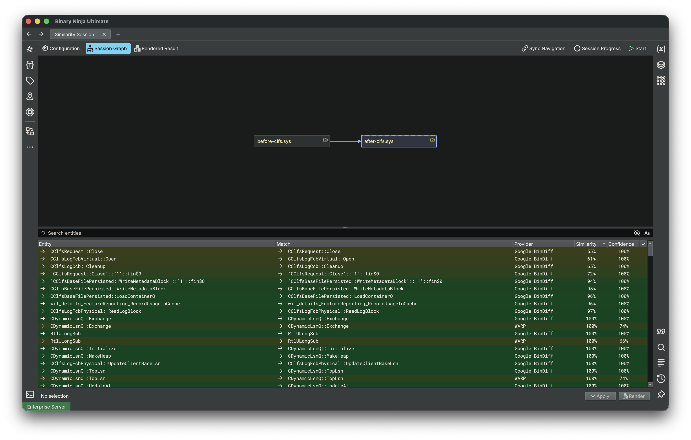
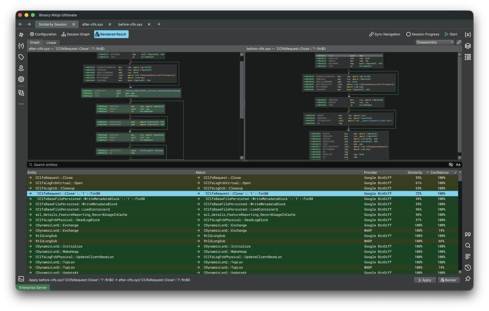
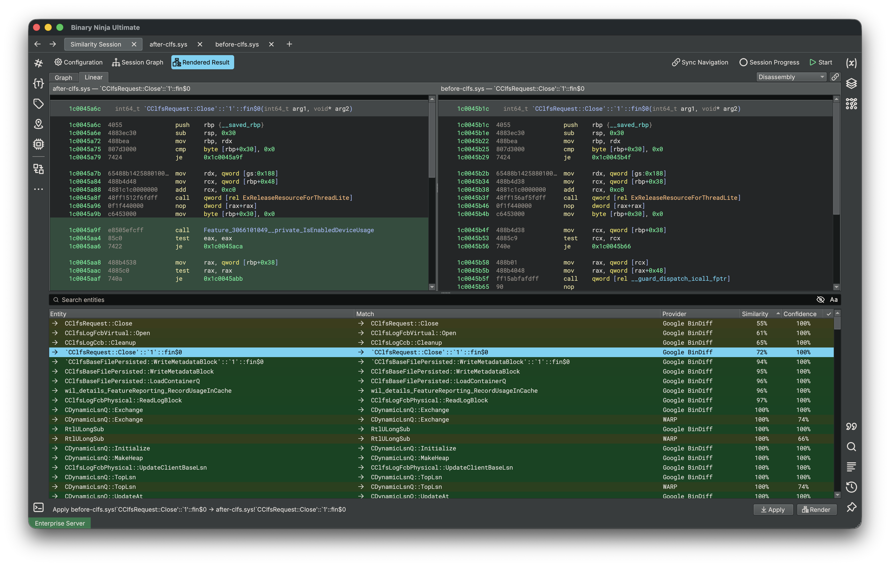

# Binary Similarity (Experimental)

Binary Similarity compares functions across two or more related binaries. It can help identify new or removed functions,
port analysis information to new versions, and show how matched functions changed. Comparisons are organized into a
session so you can choose the binaries to compare, the matching algorithms to use, and whether strong matches should be
applied automatically.

!!! Important "Supported Editions"
    Binary Similarity is only available in the [Ultimate edition](https://binary.ninja/purchase/#commercial) of Binary Ninja.

Binary Ninja includes two similarity providers:

- **Google BinDiff** finds structurally similar functions, including functions that are not byte-for-byte identical.
- **WARP** finds exact function matches using [WARP][WARP] signatures.

Plugins may supply additional providers. You can use more than one provider in the same session and compare their results together.



## How Binary Similarity Works

A similarity session has three important parts:

- **Nodes** are the binaries being compared.
- **Providers** find possible matches between functions.
- **Resolvers** optionally select and apply the best results.

Nodes are connected in a directed graph. An edge from `A` to `B` means that `A` is processed before `B`, and providers
compare `B` with its incoming neighbor `A`. The direction controls processing and comparison order; it does not
necessarily make the reported matches one-way. Providers can add match results to a previously visited node.

The graph can contain branches and merges, which is useful for comparing a family of binaries or several releases at
once.

!!! Tip "Tip"
    For a simple before-and-after comparison, use [Quick Setup](#quick-setup) when first opening the window.

### Providers and Resolvers

A provider reports possible function matches along with two measurements:

- **Similarity** describes how closely the functions match.
- **Confidence** describes how strongly the provider supports that match.

When a resolver selects a result, the session asks the provider to apply it. Depending on the provider and the available
analysis, this may transfer function names, types, variable information, and comments.

The **Metric Similarity Resolver** combines available provider results, ignores results below its configured thresholds,
and selects the best-supported target. Add and configure this resolver through the session's **Configuration** dialog.

!!! Warning "Automatic Analysis Changes"
    A session with a resolver may apply selected matches while it runs. To review results without changing analysis,
    configure providers but do **not** add a resolver. You can then apply individual results from the result table.

## Using the Binary Similarity Window

Choose **File > New Similarity Session**, or run `New Similarity Session` from the
[command palette](./index.md#command-palette). Each session opens as a main tab with an empty graph. Use
[Quick Setup](#quick-setup) for a two-binary comparison, or [build the graph](#building-the-comparison-graph) manually.

The toolbar across the top of the session contains these controls:

- **Configuration** opens the component and Quick Setup profile settings.
- **Session Graph** shows the comparison graph and the selected node's result table.
- **Rendered Result** returns to the most recently rendered comparison. It becomes available after you render a result.
- **Sync Navigation** follows the binary and function selected in the main UI. It is disabled by default.
- **Session Progress** opens detailed progress for each binary, provider, and resolver.
- **Start** begins processing. While a session is running, this changes to **Stop**.

### Quick Setup

For a two-binary comparison, select **Quick Setup** in an empty session. The wizard has two pages:

1. **Choose Binaries** selects the known or original reference binary (A) and the binary in which to find matches (B).
   Each can be an open Binary Ninja view or a file selected with **Browse files...**. When a project is open, the browser
   includes project files as well as external files. Quick Setup creates the edge `A -> B`.
2. **Choose a Similarity Profile** selects the providers and resolvers to use. **Review matches first** enables every
   available provider without a resolver. When resolvers are available, **Apply matches automatically** enables every
   available provider and resolver. Saved user profiles also appear here.

After the wizard finishes, Binary Ninja asks whether to run the session. Use **Configuration** to adjust components or
manage profiles before or after a run. Quick Setup is available only while the graph is empty.


### Building the Comparison Graph

An empty graph also provides **Add File** and **Add View** buttons. To construct or edit a graph manually, right-click
the graph to:

- Select **Add Files...** to add binaries from disk or the current project.
- Select **Add Node** to add a binary view that is already open.
- Select two nodes and connect them in either valid direction.
- Remove selected nodes or edges.
- Show or hide the mini graph for larger sessions.

You can also drag local files or project files directly onto the graph. Right-click a node to attach an incoming or
outgoing node, open an unloaded file, change its configuration, or remove it. Double-clicking a node navigates to its
open binary view.

!!! Note "Files Do Not Need to Stay Open"
    Files added from disk or a project can be loaded when the session runs and released afterward. This makes larger
    comparisons practical. Open a binary in the main UI when you want to navigate to one of its results. Rendering and
    applying offer to load required binaries when needed.

### Selecting Functions and Load Options

By default, the functions discovered in a binary are scheduled for processing. Right-click a node and select
**Node Configuration...** to customize it:

- Use the **Entities** tab to include or exclude functions from the next run.
- Use the **Load Options** tab to control how Binary Ninja opens and analyzes that file. This is useful for large
  binaries or raw firmware.

Restricting a session to the functions you care about can substantially reduce processing time for large binaries.

=== "Entities"
    

=== "Load Options"
    

### Configuring Matching

Select **Configuration** in the session toolbar. The dialog has two tabs:

- **Components** lists every available provider and resolver. Select one to view its description and settings, then use
  **Add Provider**, **Add Resolver**, **Remove Provider**, or **Remove Resolver** to change the session. Enabled
  components are highlighted, and setting changes are applied immediately.
- **Profiles** lists the built-in and user-defined profiles offered by Quick Setup. Use **Save Current as Profile...**
  to capture the session's current components, or **Delete Profile** to remove a user-defined profile. Built-in profiles
  cannot be deleted.

A common manual setup is:

1. Add **Google BinDiff** for approximate structural matching, **WARP** for exact matching, or both.
2. Add **Metric Similarity Resolver** if you want Binary Ninja to select and apply well-supported matches automatically.
3. Adjust the resolver's similarity and confidence thresholds to make automatic application more or less conservative.

If you want to inspect every result yourself, omit the resolver.

### Running a Session

Select **Start** after configuring the graph and matching components. The graph and settings cannot be edited while the
session is running.

The **Session Progress** button shows overall progress. Select it to see progress and timing for individual binaries,
providers, and resolvers. You can request a stop at any time. Providers check for stop requests while they work, so a
long-running operation may take a moment to finish.


You can run the same session again. Newly discovered or newly scheduled functions are processed, and adding another
provider or resolver makes existing functions eligible to be visited on the next run.

## Reviewing Results

Select a node in **Session Graph** to show its functions and possible matches in the table below the graph. The table
provides several ways to review a large result set:

- Enter text in **Search entities** to filter by entity or match name.
- Use the filter button to switch between similarity results and entities without results.
- Select a column heading to sort the table. Results initially sort by similarity from highest to lowest.
- Right-click the table header to show or hide optional columns such as addresses, total bytes, provider, similarity,
  confidence, and resolution status.
- Select one or more rows, then use **Apply** or **Render** in the footer. The context menu provides the same actions.

Rows are colored according to similarity. A check mark identifies the result selected by a resolver. The navigation
arrows in the **Entity** and **Match** columns navigate to that function when its binary is open. Enable **Sync
Navigation** to make the selected session node and entity follow navigation in the main UI.

### Applying a Result

Select one or more result rows and choose **Apply** to transfer the selected matches' available analysis information.
The exact information depends on the provider and the compatibility of the functions.

Applying requires active views for the affected binaries. If a required view is not available, Binary Ninja lists the
binaries that are not open and asks whether to load and open them. Save the affected databases afterward; applied
analysis does not persist unless the database is saved.

### Rendering a Comparison

Double-click a result or select **Render** from the context menu or footer to open it in **Rendered Result**. The
provider chooses the information to display, typically highlighting instructions that changed, were removed, or were
added between the two functions.

The render header provides:

- **Graph** and **Linear** tabs when the provider supplies those representations.
- A view selector for disassembly, IL, and available pseudo-language representations. This is a preference that the
  provider may override.
- **Synchronize Similarity Views**, which keeps navigation and zoom synchronized between the comparison panes. It is
  enabled by default.

=== "Graph comparison"
    

=== "Linear comparison"
    

## Multiple Sessions

Run `New Similarity Session` again to create another independent session. Each session opens in its own main
tab, so use the normal tab bar to switch between or close sessions.

Separate sessions are useful when comparing unrelated binary families or trying different provider and resolver
settings.

!!! Warning "Session Lifetime"
    Similarity session graphs and result lists are currently kept in memory for the active UI session. Analysis changes
    that you apply can be saved in a BNDB, but the comparison graph itself is **not** stored in that BNDB.

## Python and Headless Usage

[The Python API][Python API] can create and run the same sessions without the UI. The following example compares two
binaries with Google BinDiff and prints the matches found for the second binary:

```python
import time

from binaryninja import SimilarityProviderType, SimilaritySession, SimilaritySessionNode, load


session = SimilaritySession()
provider_type = SimilarityProviderType["Google BinDiff"]
provider = provider_type.create(provider_type.get_default_settings())
session.add_provider(provider)

old_node = SimilaritySessionNode(load("old-version.elf"))
new_node = SimilaritySessionNode(load("new-version.elf"))
session.graph.add_node(old_node)
session.graph.add_node(new_node)
session.graph.add_edge(old_node, new_node)

completion = session.run()
while not completion.is_finished:
    time.sleep(0.1)

for entity_id in new_node.entities:
    entity = new_node.get_entity(entity_id)
    if entity is None:
        continue
    for result_id in new_node.get_results(entity_id):
        result = new_node.get_result(result_id)
        matched_name = provider.get_name(new_node, entity_id, result_id) or "unknown"
        print(f"{entity.name} -> {matched_name}: {result.similarity / 255:.1%}")
```

`session.run()` starts in the background, so headless scripts should wait for `completion.is_finished` and may call
`completion.request_stop()` to cancel.

When a Binary Similarity tab is active, the Python console exposes its session as `current_similarity_session`. If
another main tab is active, the variable falls back to the current legacy sidebar session, when one exists.

## BinExport

BinExport files can be generated from the UI or headlessly for use outside Binary Ninja.

### Exporting from the UI

Run **Plugins > BinExport**, or select `BinExport` in the [command palette](./index.md#command-palette). Choose the
destination for the `.BinExport` file in the save dialog. Export failures are reported in the log and in the UI.

After exporting the binaries to compare, run BinDiff on the two files using its command-line or graphical interface:

```sh
bindiff baseline.BinExport modified.BinExport
```

### Exporting Headlessly

The same command works headlessly (without a UI). It writes a `.BinExport` file next to the source binary using the
source filename:

```python
from binaryninja import PluginCommand, PluginCommandContext

context = PluginCommandContext(bv)
PluginCommand.get_valid_list(context)["BinExport"].execute(context)
```

## Troubleshooting

If you encounter a scenario that is not covered here, let us know through one of our [support channels](./index.md#support).

### No Results Appear

- Confirm that at least one provider has been added to the session.
- Confirm that the nodes are connected; edge-based providers compare connected binaries.
- Open **Node Configuration...** and check that the expected functions are scheduled.
- Verify that the binaries loaded successfully with the selected load options.
- Remember that WARP finds exact matches, while BinDiff is intended for structurally similar functions.

### A Match Was Not Applied Automatically

- Confirm that a resolver, such as the Metric Similarity Resolver, was added before the run.
- Lower the resolver thresholds if the result is intentionally below the current requirements.
- Check whether another candidate has stronger combined evidence, according to the resolver's criteria.

### A Result Cannot Be Navigated To, Applied, or Rendered

Files loaded only for session processing may be released after the run. **Apply** and **Render** offer to load and open
the required binaries. Address navigation does not open a binary automatically; open it in Binary Ninja so the view can
be attached to the session node.

### Choosing Between WARP and BinDiff

Use WARP when you expect functions to match exactly aside from relocatable or other variant instructions. Use BinDiff
when you want to find functions that remain structurally related after recompilation or source changes. Using both
providers can give a resolver exact evidence where available and broader candidates everywhere else.

## Glossary

### Similarity Session

A **Similarity Session** contains the binaries, matching providers, optional resolvers, and results for one comparison
workflow. Multiple independent sessions can be open as main tabs.

### Session Graph

The **Session Graph** shows the binaries in a session and the relationships between them. It controls which binaries are
compared and the order in which they are processed.

### Node

A **Node** represents one binary in the session graph. A node can use an already-open Binary Ninja view or load a file
when the session runs.

### Edge

An **Edge** is a directed connection between two nodes. An edge from `A` to `B` makes `A` run before `B` and allows
edge-based providers to compare the two binaries.

### Entity

An **Entity** is an item that can be compared. Binary Similarity currently uses function entities.

### Scheduled Entity

A **Scheduled Entity** is an entity selected for provider processing during the next run. Functions discovered in a
binary are scheduled by default, but they can be included or excluded through **Node Configuration**.

### Provider

A **Provider** is a matching method that reports possible relationships between entities. Google BinDiff and WARP are
the built-in providers.

### Resolver

A **Resolver** evaluates provider results and may select the best-supported match. Depending on its configuration, the
selected match can be applied to the analysis automatically.

### Result

A **Result** is a possible match reported by a provider. It identifies the matched target and includes similarity and
confidence measurements.

### Similarity

**Similarity** describes how closely two entities match according to a provider. A higher value means the provider found
the entities more alike.

### Confidence

**Confidence** describes how strongly a provider supports a result. A resolver can combine confidence from multiple
providers when choosing between possible matches.

### Resolved Result

A **Resolved Result** is the result selected for an entity by a resolver. It is shown with a check mark in the results
table.

[WARP]: warp.md
[Python API]: https://api.binary.ninja/binaryninja.similarity-module.html
