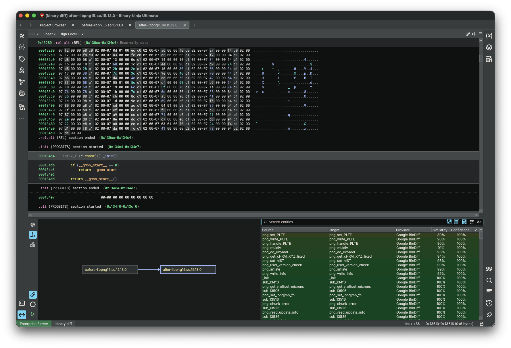
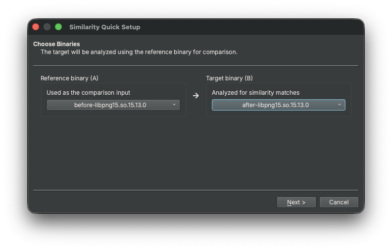
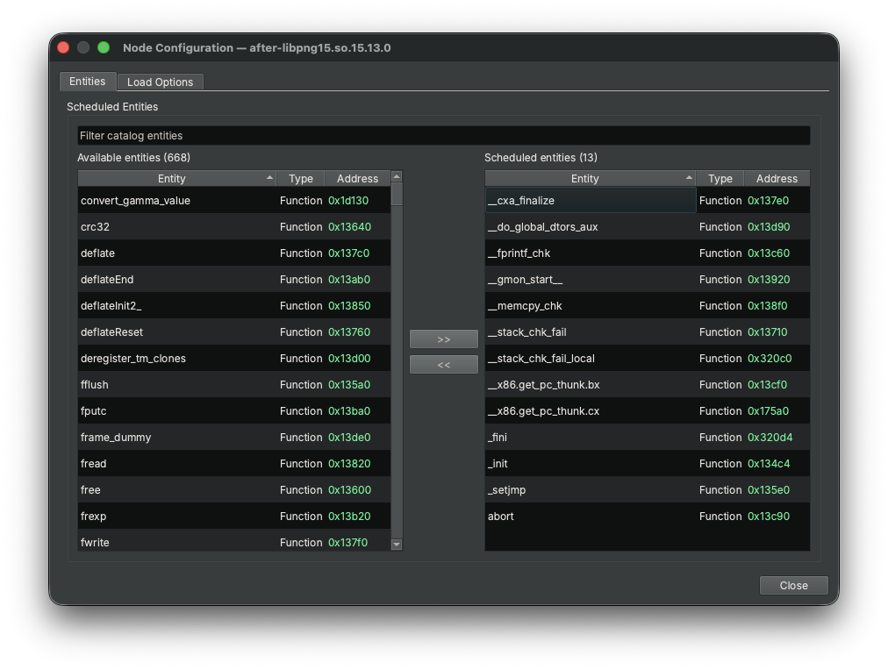
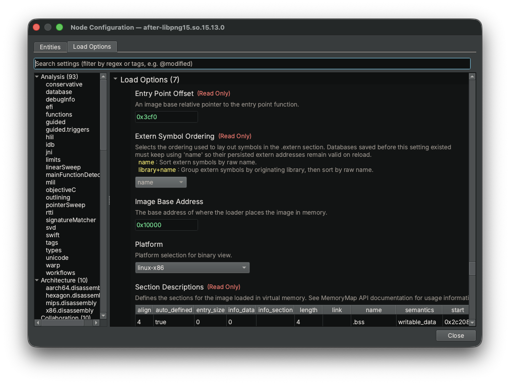
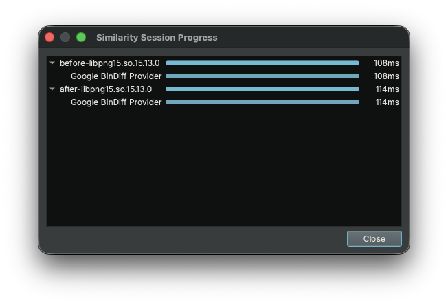
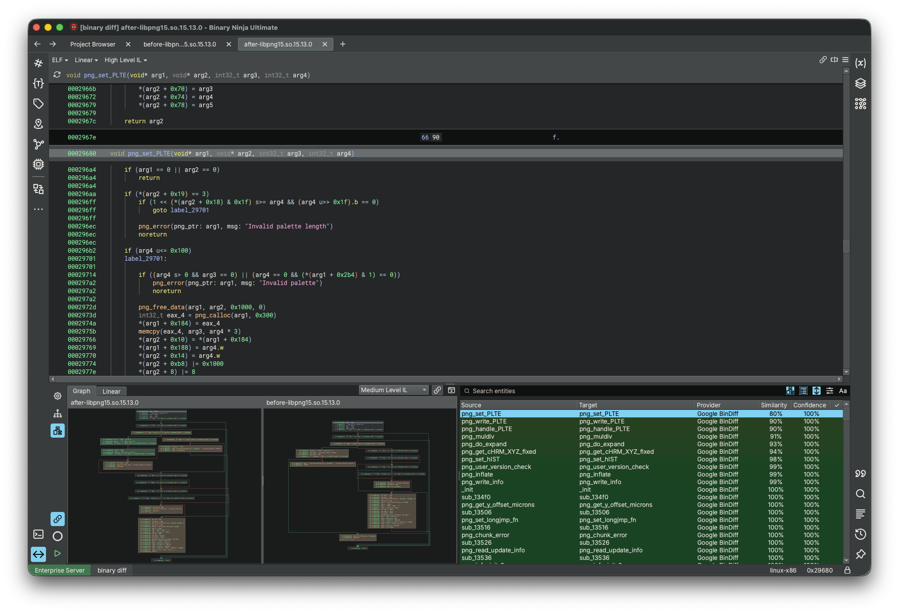
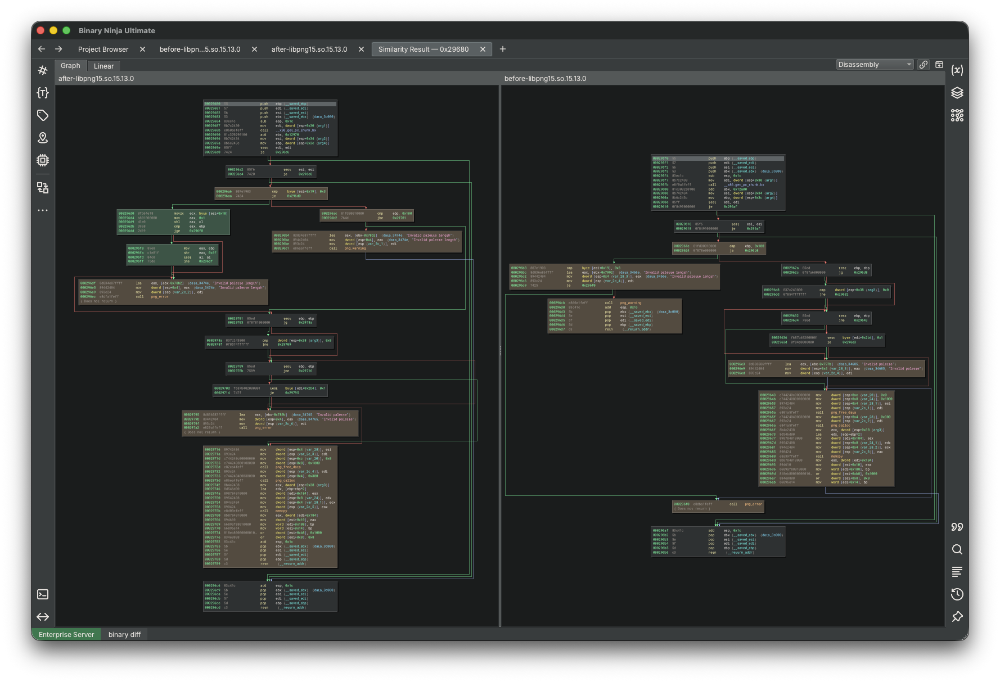

# Binary Similarity (Experimental)

Binary Similarity compares functions across two or more related binaries. It can help identify new or removed functions, port
analysis information to new versions, and show how matched functions changed. Comparisons are organized into a session so
you can choose the binaries to compare, the matching algorithms to use, and whether strong matches should be applied
automatically.

!!! Important "Supported Editions"
    Binary Similarity is only available in the [Ultimate edition](https://binary.ninja/purchase/#commercial) of Binary Ninja

Binary Ninja includes two similarity providers:

- **Google BinDiff** finds structurally similar functions, including functions that are not byte-for-byte identical.
- **WARP** finds exact function matches using [WARP][WARP] signatures.

Additional providers may be supplied by plugins. You can use more than one provider in the same session and compare
their results together.



## How Binary Similarity Works

A similarity session has three important parts:

- **Nodes** are the binaries being compared.
- **Providers** find possible matches between functions.
- **Resolvers** optionally select and apply the best results.

Nodes are connected in a directed graph. An edge from `A` to `B` means that `A` is processed before `B` and providers
compare `B` with its incoming neighbor `A`. The direction controls processing and comparison order; it does not
necessarily make the reported matches one-way (i.e. providers can add match results to a previously visited node).

The graph can contain branches and merges, which is useful for comparing a family of binaries or several releases at
once.

!!! Tip "Tip"
    For a simple before-and-after comparison, use the [Quick Setup](#quick-setup) action when first opening the sidebar.

### Providers and Resolvers

A provider reports possible function matches along with two measurements:

- **Similarity** describes how closely the functions match.
- **Confidence** describes how strongly the provider supports that match.

The **Metric Similarity Resolver** combines available provider results, ignores results below its configured thresholds,
and selects the best supported target. When a resolver selects a result, the session asks the provider to apply it.
Depending on the provider and the available analysis, this may transfer function names, types, variable information, and
comments.

!!! Warning "Automatic Analysis Changes"
    A session with a resolver may apply selected matches while it runs. To review results without changing analysis,
    configure providers but do **not** add a resolver. You can then apply individual results from the results page.

## Using the Binary Similarity Sidebar

Open **Binary Similarity** from the sidebar or activate it through the command palette. A new session starts with an
empty graph. Choose to either perform [Quick Setup](#quick-setup) or [build the graph and settings](#building-the-comparison-graph) yourself.

The session rail (the sidebar to the left of the graph) contains these controls:

- **Session Configuration** opens the provider and resolver configuration dialog, not all providers or resolvers have a configuration.
- **Session Graph** shows the graph and, when a node is selected, its entities and results in a split pane.
- **Entity Render** returns to the most recently rendered comparison. It is enabled after an entity or result has been
  rendered.
- **Sync with Navigation** follows the binary and function selected in the main UI. It is disabled by default.
- **Session Progress** opens detailed progress for each binary, provider, and resolver.
- **Start Session Processing** starts the comparison (only shown if stopped).
- **Stop Session Processing** requests that the active run stop (only shown if running).

### Quick Setup

For a two-binary comparison, select **Quick Setup** in an empty session. The wizard has two pages:

1. **Choose Binaries** selects a reference binary and a target binary. Each can be an open Binary Ninja view or a file
   selected with **Browse files...**. Quick Setup creates the edge `reference -> target`.
2. **Select Matching Components** lists providers and optional resolvers in a table. Select at least one provider.

Quick Setup creates selected components with their default settings. After the wizard finishes, you will be asked to run
the session to generate results. Use **Session Configuration** afterward if you want to adjust component settings.

Quick Setup applies only to an empty graph. Use the graph controls (right-click context menu) for sessions with more than two binaries.



### Building the Comparison Graph

An empty graph also provides **Add File** and **Add View** buttons. To construct or edit a graph manually, right-click
the graph to:

- Select **Add Files...** to add binaries from disk or the current project.
- Select **Add Node** to add a binary view that is already open.
- Select two nodes and connect them in either valid direction.
- Remove selected nodes or edges.
- Show or hide the mini graph for larger sessions.

You can also drag local files or project files directly onto the graph.

Right-click a node to attach an incoming or outgoing node. Double-clicking a node navigates to its open binary view.

!!! Note "Files Do Not Need to Stay Open"
    Files added from disk or a project can be loaded when the session runs and released afterward. This makes larger
    comparisons practical. Open a binary in the main UI when you want to navigate to one of its results. Rendering and
    applying offer to load required binaries when needed.

### Selecting Functions and Load Options

By default, the functions discovered in a binary are scheduled for processing. Right-click a node and select
**Node Configuration...** to customize it:

- Use the **Entities** tab to include or exclude functions from the next run.
- Use the **Load Options** tab to control how Binary Ninja opens and analyzes that file. Useful for large binaries or raw firmware.

Restricting a session to the functions you care about can substantially reduce processing time for large binaries.





### Configuring Matching

Select **Session Configuration** on the session rail to open the configuration dialog. Providers and resolvers are
listed on the left. Select a component to view its description and settings, then use **Add Provider**, **Add Resolver**,
**Remove Provider**, or **Remove Resolver** to change the session. Settings for components already in the session are
applied as they are changed.

A common setup is:

1. Add **Google BinDiff** for approximate structural matching, **WARP** for exact matching, or both.
2. Add **Metric Similarity Resolver** if you want Binary Ninja to select and apply well-supported matches automatically.
3. Adjust the resolver's similarity and confidence thresholds to make automatic application more or less conservative.

If you want to inspect every result yourself, omit the resolver.

### Running a Session

Select **Start Session Processing** after configuring the graph and matching components. The graph and settings cannot
be edited while the session is running.

The progress button shows overall progress. Select it to see progress and timing for individual binaries, providers, and
resolvers. You can request a stop at any time. Providers check for stop requests while they work, so a long-running
operation may take a moment to finish.



You can run the same session again. Newly discovered or newly scheduled functions are processed, and adding another
provider or resolver makes existing functions eligible to be visited on the next run.

## Reviewing Results

Select a node in the **Session Graph** to show its functions and possible matches in the result pane beside the graph.
Results can be shown as a tree or a table. The result controls allow you to:

- Search by entity or result name.
- Filter by similarity, confidence, number of matches, or resolution status.
- Sort by similarity or confidence.
- Color rows by similarity.
- Show only resolved or unresolved functions.

The check mark identifies the result selected by a resolver. Clicking a source or target address navigates to that
function when its binary is open.

If you wish to navigate with the main binary view, toggle the sidebar option **Sync with Navigation**.



### Applying a Result

Right-click one or more result rows and select **Apply** to transfer the selected matches' available analysis
information. The exact information depends on the provider and the compatibility of the functions.

Applying requires active views for the affected binaries. If a required view is not available, Binary Ninja lists the
binaries that are not open and asks whether to load and open them.

After applying information make sure to save the database like you normally would, as the information will not be persisted otherwise.

### Rendering a Comparison

Rendering is done via clicking on a result (or via the right click menu), the views will be shown with whatever information
the provider deems relevant to show the user, typically this is done by highlighting changes.

The render header provides:

- **Graph** and **Linear** tabs when the provider supplies those representations.
- A view selector for common view levels (disassembly and ILs), this is a "preference" and the provider may ignore it.
- **Synchronize Similarity Views**, synchronizes scrolling and zooming between comparison panes. It is disabled by default.
- **Open Result in Main Tab**, which opens a copy of the rendered comparison in the main tab area.



## Multiple Sessions

Use the **New Similarity Session** command to create another independent session. When more than one session exists, a
numbered rail appears in the sidebar. Select a number to switch sessions, or right-click it to delete that session.

Separate sessions are useful when comparing unrelated binary families or trying different provider and resolver
settings.

!!! Warning "Session Lifetime"
    Similarity session graphs and result lists are currently kept in memory for the active UI session. Analysis changes
    that you apply can be saved in a BNDB, but the comparison graph itself is **not** stored in that BNDB.

## Python and Headless Usage

[The Python API][Python API] can create and run the same sessions without the UI. The following example compares two
binaries with Google BinDiff and prints the matches found for the second binary:

```python
import time

from binaryninja import Settings, SimilarityProviderType, SimilaritySession, SimilaritySessionNode, load


session = SimilaritySession()
provider_type = SimilarityProviderType["Google BinDiff"]
provider = provider_type.create(provider_type.get_default_settings())
session.add_provider(provider)

old_node = SimilaritySessionNode(load("old-version.elf"))
new_node = SimilaritySessionNode(load("new-version.elf"))
session.graph.add_node(old_node)
session.graph.add_node(new_node)
session.graph.add_edge(old_node, new_node)

completion = session.run()
while not completion.is_finished:
    time.sleep(0.1)

for entity_id in new_node.entities:
    entity = new_node.get_entity(entity_id)
    if entity is None:
        continue
    for result_id in new_node.get_results(entity_id):
        result = new_node.get_result(result_id)
        matched_name = provider.get_name(new_node, entity_id, result_id) or "unknown"
        print(f"{entity.name} -> {matched_name}: {result.similarity / 255:.1%}")
```

`session.run()` starts in the background, so headless scripts should wait for `completion.is_finished` and may call
`completion.request_stop()` to cancel.

When the [sidebar](#using-the-binary-similarity-sidebar) is open, the python console also exposes the active session as
`current_similarity_session`. This is useful for inspecting or extending the graph programmatically without rebuilding the
session in a separate script.

## Troubleshooting

Common troubleshooting scenarios, if you run into something you think we should add here let us know on our [Slack][Slack].

### No Results Appear

- Confirm that at least one provider has been added to the session.
- Confirm that the nodes are connected; edge-based providers compare connected binaries.
- Open **Node Configuration...** and check that the expected functions are scheduled.
- Verify that the binaries loaded successfully with the selected load options.
- Remember that WARP finds exact matches, while BinDiff is intended for structurally similar functions.

### A Match Was Not Applied Automatically

- Confirm that a resolver (such as the metrics resolver) was added before the run.
- Lower the resolver thresholds if the result is intentionally below the current requirements.
- Check whether another candidate has stronger combined evidence (evidence being whatever the resolver considers, such as confidence).

### A Result Cannot Be Navigated To, Applied, or Rendered

Files loaded only for session processing may be released after the run. **Apply** and **Render** offer to load and open
the required binaries. Address navigation does not open a binary automatically; open it in Binary Ninja and the view will
be attached to the sessions node so that navigation may occur.

### Choosing Between WARP and BinDiff

Use WARP when you expect functions to match exactly aside from relocatable or other variant instructions. Use BinDiff
when you want to find functions that remain structurally related after recompilation or source changes. Using both
providers can give a resolver exact evidence where available and broader candidates everywhere else.

## Glossary

Here is a list of terms used by Binary Similarity and a simplified description of each.

### Similarity Session

A **Similarity Session** contains the binaries, matching providers, optional resolvers, and results for one comparison
workflow. Multiple independent sessions can be open in the Binary Similarity sidebar.

### Session Graph

The **Session Graph** shows the binaries in a session and the relationships between them. It controls which binaries are
compared and the order in which they are processed.

### Node

A **Node** represents one binary in the session graph. A node can use an already-open Binary Ninja view or load a file
when the session runs.

### Edge

An **Edge** is a directed connection between two nodes. An edge from `A` to `B` makes `A` run before `B` and allows
edge-based providers to compare the two binaries.

### Entity

An **Entity** is an item that can be compared. Binary Similarity currently uses function entities.

### Scheduled Entity

A **Scheduled Entity** is an entity selected for provider processing during the next run. Functions discovered in a
binary are scheduled by default, but they can be included or excluded through Node Configuration.

### Provider

A **Provider** is a matching method that reports possible relationships between entities. Google BinDiff and WARP are
the built-in providers.

### Resolver

A **Resolver** evaluates provider results and may select the best-supported match. Depending on its configuration, the
selected match can be applied to the analysis automatically.

### Result

A **Result** is a possible match reported by a provider. It identifies the matched target and includes similarity and
confidence measurements.

### Similarity

**Similarity** describes how closely two entities match according to a provider. A higher value means the provider found
the entities more alike.

### Confidence

**Confidence** describes how strongly a provider supports a result. A resolver can combine confidence from multiple
providers when choosing between possible matches.

### Resolved Result

A **Resolved Result** is the result selected for an entity by a resolver. It is shown with a check mark in the results
view.

[WARP]: warp.md
[Python API]: https://api.binary.ninja/binaryninja.similarity-module.html
[Binary Ninja API repository]: https://github.com/Vector35/binaryninja-api/blob/dev/python/examples/bindiff.py
[Slack]: https://slack.binary.ninja/
