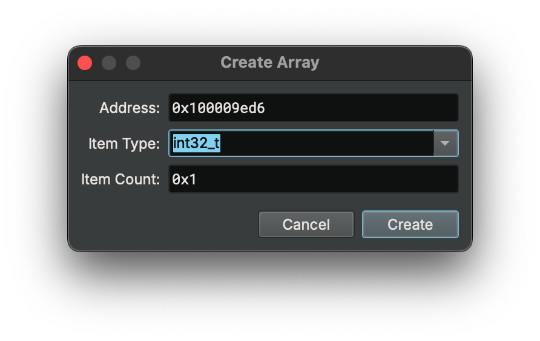
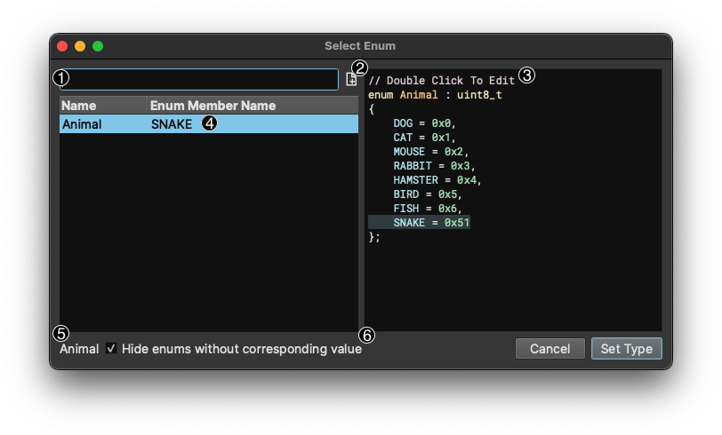
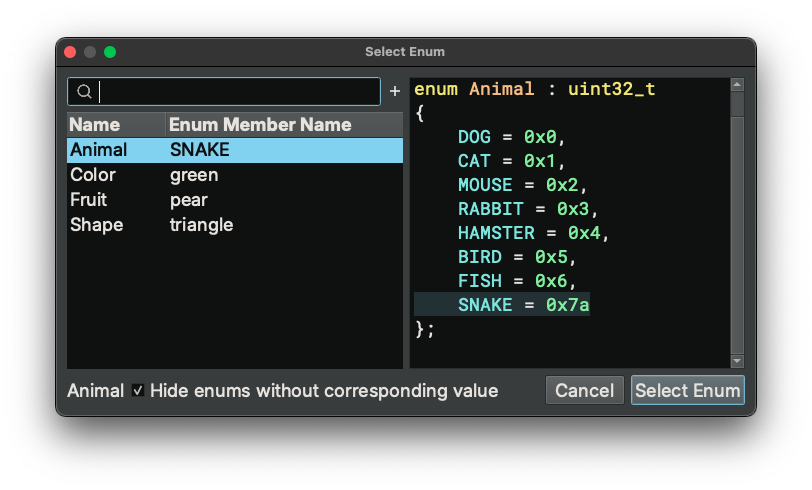
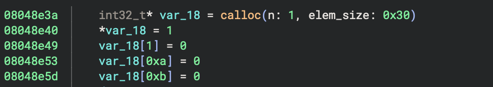
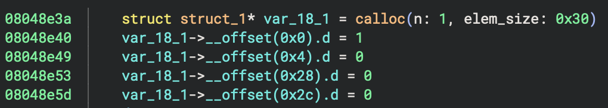
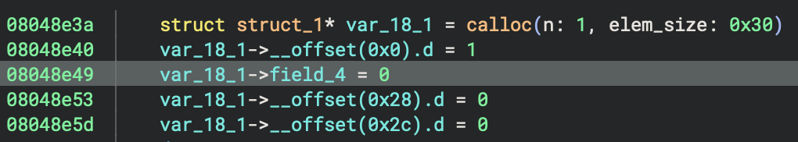
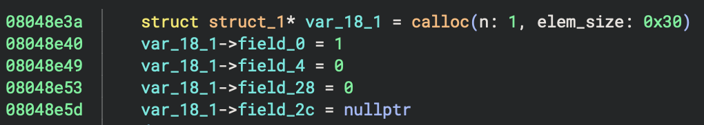
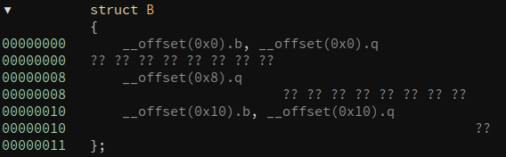
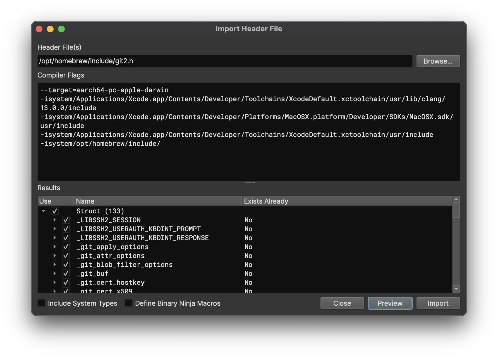

# Working with Types, Structures, and Symbols

This document is organized into four sections describing how to work with types in Binary Ninja. The first [section](#working-with-types) is how to interact with any type, regardless of its source.

The [second section](#type-library) explains how to work with the Type Library. This includes multiple sources of information from which Binary Ninja can automatically source for type information from and how you can add to them.

Next, the [third section](#signature-library) explains how to work with the signature library. While the signature library technically does not directly inform types, it will help automatically match statically compiled functions which are then matched with the type libraries described in the previous section.

Finally, we'll [cover](#symbols) how to work with Symbols in a binary.

## Working With Types

There are two main ways to interact with types from within a binary view. The first is to use the [types view](#types-view), and the second is to take advantage of the [smart structures workflow](#smart-structures-workflow) or otherwise annotate types directly in a disassembly or IL view.

### Direct UI manipulation

The simplest way to directly manipulate types in disassembly is by viewing an existing variable or sequence of bytes in linear view and using the following hotkeys:


 - `1`, `2`, `4`, `8`: The number hotkeys will create a data variable at the current location if none exists, and then change the size of the variable to an integer in the size of bytes specified in the hotkey.
 - `d`: If you want to cycle through the different integer sizes, repeatedly pressing `d` has the same effect as pressing the numbers in order.
 - `-`: To quickly toggle integers between signed and unsigned integers, you can use the `-` hotkey.
 - `a`: This hotkey sets or creates the current variable to a character array up until and including the next null byte.
 - `o`: `o` will set or create the current variable to be a pointer reference.
 - `*`: If you have a selection of identical variables, `*` will convert them into an array of elements. If you have no selection, the "Create Array" dialog will be shown allowing you to create an array of specific type and count at the current location.

 - `s`: `s` is a magic hotkey described in the next section in greater detail
 - `m`: Used to apply an enumeration display at an integer (more details [below](#enumeration-selector))

 Note that you can apply these types to a region of memory as well, not just a single variable. So selecting a large block of bytes and pressing `2` `*` for example will create an array of `int16_t` sized elements.

### Enumeration Selector



The Enum Dialog, with a default hotkey of `m` can be used to both change the type for data variables, arguments, and local variables to an enum type and also to change the Display Type of constant integers to any matching enumeration members.

When used on an integer, all matching enumeration members will be shown.

1. Filter box to search large lists of matching enums
1. "New Enum" button to allow creation of a new enum
1. Enum preview (can also be used to edit an existing enum by double clicking a given line)
1. Currently selected enum/member (when the enum is selected, the preview will update, and you can also right-click here to change the type)
1. Name of currently selected enum
1. Checkbox (set by default) that hides enums with no matching members for the current integer.

However in instances where the hotkey is used on other variables, the display will only be used to apply the enum type to the selection and does not allow editing.



### Smart Structures Workflow

"Smart Structures" feature enables automatic creation of a structure and its members directly from the disassembly/IL view using the `s` hotkey.
It simplifies the traditional workflow in which the user first creates a type in the types view and then applies it to disassembly.
It works in the following ways:

| View               | Selection                                                    | Current Type         | Behavior                                                                          |
|--------------------|--------------------------------------------------------------|----------------------|-----------------------------------------------------------------------------------|
| Linear/Graph       | A variable                                                   | Not a struct/struct* | Create structure dialog                                                           |
| Linear/Graph       | A variable that is the result an allocation routine          | Not a struct/struct* | Create structure with allocation size                                             |
| Linear/Graph/Types | A variable, data variable, or a type name                    | struct/struct*       | Create all members for structure                                                  |
| Linear/Graph/Types | A StructOffsetToken token, e.g., <code>__offset(0x18)</code> | N/A                  | Create current member for structure                                               |

Below are detailed explanation of it:

1. In linear/graph view, if the selection is a variable that is not a structure, a dialog pops up and asks you to create a structure. You can specify the structure's name and size. There is also a checkbox that asks you whether the variable's type should be the structure itself or a pointer to the structure.
2. In linear/graph view, if the selection is a variable that is not a structure, and it happens to be the result of a memory allocation routine, e.g., `malloc`, a new structure will be created and its size is automatically determined (if possible). The variable's type will be a pointer to the structure.
3. In linear/graph/types view, If you select a variable whose type is a structure, or a pointer to a structure, BN will try to create all structure field at any offset that has been accessed in the code.
4. In linear/graph/types view, If you select a StructOffsetToken, BN will try to create a structure member at the current offset.


The automatic member creation mentioned in #3 and #4 takes into consideration both incoming and outgoing type information for the accessed offsets and selects the most confident one as the type for the offset.
When no type information can be used to create the structure member, we fall back to creating an integer type based on the size of accesses. For example, if we see an access of size 4, we will create an `int32_t`. In case there are different sizes of accesses, we do not create the member. You will need to examine the conflicting size information and decide how to create a member.


Consider the following example (created using [taped](../files/chal1) from the 2011 Ghost in the Shellcode CTF if you'd like to play along at home):

| Step                                                                                                                                                                                                                                               | Preview                                                    |
|----------------------------------------------------------------------------------------------------------------------------------------------------------------------------------------------------------------------------------------------------|------------------------------------------------------------|
| Go to address <code>0x8048e20</code> and switch to HLIL.                                                                                                                                                                                           |  |
| Select variable <code>var_18</code> and press <code>s</code>. <br/>Since <code>calloc</code> is a known allocation routine and the allocation size can be determined to be 0x30, a new structure, <code>struct_1</code> is created with size 0x30. |  |
| Select an offset, e.g., <code>__offset(0x4).d</code> and press <code>s</code>. A member will be automatically created.                                                                                                                             |  |
| Alternatively, select the <code>var_18</code> or the type name <code>struct_1</code> and press <code>s</code>. All members in the <code>struct_1</code> will be automatically created.                                                             |  |
| Viewing the automatically created structure members.                                                                                                                                                                                               |  |


The `s` hotkey also works when working with structures in the linear view. Its behavior differs based on the current selection:


| Selection                                                    | Behavior                                                                          |
|--------------------------------------------------------------|-----------------------------------------------------------------------------------|
| A single byte                                                | Create structure dialog                                                           |
| A range of bytes                                             | Create structure with selection size                                              |
| A range of bytes covering existing data variables            | Create structure with selection size and add existing data vars as struct members |


In linear view, if the selection is a single byte outside any function, it will pop up the create structure dialog. If the selection is a range of bytes, a structure of the selection size is created and the start of the selection. If the selection covers any existing data variables, these data variables will become members within the newly created structure.

This also works within data variables with structure type. For example, if the selection is a range of bytes within a structure, a new structure will be created within the existing structure.


### Types View

To see all types in a Binary View, use the types view. It can be accessed from the menu `View > Types`. Alternatively, you can access it with the `t` hotkey from most other views, or using `[CMD/CTRL] p` to access the command-palette and typing "types". This is the most common interface for creating structures, unions and types using C-style syntax.

For many built-in file formats you'll notice that common headers are already enumerated in the types view. These headers are applied when viewing the binary in [linear view](./#linear-view) and will show the parsed binary data into that structure or type making them particularly useful for binary parsing even of non-executable file formats.


#### Shortcuts and Attributes

From within the Types view, you can use the following hotkeys to create new types, structures, or unions. Alternatively, you can use the right-click menu to access these options and more.


* `s` - Create new structure
* `i` - Create new type
* `[SHIFT] s` - Creating a new union
* `1`, `2`, `4`, `8`: The number hotkeys will create a create an integer of the specified size. This additionally works on selections.
* `d`: If you want to cycle through the different integer sizes, repeatedly pressing `d` has the same effect as pressing the numbers in order.
* `-`: To quickly toggle integers between signed and unsigned integers, you can use the `-` hotkey.


The shortcuts for editing existing elements are:

* `y` - Edit type / field
* `n` - Rename type / field
* `l` - Set structure size
* `u` - undefine field

Structs support the attribute `__packed` to indicate that there is no padding. Additionally, function prototypes support the following keywords to indicate their calling convention or other features:

``` text
__cdecl
__stdcall
__fastcall
__convention
__noreturn
```

To use the `__convention` keyword, pass in the convention name as a parameter argument:

```
__convention("customconvention")
```


#### Structure Access Annotations

Types view now annotates code references to structure offsets. It uses the same convention as in the graph/linear view. For example, the `__offset(0x8).q` token means the code references the offset 0x8 of this structure, and the size of the access is a qword. This will make it easier to see which offsets of a structure are being used, and aid in the process of creating structure members.




#### Applying Structures and Types


Once you've created your structures, you can apply them to your disassembly. Simply select an appropriate token (variable or memory address), and press `y` to bring up the change type dialog. Types can be applied on both disassembly and all levels of IL. Any variables that are shared between the ILs will be updated as types are applied.


#### Examples

``` C
enum _flags
{
    F_X = 0x1,
    F_W = 0x2,
    F_R = 0x4
};
```

``` C
struct Header __packed
{
    char *name;
    uint32_t version;
    void (* callback)();
    uint16_t size;
    enum _flags flags;
};
```

### Import Header File

If you already have a collection of headers containing types you want to use, you can import them directly. You can specify the compiler flags that would be used if a compiler were compiling a source file that uses this header. Specifically this means you can/should specify:

- `-isystem<path>` for various system header paths
- `-I<path>` for various user header paths
- `-D<macro>=<value>` for macro definitions
- `-x c -std=c99` to specify C99 mode
- Other Clang-compatible command-line flags are accepted (eg `-fms-extensions`, `-fms-compatibility`, etc)

You can specify that types from system headers, accessed via `#include <header.h>`, will be in the results. Otherwise, only files from user headers, accessed via `#include "header.h"` will be used.

You can also specify Define Binary Ninja Macros, which makes the type parser include the various parser extensions that Binary Ninja allows in the Type View editors, eg `__packed`, `__padding`, `__syscall`, etc. You probably only want to use this option when importing a header file exported using [Export Header File](#export-header-file). 

After specifying the file(s) and flag(s), pressing Preview will give a list of all the types and functions defined in the file(s). You may check or uncheck the box next to any of the types/functions to control whether they will be imported to your analysis.

If there were any parse errors, those will be shown instead of a list of types. Generally speaking, what this means is you're missing either header search paths or compile definitions. See the section below on [finding system headers](#finding-system-headers).

After pressing Import, all the checked types/functions will be added to your analysis. Imported types will override any existing types you had defined so they are disabled by default as indicated via the `Exists Already` column. Imported functions will replace signatures of any functions in your analysis whose name matches signatures found in the header. 



#### Finding System Headers

Since you need to specify the include paths for system headers, you will need to deduce them for the target platform of your analysis. Here are a few tricks that may help:

##### Systems with GCC/Clang (macOS, Linux, etc)

On these systems, you can run a command to print the default search path for compilation:

    gcc -Wp,-v -E -
    clang -Wp,-v -E -

For the directories printed by this command, you should include them with `-isystem<path>` in the order specified.

For example on macOS, with Xcode 13:

    $ clang -Wp,-v -E -
    clang -cc1 version 13.0.0 (clang-1300.0.29.3) default target arm64-apple-darwin21.6.0
    ignoring nonexistent directory "/Applications/Xcode.app/Contents/Developer/Platforms/MacOSX.platform/Developer/SDKs/MacOSX.sdk/usr/local/include"
    ignoring nonexistent directory "/Applications/Xcode.app/Contents/Developer/Platforms/MacOSX.platform/Developer/SDKs/MacOSX.sdk/Library/Frameworks"
    #include "..." search starts here:
    #include <...> search starts here:
     /usr/local/include
     /Applications/Xcode.app/Contents/Developer/Toolchains/XcodeDefault.xctoolchain/usr/lib/clang/13.0.0/include
     /Applications/Xcode.app/Contents/Developer/Platforms/MacOSX.platform/Developer/SDKs/MacOSX.sdk/usr/include
     /Applications/Xcode.app/Contents/Developer/Toolchains/XcodeDefault.xctoolchain/usr/include
     /Applications/Xcode.app/Contents/Developer/Platforms/MacOSX.platform/Developer/SDKs/MacOSX.sdk/System/Library/Frameworks (framework directory)
    End of search list.

From this example, the flags would be: (note: not including the framework directory line)

    -isystem/usr/local/include
    -isystem/Applications/Xcode.app/Contents/Developer/Toolchains/XcodeDefault.xctoolchain/usr/lib/clang/13.0.0/include
    -isystem/Applications/Xcode.app/Contents/Developer/Platforms/MacOSX.platform/Developer/SDKs/MacOSX.sdk/usr/include
    -isystem/Applications/Xcode.app/Contents/Developer/Toolchains/XcodeDefault.xctoolchain/usr/include

Another example on Arch Linux:

    $ gcc -Wp,-v -E -
    ignoring nonexistent directory "/usr/lib/gcc/x86_64-pc-linux-gnu/12.2.0/../../../../x86_64-pc-linux-gnu/include"
    #include "..." search starts here:
    #include <...> search starts here:
     /usr/lib/gcc/x86_64-pc-linux-gnu/12.2.0/include
     /usr/local/include
     /usr/lib/gcc/x86_64-pc-linux-gnu/12.2.0/include-fixed
     /usr/include
    End of search list.

From this example, the flags would be:

    -isystem/usr/lib/gcc/x86_64-pc-linux-gnu/12.2.0/include
    -isystem/usr/local/include
    -isystem/usr/lib/gcc/x86_64-pc-linux-gnu/12.2.0/include-fixed
    -isystem/usr/include

##### For Windows

For windows, there's no easy command to list all the include paths so you have to piece them together from the `Include Directory` property in a Visual Studio project. You also want to include `-x c -std c99` since Windows headers include lots of C++ types that the type importer currently does not support.

You will end up with something like the following for user mode:

    -x c -std c99
    -isystem"C:\Program Files (x86)\Microsoft Visual Studio\2019\Professional\VC\Tools\MSVC\14.28.29333\include"
    -isystem"C:\Program Files (x86)\Windows Kits\10\Include\10.0.19041.0\ucrt"
    -isystem"C:\Program Files (x86)\Windows Kits\10\Include\10.0.19041.0\shared"
    -isystem"C:\Program Files (x86)\Windows Kits\10\Include\10.0.19041.0\um"

Or, for kernel mode:

    -x c -std c99
    -isystem"C:\Program Files (x86)\Microsoft Visual Studio\2019\Professional\VC\Tools\MSVC\14.28.29333\include"
    -isystem"C:\Program Files (x86)\Windows Kits\10\Include\10.0.19041.0\ucrt"
    -isystem"C:\Program Files (x86)\Windows Kits\10\Include\10.0.19041.0\shared"
    -isystem"C:\Program Files (x86)\Windows Kits\10\Include\10.0.19041.0\km"

##### Cross-Platform Targets

If you are analyzing a target that is for a different operating system, you need to both find the header include paths for that system, and copy (or mount) them to a location accessible by the computer running Binary Ninja.   

### Export Header File

If you want to compile code using the structures you defined during your analysis, you can export all the types to a C-compatible header file that can be used via `#include` by a C compiler. You can also import this header in another analysis session via [Import Header File](#import-header-file), just be sure to enable `Define Binary Ninja Macros` when doing so.

## Using the API

Binary Ninja provides a flexible API for creating and defining types explicitly. Binary Ninja `Type` objects are immutable, we provide two different methods for creating them. For simple types there are one-shot APIs that allow you to define the type with a single function call. Some situations are more complex and incremental construction is preferred, so we provide an additional `TypeBuilder` interface. The `TypeBuilder` interface is also useful for when you want to modify an existing type.
### Simple Type Creation

There are a number of different type objects available for creation:

- Integer Types
- Characters Types (technically an integer)
- Wide Characters Types (also technically an integer)
- Boolean (guess what? also technically an integer)
- Float Types (definitely not an integer)
- Pointers
- Void (like an integer but if its size was zero)
- Functions
- Arrays
- Enumeration (kind of an integer)
- Structures (probably has integers in it)
- Type Definitions

#### Creating Types Using the Type Parser

Binary Ninja's built-in type parser provides a very convenient way of creating types when you can't remember the exact API to call. The `parse_type_string` API returns a tuple of `Type` and `string` name for the string passed.

```python
>>> bv.parse_type_string("uint64_t")
(<type: uint64_t>, '')
```

Though convenient it is many orders of magnitude slower than simply calling the APIs directly. For applications where performance is at all desired the following APIs should be used.

#### Integer Types

```python
Type.int(4) # Creates a 4 byte signed integer
Type.int(8, False) # Creates an 8 bytes unsigned integer
Type.int(2, altName="short") # Creates a 2 byte signed integer named 'short'
# Similarly through their classes directly
IntegerType.create(4)
IntegerType.create(8, False)
IntegerType.create(2, altName="short")
```

#### Character Types

```python
Type.char() # This is just a 1 byte signed integer and can be used as such
Type.wideChar(2, altName="wchar_t") # Creates a wide character with the name 'wchar_t'
# Similarly through their classes directly
CharType.create()
WideCharType.create(2)
```

#### Boolean

```python
Type.bool()
# Similarly through its class directly
BoolType.create()
```

#### Floating-point Types

_All floating point numbers are assumed to be signed_

```python
Type.float(4) # Creates a 4 byte ieee754 'float'
Type.float(8) # Creates a 8 byte ieee754 'double'
Type.float(10) # Creates a 10 byte ieee754 'long double'
Type.float(16) # Creates a 16 byte ieee754 'float128'
# Similarly through their classes directly
FloatType.create(4)
FloatType.create(8)
FloatType.create(10)
FloatType.create(16)
```

#### Void

```python
Type.void() # Create a void type which has zero size
# Similarly through its class directly
VoidType.create()
```

#### Pointers

```python
Type.pointer(bv.arch, Type.int(4)) # Create a pointer to a signed 4 byte integer
Type.pointer(type=Type.int(4), width=bv.arch.address_size) # Equivalent to the above but doesn't require an Architecture object be passed around
Type.pointer(bv.arch, Type.void(), const=True, volatile=False) # Creates a constant non volatile void pointer.
# Similarly through their classes directly
PointerType.create(bv.arch, Type.int(4))
PointerType.create(type=Type.int(4), width=bv.arch.address_size)
PointerType.create(bv.arch, Type.void(), const=True, volatile=False)
```

#### Arrays

```python
Type.array(Type.int(4), 2) # Create an array of 2 - 4 byte integers
# Similarly through their classes directly
ArrayType.create(Type.int(4), 2)
```

#### Function Types

```python
Type.function() # Creates a function with which takes no parameters and returns void
Type.function(Type.void(), [('arg1', Type.int(4))]) # Create a function type which takes an integer as parameter and returns void
Type.function(params=[('arg1', Type.int(4))]) # Same as the above
# Similarly through their classes directly
FunctionType.create()
FunctionType.create(Type.void(), [('arg1', Type.int(4))])
FunctionType.create(params=[('arg1', Type.int(4))])
```

#### Create Anonymous Structures/Class/Unions

In Binary Ninja's type system supports anonymous and named structures. Anonymous structures are the simplest
to understand, and what most people would expect.

```python
Type.structure(members=[(Type.int(4), 'field_0')], type=StructureVariant.UnionStructureType) # Create a union with one integer members
Type.structure(members=[(Type.int(4), 'field_0'), (Type.int(4), 'field_4')], packed=True) # Created a packed structure containing two integer members
Type.structure(members=[(Type.int(4), 'field_0')], type=StructureVariant.ClassStructureType) # Create a class with one integer members
# Similarly through their classes directly
StructureType.create(members=[(Type.int(4), 'field_0')], type=StructureVariant.UnionStructureType)
StructureType.create(members=[(Type.int(4), 'field_0'), (Type.int(4), 'field_4')], packed=True)
StructureType.create(members=[(Type.int(4), 'field_0')], type=StructureVariant.ClassStructureType)
```

#### Create Anonymous Enumerations

```python
Type.enumeration(members=[('ENUM_2', 2), ('ENUM_4', 4), ('ENUM_8', 8)])
Type.enumeration(members=['ENUM_0', 'ENUM_1', 'ENUM_2'])
```

### Accessing Types

You may end up accessing types via a variety of APIs. In some cases, you're already working with a variable, function, or other object that has a type property:

```python
>>> current_function.function_type
<type: immutable:FunctionTypeClass 'int32_t(int32_t argc, char** argv, char** envp)'>
>>> current_function.parameter_vars[2]
<var char** envp>
>>> current_function.parameter_vars[2].type
<type: immutable:PointerTypeClass 'char**'>
```

#### Explicit Type Lookup

Of course, there are also methods to directly access a type independent of its association with any given object in analysis:

```python
>>> bv.types['Elf64_Header']
<type: immutable:StructureTypeClass 'struct Elf64_Header'>
# Or
>>> s = bv.get_type_by_name('Elf64_Header')
>>> s
<type: immutable:StructureTypeClass 'struct Elf64_Header'>
>>> s.members
[<struct Elf64_Ident ident, offset 0x0>, <enum e_type type, offset 0x10>, <enum e_machine machine, offset 0x12>, <uint32_t version, offset 0x14>, <void (* entry)(), offset 0x18>, <uint64_t program_header_offset, offset 0x20>, <uint64_t section_header_offset, offset 0x28>, <uint32_t flags, offset 0x30>, <uint16_t header_size, offset 0x34>, <uint16_t program_header_size, offset 0x36>, <uint16_t program_header_count, offset 0x38>, <uint16_t section_header_size, offset 0x3a>, <uint16_t section_header_count, offset 0x3c>, <uint16_t string_table, offset 0x3e>]
```

#### Accessing Data Variable Values

Even more powerful are the APIs when a type is applied to a specific data variable because you can directly query members or values according to the type:

```python
>>> header = bv.get_data_var_at(bv.start)
>>> header
<var 0x0: struct Elf64_Header>
>>> header['ident']
<TypedDataAccessor type:struct Elf64_Ident value:{'signature': b'\x7fELF', 'file_class': 2, 'encoding': 1, 'version': 1, 'os': 0, 'abi_version': 0, 'pad': b'\x00\x00\x00\x00\x00\x00\x00'}>
>>> header['ident']['signature'].value
b'\x7fELF'
```

### Important Concepts

Here's a few useful concepts when working Binary Ninja's type system.
#### Named Types

In Binary Ninja the name of a class/struct/union or enumeration is separate from its type definition. This
is much like how it's done in C. The mapping between a structure's definition and its name is kept in the Binary View.
Thus if we want to associate a name with our type we need an extra step.

```python
bv.define_user_type('Foo', Type.structure(members=[(Type.int(4), 'field_0')]))
```

To reference a named type a `NamedTypeReference` object must be used. Say we want to add the struct `Foo` to our a new
structure `Bar`.

```python
t = Type.structure(members=[(Type.int(4), 'inner')])
n = 'Foo'
bv.define_user_type(n, t)
ntr = Type.named_type_from_registered_type(bv, n)
bv.define_user_type('Bar', Type.structure(members=[(ntr, 'outer')]))
```

The above is equivalent to the following C

```C
struct Foo {
    int32_t inner;
};

struct Bar {
    struct Foo outer;
};
```

It is also possible to add the type referenced by `Foo` directly as an anonymous structure and thus there would be no need for a `NamedTypeReference`

```python
t = Type.structure(members=[(Type.int(4), 'inner')])
bv.define_user_type('Bas', Type.structure(members=[(t, 'outer')]))
```

Yielding the following C equivalent:

```C
struct Bas
{
    struct { int32_t inner; } outer;
}
```


#### Mutable Types

As `Type` objects are immutable, the Binary Ninja API provides a pure python implementation of types to provide mutability, these all inherit from `MutableType` and keep the same names as their immutable counterparts minus the `Type` part. Thus `Structure` is the mutable version of `StructureType` and `Enumeration` is the mutable version of `MutableType`. `Type` objects can be converted to `MutableType` objects using the `Type.mutable_copy` API and, `MutableType` objects can be converted to `Type` objects through the `MutableType.immutable_copy` API. Generally speaking you shouldn't need the mutable type variants for anything except creation of structures and enumerations, mutable type variants are provided for convenience and consistency. Building and defining a new structure can be done in a few ways. The first way would be the two step process of creating the structure then defining it.

```python
s = StructureBuilder.create(members=[(IntegerType.create(4), 'field_0')])
bv.define_user_type('Foo', s)
```

A second option for more complicated situations you can opt for incremental initialization of the type:

```python
s = StructureBuilder.create()
s.packed = True
s.append(IntegerType.create(2))
s.append(IntegerType.create(4))
bv.define_user_type('Foo', s)
```

Finally you can use the built-in context manager which automatically registers the created type with the provided `BinaryView` (`bv`) and name(`Foo`). Additionally when creating TypeLibraries a `Type` can be passed instead of a `BinaryView`

```python
with StructureBuilder.builder(bv, 'Foo') as s:
    s.packed = True
    s.append(Type.int(2))
    s.append(Type.int(4))
```

### Type Modification

Sometimes it's desired to modify a type which has already been registered with a Binary View. The hard way would be as follows:

1. Look up the type you want to modify
2. Get a mutable version of that type
3. Modify the type how you wish
4. Register that type with the Binary View again

```python
s = bv.types['Foo'].mutable_copy()
s.append(Type.int(2))
bv.define_user_type('Foo', s)
```

This is a bit easier by using the builder context manager as follows:

```python
with Type.builder(bv, 'Foo') as s:
    s.append(Type.int(2))
```

### Applying Types

There are 3 categories of object which can have `Type` objects applied to them.

* Functions
* Variables (i.e. local variables)
* DataVariables (i.e. global variables)

As of the 3.0 API its much easier to apply types to Variables and DataVariables

#### Applying a type to a `Function`

Change a functions type to a function which returns void and takes zero parameters:
```python
current_function.function_type = Type.function(Type.void(), [])
```

#### Applying a type to a `Variable`

Change the parameter of a function's zeroth parameter to a pointer to a character:
```python
current_function.parameter_vars[0].type = Type.pointer(bv.arch, Type.char())
```

#### Applying a type to a `DataVariable`

```python
>>> bv.get_data_var_at(here)
<var 0x408104: void>
>>> bv.get_data_var_at(here).type
<type: immutable:VoidTypeClass 'void'>
>>> bv.get_data_var_at(here).type = Type.char()
```

### Headers

Importing a header goes through the same code path as parsing source directly. You will just have to read the file and specify the appropriate command-line arguments as an array. See [above](#import-header-file) for directions for choosing arguments.

```python
>>> with open('C:\projects\stdafx.h', 'r') as f:
...     TypeParser.default.parse_types_from_source(f.read(), 'stdafx.h', Platform['windows-x86_64'], [], ['--target=x86_64-pc-windows-msvc', '-x', 'c', '-std', 'c99', r'-isystemC:\Program Files (x86)\Microsoft Visual Studio\2019\Professional\VC\Tools\MSVC\14.28.29333\include', r'-isystemC:\Program Files (x86)\Windows Kits\10\Include\10.0.19041.0\ucrt', r'-isystemC:\Program Files (x86)\Windows Kits\10\Include\10.0.19041.0\shared', r'-isystemC:\Program Files (x86)\Windows Kits\10\Include\10.0.19041.0\um'])
(<types: [...], variables: [...], functions: [...]>, [])
```

Exporting a header uses the `TypePrinter.print_all_types` api, and outputs a string.

```python
>>> TypePrinter.default.print_all_types(bv.types.items(), bv)
'//------------------------------------------------------------------------------\n// Types for /bin/ls\n//\n// This header file generated by Binary Ninja\n//------------------------------------------------------------------------------\n\n#ifndef BN_TYPE_PARSER\n#include <stdint.h>\n#include <stddef.h>\n#include <stdlib.h>\n#include <stdbool.h>\n#include <wchar.h>\n\n#define __packed\n#define __noreturn\n#define __convention(name)\n...'
```

## Type Libraries

Type Libraries are collections of type information (structs, enums, function types, etc.) stored in a file with the extension `.bntl`.

Relative to the binaryninja executable, the default type library location is `../Resources/typelib` on macOS and `./typelib` on Linux and Windows. Individual .bntl files are organized in subdirectories named for the supported architecture. Users may include their own type libraries

The information in a type library is contained in two key-value stores:

1. named types: key is the type name, value is the type
1. named objects: key is external symbol name, value is the type

### How Binary Ninja Loads Type Libraries

When a binary is opened, its platform is determined, all .bntl's are processed, and those matching the platform of the loaded binary are registered. A debug log will show:

```
Registered library 'libc.so.6' with platform 'linux-x86_64'
```

Then, those with either a filename or an alternative name matching the exact text of the binary's import command are imported, much like the native linker/loader. For example, in ELF, the .dynstr entry is used.

```
elf: searching for 'libc.so.6' in type libraries
Type library 'libc.so.6' imported
```

Type libraries for linux are ideally named after their realname, preserving the library minor version from which they were generated, and the soname in the alternatives list. In practice, naming them after their soname suffices. Using the linkname with no alternatives will prevent your library from loading.

This requested name should be a soname, like "libfoo.so.1" but could be a linkname like "libfoo.so". (The ldconfig tool is responsible for creating symlinks from soname to realnames, like `/usr/lib/libfoo.so.1` -> `/usr/lib/libfoo.so.1.0`. See [tldp.org](https://tldp.org/HOWTO/Program-Library-HOWTO/shared-libraries.html) for more information.).

Binary Ninja's logic for determining a match is straightforward:

```
typelibname.removesuffix('.bntl') == requestedname or requestedname in alternativenames
```

Therefore, without any alternative names, `libc.so.bntl` will not be loaded by Binary Ninja if an ELF requests libc.so.6.

We recommend and use the following convention:

Type libraries should be named for the filename from which they were generated with the phrase ".bntl" added. When the source library contains additional minor and release number, like `libfoo.so.1.2.3` Binary Ninja would not load the resulting type library `libfoo.so.1.2.3.bntl` for an ELF requesting soname `libfoo.so.1`. Therefore the alternative names list should include the most specific version numbers, incrementally stripped down to the soname, and finally a linkname for good measure.

Example:

`libfoo.so.1.2.3` is used to generated `libfoo.so.1.2.3.bntl`

The alternative names list should have:

```
libfoo.so.1.2.3 <-- includes version, minor, release (most specific)
libfoo.so.1.2   <-- includes version, minor (less specific)
libfoo.so.1     <-- includes version (soname)
libfoo.so       <-- linkname
```

### Acquiring a Handle

The platform class exposes handles to these imported type libraries with its `type_libraries` list and its `get_type_libraries_by_name()` function:

```python
>>> bv.platform.type_libraries
[<typelib 'libm.so.6':x86_64':x86_64>, <typelib 'SYSCALLS':x86_64]
>>> bv.platform.get_type_libraries_by_name('libm.so.6')
[<typelib 'libm.so.6':x86_64>]
```

That requires the type library having been loaded. A more direct way is to load from a file path with the `load_from_file()` from `Typelibrary` class from `typelibrary` module:

```python
>>> typelibrary.TypeLibrary.load_from_file('/path/to/libm_x86_64.so.6.bntl')
<typelib 'libm_x86_64.so.6':x86_64>
```

### Contents of Libraries

The following demonstrates attributes of interest on a loaded type library in variable `tl`:

```python
	print('           name: %s' % tl.name)
	print('           arch: %s' % tl.arch)
	print('           guid: %s' % tl.guid)
	print('dependency_name: %s' % tl.dependency_name)
	print('alternate_names: %s' % tl.alternate_names)
	print(' platform_names: %s' % tl.platform_names)

	print('  named_objects: %d' % len(tl.named_objects))
	for (key, val) in tl.named_objects.items():
		print('\t"%s" %s' % (str(key), str(val)))

	print('    named_types: %d' % len(tl.named_types))
	for (key,val) in tl.named_types.items():
		print('\t"%s" %s' % (str(key), str(val)))
```

Named objects (via dictionary `.named_objects` are functions signatures and a module's exported variables. Named types (via dictionary `.named_types`) are the textual named you might use to declare a variable. For example,

For example, `.named_objects['fegetexceptionflag']` looks up its function prototype: `int32_t (fexcept_t* flagp)` and `.named_types['fexcept_t']` looks up `uint16_t`, its typedef.

### Creating

You may also wish to use the [typelib_create.py](https://github.com/Vector35/binaryninja-api/blob/dev/python/examples/typelib_create.py) example script included both online and offline in your installation path.

Types entered by manual entry can be exported from the binary view using `export_type_to_library()`.

Manual creation is achieved by creating a new type library, associating the correct platform and architecture, adding types, finalizing, and writing to a file. Example:

```python
arch = binaryninja.Architecture['x86_64']

struct = Structure()
struct.append(Type.pointer(arch, Type.char()), 'name')
struct.append(Type.int(4), 'age')
struct.append(Type.int(4), 'height')
struct.append(Type.int(4), 'weight')

typelib = binaryninja.typelibrary.TypeLibrary.new(arch, 'test.so.1.4')
typelib.add_named_type('human', binaryninja.types.Type.structure_type(struct))
typelib.add_alternate_name('test.so.1') #don't forget this step!
typelib.add_alternate_name('test.so')
typelib.finalize()
typelib.write_to_file('test.so.1.bntl')
```

### Other Type Library Questions

_What's a named type vs. just a type?_

Some variable definitions have type information, but don't produce a type name useful for future definitions, examples:

- `enum {A=1,B=2} foo;` : foo has type with no type name (it does have a variable name)
- `struct {int A; int B;} bar;` : bar has type with no type name

In C, enum and struct definitions can create a new type name as a byproduct of a definition by using a "tag name":

- `enum MyEnum {A=1,B=2} foo;` : foo has the type named `MyEnum`
- `struct MyStruct {int A; int B;} bar;` : bar has the type named `MyStruct`

In the second set of examples, the types are named, and that name could be used to declare other variables, like `enum MyEnum bar2;` and `struct MyStruct bar2`.

Functions' types are not named. The function name is considered the name of a function object, and the function's type is anonymous.

In summary:

```c
typedef int foo; // type:int, name:foo

// structs, without and with a "tag name"
struct {int A; int B;} foo; // type:struct{int A, intB;}, name:<anonymous>
struct MyStruct {int A; int B;} foo; // type:struct{int A, intB;}, name:MyStruct

// enumerations, without and with a "tag name"
enum {A=1,B=2} foo; // type:enum{A=1,B=2}, name:<anonymous>
enum MyEnum {A=1,B=2} foo; // type:enum{A=1,B=2}, name:MyEnum

// functions
int main(int ac, char **av); // type int ()(int, char **), name:<anonymous>
typedef int (MyFunc)(int ac, char **av); // type int ()(int, char **), name:MyFunc

```

_How does Binary Ninja decide when to use a typelibrary (.bntl) file?_

Type Libraries are loaded when the corresponding library is imported by a BinaryView. (i.e. if an exe imports `ntdll.dll`, binja will look in the bv's platform for type libraries named ntdll.bntl and load the first one it finds)

_What's the difference between a named type and a named object?_

A named type is a type with a name that can identify it. For example, `color` is the name of type `enum {RED=0, ORANGE=1, YELLOW=2, ...}`.

A named object is the name of an external/imported symbol for which the type library has type information. For example, `MessageBoxA` is the name of a function whose type is `int ()(HWND, LPCSTR, LPCSTR, UINT)`.

_How do I find what type of type a type object is? How many are there?_

I've seen "types of types", "sorts of types", "kinds of types", "classes of types" used to differentiate the varieties of possible types, and there are probably more. Binary Ninja uses "class", example:

```
>>> type_obj.type_class
<TypeClass.FunctionTypeClass: 8>
```

In [enums.py](https://api.binary.ninja/_modules/binaryninja/enums.html#TypeClass) we can see Binary Ninja currently thinks of types falling into 13 classes: `Void`, `Bool`, `Integer`, `Float`, `Structure`, `Enumeration`, `Pointer`, `Array`, `Function`, `VarArgs`, `Value`, `NamedTypeReference`, `WideCharType`.

Compare this to LLDB, which also uses the term "class", and currently has 19 of them: `Array`, `BlockPointer`, `Builtin`, `Class`, `ComplexFloat`, `ComplexInteger`, `Enumeration`, `Function`, `MemberPointer`, `ObjCObject`, `ObjCInterface`, `ObjCObjectPointer`, `Pointer`, `Reference`, `Struct`, `Typedef`, `Union`, `Vector`, `Other`.

Compare this to GDB, which uses the term "type code" and has 25 of them.

_Where are function parameter names stored?_

While technically not part of the type, having names of function parameters is very useful and can thus be optionally stored in a type.

Function types (types with `.type_class == FunctionTypeClass`) have a `.parameters` attribute, a list of [`FunctionParameter`](https://api.binary.ninja/binaryninja.types.FunctionParameter.html) objects. When those objects have `.name==''` you get the bare bones function types like `int ()(int, char **)`. When those objects have their `.name` populated you get the more meaningful `int ()(int argc, char **argv)`.

_How do I manually load a type library?_

```
>>> bv.add_type_library(TypeLibrary.load_from_file('test.bntl'))
```

_How can I manually load a type object?_

```
>>> bv.import_library_object('_MySuperComputation')
<type: int32_t (int32_t, int32_t, char*)>
```

_Why doesn't the types view show the types imported from type libraries?_

Because the type libraries added to a binary view only makes their type information _available_ for use. The types view will show a type from a type library only after it is used (on demand).

Try this experiment:

- note `bv.type_libraries`, `bv.types`
- add a type library with `bv.add_type_library(TypeLibrary.load_from_file('test.bntl'))`
- note that `bv.type_libraries` is extended, but `bv.types` is unchanged!
- note `bv.get_type_by_name('Rectangle')` returns nothing
- set the type of some data to `struct Rectangle` (using `y` in linear view or via any other method described above)
- `bv.types` is extended, and the types view shows `struct Rectangle` in the auto types

_What's a named type reference?_

Named Type References are a way to refer to a type by name without having its declaration immediately available.

For example, examine this struct from [typelib_create.py](https://github.com/Vector35/binaryninja-api/blob/dev/python/examples/typelib_create.py):

```
struct Rectangle2 {
  int width;
  int height;
  struct Point center;
}
```

We don't know at this moment what a `struct Point is`. Maybe we've already added it. Maybe we'll add it later. Maybe it's in another type library. But we want to add a Rectangle now. So we leave the center field as a reference to the named type `struct Point`.

Load the resulting `test.bntl` in your binary and try to set some data to type `struct Rectangle2` and you'll be met with this message:

```
TypeLibrary: failed to import type 'Point'; referenced but not present in library 'libtest.so.1`
```

This makes sense! Now go to types view and `define struct Point { int x; int y; }` and try again, success!

```
100001000  struct rectangle_unresolved data_100001000 =
100001000  {
100001000      int32_t width = 0x5f0100
100001004      int32_t height = 0x5f030005
100001008      struct Point center =
100001008      {
100001008          int32_t x = 0x655f686d
10000100c          int32_t y = 0x75636578
100001010      }
100001008  }
```

You should repeat the experiment using `struct Rectangle` and see that you're allowed to create variables with type containing _pointers_ to unresolved type references.

_How are types represented?_

By a hierarchy of objects from [api/python/types.py](https://github.com/Vector35/binaryninja-api/blob/dev/python/types.py) referencing one another. The "glue" object is [`binaryninja.types.Type`](https://api.binary.ninja/binaryninja.types.Type.html#binaryninja.types.Type) and depending on the complexity of the type it represents (stored in its `.type_class` attribute), it could have an attribute with more information. For instance, if the `binaryninja.types.Type` has `.type_class == FunctionTypeClass` then its `.parameters` attribute is a list of [`binaryninja.types.FunctionParameter`](https://api.binary.ninja/binaryninja.types.FunctionParameter.html). See  [typelib_dump.py](https://github.com/Vector35/binaryninja-api/blob/dev/python/examples/typelib_dump.py) for how this can work.

As an example, here is the hierarchical representation of `type struct Rectangle` from [typelib_create.py](https://github.com/Vector35/binaryninja-api/blob/dev/python/examples/typelib_create.py)

```
typelib.named_types["Rectangle"] =
----------------------------------
Type class=Structure
  Structure
    StructureMember "width"
      Type class=Integer width=4
    StructureMember "height"
      Type class=Integer width=4
    StructureMember "center"
      Type class=Pointer
        Type class=NamedTypeReference
          NamedTypeReference <named type: struct Point>
```

Here is the representation of `type int ()(int, int)` named `MyFunctionType` from [typelib_create.py](https://github.com/Vector35/binaryninja-api/blob/dev/python/examples/typelib_create.py):

_When do named objects get used?_

When a binary is loaded and its external symbols is processed, the symbol names are searched against the named objects from type libraries. If there is a match, it obeys the type from the type library. Upon success, you'll see a message like:

```
type library test.bntl found hit for _DoSuperComputation
```

At this moment, there is no built in functionality to apply named objects to an existing Binary Ninja database.

## Signature Library

While many signatures are [built-in](https://github.com/Vector35/binaryninja-api/issues/1551) and require no interaction to automatically match functions, you may wish to add or modify your own. First, install the [SigKit](https://github.com/Vector35/sigkit/) plugin from the [plugin manager](plugins.md#plugin-manager).

### Running the signature matcher

The signature matcher runs automatically by default once analysis completes. You can turn this off in `Settings > Analysis > Autorun Function Signature Matcher` (or, [analysis.signatureMatcher.autorun](settings.md#analysis.signatureMatcher.autorun) in Settings).

You can also trigger the signature matcher to run from the menu `Tools > Run Analysis Module > Signature Matcher`.

Once the signature matcher runs, it will print a brief report to the console detailing how many functions it matched and will rename matched functions. For example:

``` text
1 functions matched total, 0 name-only matches, 0 thunks resolved, 33 functions skipped because they were too small
```

### Generating signature libraries

To generate a signature library for the currently-open binary, use `Tools > Signature Library > Generate Signature Library`. This will generate signatures for all functions in the binary that have a name attached to them. Note that functions with automatically-chosen names such as `sub_401000` will be skipped. Once it's generated, you'll be prompted where to save the resulting signature library.

For headless users, you can generate signature libraries by using the sigkit API ([examples](https://github.com/Vector35/sigkit/tree/master/examples) and [documentation](https://github.com/Vector35/sigkit/blob/master/__init__.py#L46)). For more detailed information, see our blog post describing [signature generation](https://binary.ninja/2020/03/11/signature-libraries.html#signature-generation).

If you are accessing the sigkit API through the Binary Ninja GUI and you've installed the sigkit plugin through the plugin manager, you will need to import sigkit under a different name:

``` python
import Vector35_sigkit as sigkit
```

### Installing signature libraries

Binary Ninja loads signature libraries from 2 locations:

 - [$INSTALL_DIR](https://docs.binary.ninja/guide/#binary-path)/signatures/$PLATFORM
 - [$USER_DIR](https://docs.binary.ninja/guide/#user-folder)/signatures/$PLATFORM

**WARNING**: Always place your signature libraries in your user directory. The install path is wiped whenever Binary Ninja auto-updates. You can locate it with `Open Plugin Folder` in the command palette and navigate "up" a directory.

Inside the signatures folder, each platform has its own folder for its set of signatures. For example, `windows-x86_64` and `linux-ppc32` are two sample platforms. When the signature matcher runs, it uses the signature libraries that are relevant to the current binary's platform. (You can check the platform of any binary you have open in the UI using the console and typing `bv.platform`)

#### Manipulating signature libraries

You can edit signature libraries programmatically using the sigkit API. A very basic [example](https://github.com/Vector35/sigkit/blob/master/examples/convert_siglib.py) shows how to load and save signature libraries. Note that Binary Ninja only supports signatures in the `.sig` format; the other formats are for debugging. The easiest way to load and save signature libraries in this format are the [`sigkit.load_signature_library()`](https://github.com/Vector35/sigkit/blob/master/__init__.py) and [`sigkit.save_signature_library()`](https://github.com/Vector35/sigkit/blob/master/__init__.py) functions.

To help debug and optimize your signature libraries in a Signature Explorer GUI by using `Tools > Signature Library > Explore Signature Library`. This GUI can be opened through the sigkit API using [`sigkit.signature_explorer()`](https://github.com/Vector35/sigkit/blob/master/__init__.py) and [`sigkit.explore_signature_library()`](https://github.com/Vector35/sigkit/blob/master/sigkit/sigexplorer.py).

For a text-based approach, you can also export your signature libraries to JSON using the Signature Explorer. Then, you can edit them in a text editor and convert them back to a .sig using the Signature Explorer afterwards. Of course, these conversions are also accessible through the API as the [`sigkit.sig_serialize_json`](https://github.com/Vector35/sigkit/blob/master/sigkit/sig_serialize_json.py) module, which provides a pickle-like interface. Likewise, [`sigkit.sig_serialize_fb`](https://github.com/Vector35/sigkit/blob/master/sigkit/sig_serialize_fb.py) provides serialization for the standard .sig format.


## Symbols

Some binaries helpfully have symbol information in them which makes reverse engineering easier. Of course, even if the binary doesn't come with symbol information, you can always add your own. From the UI, just select the function, variable, member, or register you want to change and press `n`.


From an API perspective, there are some helper functions to make the process easier. For example, to rename a function:

```py
>>> current_function.name
'main'
>>> current_function.name = "newName"
>>> current_function.name
'newName'
```

Other objects or variables may need a [symbol](https://api.binary.ninja/binaryninja.types.Symbol.html) created and applied:

```py
>>> mysym = Symbol(SymbolType.FunctionSymbol, here, "myVariableName")
>>> mysym
<SymbolType.FunctionSymbol: "myVariableName" @ 0x80498d0>
>>> bv.define_user_symbol(mysym)
```

Note that `here` and `bv` are used in many of the previous examples. These shortcuts and [several others](./index.md#script-python-console) are only available when running in the Binary Ninja python console and are used here for convenience.

Valid symbol types [include](https://api.binary.ninja/binaryninja.enums.SymbolType.html):

| SymbolType | Description |
| ---------- | ----------- |
| FunctionSymbol |            Symbol for function that exists in the current binary |
| ImportAddressSymbol |       Symbol defined in the Import Address Table |
| ImportedFunctionSymbol |    Symbol for a function that is not defined in the current binary |
| DataSymbol |                Symbol for data in the current binary |
| ImportedDataSymbol |        Symbol for data that is not defined in the current binary |
| ExternalSymbol |            Symbols for data and code that reside outside the BinaryView |
| LibraryFunctionSymbol |     Symbols for external functions outside the library |
