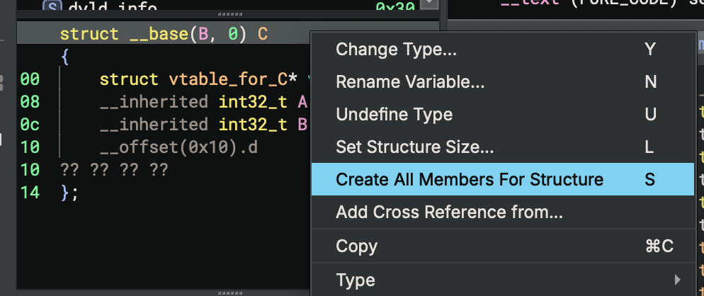
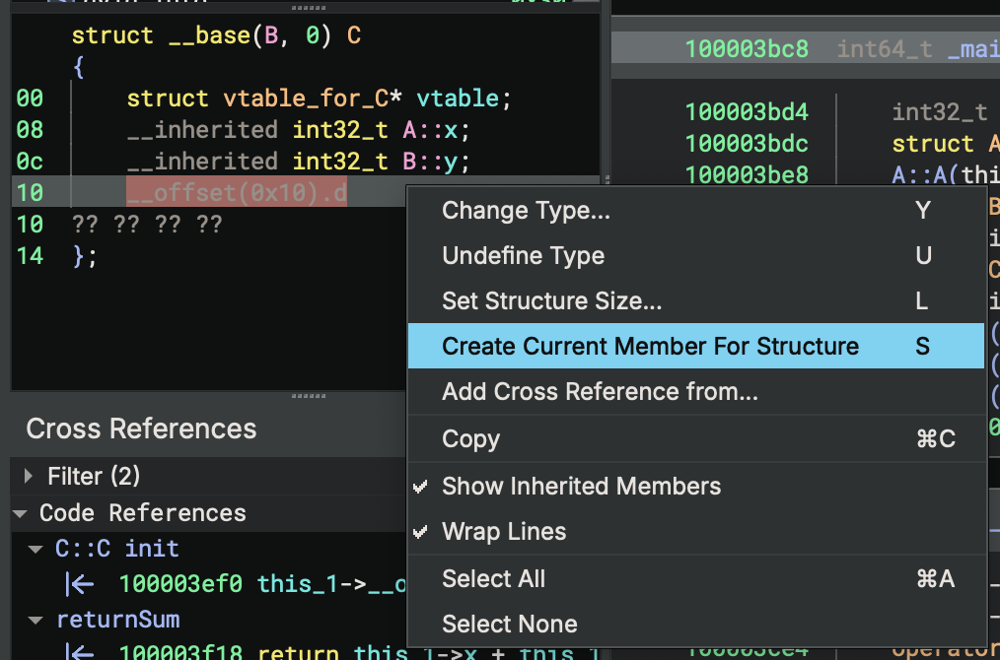
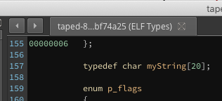
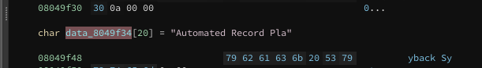

# Working with Types, Structures, and Symbols

This document is organized into four sections describing how to work with types in Binary Ninja. The first [section](#working-with-types) is how to interact with any type, regardless of its source.

The [second section](#type-library) explains how to work with the Type Library. This includes multiple sources of information from which Binary Ninja can automatically source for type information from and how you can add to them.

Next, the [third section](#signature-library) explains how to work with the signature library. While the signature library technically does not directly inform types, it will help automatically match statically compiled functions which are then matched with the type libraries described in the previous section.

Finally, we'll [cover](#symbols) how to work with Symbols in a binary.

## Working With Types

There are two main ways to interact with types from within a binary view. The first is to use the [types view](#types-view), and the second is to take advantage of the [smart structures workflow](#smart-structures-workflow) or otherwise annotate types directly in a disassembly or IL view.

### Direct UI manipulation

The simplest way to directly manipulate types in disassembly is by viewing an existing variable or sequence of bytes in linear view and using the following hotkeys:

 - `1`, `2`, `4`, `8`: The number hotkeys will create a data variable at the current location if none exists, and then change the size of the variable to an integer in the size of bytes specified in the hotkey.
 - `d`: If you want to cycle through the different integer sizes, repeatedly pressing `d` has the same effect as pressing the numbers in order.
 - `-`: To quickly toggle integers between signed and unsigned integers, you can use the `-` hotkey.
 - `a`: This hotkey sets or creates the current variable to a character array up until and including the next null byte.
 - `o`: `o` will set or create the current variable to be a pointer reference.
 - `*`: If you have a selection of identical variables, `*` will convert them into an array of elements.
 - `s`: `s` is a magic hotkey described in the next section in greater detail

 Note that you can apply these types to a region of memory as well, not just a single variable. So selecting a large block of bytes and pressing `2` `*` for example will create an array of `int16_t` sized elements.

### Smart Structures Workflow

New to [stable version 1.3.2015](https://binary.ninja/changelog/) is the "Smart Structures" feature. Rather than manually create a type in the type view and then apply it to disassembly, you can create structures directly from disassembly using the `s` hotkey.  Consider the following example (created using [taped](binaryninja:http://captf.com/2011/gits/taped) from the 2011 Ghost in the Shellcode CTF if you'd like to play along at home):

<div class="inline-slides">
    <ol id="inline-slides-text">
        <li id="currentline">Assembly view of the start of <code>0x8048e20</code></li>
        <li>MLIL view of the same basic block</li>
        <li>MLIL view after selecting the return of <code>calloc</code> and pressing <code>s</code></li>
        <li>MLIL view after selecting the offset and pressing <code>s</code> to turn it into a member access</li>
        <li>MLIL view after selecting the remaining offsets and pressing <code>s</code> in turn</li>
        <li>Viewing the structure automatically created after this workflow</li>
        <li>Selecting the remaining bytes and turning them into an array using <code>1</code> to turn them all into uint_8 variables, and then <code>*</code> to turn them all into an array</li>
    </ol>
    <div id="image-slider-container">
        <ul id="image-slider">
            <li>
              
            </li>
            <li>
              
            </li>
            <li>
              
            </li>
            <li>
              
            </li>
            <li>
              
            </li>
            <li>
              
            </li>
            <li>
              
            </li>
        </ul>
    </div>
</div>

_hover over the image to temporarily pause_


<script>
document.addEventListener("DOMContentLoaded", function(event) {
    let pause = 3000;
    let slider = $("#image-slider");
    let sliderContainer = $(slider.selector + "-container");
    window.slider = slider.lightSlider({
        item:1,
        loop: false,
        auto: true,
        speed: 200,
        pause: pause,
        slideMargin: 0,
        pauseOnHover: true,
        autoWidth:false,
        thumbMargin:0,
        onBeforeSlide: function (el) {
            Array.from($('ol#inline-slides-text')[0].children).forEach(function(item, index, arr) {
              if (index == el.getCurrentSlideCount() - 1)
                item.id = "currentline";
              else
                item.id = "";
             });
        },
        onSliderLoad: function() {
            let sliderHeight = slider.height();
            slider.find('img').each(function() {
                $(this).parent().css("padding-top", (sliderHeight - this.naturalHeight)/2);
            });
            slider.removeClass('hiddenc');
        },
        onAfterSlide: function(el) {
            if (el.getCurrentSlideCount() == el.getTotalSlideCount()) {
                setTimeout(() => {!el.is(':hover') && el.goToSlide(0)}, pause);
            }
        },
        onBeforeStart: function() {
            let width = 0;
            slider.find('img').each(function() {
                width = Math.max(width, this.naturalWidth);
            });
            sliderContainer.width(width);
        },
    });
    Array.from($('ol#inline-slides-text')[0].children).forEach(function(item, index, arr) {
        item.addEventListener('click', function() { window.slider.goToSlide(index)});
    });
});
</script>

Note that the last step is entirely optional. Now that we've created a basic structure, and if we happen to do some reverse engineering on these binaries, we learn that this is actually a linked list and that the structures should look like:

``` C
struct Page
{
    int num;
    int count;
    Tape* tapes[8];
    struct Page* prev;
    struct Page* next;
}
```

and:
``` C
struct Tape
{
    int id;
    char* name;
    char text[256];
};
```

We can either update our automatically created structure by pressing `y` to change member types and `n` to change their names, or we can use the [types view](#types-view) to directly import the c code and then apply the types using `y`. That gives us HLIL that now looks like:


### Automatically Creating Structure Member(s)

Starting from `dev 2.3.2827` (and the subsequent stable 2.4), we offer a more automated way of creating structure members. You can select a structure or a particular structure offset, and create member(s) based on the accesses to the offset(s). The operation takes into consideration of both incoming and outgoing type information for the accessed offsets and selects the most confident one as the type for the offset.

When no type information can be used to create the structure member, we fall back to creating an integer type based on the size of accesses, similar to what we do for the `s` hotkey (discussed above). In case there are different sizes of accesses, we do not create the member. You will need to examine the conflicting size information and decide how to create a member.

The automatic structure member creation can be triggered in both types view and linear/graph view. In types view, you can right-click a structure definition line and select the "Create Members at Accessed Offsets" to create new members at all offsets that are accessed in the structure.



Alternatively, you can right-click on a padding byte or an access annotation, and select "Create Member At Current Offset", which creates a new structure member at the byte's offset.



Note, the second action can only be triggered on an offset that does not already have a member. If you wish to run it on an offset that already has a member, you must first undefine the member by pressing `u`.

In graph/linear view, you can select either a token that has a structure name, or a variable that has a structure type, and then right-click and select the menu item. Besides, you can select a token with struct offset, e.g., `__offset(0x10).q` and right-click to automatically create one member.


### Types View

To see all types in a Binary View, use the types view. It can be accessed from the menu `View > Types`. Alternatively, you can access it with the `t` hotkey from most other views, or using `[CMD/CTRL] p` to access the command-palette and typing "types". This is the most common interface for creating structures, unions and types using C-style syntax.

For many built-in file formats you'll notice that common headers are already enumerated in the types view. These headers are applied when viewing the binary in [linear view](../getting-started.md#linear-view) and will show the parsed binary data into that structure or type making them particularly useful for binary parsing even of non-executable file formats.


#### Shortcuts and Attributes

From within the Types view, you can use the following hotkeys to create new types, structures, or unions. Alternatively, you can use the right-click menu to access these options and more.


* `s` - Create new structure
* `i` - Create new type
* `[SHIFT] s` - Creating a new union

The shortcuts for editing existing elements are:

* `y` - Edit type / field
* `n` - Rename type / field
* `l` - Set structure size
* `u` - undefine field

Structs support the attribute `__packed` to indicate that there is no padding. Additionally, function prototypes support the following keywords to indicate their calling convention or other features:

``` text
__cdecl
__stdcall
__fastcall
__convention
__noreturn
```

To use the `__convention` keyword, pass in the convention name as a parameter argument:

```
__convention("customconvention")
```


#### Structure Access Annotations

Types view now annotates code references to structure offsets. It uses the same convention as in the graph/linear view. For example, the `__offset(0x8).q` token means the code references the offset 0x8 of this structure, and the size of the access is a qword. This will make it easier to see which offsets of a structure are being used, and aid in the process of creating structure members.


#### Applying Structures and Types


Once you've created your structures, you can apply them to your disassembly. Simply select an appropriate token (variable or memory address), and press `y` to bring up the change type dialog. Types can be applied on both disassembly and all levels of IL. Any variables that are shared between the ILs will be updated as types are applied.


#### Examples

``` C
enum _flags
{
    F_X = 0x1,
    F_W = 0x2,
    F_R = 0x4
};
```

``` C
struct Header __packed
{
    char *name;
    uint32_t version;
    void (* callback)();
    uint16_t size;
    enum _flags flags;
};
```

## Using the API

Of course, like everything else in Binary Ninja, anything you can accomplish in the UI you can accomplish using the API. Manipulating types is no exception. Here are four common workflows for working with types as commented examples.

### Create a new type

Let's follow the most basic workflow: making a new type, inserting it into a BinaryView, and then applying to a variable or memory address.

#### From C syntax

There are two main ways to create a type with the API. The first is to use [one of](https://api.binary.ninja/search.html?q=parse_type&check_keywords=yes&area=default#) our APIs that parse a type string and return a type object. For a simple, single type, [parse_type_string](https://api.binary.ninja/binaryninja.binaryview-module.html#binaryninja.binaryview.BinaryView.parse_type_string) will return a tuple of the [Type](https://api.binary.ninja/binaryninja.types.Type.html#binaryninja.types.Type) and the [QualifiedName](https://api.binary.ninja/binaryninja.types.QualifiedName.html#binaryninja.types.QualifiedName):

``` py
>>> bv.parse_type_string("int foo")
(<type: int32_t>, 'foo')
>>>
```

For more complicated types that are already in C syntax, you may want to take advantage of the [parse_types_*](https://api.binary.ninja/search.html?q=parse%5ftypes&check%5fkeywords=yes&area=default) APIs.

``` py
>>> bv.platform.parse_types_from_source('''
enum colors {blue, green, brown};

struct person
{
	char name[20];
	int age;
	colors eyecolor;
};
''')
<types: {'colors': <type: enum>, 'person': <type: struct>}, variables: {}, functions: {}>
```

If you're importing a large number of headers from an existing project you might find that some features are not compatible with the type parser that Binary Ninja currently uses. In that case, you may find the [Header Plugin](https://github.com/rmspeers/binja_load_headers) useful as it attempts to automate the normalization of headers to make them compatible with Binary Ninja's type parser.

NOTE: While they have similar names, be aware that the parse_types APIs live off of the [Platform](https://api.binary.ninja/binaryninja.platform.Platform.html#binaryninja.platform.Platform) class as they require knowledge of the existing architecture's platform whereas the simpler `parse_type_string` is accessed directly from the [BinaryView](https://api.binary.ninja/binaryninja.binaryview.BinaryView.html#binaryninja.binaryview.BinaryView) class.

#### Using Type objects

Base [types](https://api.binary.ninja/binaryninja.types-module.html) can be easily composed to create simple type objects or added with [Structures](https://api.binary.ninja/binaryninja.types.Structure.html#binaryninja.types.Structure):

``` py
>>> myar = Type.array(Type.char(), 20)
>>> print(repr(myar))
<type: char [20]>
```

This is useful for creating structures that are not easily created in C syntax, such as sparse structures with only some members defined:

``` py
>>> s = types.Structure()
>>> s
<struct: size 0x0>
>>> s.insert(0x20, myar, name='name')
>>> s
<struct: size 0x34>
```

#### Adding types

Next, we're going to take the optional step of inserting our type into the current BinaryView with the [define_user_type](https://api.binary.ninja/binaryninja.binaryview-module.html#binaryninja.binaryview.BinaryView.define_user_type) API:


``` py
>>> bv.define_user_type("myString", myar)
```

And we can verify the type shows up in the types view as expected:



This makes the type available to the user to apply more easily and is appropriate for named structures, but is not required if you simply with to set a type as shown in the next step.

#### Applying

Of course, having the type available doesn't actually apply it to anything in the binary. Let's examine our [sample binary](http://captf.com/2011/gits/taped), find a suitable string (like the one at `0x8049f34`) and create a data variable using our new type:

``` py
>>> bv.define_user_data_var(0x8049f34, bv.types["myString"])
```
And now we can see that the string was indeed applied to our location:



Of course, we could have just directly applied our type without inserting it into the types available in the binary. For example:

``` py
>>> bv.define_user_data_var(0x8049f34, Type.array(Type.char(), 20))
```

If we want to name the variable there, see the section below on working with [symbols](#symbols).

NOTE: There also exists the [`define_data_var`](https://api.binary.ninja/binaryninja.binaryview-module.html#binaryninja.binaryview.BinaryView.define_data_var) API, however that will create an AUTO data variable. Auto-APIs are intended for code which is expected to be run every-time a binary is opened. Thus, they're not saved to the analysis database since they will generally be generated on load. Keep that in mind when you see multiple APIs that have both `_auto_` and `_user_` variants.

Alternatively, if you wanted to add or change the type of a function, function objects have a `[.function_type](https://api.binary.ninja/binaryninja.function-module.html#binaryninja.function.Function.function_type)` property that can take either a type object or a string.

### Deleting

To remove a type from the view:

``` py
>>> bv.undefine_user_type('person')
```

Or you can remove a type applied to memory:

``` py
>>> bv.undefine_user_data_var(0x8049f34)
```


### Modifying

Here's a snippet to take an existing function, and set the confidence of all the parameter types to 100%:

``` py
old = current_function.function_type
new_parameters = []
for vars, params in zip(current_function.parameter_vars, old.parameters):
    new_type = vars.type
    new_type.confidence = 256 #max-confidence
    new_parameters.append(FunctionParameter(new_type, params.name, params.location))

current_function.function_type = types.Type.function(old.return_value, new_parameters, \
old.calling_convention, old.has_variable_arguments, old.stack_adjustment)
```

## Type Library

Type Libraries are collections of type information (structs, enums, function types, etc.) stored in a file with the extension `.bntl`.

Relative to the binaryninja executable, the default type library location is `../Resources/typelib` on MacOS and `./typelib` on Linux and Windows. Individual .bntl files are organized in subdirectories named for the supported architecture. Users may include their own type libraries 

The information in a type library is contained in two key-value stores:

1. named types: key is the type name, value is the type
1. named objects: key is external symbol name, value is the type

### How Binary Ninja Loads Type Libraries

When a binary is opened, its platform is determined, all .bntl's are processed, and those matching the platform of the loaded binary are registered. A debug log will show:

```
Registered library 'libc.so.6' with platform 'linux-x86_64'
```

Then, those with either a filename or an alternative name matching the exact text of the binary's import command are imported, much like the native linker/loader. For example, in ELF, the .dynstr entry is used.

```
elf: searching for 'libc.so.6' in type libraries
Type library 'libc.so.6' imported
```

Type libraries for linux are ideally named after their realname, preserving the library minor version from which they were generated, and the soname in the alternatives list. In practice, naming them after their soname suffices. Using the linkname with no alternatives will prevent your library from loading.

This requested name should be a soname, like "libfoo.so.1" but could be a linkname like "libfoo.so". (The ldconfig tool is responsible for creating symlinks from soname to realnames, like `/usr/lib/libfoo.so.1` -> `/usr/lib/libfoo.so.1.0`. See [tldp.org](https://tldp.org/HOWTO/Program-Library-HOWTO/shared-libraries.html) for more information.).

Binary Ninja's logic for determining a match is straightforward:

```
typelibname.removesuffix('.bntl') == requestedname or requestedname in alternativenames
```

Therefore, without any alternative names, `libc.so.bntl` will not be loaded by Binary Ninja if an ELF requests libc.so.6.

We recommend and use the following convention:

Type libraries should be named for the filename from which they were generated with the phrase ".bntl" added. When the source library contains additional minor and release number, like `libfoo.so.1.2.3` Binary Ninja would not load the resulting type library `libfoo.so.1.2.3.bntl` for an ELF requesting soname `libfoo.so.1`. Therefore the alternative names list should include the most specific version numbers, incrementally stripped down to the soname, and finally a linkname for good measure.

Example:

`libfoo.so.1.2.3` is used to generated `libfoo.so.1.2.3.bntl`

The alternative names list should have:

```
libfoo.so.1.2.3 <-- includes version, minor, release (most specific)
libfoo.so.1.2   <-- includes version, minor (less specific)
libfoo.so.1     <-- includes version (soname)
libfoo.so       <-- linkname
```

### Acquiring a Handle

The platform class exposes handles to these imported type libraries with its `type_libraries` list and its `get_type_libraries_by_name()` function:

```python
>>> bv.platform.type_libraries
[<typelib 'libm.so.6':x86_64':x86_64>, <typelib 'SYSCALLS':x86_64]
>>> bv.platform.get_type_libraries_by_name('libm.so.6')
[<typelib 'libm.so.6':x86_64>]
```

That requires the type library having been loaded. A more direct way is to load from a file path with the `load_from_file()` from `Typelibrary` class from `typelibrary` module:

```python
>>> typelibrary.TypeLibrary.load_from_file('/path/to/libm_x86_64.so.6.bntl')
<typelib 'libm_x86_64.so.6':x86_64>
```

### Contents of Libraries

The following demonstrates attributes of interest on a loaded type library in variable `tl`:

```python
	print('           name: %s' % tl.name)
	print('           arch: %s' % tl.arch)
	print('           guid: %s' % tl.guid)
	print('dependency_name: %s' % tl.dependency_name)
	print('alternate_names: %s' % tl.alternate_names)
	print(' platform_names: %s' % tl.platform_names)

	print('  named_objects: %d' % len(tl.named_objects))
	for (key, val) in tl.named_objects.items():
		print('\t"%s" %s' % (str(key), str(val)))

	print('    named_types: %d' % len(tl.named_types))
	for (key,val) in tl.named_types.items():
		print('\t"%s" %s' % (str(key), str(val)))
```

Named objects (via dictionary `.named_objects` are functions signatures and a module's exported variables. Named types (via dictionary `.named_types`) are the textual named you might use to declare a variable. For example,

For example, `.named_objects['fegetexceptionflag']` looks up its function prototype: `int32_t (fexcept_t* flagp)` and `.named_types['fexcept_t']` looks up `uint16_t`, its typedef.

### Creating

You may also wish to use the [typelib_create.py](https://github.com/Vector35/binaryninja-api/blob/dev/python/examples/typelib_create.py) example script included both online and offline in your installation path.

Types entered by manual entry can be exported from the binary view using `export_type_to_library()`.

Manual creation is achieved by creating a new type library, associating the correct platform and architecture, adding types, finalizing, and writing to a file. Example:

```python
arch = binaryninja.Architecture['x86_64']

struct = Structure()
struct.append(Type.pointer(arch, Type.char()), 'name')
struct.append(Type.int(4), 'age')
struct.append(Type.int(4), 'height')
struct.append(Type.int(4), 'weight')

typelib = binaryninja.typelibrary.TypeLibrary.new(arch, 'test.so.1.4')
typelib.add_named_type('human', binaryninja.types.Type.structure_type(struct))
typelib.add_alternate_name('test.so.1') #don't forget this step!
typelib.add_alternate_name('test.so') 
typelib.finalize()
typelib.write_to_file('test.so.1.bntl')
```

### Other Type Library Questions

####  What's a named type vs. just a type?

Some variable definitions have type information, but don't produce a type name useful for future definitions, examples:

- `enum {A=1,B=2} foo;` : foo has type with no type name (it does have a variable name)
- `struct {int A; int B;} bar;` : bar has type with no type name

In C, enum and struct definitions can create a new type name as a byproduct of a definition by using a "tag name":

- `enum MyEnum {A=1,B=2} foo;` : foo has the type named `MyEnum`
- `struct MyStruct {int A; int B;} bar;` : bar has the type named `MyStruct`

In the second set of examples, the types are named, and that name could be used to declare other variables, like `enum MyEnum bar2;` and `struct MyStruct bar2`.

Functions' types are not named. The function name is considered the name of a function object, and the function's type is anonymous.

In summary:

```c
typedef int foo; // type:int, name:foo

// structs, without and with a "tag name"
struct {int A; int B;} foo; // type:struct{int A, intB;}, name:<anonymous>
struct MyStruct {int A; int B;} foo; // type:struct{int A, intB;}, name:MyStruct

// enumerations, without and with a "tag name"
enum {A=1,B=2} foo; // type:enum{A=1,B=2}, name:<anonymous>
enum MyEnum {A=1,B=2} foo; // type:enum{A=1,B=2}, name:MyEnum

// functions
int main(int ac, char **av); // type int ()(int, char **), name:<anonymous>
typedef int (MyFunc)(int ac, char **av); // type int ()(int, char **), name:MyFunc

```

#### How does Binary Ninja decide when to use a typelibrary (.bntl) file?


#### What's the difference between a named type and a named object?

A named type is a type with a name that can identify it. For example, `color` is the name of type `enum {RED=0, ORANGE=1, YELLOW=2, ...}`.

A named object is the name of an external/imported symbol for which the type library has type information. For example, `MessageBoxA` is the name of a function whose type is `int ()(HWND, LPCSTR, LPCSTR, UINT)`.

#### How do I find what type of type a type object is? How many are there?

I've seen "types of types", "sorts of types", "kinds of types", "classes of types" used to differentiate the varieties of possible types, and there are probably more. Binary Ninja uses "class", example:

```
>>> type_obj.type_class
<TypeClass.FunctionTypeClass: 8>
```

In [enums.py](https://api.binary.ninja/_modules/binaryninja/enums.html#TypeClass) we can see Binary Ninja currently thinks of types falling into 13 classes: `Void`, `Bool`, `Integer`, `Float`, `Structure`, `Enumeration`, `Pointer`, `Array`, `Function`, `VarArgs`, `Value`, `NamedTypeReference`, `WideCharType`.

Compare this to LLDB, which also uses the term "class", and currently has 19 of them: `Array`, `BlockPointer`, `Builtin`, `Class`, `ComplexFloat`, `ComplexInteger`, `Enumeration`, `Function`, `MemberPointer`, `ObjCObject`, `ObjCInterface`, `ObjCObjectPointer`, `Pointer`, `Reference`, `Struct`, `Typedef`, `Union`, `Vector`, `Other`.

Compare this to GDB, which uses the term "type code" and has 25 of them.

#### Where are function parameter names stored?

While technically not part of the type, having names of function parameters is very useful and can thus be optionally stored in a type.

Function types (types with `.type_class == FunctionTypeClass`) have a `.parameters` attribute, a list of [`FunctionParameter`](https://api.binary.ninja/binaryninja.types.FunctionParameter.html) objects. When those objects have `.name==''` you get the bare bones function types like `int ()(int, char **)`. When those objects have their `.name` populated you get the more meaningful `int ()(int argc, char **argv)`.

#### How do I manually load a type library?

```
>>> bv.add_type_library(TypeLibrary.load_from_file('test.bntl'))
```

#### How can I manually load a type object?

```
>>> bv.import_library_object('_MySuperComputation')
<type: int32_t (int32_t, int32_t, char*)>
```

#### Why doesn't the types view show the types imported from type libraries?

Because the type libraries added to a binary view only makes their type information _available_ for use. The types view will show a type from a type library only after it is used (on demand).

Try this experiment:

- note `bv.type_libraries`, `bv.types`
- add a type library with `bv.add_type_library(TypeLibrary.load_from_file('test.bntl'))`
- note that `bv.type_libraries` is extended, but `bv.types` is unchanged!
- note `bv.get_type_by_name('Rectangle')` returns nothing
- set the type of some data to `struct Rectangle` (using `y` in linear view or via any other method described above)
- `bv.types` is extended, and the types view shows `struct Rectangle` in the auto types

#### What's a named type reference?

Named Type References are a way to refer to a type by name without having its declaration immediately available.

For example, examine this struct from [typelib_create.py](https://github.com/Vector35/binaryninja-api/blob/dev/python/examples/typelib_create.py):

```
struct Rectangle2 {
  int width;
  int height;
  struct Point center;
}
```

We don't know at this moment what a `struct Point is`. Maybe we've already added it. Maybe we'll add it later. Maybe it's in another type library. But we want to add a Rectangle now. So we leave the center field as a reference to the named type `struct Point`.

Load the resulting `test.bntl` in your binary and try to set some data to type `struct Rectangle2` and you'll be met with this message:

```
TypeLibrary: failed to import type 'Point'; referenced but not present in library 'libtest.so.1`
```

This makes sense! Now go to types view and `define struct Point { int x; int y; }` and try again, success!

```
100001000  struct rectangle_unresolved data_100001000 = 
100001000  {
100001000      int32_t width = 0x5f0100
100001004      int32_t height = 0x5f030005
100001008      struct Point center = 
100001008      {
100001008          int32_t x = 0x655f686d
10000100c          int32_t y = 0x75636578
100001010      }
100001008  }
```

You should repeat the experiment using `struct Rectangle` and see that you're allowed to create variables with type containing _pointers_ to unresolved type references.

#### How are types represented?

By a hierarchy of objects from [api/python/types.py](https://github.com/Vector35/binaryninja-api/blob/dev/python/types.py) referencing one another. The "glue" object is [`binaryninja.types.Type`](https://api.binary.ninja/binaryninja.types.Type.html#binaryninja.types.Type) and depending on the complexity of the type it represents (stored in its `.type_class` attribute), it could have an attribute with more information. For instance, if the `binaryninja.types.Type` has `.type_class == FunctionTypeClass` then its `.parameters` attribute is a list of [`binaryninja.types.FunctionParameter`](https://api.binary.ninja/binaryninja.types.FunctionParameter.html). See  [typelib_dump.py](https://github.com/Vector35/binaryninja-api/blob/dev/python/examples/typelib_dump.py) for how this can work.

As an example, here is the hierarchical representation of `type struct Rectangle` from [typelib_create.py](https://github.com/Vector35/binaryninja-api/blob/dev/python/examples/typelib_create.py)

```
typelib.named_types["Rectangle"] =
----------------------------------
Type class=Structure
  Structure
    StructureMember "width"
      Type class=Integer width=4
    StructureMember "height"
      Type class=Integer width=4
    StructureMember "center"
      Type class=Pointer
        Type class=NamedTypeReference
          NamedTypeReference <named type: struct Point>
```

Here is the representation of `type int ()(int, int)` named `MyFunctionType` from [typelib_create.py](https://github.com/Vector35/binaryninja-api/blob/dev/python/examples/typelib_create.py):
#### When do named objects get used? 

When a binary is loaded and its external symbols is processed, the symbol names are searched against the named objects from type libraries. If there is a match, it obeys the type from the type library. Upon success, you'll see a message like:

```
type library test.bntl found hit for _DoSuperComputation
```

At this moment, there is no built in functionality to apply named objects to an existing Binary Ninja database.


## Signature Library

While many signatures are [built-in](https://github.com/Vector35/binaryninja-api/issues/1551) and require no interaction to automatically match functions, you may wish to add or modify your own. First, install the [SigKit](https://github.com/Vector35/sigkit/) plugin from the [plugin manager](plugins.md#plugin-manager).

### Running the signature matcher

The signature matcher runs automatically by default once analysis completes. You can turn this off in `Settings > Analysis > Autorun Function Signature Matcher` (or, [analysis.signatureMatcher.autorun](../getting-started.md#analysis.signatureMatcher.autorun) in Settings).

You can also trigger the signature matcher to run from the menu `Tools > Run Analysis Module > Signature Matcher`.

Once the signature matcher runs, it will print a brief report to the console detailing how many functions it matched and will rename matched functions. For example:

``` text
1 functions matched total, 0 name-only matches, 0 thunks resolved, 33 functions skipped because they were too small
```

### Generating signature libraries

To generate a signature library for the currently-open binary, use `Tools > Signature Library > Generate Signature Library`. This will generate signatures for all functions in the binary that have a name attached to them. Note that functions with automatically-chosen names such as `sub_401000` will be skipped. Once it's generated, you'll be prompted where to save the resulting signature library.

For headless users, you can generate signature libraries by using the sigkit API ([examples](https://github.com/Vector35/sigkit/tree/master/examples) and [documentation](https://github.com/Vector35/sigkit/blob/master/__init__.py#L46)). For more detailed information, see our blog post describing [signature generation](https://binary.ninja/2020/03/11/signature-libraries.html#signature-generation).

If you are accessing the sigkit API through the Binary Ninja GUI and you've installed the sigkit plugin through the plugin manager, you will need to import sigkit under a different name:

``` python
import Vector35_sigkit as sigkit
```

### Installing signature libraries

Binary Ninja loads signature libraries from 2 locations:

 - [$INSTALL_DIR](https://docs.binary.ninja/getting-started.html#binary-path)/signatures/$PLATFORM
 - [$USER_DIR](https://docs.binary.ninja/getting-started.html#user-folder)/signatures/$PLATFORM

**WARNING**: Always place your signature libraries in your user directory. The install path is wiped whenever Binary Ninja auto-updates. You can locate it with `Open Plugin Folder` in the command palette and navigate "up" a directory.

Inside the signatures folder, each platform has its own folder for its set of signatures. For example, `windows-x86_64` and `linux-ppc32` are two sample platforms. When the signature matcher runs, it uses the signature libraries that are relevant to the current binary's platform. (You can check the platform of any binary you have open in the UI using the console and typing `bv.platform`)

#### Manipulating signature libraries

You can edit signature libraries programmatically using the sigkit API. A very basic [example](https://github.com/Vector35/sigkit/blob/master/examples/convert_siglib.py) shows how to load and save signature libraries. Note that Binary Ninja only supports signatures in the `.sig` format; the other formats are for debugging. The easiest way to load and save signature libraries in this format are the [`sigkit.load_signature_library()`](https://github.com/Vector35/sigkit/blob/master/__init__.py) and [`sigkit.save_signature_library()`](https://github.com/Vector35/sigkit/blob/master/__init__.py) functions.

To help debug and optimize your signature libraries in a Signature Explorer GUI by using `Tools > Signature Library > Explore Signature Library`. This GUI can be opened through the sigkit API using [`sigkit.signature_explorer()`](https://github.com/Vector35/sigkit/blob/master/__init__.py) and [`sigkit.explore_signature_library()`](https://github.com/Vector35/sigkit/blob/master/sigexplorer.py).

For a text-based approach, you can also export your signature libraries to JSON using the Signature Explorer. Then, you can edit them in a text editor and convert them back to a .sig using the Signature Explorer afterwards. Of course, these conversions are also accessible through the API as the [`sigkit.sig_serialize_json`](https://github.com/Vector35/sigkit/blob/master/sig_serialize_json.py) module, which provides a pickle-like interface. Likewise, [`sigkit.sig_serialize_fb`](https://github.com/Vector35/sigkit/blob/master/sig_serialize_fb.py) provides serialization for the standard .sig format.


## Symbols

Some binaries helpfully have symbol information in them which makes reverse engineering easier. Of course, even if the binary doesn't come with symbol information, you can always add your own. From the UI, this couldn't be simpler. Just select the function, variable, member, register, or whatever you want to change the symbol of and press `n`.


That's it! From an API perspective, there are some helper functions to make the process easier. For example, to rename a function:

``` py
>>> current_function.name
'main'
>>> current_function.name = "newName"
>>> current_function.name
'newName'
```

Other objects or variables may need a [symbol](https://api.binary.ninja/binaryninja.types.Symbol.html) created and applied:

``` py
>>> mysym = Symbol(SymbolType.FunctionSymbol, here, "myVariableName")
>>> mysym
<SymbolType.FunctionSymbol: "myVariableName" @ 0x80498d0>
>>> bv.define_user_symbol(mysym)
```

Note that `here` and `bv` are used in many of the previous examples. These shortcuts and [several others](../getting-started.md#script-python-console) are only available when running in the Binary Ninja python console and are used here for convenience.

Valid symbol types [include](https://api.binary.ninja/binaryninja.enums.SymbolType.html):

| SymbolType | Description |
| ---------- | ----------- |
| FunctionSymbol |            Symbol for function that exists in the current binary |
| ImportAddressSymbol |       Symbol defined in the Import Address Table |
| ImportedFunctionSymbol |    Symbol for a function that is not defined in the current binary |
| DataSymbol |                Symbol for data in the current binary |
| ImportedDataSymbol |        Symbol for data that is not defined in the current binary |
| ExternalSymbol |            Symbols for data and code that reside outside the BinaryView |
| LibraryFunctionSymbol |     Symbols for external functions outside the library |
