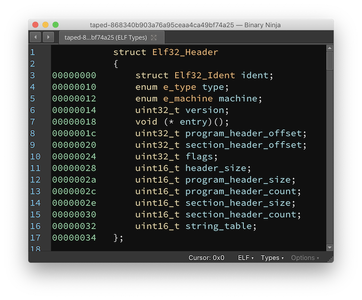

# Working with Types, Structures, and Symbols

This document is organized into two sections describing how to work with types in Binary Ninja. The [first section](#basic-types) is how apply and create types.

The second [section](#working-with-types) is how to interact with any type, regardless of its source.

For more about type libraries, signature library, and how to interact with types through the API, see the [applying annotations](../dev/annotation.md) section of the developer guide.

## Basic Types

The biggest culprit of bad decompilation is often missing type information. Therefore, some of the most important actions you can take while reverse engineering is renaming symbols/variables, applying types, and creating new types to apply.

### Renaming Symbols and Variables


Some binaries helpfully have symbol information in them which makes reverse engineering easier. Of course, even if the binary doesn't come with symbol information, you can always add your own. From the UI, just select the function, variable, member, or register you want to change and press `n`. This works on variables as well.

### Applying Structures and Types

Simply select an appropriate token (variable or memory address), and press `y` to bring up the change type dialog. Types can be applied on both disassembly and all levels of IL. Any variables that are shared between the ILs will be updated as types are applied.


### Types View

To see all types in a Binary View, use the types view. It can be accessed from the menu `View > Types`. Alternatively, you can access it with the `t` hotkey from most other views, or using `[CMD/CTRL] p` to access the command-palette and typing "types". This is the most common interface for creating structures, unions and types using C-style syntax.

For many built-in file formats you'll notice that common headers are already enumerated in the types view. These headers are applied when viewing the binary in [linear view](./index.md#linear-view) and will show the parsed binary data into that structure or type making them particularly useful for binary parsing even of non-executable file formats.




#### Structure Access Annotations

Types view now annotates code references to structure offsets. It uses the same convention as in the graph/linear view. For example, the `__offset(0x8).q` token means the code references the offset 0x8 of this structure, and the size of the access is a qword. This will make it easier to see which offsets of a structure are being used, and aid in the process of creating structure members.


#### Shortcuts

From within the Types view, you can use the following hotkeys to create new types, structures, or unions. Alternatively, you can use the right-click menu to access these options and more.


* `s` - Create new structure
* `i` - Create new type
* `[SHIFT] s` - Creating a new union
* `1`, `2`, `4`, `8`: The number hotkeys will create a create an integer of the specified size. This additionally works on selections.
* `d`: If you want to cycle through the different integer sizes, repeatedly pressing `d` has the same effect as pressing the numbers in order.
* `-`: To quickly toggle integers between signed and unsigned integers, you can use the `-` hotkey.


The shortcuts for editing existing elements are:

* `y` - Edit type / field
* `n` - Rename type / field
* `l` - Set structure size
* `u` - undefine field

#### Attributes

Structs support the attribute `__packed` to indicate that there is no padding. Additionally, function prototypes support the following keywords to indicate their calling convention or other features:

``` text
__cdecl
__stdcall
__fastcall
__convention
__noreturn
```

To use the `__convention` keyword, pass in the convention name as a parameter argument:

```
__convention("customconvention")
```


##### Examples

``` C
enum _flags
{
    F_X = 0x1,
    F_W = 0x2,
    F_R = 0x4
};
```

``` C
struct Header __packed
{
    char *name;
    uint32_t version;
    void (* callback)();
    uint16_t size;
    enum _flags flags;
};
```


## Working With Types

There are two main ways to interact with types from within a binary view. The first is to use the [types view](#types-view), and the second is to take advantage of the [smart structures workflow](#smart-structures-workflow) or otherwise annotate types directly in a disassembly or IL view.

### Direct UI manipulation

The simplest way to directly manipulate types in disassembly is by viewing an existing variable or sequence of bytes in linear view and using the following hotkeys:


 - `1`, `2`, `4`, `8`: The number hotkeys will create a data variable at the current location if none exists, and then change the size of the variable to an integer in the size of bytes specified in the hotkey.
 - `d`: If you want to cycle through the different integer sizes, repeatedly pressing `d` has the same effect as pressing the numbers in order.
 - `-`: To quickly toggle integers between signed and unsigned integers, you can use the `-` hotkey.
 - `a`: This hotkey sets or creates the current variable to a character array up until and including the next null byte.
 - `o`: `o` will set or create the current variable to be a pointer reference.
 - `*`: If you have a selection of identical variables, `*` will convert them into an array of elements. If you have no selection, the "Create Array" dialog will be shown allowing you to create an array of specific type and count at the current location.

 - `s`: `s` is a magic hotkey described in the next section in greater detail
 - `m`: Used to apply an enumeration display at an integer (more details [below](#enumeration-selector))

 Note that you can apply these types to a region of memory as well, not just a single variable. So selecting a large block of bytes and pressing `2` `*` for example will create an array of `int16_t` sized elements.

### Enumeration Selector


The Enum Dialog, with a default hotkey of `m` can be used to both change the type for data variables, arguments, and local variables to an enum type and also to change the Display Type of constant integers to any matching enumeration members.

When used on an integer, all matching enumeration members will be shown.

1. Filter box to search large lists of matching enums
1. "New Enum" button to allow creation of a new enum
1. Enum preview (can also be used to edit an existing enum by double clicking a given line)
1. Currently selected enum/member (when the enum is selected, the preview will update, and you can also right-click here to change the type)
1. Name of currently selected enum
1. Checkbox (set by default) that hides enums with no matching members for the current integer.

However in instances where the hotkey is used on other variables, the display will only be used to apply the enum type to the selection and does not allow editing.


### Smart Structures Workflow

"Smart Structures" feature enables automatic creation of a structure and its members directly from the disassembly/IL view using the `s` hotkey.
It simplifies the traditional workflow in which the user first creates a type in the types view and then applies it to disassembly.
It works in the following ways:

| View               | Selection                                                    | Current Type         | Behavior                                                                          |
|--------------------|--------------------------------------------------------------|----------------------|-----------------------------------------------------------------------------------|
| Linear/Graph       | A variable                                                   | Not a struct/struct\* | Create structure dialog                                                           |
| Linear/Graph       | A variable that is the result an allocation routine          | Not a struct/struct\* | Create structure with allocation size                                             |
| Linear/Graph/Types | A variable, data variable, or a type name                    | struct/struct\*       | Create all members for structure                                                  |
| Linear/Graph/Types | A StructOffsetToken token, e.g., `__offset(0x18)`            | N/A                  | Create current member for structure                                               |

Below are detailed explanation of it:

1. In linear/graph view, if the selection is a variable that is not a structure, a dialog pops up and asks you to create a structure. You can specify the structure's name and size. There is also a checkbox that asks you whether the variable's type should be the structure itself or a pointer to the structure.
2. In linear/graph view, if the selection is a variable that is not a structure, and it happens to be the result of a memory allocation routine, e.g., `malloc`, a new structure will be created and its size is automatically determined (if possible). The variable's type will be a pointer to the structure.
3. In linear/graph/types view, If you select a variable whose type is a structure, or a pointer to a structure, BN will try to create all structure field at any offset that has been accessed in the code.
4. In linear/graph/types view, If you select a StructOffsetToken, BN will try to create a structure member at the current offset.

The automatic member creation mentioned in #3 and #4 takes into consideration both incoming and outgoing type information for the accessed offsets and selects the most confident one as the type for the offset.
When no type information can be used to create the structure member, we fall back to creating an integer type based on the size of accesses. For example, if we see an access of size 4, we will create an `int32_t`. In case there are different sizes of accesses, we do not create the member. You will need to examine the conflicting size information and decide how to create a member.


Consider the following example (created using [taped](../files/taped) from the 2011 Ghost in the Shellcode CTF if you'd like to play along at home):

| Step                                                                                                                                                                                                                                               | Preview                                                    |
|----------------------------------------------------------------------------------------------------------------------------------------------------------------------------------------------------------------------------------------------------|------------------------------------------------------------|
| Go to address `0x8048e20` and switch to HLIL.                                                                                                                                                                                           |  |
| Select variable `var_18` and press `s`. <br/>Since `calloc` is a known allocation routine and the allocation size can be determined to be 0x30, a new structure, `struct_1` is created with size 0x30. |  |
| Select an offset, e.g., `__offset(0x4).d` and press `s`. A member will be automatically created.                                                                                                                             |  |
| Alternatively, select the `var_18` or the type name `struct_1` and press `s`. All members in the `struct_1` will be automatically created.                                                             |  |
| Viewing the automatically created structure members.                                                                                                                                                                                               |  |


The `s` hotkey also works when working with structures in the linear view. Its behavior differs based on the current selection:


| Selection                                                    | Behavior                                                                          |
|--------------------------------------------------------------|-----------------------------------------------------------------------------------|
| A single byte                                                | Create structure dialog                                                           |
| A range of bytes                                             | Create structure with selection size                                              |
| A range of bytes covering existing data variables            | Create structure with selection size and add existing data vars as struct members |


In linear view, if the selection is a single byte outside any function, it will pop up the create structure dialog. If the selection is a range of bytes, a structure of the selection size is created and the start of the selection. If the selection covers any existing data variables, these data variables will become members within the newly created structure.

This also works within data variables with structure type. For example, if the selection is a range of bytes within a structure, a new structure will be created within the existing structure.


### Import BNDB File

The Import BNDB File feature imports types from a previous BNDB into your currently open file. In addition, it will apply types for matching symbols in functions and variables. Import BNDB *will not* port symbols from a BNDB with symbols to one without -- the names must already match. Matching functions and porting symbols is beyond the scope of this feature.


#### Usage

To use this feature select `Import From BNDB` from the `Analysis` menu, use the [command palette](index.md#command-palette), or [bind a hotkey](index.md#custom-hotkeys) and select the BNDB you'd like to import. Wait for the BNDB to load then you'll be presented with a list of things to import.

* Types - Various types to be imported from the source BNDB
* Functions - Attempt to find target functions whose symbol already matches the symbol of the source BNDB and apply their type
* Function to Imports - Attempt to find target Imports whose symbol matches the Functions symbols in the source BNDB and apply their type
* Data Variables - Attempt to find target DataVariables with symbols that match DataVariables in the source BNDB and apply their type

This feature enables a number of workflows:

#### Porting Analysis Between Target Versions

If you're working with version 1 of a file which has symbols and you now want to port your work over to version 2 (as long as they both have symbols). This isn't going to be perfect as this feature isn't interactive and doesn't take into account changes in parameter counts or ordering, so *use this with caution*.

#### Quickly Defining Externs

If you have a binary with externs which don't have TypeLibraries this can allow you to quickly import them (and their types) from another source, this is especially effective when you have debug information for the dependent libraries

### Import Header File

If you already have a collection of headers containing types you want to use, you can import them directly. You can specify the compiler flags that would be used if a compiler were compiling a source file that uses this header. Specifically this means you can/should specify:

- `-isystem<path>` for various system header paths
- `-I<path>` for various user header paths
- `-D<macro>=<value>` for macro definitions
- `-x c -std=c99` to specify C99 mode
- Other Clang-compatible command-line flags are accepted (eg `-fms-extensions`, `-fms-compatibility`, etc)

You can specify that types from system headers, accessed via `#include <header.h>`, will be in the results. Otherwise, only files from user headers, accessed via `#include "header.h"` will be used.

You can also specify Define Binary Ninja Macros, which makes the type parser include the various parser extensions that Binary Ninja allows in the Type View editors, eg `__packed`, `__padding`, `__syscall`, etc. You probably only want to use this option when importing a header file exported using [Export Header File](#export-header-file). 

After specifying the file(s) and flag(s), pressing Preview will give a list of all the types and functions defined in the file(s). You may check or uncheck the box next to any of the types/functions to control whether they will be imported to your analysis.

If there were any parse errors, those will be shown instead of a list of types. Generally speaking, what this means is you're missing either header search paths or compile definitions. See the section below on [finding system headers](#finding-system-headers).

After pressing Import, all the checked types/functions will be added to your analysis. Imported types will override any existing types you had defined so they are disabled by default as indicated via the `Exists Already` column. Imported functions will replace signatures of any functions in your analysis whose name matches signatures found in the header. 


#### Finding System Headers

Since you need to specify the include paths for system headers, you will need to deduce them for the target platform of your analysis. Here are a few tricks that may help:

##### Systems with GCC/Clang (macOS, Linux, etc)

On these systems, you can run a command to print the default search path for compilation:

    gcc -Wp,-v -E -
    clang -Wp,-v -E -

For the directories printed by this command, you should include them with `-isystem<path>` in the order specified.

For example on macOS, with Xcode 13:

    $ clang -Wp,-v -E -
    clang -cc1 version 13.0.0 (clang-1300.0.29.3) default target arm64-apple-darwin21.6.0
    ignoring nonexistent directory "/Applications/Xcode.app/Contents/Developer/Platforms/MacOSX.platform/Developer/SDKs/MacOSX.sdk/usr/local/include"
    ignoring nonexistent directory "/Applications/Xcode.app/Contents/Developer/Platforms/MacOSX.platform/Developer/SDKs/MacOSX.sdk/Library/Frameworks"
    #include "..." search starts here:
    #include <...> search starts here:
     /usr/local/include
     /Applications/Xcode.app/Contents/Developer/Toolchains/XcodeDefault.xctoolchain/usr/lib/clang/13.0.0/include
     /Applications/Xcode.app/Contents/Developer/Platforms/MacOSX.platform/Developer/SDKs/MacOSX.sdk/usr/include
     /Applications/Xcode.app/Contents/Developer/Toolchains/XcodeDefault.xctoolchain/usr/include
     /Applications/Xcode.app/Contents/Developer/Platforms/MacOSX.platform/Developer/SDKs/MacOSX.sdk/System/Library/Frameworks (framework directory)
    End of search list.

From this example, the flags would be: (note: not including the framework directory line)

    -isystem/usr/local/include
    -isystem/Applications/Xcode.app/Contents/Developer/Toolchains/XcodeDefault.xctoolchain/usr/lib/clang/13.0.0/include
    -isystem/Applications/Xcode.app/Contents/Developer/Platforms/MacOSX.platform/Developer/SDKs/MacOSX.sdk/usr/include
    -isystem/Applications/Xcode.app/Contents/Developer/Toolchains/XcodeDefault.xctoolchain/usr/include

Another example on Arch Linux:

    $ gcc -Wp,-v -E -
    ignoring nonexistent directory "/usr/lib/gcc/x86_64-pc-linux-gnu/12.2.0/../../../../x86_64-pc-linux-gnu/include"
    #include "..." search starts here:
    #include <...> search starts here:
     /usr/lib/gcc/x86_64-pc-linux-gnu/12.2.0/include
     /usr/local/include
     /usr/lib/gcc/x86_64-pc-linux-gnu/12.2.0/include-fixed
     /usr/include
    End of search list.

From this example, the flags would be:

    -isystem/usr/lib/gcc/x86_64-pc-linux-gnu/12.2.0/include
    -isystem/usr/local/include
    -isystem/usr/lib/gcc/x86_64-pc-linux-gnu/12.2.0/include-fixed
    -isystem/usr/include

##### For Windows

For windows, there's no easy command to list all the include paths so you have to piece them together from the `Include Directory` property in a Visual Studio project. You also want to include `-x c -std c99` since Windows headers include lots of C++ types that the type importer currently does not support.

You will end up with something like the following for user mode:

    -x c -std c99
    -isystem"C:\Program Files (x86)\Microsoft Visual Studio\2019\Professional\VC\Tools\MSVC\14.28.29333\include"
    -isystem"C:\Program Files (x86)\Windows Kits\10\Include\10.0.19041.0\ucrt"
    -isystem"C:\Program Files (x86)\Windows Kits\10\Include\10.0.19041.0\shared"
    -isystem"C:\Program Files (x86)\Windows Kits\10\Include\10.0.19041.0\um"

Or, for kernel mode:

    -x c -std c99
    -isystem"C:\Program Files (x86)\Microsoft Visual Studio\2019\Professional\VC\Tools\MSVC\14.28.29333\include"
    -isystem"C:\Program Files (x86)\Windows Kits\10\Include\10.0.19041.0\ucrt"
    -isystem"C:\Program Files (x86)\Windows Kits\10\Include\10.0.19041.0\shared"
    -isystem"C:\Program Files (x86)\Windows Kits\10\Include\10.0.19041.0\km"

##### Cross-Platform Targets

If you are analyzing a target that is for a different operating system, you need to both find the header include paths for that system, and copy (or mount) them to a location accessible by the computer running Binary Ninja.   

### Export Header File

If you want to compile code using the structures you defined during your analysis, you can export all the types to a C-compatible header file that can be used via `#include` by a C compiler. You can also import this header in another analysis session via [Import Header File](#import-header-file), just be sure to enable `Define Binary Ninja Macros` when doing so.
