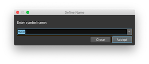

# Basic Type Editing

The biggest culprit of bad decompilation is often missing type information. Therefore, some of the most important actions you can take while reverse engineering is renaming symbols/variables, applying types, and creating new types to apply.

## Renaming Symbols and Variables

Some binaries helpfully have symbol information in them which makes reverse engineering easier. Of course, even if the binary doesn't come with symbol information, you can always add your own. From the UI, just select the function, variable, member, or register you want to change and press `n`.

## Applying / Changing Structures and Types

Simply select an appropriate token (function, parameter, variable or memory address), and press `y` to bring up the change type dialog. Types can be applied on both disassembly and all levels of IL. Any variables that are shared between the ILs will be updated as types are applied.

## Types View

The Types View is the main view for organizing and modifying types in Binary Ninja.
You can access it in a number of different ways:

- Open it in the sidebar with the {T} icon
- Open it in the sidebar in the Command Palette under "Focus Types"
- Switch the current view pane to it by selecting "Types" under the view type menu
- Switch the current view pane in the Command Palette under "Types"

The Types View comprises two main views: the [Type List](#the-type-list) and the [Type Editor](#the-type-editor).
There is also a search box that filters the Type List, and a menu button that shows the context menu
for the active view.

### The Type List

The Type List shows you both the types available in your analysis session and types from
the [various other places](#type-containers) related to your analysis that can be imported.
Types you select in the Type List will be shown in the Type Editor view, and you can view
multiple types at once by clicking with Shift or Ctrl (Cmd on macOS). Selected types will
show cross-references in the [cross-references sidebar pane](../index.md#cross-references).
You can edit selected types in the Type Editor, or if you double-click a type
(or use Change Type in the context menu), you can edit them as C source.

Types in the list have their class indicated by icons:

* **S**: Structure types
* **C**: Class types (a variant of structure types)
* **U**: Union types (a variant of structure types)
* **E**: Enumeration types
* **T**: All other types

#### Type List Actions

* Type Creation
	* **Create Types from C Source** - Open a text box where you can enter C source type and structure definitions
	* **Create New Structure** - Create a new blank structure type
	* **Create New Enumeration** - Create a new blank enumeration type
	* **Create New Union** - Create a new blank union type
* Type Editing
	* **Rename Type** - Rename the currently selected type
	* **Change Type** - Edit the currently selected type in a text box with C source
* Type Archives
	* **Create Type Archive** - Create a [Type Archive](typearchives.md) and attach it to your analysis
	* **Attach Type Archive** - Attach an existing [Type Archive](typearchives.md) to your analysis
	* **Detach Type Archive** - Detach an attached [Type Archive](typearchives.md) and disassociate all types from it
	* **Push Types to Archive** - Push the selected types to a [Type Archive](typearchives.md)
	* **Pull Types from Archive** - Pull the selected types from a [Type Archive](typearchives.md)
	* **Disassociate Types from Archive** - Disassociate, or break connections between, the selected types and their associated [Type Archive](typearchives.md)
* Type Libraries
	* **Import Type** - Import a type from a [Type Library](../../dev/annotation.md#type-libraries) into your analysis
	* **Import Type by GUID** - (Windows binary analyses only) Import a COM type by its GUID
	* **Add Type Library** - Add an existing [Type Library](../../dev/annotation.md#type-libraries) to your analysis
* Settings
	* **Search** - Change how the search box filters types
	* **Type Names** - Search only filters by names of types (default)
	* **Type and Member Names** - Search filters by both names of types and names of members in structure types
	* **Full Definition Text** - Search filters by matching the full text representation of types (can be slow for large numbers of types)

#### Type Containers

All of the type containers described in the [type introduction](index.md) are available in the Types View along with `User Types` in a section of its own.

* **User Types**: In your analysis: Types created by you, either manually or through actions/plugins
* **System Types**: In your analysis: Types created by analysis or imported during analysis, such as from Libraries or Debug Info
* **Archive**: Types in an attached [Type Archive](typearchives.md). You can edit and delete them, without affecting the types in your analysis, and you can push/pull them into your analysis.
* **Library**: Types in a [Type Library](../../dev/annotation.md#type-libraries). You cannot edit them, but you can import them into your analysis.
* **Debug Info**: Types found in [Debug Info](debuginfo.md). You cannot edit them here, but they are copied into the System Types where you can edit them.
* **Platform**: Types from the analyzed binary's [Platform](platformtypes.md). You cannot edit them here, but they are copied into the System Types where you can edit them.

### The Type Editor

The Type Editor is the primary interface for editing types used in your analysis. It shows
whichever types you select in the Type List above, and allows you to edit them in many ways.
Types are shown in C syntax with various [annotations](#type-annotations). Structure members
have their offsets indicated on the left, and empty space between structure members is shown
with `??` marks indicating individual bytes. Selecting members in a structure will show
[cross-references](../index.md#cross-references) to those members, and double-clicking
the name of a type will take you to its definition.

#### Type Editor Actions

* Modifying Types
	* **Change Type** - Edit an entire type, or structure member, as C source
	* **Rename** - Rename a type or structure member
	* **Undefine** - Delete a type from your analysis, or delete a structure member
	* **Set Structure Size** - Manually specify a structure's size, alignment, and packing
* Creating Structure Members
	* **Type > Make 8-bit Integer** - Create `uint8_t` members in selection
	* **Type > Make 16-bit Integer** - Create `uint16_t` members in selection
	* **Type > Make 32-bit Integer** - Create `uint32_t` members in selection
	* **Type > Make 64-bit Integer** - Create `uint64_t` members in selection
	* **Type > Invert Integer Sign** - Toggle integer signedness, e.g. between `uint8_t` and `int8_t`
	* **Type > Cycle Integer Size** - Change integer member size in order: `uint8_t`, `uint16_t`, `uint32_t`, `uint64_t`
	* **Type > Make 32-bit Float** - Create `float` members in selection
	* **Type > Make 64-bit Float** - Create `double` members in selection
	* **Type > Cycle Float Size** - Change float member size in order: `float`, `double`
	* **Type > Make Pointer** - Create `void*` members in selection
	* **Type > Make C String** - Create `char*` members in selection
	* **Type > Make UTF-16 String** - Create `wchar16*` members in selection
	* **Type > Make UTF-32 String** - Create `wchar32*` members in selection
* Utility
	* **Add Cross Reference from** - Manually add a cross-reference to a type (or member) from an address in the analysis
* Settings
	* **Show Inherited Members** - When working with [structures with inheritance](cpp.md#derived-classes), show members from base classes in child classes
	* **Wrap Lines** - Soft-wrap long text lines

### Structure Offset Annotations

The Types view annotates code references to structure offsets if a structure member is not present. These annotations use the same convention as in the graph/linear view, showing the offset position and width. For example, the `__offset(0x8).q` token means the code references the offset 0x8 bytes into this structure, and the size of the access is a qword (8 bytes). You can press S on an offset annotation and a structure member of the appropriate type will be created there. Additionally, if you right click the structure name, you can choose to create all of these references.
