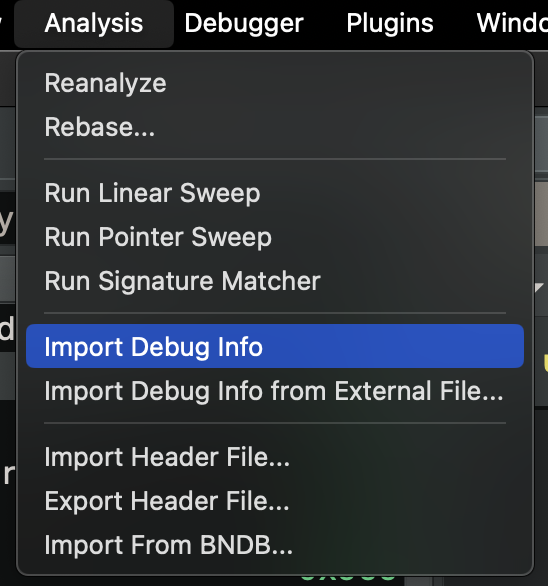

# Debug Info

Debug Info is a mechanism for importing types, function signatures, and data variables from either the original binary (eg. an ELF compiled with DWARF) or a supplemental file (eg. a PDB).

Currently debug info plugins are limited to types, function signatures, and data variables, but in the future will include line number information, comments, local variables, and possibly more.

## Supported Debug Info

We currently support [PDBs](https://github.com/Vector35/binaryninja-api/tree/dev/rust/examples/pdb-ng) and [DWARF](https://github.com/Vector35/binaryninja-api/tree/dev/rust/examples/dwarf/dwarf_import) (which are both open source), though you can also [register your own debug info parser through the API](https://api.binary.ninja/binaryninja.debuginfo-module.html#binaryninja.debuginfo.DebugInfoParser).

For PDBs, Binary Ninja will automatically try to source from specified local folders and Microsoft's symbol server ([see the PDB settings for more information](../settings.md#all-settings)).

DWARF supports information compiled in to ELF binaries, information from external ELF files (`.dwo`, `.debug`, etc), information compiled in to Mach-O's, and information from external `.dSYM` files as well. Support for DWARF information in PEs is [planned](https://github.com/Vector35/binaryninja-api/issues/1555).

## Applying Debug Info

Debug Info is automatically applied by default if applicable. 

{ width="300" }

However, for some file formats, you may wish to specify an external source of Debug Info using the `Import Debug Info from External File` menu option under `Analysis`.

## Blocking Debug Info

You can control if debug information is imported for a file by changing the setting "Import Debug Information" ([`analysis.debugInfo.internal`](https://docs.binary.ninja/guide/settings.html#analysis.debugInfo.internal)). You can import debug information at any point later by using the menu action `Analysis` -> `Import Debug Info`.

### PDB Notes

PDBs will make a best effort to find relevant debug info and apply it when you open a binary. Some PDBs can be very large and take a significant amount of time to parse. When you open a large PDB, you'll see a progress indicator in the status bar at the bottom of the application.

### DWARF Notes

DWARF information is imported from files that contain DWARF sections. Currently, Binary Ninja will not search local or remote locations to attempt to find the associated DWARF information for you. If you have separate DWARF info, you'll need to import that from an external file.

#### DWARF Import Limitations

[DWARF version 5](https://dwarfstd.org/dwarf5std.html) is mostly backwards compatible with DWARF version 4, which we originally targetted with our DWARF import plugin, with the caveats descibed in [this issue](https://github.com/Vector35/binaryninja-api/issues/5423).

Components are supported by the API, but not in the parser. The [same issue](https://github.com/Vector35/binaryninja-api/issues/5423) as above would also allow us to support components more easily as well.

#### DWARF Export Limitations

Our [DWARF Export plugin](https://github.com/Vector35/binaryninja-api/tree/dev/rust/examples/dwarf/dwarf_export) is also open source and uses a different system from our debug information import plugins. It also does not support function-local variable names or types. The export plugin currently will export the global variables, function prototypes, and all the types in your binary view except for ones that are FunctionTypeClass or VarArgsTypeClass.

#### Special Note for `.dSYM` Files

`.dSYM` packages are often provided as application bundles. Binary Ninja currently does not support extracting the actual `.dSYM` file out of the package for parsing, so you may need to provide a full path for Binary Ninja to correctly parse.

For example, you could have the file `hello.macho` that you would like to import debug info for. Thankfully, you also have `hello.dSYM`. So you open `hello.macho` with options, find the "External Debug Info File" and provide the `hello.dSYM` file. When the file opens, you notice that no information was imported and the log reads "No available/valid parsers for file." This is because `hello.dSYM` is a bundle. The actual path you needed to provide for the "External Debug Info File" setting would look something like `hello.dSYM/Contents/Resources/DWARF/hello`.
