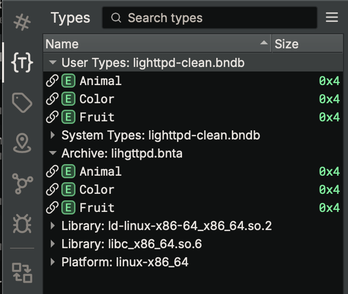
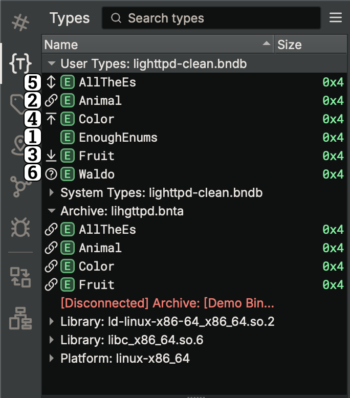

# Type Archives

Type Archives are files you can use to share types between analysis databases. You can create them and manage their contents in [Types View](./basictypes.md#the-type-list).

{ width="400" }

## Creating and Attaching

Using the context menu in the [Type List](basictypes.md#the-type-list) in Types View, you can create Type Archives using **Create Type Archive**. Simply pick a file location, and one will be created and attached to your analysis. Once you have done this, you can attach that Type Archive to other analyses in the same menu, by instead using **Attach Type Archive**. If you don't want to use a specific Type Archive in your analysis, you can right-click it in the Type List and use **Detach Type Archive**, which will remove any associations made to types it contains, but will not remove any types in your analysis.

???+ Tip "Tip"
    Type Archives have an associated Platform (e.g. windows-x86_64), which will determine
    various Platform-specific type details, like pointer width. You may attach a
    Type Archive to files with a different Platform, but note that these details may
    cause issues with any types pulled from the Type Archive.

Attached Type Archives are remembered in saved analysis databases, and will be attached on reopen, provided the file still exists. If the Type Archive file is moved (or deleted), then the Type List will report the Type Archive as Disconnected (but still attached). You can reconnect the Type Archive by using **Connect Type Archive** and pointing Binary Ninja at the new location of the Type Archive file.

Enterprise users can create Type Archives in Remote Projects in the same manner, and all changes made to Type Archives in Remote Projects will be automatically synced with the Collaboration Server. Updates made by you are sent immediately, whereas updates made by other users on your server are fetched periodically in the background every 30 seconds (configurable by the `collaboration.autoPollInterval` setting). Once changes have been fetched, you can pull them into your analysis in the same way as described below. You may also attach Type Archives created outside your Remote Project, but note they will not be synced to the Collaboration Server.

## Managing Types

Once you have one or more Type Archives created and attached, you can start using them to store and share types between your analyses:

1. In one analysis, create some types and use **Push Types to Archive** to add them to a Type Archive
2. In another analysis, you can use **Pull Types from Archive** to import those types from the Type Archive
3. Now, in either analysis, you can [make changes to those types](basictypes.md#the-type-editor) and once again use **Push Types to Archive** to send the changes to the Type Archive
4. And after doing so, you can open the other analysis and use **Pull Types from Archive** to receive those changes from the Type Archive
5. If you push changes to a Type Archive and, before pulling them in the other analysis, change them there as well, you will have to choose which version of the individual types you want to use. Either push or pull the specific types and, when prompted, confirm your choice to use that version.

If you want to rename a type in the Type Archive, you can use **Rename Type** in the context menu in the Type List. You can either rename it in your analysis, and then push the type, or rename it directly in the Type Archive, and then pull the type. Note that renaming a type will cause updates for other types that reference it, which may also need to be pushed or pulled afterward.

If you want to delete a type in the Type Archive, you can select it in the Type List under the Type Archive, and use **Undefine Type**. This will not delete it from your analysis, and indeed if you had instead deleted it from your analysis, it would not have been deleted in the Type Archive. If you delete the type in either place, the association will no longer apply and changes made to the type will not be shown as needing to be pushed or pulled.

If you want to manually disassociate a type in your analysis from a Type Archive, you can use **Disassociate Types from Archive**, and then no changes made to that type, either in the analysis, or in the Type Archive, will be shown as needing to be pushed or pulled.

{ width="500" }

When you have pushed or pulled types from a Type Archive, you will see their status reflected in the Type List:

1. Normal type, not associated with a Type Archive
2. Type associated with a Type Archive with no changes
3. Type associated with a Type Archive with changes made in the analysis that can be pushed to the Type Archive
4. Type associated with a Type Archive with changes made in the Type Archive that can be pulled into the analysis
5. Type associated with a Type Archive with changes made both in the analysis and the Type Archive, that will need you to choose which version to keep
6. Type associated with a Type Archive that is missing

