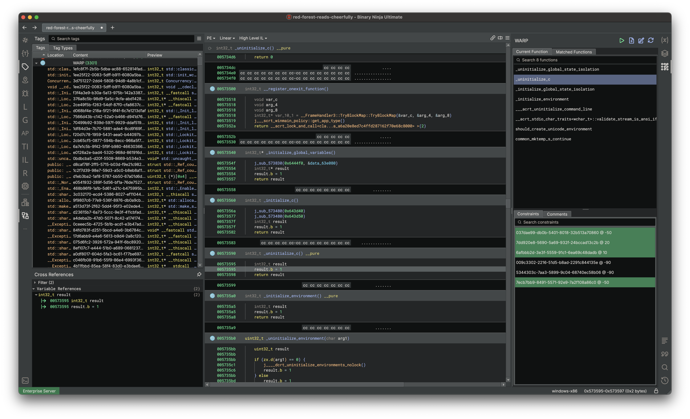
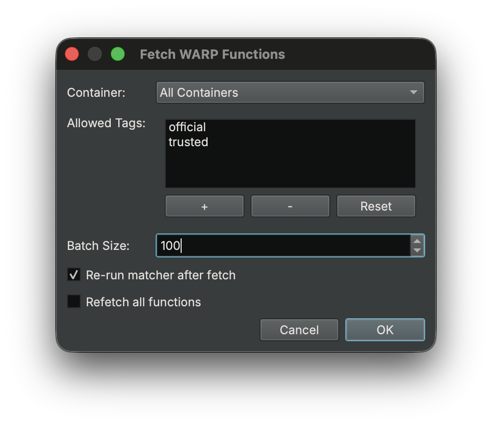
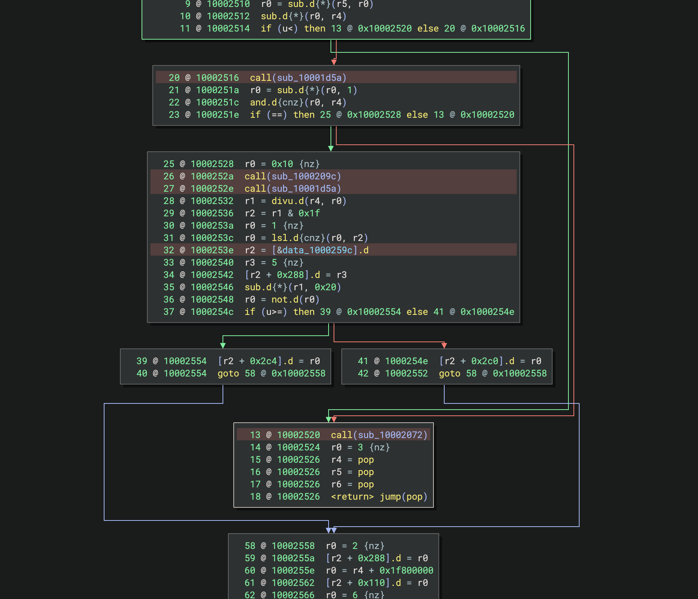

# WARP

Binary Ninja ships a first party plugin for [WARP], a format for transferring analysis information including function
names, parameter names, and types. The plugin is responsible for matching unique functions in a binary and automatically
applying information to the analysis. It also provides the user the ability to select from a set of possible functions
when identifying the unique function fails.

The bundled plugin is open source and is located [here](https://github.com/Vector35/binaryninja-api/tree/dev/plugins/warp).



## How WARP Works

WARP works by making a function GUID based off the byte contents of the function. Because WARP creates this GUID based
off the byte contents, the functions are expected to be an exact match, aside from variant instructions. To use WARP,
you only need to know that the function GUID's must match across binaries for the function information to be considered.

To read more about how WARP works, please see the GitHub repository [here](https://github.com/vector35/warp).

### Applied Function Information

When a function matches, we will apply the following information:

- Symbol
    - Name
    - Demangled type
- User-defined type
    - Calling convention
    - Parameter names
    - Parameter types
    - Return type
- User-defined variables
    - Name
    - Type
- Comments

## Loading WARP Files

### Automatically on start

Files are automatically loaded from two locations when Binary Ninja starts:

- [Install Directory] + `/signatures/`
    - Can be disabled using the setting `warp.container.loadBundledFiles`.
- [User Directory] + `/signatures/`
    - Can be disabled using the setting `warp.container.loadUserFiles`.

!!! Warning "Warning"
    Always place your signature libraries in your user directory. The installation path is wiped whenever Binary Ninja 
    auto-updates. You can locate it with `Open Plugin Folder` in the command palette and navigate "up" a directory.

### Manually

Aside from using the signature directory you can load any WARP file manually using the command `WARP\\Load File` or via
the UI sidebar, they both do the same thing. Once the file is loaded, you do not need to load it for every view, any view
that performs function matching will have access to the loaded file.

!!! Tip "Tip"
    When loading signatures you may encounter a dialog asking to "Override file target?" this happens when your file
    has a different platform, which is common if you are working with firmware where the intermediate libraries may be
    detected as a different target, this is OK you can continue loading, and it will change the file target to fit the view.

## Creating WARP Files

Before you actually can create these WARP files, you must identify the binary files relevant to the target binary. This
can differ depending on the type of binary you are working with, but once you have those files you can create the files
using the command `WARP\\Process` or via the UI sidebar.

{ width="600" }

The processor dialog will allow you to select the files you want to process, including directories and project files. To
add more files, you can use the "+" button and select the files you want to add. If you have more than one file to process 
the worker count will control how many entries are processed in parallel.

!!! Tip "Tip"
    You can also create signature files using the provided API, see the [API section](#api) for more details.

The following file formats are supported:

- Binary files (`.exe`, `.so`, `.dylib`)
- WARP files (`.warp`)
    - Useful when merging multiple warp files in a project.
- BNDB files (`.bndb`)
    - Using a database will allow you to mark up the function information and also cut down on processing time as the required information has already been created prior to processing.
- Archive files (`.a`, `.lib`, `.rlib`)
    - The archive entry files will be extracted to a temporary directory for processing.

After processing is complete, you will be shown a dialog with the results, from here you can save the file to disk or commit
the data to the server using the commit dialog.

{ width="600" }

If you are trying to commit the data to the server, make sure you have [connected](#connecting) to the server first with
a valid API key, otherwise you will get an error when commiting.

### Including specific functions

Sometimes you may not want to include every function but a subset, in that case you can tag functions to include with
the command `WARP\\Include Function` (or add the tag yourself with `"WARP: Selected Function"`) once you have selected all
the functions you want, you can run the create command. If you are trying to add functions to an existing warp file, you
will be prompted whether you want to keep the existing data, you will want to say yes.

### File size

Information in the WARP file will be deduplicated across all processed files automatically. If your files are too large, 
try and adjust the file data to something like "Symbols" only.

## Networked Functionality

WARP for Binary Ninja provides the ability to lazily pull data (functions, types) from a WARP server. By default,
networked functionality is disabled since it requires sending the functions platform (`windows-x86`) and GUID
(`2f893a32-8592-54e2-8052-207603976686`) which can be considered sensitive information. See [Connecting](#connecting) to
learn how to enable this functionality.

### Connecting

To enable turn on `network.enableWARP` and restart, server connection settings exist in the regular WARP setting group, 
and the default primary server is https://warp.binary.ninja. You can also give it an API token so that you can be logged 
in as your user, and have access to push data to your sources using `warp.container.serverApiKey`.

Once restarted, you should see a log message indicating you have connected. You can also verify connections in the WARP 
sidebar under the "Containers" tab, which should list the provided WARP server(s) alongside any of your sources you have created.

### Pulling Networked Data

To pull networked data, you must have successfully connected and have an open binary view, after which,
you can use the command `WARP\\Fetch` or using the ⬇ button within the WARP sidebar. This will open a
dialog which will, in batches, pull down all the necessary data for matching all functions in a binary.

By default, we will only ever pull down data from "official" and "trusted" tagged sources. You can change the default 
globally by modifying the setting `warp.fetcher.allowedSourceTags` as a comma separated list. These tags are assigned
from within the server UI, either by source users or the server admin, the tags "official" and "trusted" may only be added
or removed by the server admin.

{ width="600" }

!!! Tip "Tip"
    Fetching of function information from the server will also be done on demand when navigating to a function for the first time
    with the WARP sidebar open. The fetched functions will be shown in the "Matched Functions" sidebar automatically, however,
    you will need to run the matcher to apply the information to the analysis.

In the case where you want fetching to be done automatically, set `analysis.warp.fetcher` to true, this will cause the fetcher
to run at the end of the analysis, useful if you are working with binaries headlessly and do not mind waiting for the fetcher
to complete.

### Pushing Networked Data

To push data to the server, you must provide an API key. This can be done either self-service or by the server admin.

To get an API key using the website:

1. Navigate to the account settings page (https://warp.binary.ninja/account)
2. Give a name to the key and hit "Add Key"
3. Copy the API key and open Binary Ninja
4. Paste the API key into the setting `warp.container.serverApiKey`

Once restarted, you should see a log message indicating you have connected as the associated user.

> [WARP.Plugin] Server 'https://warp.binary.ninja' connected, logged in as user 'binary-dog-4213'

After logging in, you can create a new source on the server by right-clicking in the container sources tab and selecting
"Add Source" you can also do this via the website or in the processor dialog (see below). 

Once you have created a source, you can start pushing your information to the server by invoking the processor dialog
and opening the commit dialog after processing of the data has completed.

{ width="600" }

Each source operates as its own collection of function and type information, creating a new source is as simple as clicking
the "+" button and giving it a name. The sources are synced on the server and can be managed from the website.

## Overwriting Matched Functions

WARP will not always be able to identify the unique function in the matcher. In this case we give the user a few
options for resolving the matched function:

- Using the WARP sidebar, you can view and set the matched function
    - In the "Current Function" tab, double-click on any possible function (or right-click and hit Apply)
- Using the [API](#api), you can query possible functions and then set the matched function

All matched functions are stored in the BNDB, so you do not need to provide signature files when distributing databases.

## Removing Matched Functions

Using the command "WARP\\Remove Matched Function" or via the context menu in the WARP sidebar, you can remove matched function
information. You may also want to run the complementary command `WARP\\Ignore Function` which will prevent the selected function 
from being matched automatically in the future.

## API

To create, query, and load WARP data programmatically, we provide a [Python API]. For those looking to interact with WARP
from Rust because the plugin is open source, you can depend _directly_ on the [Rust plugin], skipping the FFI entirely.

### Rust example (recommended)

This example will use the Rust API directly to generate WARP files from given inputs, this operates with the same processor
as the UI and supports all the same options.

Find the example [here](https://github.com/Vector35/binaryninja-api/tree/dev/plugins/warp/examples/headless).

### Python example

This example will open a binary in Binary Ninja then output a WARP signature file using the core processor API. This is the
easiest way to get started with the API, as it will use the same processor as the UI and support all the same options.

Find the example [here](https://github.com/Vector35/binaryninja-api/tree/dev/plugins/warp/examples/create_signatures.py).

### Python example (advanced)

This example will open a binary in Binary Ninja then output a WARP signature file.

The flexibility of the API allows you to include or exclude any functions you want from the creation of the signature file.
The cost is that it does not use the same processor as the UI and you will need to implement the same logic yourself for
selecting the functions and processing in parallel.

Find the example [here](https://github.com/Vector35/binaryninja-api/tree/dev/plugins/warp/examples/create_signatures_advanced.py).

## Troubleshooting

### Why do these very similar functions have a different function GUID?

WARP is an exact function matcher, even small changes like a different register will change the GUID. The point of WARP is
to provide an inexpensive base layer of function matching and an open source file format for sharing analysis information.

### Why does the exact same function have a different function GUID?

Using the render layer, you can identify differences in the two functions GUID construction:

- Highlighted red is "variant instruction"
- Highlighted yellow is "computed variant instruction"
- Highlighted black is "blacklisted instruction"

The function GUID will differ if the instruction highlights are not exactly the same across all instructions in both functions.



### No relocatable regions found

When running the matcher manually, you may get a warning about no relocatable regions found; this means you have no defined
sections or segments in your view. For WARP to work we must have some range of address space to work with, without it the
function GUIDs will likely be inconsistent if the functions can be based at different addresses. Once you have updated the sections,
or segments, you should [regenerate the function GUIDs](#regenerating-the-function-guids).

### "Relocatable region has a low start-address" warning

WARP uses relocatable regions to determine relocatable addresses encoded in instructions, if you have a relocatable region
that covers a low-address space, WARP may mask regular constants and other irrelevant instructions. This warning mostly
affects firmware binaries (or other mapped views), if you have not rebased the view to the correct image base, then you
should as it will fix this issue. Once you have rebased the view, you should [regenerate the function GUIDs](#regenerating-the-function-guids).

### Failed to connect to the server

If you fail to connect to a WARP server, you will receive an error in the log. Outside typical network connectivity issues 
it is possible the provided server URL is malformed, verify that the URL looks similar to the default server URL: `https://warp.binary.ninja`

### Regenerating the function GUIDs

After updating the binary with new sections, segments, or base address, you will need to regenerate the function GUIDs to ensure 
they are accurate and up to date. Unfortunately, this is currently not something we can automatically do for you. To do this
you will need to run something like this:

```python
from binaryninja.warp import *
for func in bv.functions:
    func.remove_metadata('warp_function_guid')
    get_function_guid(func)
```

## Glossary

Here is a list of terms used and a simplified description, please see the [WARP] spec repository for a more detailed description.

### Target
A **Target** defines platform-specific information needed to filter out irrelevant WARP information.

### Container
A **Container** stores and manages WARP data, whether in memory, on disk, or over the network. Each container has its own collection of sources.

### Source
A **Source** is a collection of WARP data within a container, like a file containing function and type information.

### Source Tag
A **Source Tag** is an arbitrary string, which is used for filtering fetched function data from containers, useful when dealing with 
larger and potentially untrusted datasets.

### Function
A **Function** in WARP represents the collection of metadata that we wish to transfer, such as the symbol, comments, and types.

### Function GUID
A **Function GUID** is a unique ID derived from the contents of the function, allowing matching across different binaries.

### Constraint
A **Constraint** helps ensure accurate function matching by verifying specific properties are shared between functions.
For example, a referenced function would be used as a constraint.

### File
A **File** in WARP represents a collection of chunks, which are use to store function and type information. It is exposed 
via the API as a way to pass around the data to different parts of the application, such as the processor and the container.

### Chunk
A **Chunk** is a collection of either function or type information, stored as a flatbuffer.

[WARP]: https://github.com/vector35/warp
[Install Directory]: https://docs.binary.ninja/guide/#binary-folder
[User Directory]: https://docs.binary.ninja/guide/#user-folder
[Python API]: https://github.com/Vector35/binaryninja-api/blob/dev/plugins/warp/api/python/warp.py
[Rust plugin]: https://github.com/Vector35/binaryninja-api/tree/dev/plugins/warp
