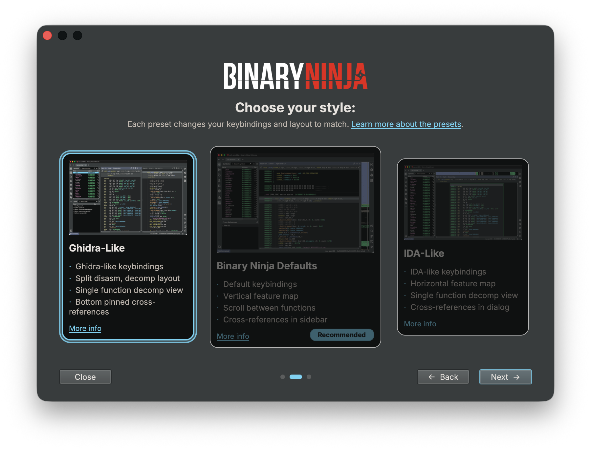

# Migrating From Ghidra

## Starting Binary Ninja

Binary Ninja starts with the [New Tab Page](../../index.md#new-tab) open. From here, you can optionally [start a project](../../projects.md#creating-a-project) to work with multiple files, navigate your offline docs from the help menu, or just [open existing files](../../index.md#loading-files) (including drag-and-drop!).

## Decompiler Settings

Binary Ninja likes to stay out of your way as much as possible, but sometimes you need to dig into the settings and change how a file is analyzed. If you have a file that can be opened with default settings, you won't get prompted for any additional input. Binary Ninja will automatically analyze the entire file — including running [linear sweep](https://binary.ninja/2017/11/06/architecture-agnostic-function-detection-in-binaries.html) — and provide you with linear decompilation for the whole file (like Ghidra's linear disassembly, but as decompilation by default).

If you're opening a [Universal Mach-O](https://en.wikipedia.org/wiki/Universal_binary), the Open with Options dialogue will appear so that you can choose which architecture to open (in the top right). If you have a default architecture you want to open whenever you open a universal binary, you can set your preference in a setting called [Universal Mach-O Architecture Preference](../../settings.md#settings-reference). You'll also see the Open with Options dialogue when Binary Ninja is unable to recognize the file type or otherwise needs user input to analyze the file (can't find the entry point, needs you to provide some memory mappings, etc.).

It's worth digging into Binary Ninja's [settings](../../settings.md) and seeing what's available to tune, but if you ever want to change a setting for a single binary, you can Open (it) with Options. Go to File -> Open with Options, and any settings you change will apply to only that file.

If you're used to waiting for Ghidra's auto-analysis to finish before working, you'll find that Binary Ninja is designed to remain responsive during analysis. A priority queue ensures that wherever you navigate is analyzed first, even while other analysis threads continue in the background.

## Importing Data From Ghidra

See [the Ghidra import documentation](./ghidraimport.md)

## Exporting Data To Ghidra

See [the Ghidra export documentation](./ghidraexport.md)

## Keybindings

To quickly set up Ghidra-like keybindings, open the First Run dialog from the Help menu (Help / First Run Wizard...) and select the Ghidra preset. The First Run dialog will apply Ghidra-style keybindings and UI settings for you. It appears automatically the first time you launch Binary Ninja, but it is always available from Help / First Run Wizard... — so if you dismissed it initially, or later want to (re)apply the Ghidra preset or switch between presets, you can change your keybindings and settings from there at any time.

Alternatively, you can manually replace your [keybindings](../../index.md#custom-hotkeys) file in your [user folder](../../index.md#user-folder) with [this file](../../../files/ghidra-keybindings.json) to have the most seamless experience when changing to Binary Ninja.

Binary Ninja's default keybindings are very different from Ghidra. Thankfully, [Binary Ninja's action system](https://binary.ninja/2024/02/15/command-palette.html) allows you to easily find actions and view the keybindings extremely easily. It'll also save you from digging through unfamiliar right-click menus while helping you learn any new keybindings. All actions can have their keybinding set, changed, or removed in the [keybindings menu](../../index.md#default-hotkeys).

For the complete list of shortcuts the Ghidra preset configures, see [`ghidra-keybindings.json`](../../../files/ghidra-keybindings.json).

## UI Settings

When you select the "Ghidra" preset in the First Run dialog, Binary Ninja will configure several settings to provide a more Ghidra-familiar experience:

### View Settings
- **Preferred View**: Sets linear view as the default (rather than graph view), similar to Ghidra's listing view
- **Show Address**: Disabled in linear view for a cleaner interface

### Feature Map
- **Visibility**: Hidden by default (you can show/hide the feature map at any time using `View > Show Feature Map`)

### Sidebar Configuration
- **Default Sidebars**: Shows the Symbols and Types sidebars by default, with Types placed beneath Symbols

### Types Sidebar
- **Details Section**: Hidden by default to maximize space for the type list
- You can toggle the details section visibility using the hamburger menu in the Types sidebar (look for "Hide Details")

These settings can be changed at any time through Binary Ninja's settings menu (`[CTRL/⌘-,]`). For a more complete Ghidra-like layout with split panes, see the Layout section below.

### Preset Configuration Files

The Ghidra preset keybindings and settings are stored in JSON configuration files that are easy to review and contribute to:

- **Keybindings**: [`api/docs/manual/files/ghidra-keybindings.json`](https://github.com/Vector35/binaryninja-api/blob/dev/docs/manual/files/ghidra-keybindings.json)
- **Settings**: [`api/docs/manual/files/ghidra-settings.json`](https://github.com/Vector35/binaryninja-api/blob/dev/docs/manual/files/ghidra-settings.json)

If you notice a missing keybinding or a setting that would make the Ghidra experience more familiar, we welcome contributions via pull requests to the [binaryninja-api](https://github.com/Vector35/binaryninja-api) repository.

## Cross-References

The default behavior of cross-references is to open in a tabbed reference UI element similar to how Ghidra does it, however the `X` hotkey is used by default (and can be changed in the [keybindings UI](../../index.md#custom-hotkeys)).

## Theme

This doesn't exactly have to do with your layout, but it can go a long way towards making the interface feel a bit more familiar. We have an expansive list of [community themes](https://github.com/Vector35/community-themes), and [a guide](../../../dev/themes.md) and a [blog post](https://binary.ninja/2021/07/08/creating-great-themes.html) on how to make your own. The built-in "Classic" theme should feel nostalgic, but if you're looking for a light theme that's slightly easier on the eyes, try out Summer or Solarized Light.

## Layout

Binary Ninja's layout is also a bit different from what you're used to in Ghidra, but thankfully Binary Ninja's UI is flexible enough to allow us to build something that will feel familiar.

### Sidebars

Our sidebars have a whole host of customization options, so make sure to check out [their dedicated docs](../../index.md#the-sidebar) to maximize your workflow.

That said, I'll walk you through how to set up your sidebars to get it looking very similar to what you're used to in Ghidra.

#### Program Tree

But first, there are a couple caveats. Binary Ninja does not have an exact 1-to-1 widget for everything in Ghidra. The Program Tree is one of those elements; it's a bit like our memory map, but it's also kinda not. Our new Binary Ninja layout assumes you've closed the program tree in Ghidra. Now Binary Ninja and Ghidra's sidebars are starting to match by having the symbols view on the top (which we start as a flat listing for you to organize into file yourself), and a different sidebar panel below it. Be sure to check out the options in the Symbols list's hamburger menu (the three lines in the top right).

#### Types Manager

If you want to match how Ghidra has its types showing on the bottom, you can simply drag the types widget to beneath the divider line on the left side. Whenever you open your sidebar, both areas will open together. The Types sidebar also shows you the full type definition when you select a type.

#### Main Area

<!-- TODO: Add screenshot of the Ghidra-like layout with linear disassembly on the left and single-function decompilation on the right -->

Time for the main event!

Ghidra shows you a linear view on the left, and single-function-at-a-time decompilation on the right. We already gave you linear decompilation of the whole binary here by default, so there are three last things to do:

1. Create a new pane by pressing the icon in the top right that looks like a rectangle with a line through it. The two panes are now synced by address, as you’d expect.
2. In the left pane, find the dropdown that says "High Level IL", and switch down to disassembly. You should now have linear disassembly on the left, and linear decompilation on the right.
3. The final touch is to go back to the decompilation pane on the right and find the hamburger menu for that pane in the top right, and then select “Single Function View.”

Single Function View applies to a pane, not to a particular IL, so it stays on for both disassembly and decompilation in that pane. If you want to apply it only to, say, HLIL, you can enable it just in that pane, but as soon as you restart, it will be applied to all views.

Now the UI should be looking extremely familiar. Read our last couple of tips below, don't forget to use the command palette to find what you want to do, and you'll be off analyzing binaries in no time!

#### Saving Layouts

Now that you've done all this hard work to make the perfect layout, it would be a shame to lose it! Thankfully, we make it easy. Go to the `Window` → `Layout` → `Save Current Layout...` and give it a name, or select `Save Current Layout as Default`. Named layouts let you quickly swap between different kinds of work.

## What You'll Love

...about switching to Binary Ninja! We know leaving your old tool behind can be hard, and there will be things you miss, but we think there are a lot of features packed into Binary Ninja that you'll love. Here are a couple we think you'll appreciate:

 - [Updates every day](../../index.md#updates) on the dev branch (nearly) - accepted PRs can be in everyone's hands within hours.
 - [Our awesome native Python API](../../../dev/cookbook.md) (and [C++](https://api.binary.ninja/cpp/), and [Rust](https://dev-rust.binary.ninja/))
 - [The speed](https://binary.ninja/2022/05/31/3.1-the-performance-release.html)
 - ...not needing to manage Java installations

---

Don't forget to check out our [additional resources](../index.md#additional-resources)!
