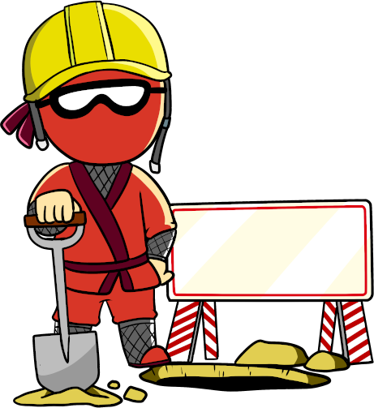

# BinaryNinja-rs



> :warning: **These bindings are in a very early beta, only have partial support for the core APIs and are still actively under development. Compatibility _will_ break and conventions _will_ change! They are being used for core Binary Ninja features however, so we expect much of what is already there to be reliable enough to build on, just don't be surprised if your plugins/scripts need to hit a moving target.**

> :warning: This project requires **Rust Nightly** to build with those fancy linker arguments - most recent tested version: `cargo 1.55.0-nightly (9233aa06c 2021-06-22)`


## Dependencies

Having BinaryNinja installed (and your license registered)
Clang
Rust **Nightly**


## How to use

See [`examples/template`](examples/template) for more details.

### To write a plugin:

`Cargo.toml`:
```
[lib]
crate-type = ["cdylib"]

[dependencies]
binaryninja = {git = "https://github.com/Vector35/binaryninja-api.git", branch = "dev"}
```

See the `./examples/`.  Plugin registration commands are in `binaryninja::command::*`


### To write a standalone executable:

`Cargo.toml`:
```
[dependencies]
binaryninja = { git = "https://github.com/Vector35/binaryninja-api.git", branch = "dev"}
```

All standalone binaries should call both `binaryninja::headless::init()` and `binaryninja::headless::shutdown()`.
All standalone binaries need to provide a `build.rs`.
See [`examples/template`](examples/template) for details.

---

#### Attribution

This project makes use of:
  - [log] ([log license] - MIT)
  - [rayon] ([rayon license] - MIT)

[log]: https://github.com/rust-lang/log
[log license]: https://github.com/rust-lang/log/blob/master/LICENSE-MIT
[rayon]: https://github.com/rayon-rs/rayon
[rayon license]: https://github.com/rayon-rs/rayon/blob/master/LICENSE-MIT
