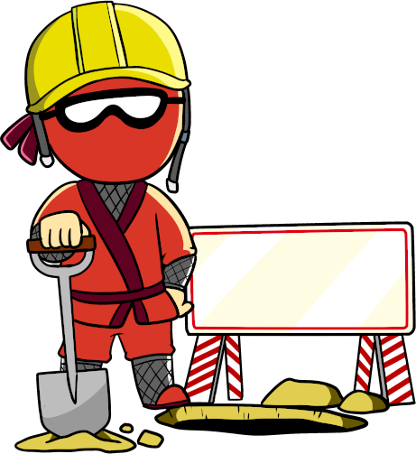

# BinaryNinja-rs



> :warning: **These bindings are in a very early beta, only have partial support for the core APIs and are still actively under development. Compatibility _will_ break and conventions _will_ change! They are being used for core Binary Ninja features however, so we expect much of what is already there to be reliable enough to build on, just don't be surprised if your plugins/scripts need to hit a moving target.**

> :warning: This project requires Rust version `1.83.0`


## Contributing

:warning: If you're thinking of contributing to the Rust API, we encourage you to join the #rust-api channel in our Slack: https://slack.binary.ninja, especially for large-effort PRs.

## Dependencies

- Having BinaryNinja installed (and your license registered)
- Clang
- Rust


## How to use

See [`examples/template`](examples/template) for more details.

### To write a plugin:

`Cargo.toml`:
```toml
[lib]
crate-type = ["cdylib"]

[dependencies]
binaryninja = {git = "https://github.com/Vector35/binaryninja-api.git", branch = "dev"}
```

See the `./examples/`.  Plugin registration commands are in `binaryninja::command::*`


### To write a standalone executable:

Writing a standalone executable requires that you link to `binaryninjacore` directly. The process of locating that however
is done for you within the `binaryninjacore-sys` crate. Because linker arguments are _not_ transitive for executables you
must specify them within your `build.rs`.

`Cargo.toml`:
```toml
[dependencies]
binaryninja = { git = "https://github.com/Vector35/binaryninja-api.git", branch = "dev"}
# Locates binaryninjacore on your system.
binaryninjacore-sys = { git = "https://github.com/Vector35/binaryninja-api.git", branch = "dev"}
```

`build.rs`:
```rust
fn main() {
    let link_path =
        std::env::var_os("DEP_BINARYNINJACORE_PATH").expect("DEP_BINARYNINJACORE_PATH specified");
    
    println!("cargo::rustc-link-lib=dylib=binaryninjacore");
    println!("cargo::rustc-link-search={}", link_path.to_str().unwrap());
    
    #[cfg(not(target_os = "windows"))]
    {
        println!(
            "cargo::rustc-link-arg=-Wl,-rpath,{0},-L{0}",
            link_path.to_string_lossy()
        );
    }
}

```

- All standalone binaries should call both `binaryninja::headless::init()` and `binaryninja::headless::shutdown()`.
- All standalone binaries need to provide a `build.rs`.
- See [`examples/template`](examples/template) for details.

## Docs

Docs can be found at https://dev-rust.binary.ninja/

---

#### Attribution

This project makes use of:
  - [log] ([log license] - MIT)
  - [rayon] ([rayon license] - MIT)

[log]: https://github.com/rust-lang/log
[log license]: https://github.com/rust-lang/log/blob/master/LICENSE-MIT
[rayon]: https://github.com/rayon-rs/rayon
[rayon license]: https://github.com/rayon-rs/rayon/blob/master/LICENSE-MIT
