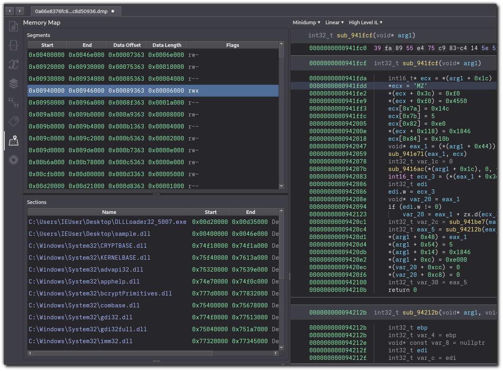
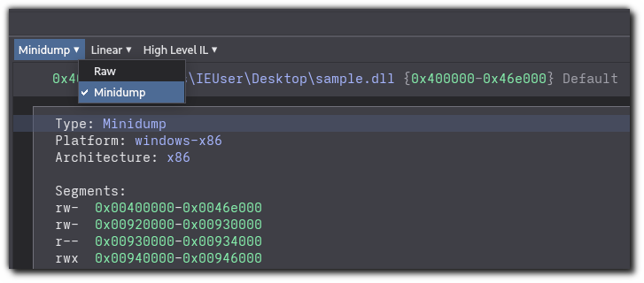
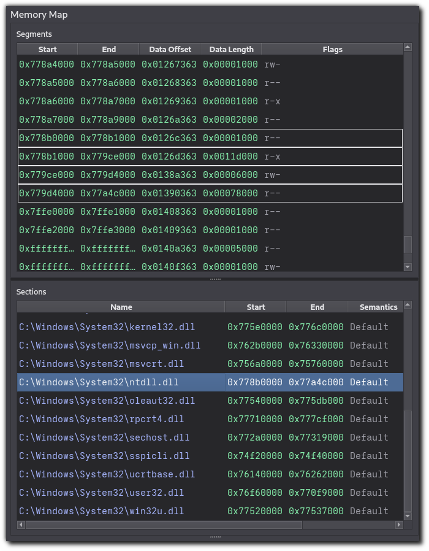

# Binary Ninja Minidump Loader

A Minidump memory dump loader plugin for Binary Ninja.



This plugin adds a new _Minidump_ binary view type. When a binary with the magic number `MDMP` is opened, this plugin will automatically try to load in the binary as a minidump, and create a new _Minidump_ binary view to view the contents.

The architecture is determined automatically from the platform information embedded in the minidump.



The loaded minidump's memory regions and modules can be navigated via the _Memory Map_ window. In the _Minidump_ binary view, the meanings of "Segments" and "Sections" in the Memory Map window are modified to mean the following:

- The memory regions in the minidump are loaded as _Segments_. The _Data Offset_ and _Data Length_ fields of each segment are the corresponding addresses in the minidump file where the data for that memory region is located.
- The modules in the minidump are loaded as _Sections_, with the name of each section being the path to the module.



## Supported Minidump Types

This plugin currently only supports loading minidump files generated by the Windows [`MiniDumpWriteDump` API](https://learn.microsoft.com/en-us/windows/win32/api/minidumpapiset/nf-minidumpapiset-minidumpwritedump).

This includes dumps generated from:

- The [`.dump` command](https://learn.microsoft.com/en-us/windows-hardware/drivers/debugger/-dump--create-dump-file-) in WinDbg.
- The `.dump` command in Binary Ninja's debugger for Windows targets (which uses the same debugging engine as WinDbg).

For both of the above, it's recommended to generate a full dump:

```
.dump /ma dumpfile.dmp
```

- The [`minidump` command](https://help.x64dbg.com/en/latest/commands/memory-operations/minidump.html) in x64dbg.

```
minidump dumpfile.dmp
```

- Right clicking on a listed process and then clicking "Create dump file" / "Create full dump" from Windows Task Manager, Process Hacker, Sysinternals Process Explorer, etc...

## Unsupported Features (for now)

- Loading Minidump files from platforms or APIs other than Windows' `MinidumpWriteDump`, such as those generated by [Google Breakpad](https://chromium.googlesource.com/breakpad/breakpad/).
- Loading and applyng debug information from the minidump file. In Windows minidump files, `MinidumpModuleList` streams contain information about the PDB file which contains the debug information for the module; this isn't currently read or applied, however.
- Integration with Binary Ninja's built-in debugger. Minidump files can contain information about threads, register values, and stack frames, and it would be nice in the future for minidump files to be loadable back into the debugger in order to resume a debugging session. This isn't currently done, however.

## Building and Installing

This plugin currently needs to be built from source, then copied into your user plugin folder.

```
cargo build --release
cp target/release/libminidump_bn.so ~/.binaryninja/plugins/
```

The code in this plugin targets the `dev` branch of the [Binary Ninja Rust API](https://github.com/Vector35/binaryninja-api/tree/dev/rust).

To update the Binary Ninja Rust API dependency:

```
cargo update -p binaryninja
cargo build --release
```